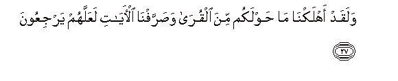
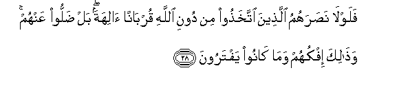
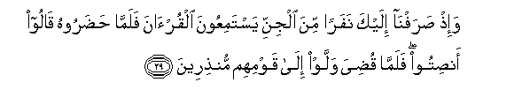
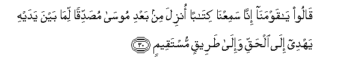
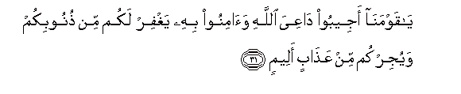
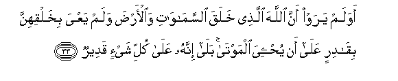
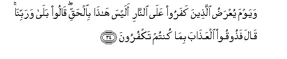
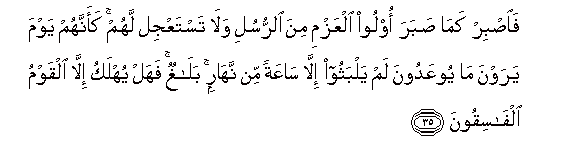

  
[Intangible Textual Heritage](../../index)  [Islam](../index) 
[Index](index)   
[Hypertext Qur'an](../htq/index)  [Unicode](../uq/046.htm#046_027) 
[Palmer](../sbe09/046)  [Pickthall](../pick/046.htm#046_027)  [Yusuf Ali
English](../yaq/yaq046)  [Rodwell](../qr/046)   
  
[Sūra XLVI.: Aḥqāf, or Winding Sand-tracts. Index](046)  
  [Previous](04603)  [Next](04701) 

------------------------------------------------------------------------

  
*The Holy Quran*, tr. by Yusuf Ali, \[1934\], at Intangible Textual
Heritage

------------------------------------------------------------------------

# Sūra XLVI.: Aḥqāf, or Winding Sand-tracts.

### Section 4

------------------------------------------------------------------------

27. Walaqad ahlakn<u>a</u> m<u>a</u> <u>h</u>awlakum mina alqur<u>a</u>
wa<u>s</u>arrafn<u>a</u> al-<u>a</u>y<u>a</u>ti laAAallahum
yarjiAAoon**a**

27\. We destroyed aforetime  
Populations round about you;  
And We have shown  
The Signs in various ways,  
That they may turn (to Us).

------------------------------------------------------------------------

28. Falawl<u>a</u> na<u>s</u>arahumu alla<u>th</u>eena
ittakha<u>th</u>oo min dooni All<u>a</u>hi qurb<u>a</u>nan
<u>a</u>lihatan bal <u>d</u>alloo AAanhum wa<u>tha</u>lika ifkuhum
wam<u>a</u> k<u>a</u>noo yaftaroon**a**

28\. Why then was no help  
Forthcoming to them from those  
Whom they worshipped as gods,  
Besides God, as a means  
Of access (to God)? Nay,  
They left them in the lurch:  
But that was their  
Falsehood and their invention.

------------------------------------------------------------------------

29. Wa-i<u>th</u> <u>s</u>arafn<u>a</u> ilayka nafaran mina aljinni
yastamiAAoona alqur-<u>a</u>na falamm<u>a</u> <u>h</u>a<u>d</u>aroohu
q<u>a</u>loo an<u>s</u>itoo falamm<u>a</u> qu<u>d</u>iya wallaw
il<u>a</u> qawmihim mun<u>th</u>ireen**a**

29\.

------------------------------------------------------------------------

30. Q<u>a</u>loo y<u>a</u> qawman<u>a</u> inn<u>a</u> samiAAn<u>a</u>
kit<u>a</u>ban onzila min baAAdi moos<u>a</u> mu<u>s</u>addiqan
lim<u>a</u> bayna yadayhi yahdee il<u>a</u> al<u>h</u>aqqi wa-il<u>a</u>
<u>t</u>areeqin mustaqeem**in**

30\. They said, "O our people!  
We have heard a Book  
Revealed after Moses,  
Confirming what came  
Before it: it guides (men)  
To the Truth and  
To a Straight Path.

------------------------------------------------------------------------

31. Y<u>a</u> qawman<u>a</u> ajeeboo d<u>a</u>AAiya All<u>a</u>hi
wa<u>a</u>minoo bihi yaghfir lakum min <u>th</u>unoobikum wayujirkum min
AAa<u>tha</u>bin aleem**in**

31\. "O our people, hearken  
To the one who invites  
(You) to God, and believe  
In him: He will forgive  
You your faults,  
And deliver you from  
A Penalty Grievous.

------------------------------------------------------------------------

32. Waman l<u>a</u> yujib d<u>a</u>AAiya All<u>a</u>hi falaysa
bimuAAjizin fee al-ar<u>d</u>i walaysa lahu min doonihi awliy<u>a</u>a
ol<u>a</u>-ika fee <u>d</u>al<u>a</u>lin mubeen**in**

32\. "If any does not hearken  
To the one who invites  
(Us) to God, he cannot  
Frustrate (God's Plan) on earth,  
And no protectors can he have  
Besides God: such men  
(Wander) in manifest error."

------------------------------------------------------------------------

33. Awa lam yaraw anna All<u>a</u>ha alla<u>th</u>ee khalaqa
a**l**ssam<u>a</u>w<u>a</u>ti wa**a**l-ar<u>d</u>a walam yaAAya
bikhalqihinna biq<u>a</u>dirin AAal<u>a</u> an yu<u>h</u>yiya
almawt<u>a</u> bal<u>a</u> innahu AAal<u>a</u> kulli shay-in
qadeer**un**

33\. See they not that  
God, Who created the heavens  
And the earth, and never  
Wearied with their creation,  
Is able to give life  
To the dead? Yea, verily  
He has power over all things.

------------------------------------------------------------------------

34. Wayawma yuAAra<u>d</u>u alla<u>th</u>eena kafaroo AAal<u>a</u>
a**l**nn<u>a</u>ri alaysa h<u>atha</u> bi**a**l<u>h</u>aqqi q<u>a</u>loo
bal<u>a</u> warabbin<u>a</u> q<u>a</u>la fa<u>th</u>ooqoo
alAAa<u>tha</u>ba bim<u>a</u> kuntum takfuroon**a**

34\. And on the Day that  
The Unbelievers will be  
Placed before the Fire,  
(They will be asked,)  
Is this not the Truth?"  
They will say, "Yea,  
By our Lord!"  
(One will say:)  
"Then taste ye  
The Penalty, for that ye  
Were wont to deny (Truth)!"

------------------------------------------------------------------------

35. Fa**i**<u>s</u>bir kam<u>a</u> <u>s</u>abara oloo alAAazmi mina
a**l**rrusuli wal<u>a</u> tastaAAjil lahum kaannahum yawma yarawna
m<u>a</u> yooAAadoona lam yalbathoo ill<u>a</u> s<u>a</u>AAatan min
nah<u>a</u>rin bal<u>a</u>ghun fahal yuhlaku ill<u>a</u> alqawmu
alf<u>a</u>siqoon**a**

35\. Therefore patiently persevere,  
As did (all) apostles  
Of inflexible purpose;  
And be in no haste  
About the (Unbelievers). On the Day  
That they see the (Punishment)  
Promised them, (it will be)  
As if they had not  
Tarried more than an hour  
In a single day. (Thine  
But) to proclaim the Message:  
But shall any be destroyed  
Except those who transgress?

------------------------------------------------------------------------

[Next: Section 1 (1-11)](04701)

