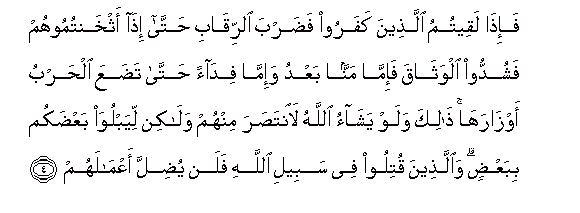
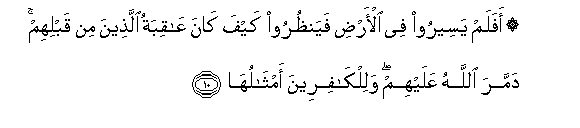

  
[Intangible Textual Heritage](../../index)  [Islam](../index) 
[Index](index)   
[Hypertext Qur'an](../htq/index)  [Unicode](../uq/047.htm#047_001) 
[Palmer](../sbe09/047)  [Pickthall](../pick/047.htm#047_001)  [Yusuf Ali
English](../yaq/yaq047)  [Rodwell](../qr/047)   
  
[Sūra XLVII.: Muḥammad (the Prophet). Index](047)  
  [Previous](04604)  [Next](04702) 

------------------------------------------------------------------------

  
*The Holy Quran*, tr. by Yusuf Ali, \[1934\], at Intangible Textual
Heritage

------------------------------------------------------------------------

# Sūra XLVII.: Muḥammad (the Prophet).

### Section 1

1. Alla<u>th</u>eena kafaroo wa<u>s</u>addoo AAan sabeeli All<u>a</u>hi
a<u>d</u>alla aAAm<u>a</u>lahum

1\. Those who reject God  
And hinder (men) from  
The Path of God,  
Their deeds will God  
Render astray  
(From their mark).

------------------------------------------------------------------------

2. Wa**a**lla<u>th</u>eena <u>a</u>manoo waAAamiloo
a**l**<u>ssa</u>li<u>ha</u>ti wa<u>a</u>manoo bim<u>a</u> nuzzila
AAal<u>a</u> mu<u>h</u>ammadin wahuwa al<u>h</u>aqqu min rabbihim
kaffara AAanhum sayyi-<u>a</u>tihim waa<u>s</u>la<u>h</u>a
b<u>a</u>lahum

2\. But those who believe  
And work deeds of  
Righteousness, and believe  
In the (Revelation) sent down  
To Muhammad—for it is  
The Truth from their Lord,  
He will remove from them  
Their ills and improve  
Their condition.

------------------------------------------------------------------------

3. <u>Tha</u>lika bi-anna alla<u>th</u>eena kafaroo ittabaAAoo
alb<u>at</u>ila waanna alla<u>th</u>eena <u>a</u>manoo ittabaAAoo
al<u>h</u>aqqa min rabbihim ka<u>tha</u>lika ya<u>d</u>ribu
All<u>a</u>hu li**l**nn<u>a</u>si amth<u>a</u>lahum

3\. This because those who  
Reject God follow vanities,  
While those who believe follow  
The Truth from their Lord:  
Thus does God set forth  
For men their lessons  
By similitudes.

------------------------------------------------------------------------

4. Fa-i<u>tha</u> laqeetumu alla<u>th</u>eena kafaroo fa<u>d</u>arba
a**l**rriq<u>a</u>bi <u>h</u>att<u>a</u> i<u>tha</u> athkhantumoohum
fashuddoo alwath<u>a</u>qa fa-imm<u>a</u> mannan baAAdu wa-imm<u>a</u>
fid<u>a</u>an <u>h</u>att<u>a</u> ta<u>d</u>aAAa al<u>h</u>arbu
awz<u>a</u>rah<u>a</u> <u>tha</u>lika walaw yash<u>a</u>o All<u>a</u>hu
la**i**nta<u>s</u>ara minhum wal<u>a</u>kin liyabluwa baAA<u>d</u>akum
bibaAA<u>d</u>in wa**a**lla<u>th</u>eena qutiloo fee sabeeli
All<u>a</u>hi falan yu<u>d</u>illa aAAm<u>a</u>lahum

4\. Therefore, when ye meet  
The Unbelievers (in fight),  
Smite at their necks;  
At length, when ye have  
Thoroughly subdued them,  
Bind a bond  
Firmly (on them): thereafter  
(Is the time for) either  
Generosity or ransom:  
Until the war lays down  
Its burdens. Thus (are ye  
Commanded): but if it  
Had been God's Will,  
He could certainly have exacted  
Retribution from them (Himself);  
But (He lets you fight)  
In order to test you,  
Some with others.  
But those who are slain  
In the way of God,  
He will never let  
Their deeds be lost.

------------------------------------------------------------------------

5. Sayahdeehim wayu<u>s</u>li<u>h</u>u b<u>a</u>lahum

5\. Soon will He guide them  
And improve their condition,

------------------------------------------------------------------------

6. Wayudkhiluhumu aljannata AAarrafah<u>a</u> lahum

6\. And admit them to  
The Garden which He  
Has announced for them.

------------------------------------------------------------------------

7. Y<u>a</u> ayyuh<u>a</u> alla<u>th</u>eena <u>a</u>manoo in
tan<u>s</u>uroo All<u>a</u>ha yan<u>s</u>urkum wayuthabbit
aqd<u>a</u>makum

7\. O ye who believe!  
If ye will aid  
(The cause of) God,  
He will aid you,  
And plant your feet firmly.

------------------------------------------------------------------------

8. Wa**a**lla<u>th</u>eena kafaroo fataAAsan lahum waa<u>d</u>alla
aAAm<u>a</u>lahum

8\. But those who reject (God),  
For them is destruction,  
And (God) will render  
Their deeds astray  
(From their mark).

------------------------------------------------------------------------

9. <u>Tha</u>lika bi-annahum karihoo m<u>a</u> anzala All<u>a</u>hu
faa<u>h</u>ba<u>t</u>a aAAm<u>a</u>lahum

9\. That is because they  
Hate the Revelation of God;  
So He has made  
Their deeds fruitless.

------------------------------------------------------------------------

10. Afalam yaseeroo fee al-ar<u>d</u>i fayan*<u>th</u>*uroo kayfa
k<u>a</u>na AA<u>a</u>qibatu alla<u>th</u>eena min qablihim dammara
All<u>a</u>hu AAalayhim walilk<u>a</u>fireena amth<u>a</u>luh<u>a</u>

10\. Do they not travel  
Through the earth, and see  
What was the End  
Of those before them  
(Who did evil)?  
God brought utter destruction  
On them, and similar  
(Fates await) those who  
Reject God.

------------------------------------------------------------------------

11. <u>Tha</u>lika bi-anna All<u>a</u>ha mawl<u>a</u> alla<u>th</u>eena
<u>a</u>manoo waanna alk<u>a</u>fireena l<u>a</u> mawl<u>a</u> lahum

11\. That is because God  
Is the Protector of those  
Who believe, but  
Those who reject God  
Have no protector.

------------------------------------------------------------------------

[Next: Section 2 (12-19)](04702)

