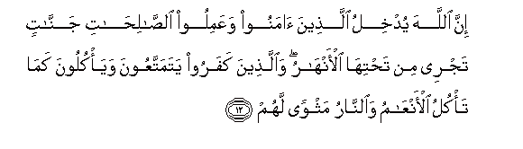
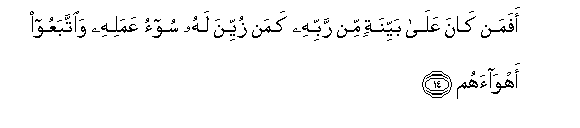
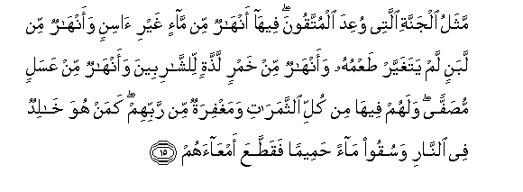
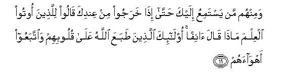
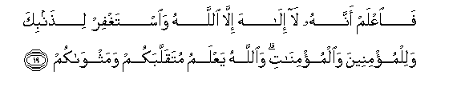

  
[Intangible Textual Heritage](../../index)  [Islam](../index.md) 
[Index](index.md)   
[Hypertext Qur'an](../htq/index)  [Unicode](../uq/047.htm#047_012.md) 
[Palmer](../sbe09/047)  [Pickthall](../pick/047.htm#047_012.md)  [Yusuf Ali
English](../yaq/yaq047)  [Rodwell](../qr/047.md)   
  
[Sūra XLVII.: Muḥammad (the Prophet). Index](047.md)  
  [Previous](04701)  [Next](04703.md) 

------------------------------------------------------------------------

  
*The Holy Quran*, tr. by Yusuf Ali, \[1934\], at Intangible Textual
Heritage

------------------------------------------------------------------------

# Sūra XLVII.: Muḥammad (the Prophet).

### Section 2

------------------------------------------------------------------------

12. Inna All<u>a</u>ha yudkhilu alla<u>th</u>eena <u>a</u>manoo
waAAamiloo a**l**<u>ssa</u>li<u>ha</u>ti jann<u>a</u>tin tajree min
ta<u>h</u>tih<u>a</u> al-anh<u>a</u>ru wa**a**lla<u>th</u>eena kafaroo
yatamattaAAoona waya/kuloona kam<u>a</u> ta/kulu al-anAA<u>a</u>mu
wa**al**nn<u>a</u>ru mathwan lahum

12\. Verily God will admit  
Those who believe and do  
Righteous deeds, to Gardens  
Beneath which rivers flow;  
While those who reject God  
Will enjoy (this world)  
And eat as cattle eat;  
And the Fire will  
Be their abode.

------------------------------------------------------------------------

13. Wakaayyin min qaryatin hiya ashaddu quwwatan min qaryatika allatee
akhrajatka ahlakn<u>a</u>hum fal<u>a</u> n<u>as</u>ira lahum

13\. And how many cities,  
With more power than  
Thy city which has  
Driven thee out,  
Have We destroyed  
(For their sins)?  
And there was none  
To aid them.

------------------------------------------------------------------------

14. Afaman k<u>a</u>na AAal<u>a</u> bayyinatin min rabbihi kaman zuyyina
lahu soo-o AAamalihi wa**i**ttabaAAoo ahw<u>a</u>ahum

14\. Is then one who is  
On a clear (Path)  
From his Lord,  
No better than one  
To whom the evil  
Of his conduct seems pleasing,  
And such as follow  
Their own lusts?

------------------------------------------------------------------------

15. Mathalu aljannati allatee wuAAida almuttaqoona feeh<u>a</u>
anh<u>a</u>run min m<u>a</u>-in ghayri <u>a</u>sinin waanh<u>a</u>run
min labanin lam yataghayyar <u>t</u>aAAmuhu waanh<u>a</u>run min khamrin
la<u>thth</u>atin li**l**shsh<u>a</u>ribeena waanh<u>a</u>run min
AAasalin mu<u>s</u>affan walahum feeh<u>a</u> min kulli
a**l**ththamar<u>a</u>ti wamaghfiratun min rabbihim kaman huwa
kh<u>a</u>lidun fee a**l**nn<u>a</u>ri wasuqoo m<u>a</u>an
<u>h</u>ameeman faqa<u>tt</u>aAAa amAA<u>a</u>ahum

15\. (Here is) a Parable  
Of the Garden which  
The righteous are promised:  
In it are rivers  
Of water incorruptible;  
Rivers of milk  
Of which the taste  
Never changes; rivers  
Of wine, a joy  
To those who drink;  
And rivers of honey  
Pure and clear. In it  
There are for them  
All kinds of fruits;  
And Grace from their Lord.  
(Can those in such Bliss)  
Be compared to such as  
Shall dwell for ever  
In the Fire, and be given,  
To drink, boiling water,  
So that it cuts up  
Their bowels (to pieces)?

------------------------------------------------------------------------

16. Waminhum man yastamiAAu ilayka <u>h</u>att<u>a</u> i<u>tha</u>
kharajoo min AAindika q<u>a</u>loo lilla<u>th</u>eena ootoo alAAilma
m<u>atha</u> q<u>a</u>la <u>a</u>nifan ol<u>a</u>-ika alla<u>th</u>eena
<u>t</u>abaAAa All<u>a</u>hu AAal<u>a</u> quloobihim wa**i**ttabaAAoo
ahw<u>a</u>ahum

16\. And among them are men  
Who listen to thee,  
But in the end, when they  
Go out from thee,  
They say to those who  
Have received Knowledge,  
"What is it he said  
Just then?" Such are  
Men whose hearts God  
Has sealed, and who  
Follow their own lusts.

------------------------------------------------------------------------

17. Wa**a**lla<u>th</u>eena ihtadaw z<u>a</u>dahum hudan
wa<u>a</u>t<u>a</u>hum taqw<u>a</u>hum

17\. But to those who receive  
Guidance, He increases  
The (light of) Guidance,  
And bestows on them  
Their Piety and Restraint  
(From evil).

------------------------------------------------------------------------

18. Fahal yan*<u>th</u>*uroona ill<u>a</u> a**l**ss<u>a</u>AAata an
ta/tiyahum baghtatan faqad j<u>a</u>a ashr<u>at</u>uh<u>a</u>
faann<u>a</u> lahum i<u>tha</u> j<u>a</u>at-hum <u>th</u>ikr<u>a</u>hum

18\. Do they then only wait  
For the Hour,—that it  
Should come on them  
Of a sudden? But already  
Have come some tokens  
Thereof, and when it  
(Actually) is on them,  
How can they benefit  
Then by their admonition?

------------------------------------------------------------------------

19. Fa**i**AAlam annahu l<u>a</u> il<u>a</u>ha ill<u>a</u> All<u>a</u>hu
wa**i**staghfir li<u>th</u>anbika walilmu/mineena
wa**a**lmu/min<u>a</u>ti wa**A**ll<u>a</u>hu yaAAlamu mutaqallabakum
wamathw<u>a</u>kum

19\. Know, therefore, that  
There is no god  
But God, and ask  
Forgiveness for thy fault,  
And for the men  
And women who believe:  
For God knows how ye  
Move about and how  
Ye dwell in your homes.

------------------------------------------------------------------------

[Next: Section 3 (20-28)](04703.md)

