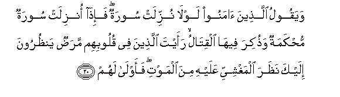
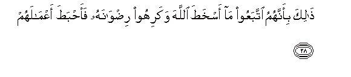

  
[Intangible Textual Heritage](../../index)  [Islam](../index) 
[Index](index)   
[Hypertext Qur'an](../htq/index)  [Unicode](../uq/047.htm#047_020) 
[Palmer](../sbe09/047)  [Pickthall](../pick/047.htm#047_020)  [Yusuf Ali
English](../yaq/yaq047)  [Rodwell](../qr/047)   
  
[Sūra XLVII.: Muḥammad (the Prophet). Index](047)  
  [Previous](04702)  [Next](04704) 

------------------------------------------------------------------------

  
*The Holy Quran*, tr. by Yusuf Ali, \[1934\], at Intangible Textual
Heritage

------------------------------------------------------------------------

# Sūra XLVII.: Muḥammad (the Prophet).

### Section 3

------------------------------------------------------------------------

20. Wayaqoolu alla<u>th</u>eena <u>a</u>manoo lawl<u>a</u> nuzzilat
sooratun fa-i<u>tha</u> onzilat sooratun mu<u>h</u>kamatun
wa<u>th</u>ukira feeh<u>a</u> alqit<u>a</u>lu raayta alla<u>th</u>eena
fee quloobihim mara<u>d</u>un yan*<u>th</u>*uroona ilayka
na*<u>th</u>*ara almaghshiyyi AAalayhi mina almawti faawl<u>a</u> lahum

20\. Those who believe say,  
"Why is not a Sūra  
Sent down (for us)?"  
But when a Sūra  
Of basic or categorical  
Meaning is revealed,  
And fighting is mentioned  
Therein, thou wilt see those  
In whose hearts is a disease  
Looking at thee with a look  
Of one in swoon at  
The approach of death.  
But more fitting for them—

------------------------------------------------------------------------

21. <u>Ta</u>AAatun waqawlun maAAroofun fa-i<u>tha</u> AAazama al-amru
falaw <u>s</u>adaqoo All<u>a</u>ha lak<u>a</u>na khayran lahum

21\. Were it to obey  
And say what is just,  
And when a matter  
Is resolved on, it were  
Best for them if they  
Were true to God.

------------------------------------------------------------------------

22. Fahal AAasaytum in tawallaytum an tufsidoo fee al-ar<u>d</u>i
watuqa<u>tt</u>iAAoo ar<u>ha</u>makum

22\. Then, is it  
To be expected of you,  
If ye were put in authority,  
That ye will do mischief  
In the land, and break  
Your ties of kith and kin?

------------------------------------------------------------------------

23. Ol<u>a</u>-ika alla<u>th</u>eena laAAanahumu All<u>a</u>hu
faa<u>s</u>ammahum waaAAm<u>a</u> ab<u>sa</u>rahum

23\.

------------------------------------------------------------------------

24. Afal<u>a</u> yatadabbaroona alqur-<u>a</u>na am AAal<u>a</u>
quloobin aqf<u>a</u>luh<u>a</u>

24\. Do they not then  
Earnestly seek to understand  
The Qur-ān, or are  
Their hearts locked up  
By them?

------------------------------------------------------------------------

25. Inna alla<u>th</u>eena irtaddoo AAal<u>a</u> adb<u>a</u>rihim min
baAAdi m<u>a</u> tabayyana lahumu alhud<u>a</u> a**l**shshay<u>ta</u>nu
sawwala lahum waaml<u>a</u> lahum

25\. Those who turn back  
As apostates after Guidance  
Was clearly shown to them,—  
The Evil One has instigated  
Them and buoyed them up  
With false hopes.

------------------------------------------------------------------------

26. <u>Tha</u>lika bi-annahum q<u>a</u>loo lilla<u>th</u>eena karihoo
m<u>a</u> nazzala All<u>a</u>hu sanu<u>t</u>eeAAukum fee baAA<u>d</u>i
al-amri wa**A**ll<u>a</u>hu yaAAlamu isr<u>a</u>rahum

26\. This, because they said  
To those who hate what  
God has revealed, "We  
Will obey you in part  
Of (this) matter"; but God  
Knows their (inner) secrets.

------------------------------------------------------------------------

27. Fakayfa i<u>tha</u> tawaffat-humu almal<u>a</u>-ikatu
ya<u>d</u>riboona wujoohahum waadb<u>a</u>rahum

27\. But how (will it be)  
When the angels take  
Their souls at death,  
And smite their faces  
And their backs?

------------------------------------------------------------------------

28. <u>Tha</u>lika bi-annahumu ittabaAAoo m<u>a</u> askha<u>t</u>a
All<u>a</u>ha wakarihoo ri<u>d</u>w<u>a</u>nahu faa<u>h</u>ba<u>t</u>a
aAAm<u>a</u>lahum

28\. This because they followed  
That which called forth  
The Wrath of God, and  
They hated God's good pleasure;  
So He made their deeds  
Of no effect.

------------------------------------------------------------------------

[Next: Section 4 (29-38)](04704)

