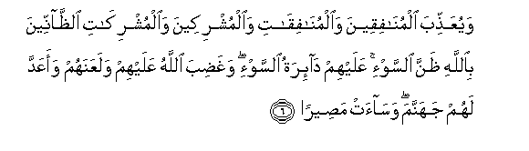

  
[Intangible Textual Heritage](../../index)  [Islam](../index.md) 
[Index](index.md)   
[Hypertext Qur'an](../htq/index)  [Unicode](../uq/048.htm#048_001.md) 
[Palmer](../sbe09/048)  [Pickthall](../pick/048.htm#048_001.md)  [Yusuf Ali
English](../yaq/yaq048)  [Rodwell](../qr/048.md)   
  
[Sūra XLVIII.: Fat-ḥ or Victory. Index](048.md)  
  [Previous](04704)  [Next](04802.md) 

------------------------------------------------------------------------

  
*The Holy Quran*, tr. by Yusuf Ali, \[1934\], at Intangible Textual
Heritage

------------------------------------------------------------------------

# Sūra XLVIII.: Fat-ḥ or Victory.

### Section 1

1. Inn<u>a</u> fata<u>h</u>n<u>a</u> laka fat<u>h</u>an
mubeen<u>a</u>**n**

1\. Verily We have granted  
Thee a manifest Victory:

------------------------------------------------------------------------

2. Liyaghfira laka All<u>a</u>hu m<u>a</u> taqaddama min <u>th</u>anbika
wam<u>a</u> taakhkhara wayutimma niAAmatahu AAalayka wayahdiyaka
<u>s</u>ir<u>at</u>an mustaqeem<u>a</u>**n**

2\. That God may forgive thee  
Thy faults of the past  
And those to follow;  
Fulfil His favour to thee;  
And guide thee  
On the Straight Way;

------------------------------------------------------------------------

3. Wayan<u>s</u>uraka All<u>a</u>hu na<u>s</u>ran AAazeez<u>a</u>**n**

3\. And that God may help  
Thee with powerful help.

------------------------------------------------------------------------

4. Huwa alla<u>th</u>ee anzala a**l**ssakeenata fee quloobi almu/mineena
liyazd<u>a</u>doo eem<u>a</u>nan maAAa eem<u>a</u>nihim walill<u>a</u>hi
junoodu a**l**ssam<u>a</u>w<u>a</u>ti wa**a**l-ar<u>d</u>i wak<u>a</u>na
All<u>a</u>hu AAaleeman <u>h</u>akeem<u>a</u>**n**

4\. It is He Who sent  
Down Tranquillity  
Into the hearts of  
The Believers, that they may  
Add Faith to their Faith;—  
For to God belong  
The Forces of the heavens  
And the earth; and God is  
Full of Knowledge and Wisdom;—

------------------------------------------------------------------------

5. Liyudkhila almu/mineena wa**a**lmu/min<u>a</u>ti jann<u>a</u>tin
tajree min ta<u>h</u>tih<u>a</u> al-anh<u>a</u>ru kh<u>a</u>lideena
feeh<u>a</u> wayukaffira AAanhum sayyi-<u>a</u>tihim wak<u>a</u>na
<u>tha</u>lika AAinda All<u>a</u>hi fawzan
AAa*<u>th</u>*eem<u>a</u>**n**

5\. That He may admit  
The men and women  
Who believe, to Gardens  
Beneath which rivers flow,  
To dwell therein for aye,  
And remove their ills  
From them;—and that is,  
In the sight of God,  
The highest achievement  
(For man),—

------------------------------------------------------------------------

6. WayuAAa<u>thth</u>iba almun<u>a</u>fiqeena
wa**a**lmun<u>a</u>fiq<u>a</u>ti wa**a**lmushrikeena
wa**a**lmushrik<u>a</u>ti a**l***<u>thth</u>*<u>a</u>nneena
bi**A**ll<u>a</u>hi *<u>th</u>*anna a**l**ssaw-i AAalayhim
d<u>a</u>-iratu a**l**ssaw-i wagha<u>d</u>iba All<u>a</u>hu AAalayhim
walaAAanahum waaAAadda lahum jahannama was<u>a</u>at
ma<u>s</u>eer<u>a</u>**n**

6\. And that He may punish  
The Hypocrites, men and  
Women, and the Polytheists,  
Men and women, who imagine  
An evil opinion of God.  
On them is a round  
Of Evil: the Wrath of God  
Is on them: He has cursed  
Them and got Hell ready  
For them: and evil  
Is it for a destination.

------------------------------------------------------------------------

7. Walill<u>a</u>hi junoodu a**l**ssam<u>a</u>w<u>a</u>ti
wa**a**l-ar<u>d</u>i wak<u>a</u>na All<u>a</u>hu AAazeezan
<u>h</u>akeem<u>a</u>**n**

7\. For to God belong  
The Forces of the heavens  
And the earth; and God is  
Exalted in Power,  
Full of Wisdom.

------------------------------------------------------------------------

8. Inn<u>a</u> arsaln<u>a</u>ka sh<u>a</u>hidan wamubashshiran
wana<u>th</u>eer<u>a</u>**n**

8\. We have truly sent thee  
As a witness, as a  
Bringer of Glad Tidings,  
And as a Warner:

------------------------------------------------------------------------

9. Litu/minoo bi**A**ll<u>a</u>hi warasoolihi watuAAazziroohu
watuwaqqiroohu watusabbi<u>h</u>oohu bukratan
waa<u>s</u>eel<u>a</u>**n**

9\. In order that ye  
(O men) may believe  
In God and His Apostle,  
That ye may assist  
And honour Him,  
And celebrate His praises  
Morning and evening.

------------------------------------------------------------------------

10. Inna alla<u>th</u>eena yub<u>a</u>yiAAoonaka innam<u>a</u>
yub<u>a</u>yiAAoona All<u>a</u>ha yadu All<u>a</u>hi fawqa aydeehim
faman nakatha fa-innam<u>a</u> yankuthu AAal<u>a</u> nafsihi waman
awf<u>a</u> bim<u>a</u> AA<u>a</u>hada AAalayhu All<u>a</u>ha
fasayu/teehi ajran AAa*<u>th</u>*eem<u>a</u>**n**

10\. Verily those who plight  
Their fealty to thee  
Do no less than plight  
Their fealty to God:  
The Hand of God is  
Over their hands:  
Then any one who violates  
His oath, does so  
To the harm of his own  
Soul, and any one who  
Fulfils what he has  
Covenanted with God,—  
God will soon grant him  
A great Reward.

------------------------------------------------------------------------

[Next: Section 2 (11-17)](04802.md)

