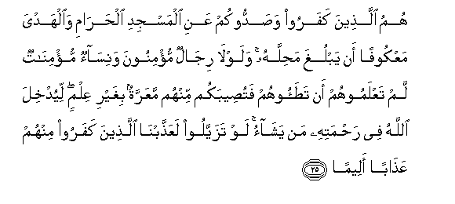

  
[Intangible Textual Heritage](../../index)  [Islam](../index.md) 
[Index](index.md)   
[Hypertext Qur'an](../htq/index)  [Unicode](../uq/048.htm#048_018.md) 
[Palmer](../sbe09/048)  [Pickthall](../pick/048.htm#048_018.md)  [Yusuf Ali
English](../yaq/yaq048)  [Rodwell](../qr/048.md)   
  
[Sūra XLVIII.: Fat-ḥ or Victory. Index](048.md)  
  [Previous](04802)  [Next](04804.md) 

------------------------------------------------------------------------

  
*The Holy Quran*, tr. by Yusuf Ali, \[1934\], at Intangible Textual
Heritage

------------------------------------------------------------------------

# Sūra XLVIII.: Fat-ḥ or Victory.

### Section 3

------------------------------------------------------------------------

18. Laqad ra<u>d</u>iya All<u>a</u>hu AAani almu/mineena i<u>th</u>
yub<u>a</u>yiAAoonaka ta<u>h</u>ta a**l**shshajarati faAAalima m<u>a</u>
fee quloobihim faanzala a**l**sakeenata AAalayhim waath<u>a</u>bahum
fat<u>h</u>an qareeb<u>a</u>**n**

18\. God's Good Pleasure  
Was on the Believers  
When they swore Fealty  
To thee under the Tree:  
He knew what was  
In their hearts, and He  
Sent down Tranquillity  
To them; and He rewarded  
Them with a speedy Victory;

------------------------------------------------------------------------

19. Wamagh<u>a</u>nima katheeratan ya/khu<u>th</u>oonah<u>a</u>
wak<u>a</u>na All<u>a</u>hu AAazeezan <u>h</u>akeem<u>a</u>**n**

19\. And many gains will they  
Acquire (besides): and God  
Is Exalted in Power,  
Full of Wisdom.

------------------------------------------------------------------------

20. WaAAadakumu All<u>a</u>hu magh<u>a</u>nima katheeratan
ta/khu<u>th</u>oonah<u>a</u> faAAajjala lakum h<u>ath</u>ihi wakaffa
aydiya a**l**nn<u>a</u>si AAankum walitakoona <u>a</u>yatan
lilmu/mineena wayahdiyakum <u>s</u>ir<u>at</u>an mustaqeem<u>a</u>**n**

20\. God has promised you  
Many gains that ye shall  
Acquire, and He has given  
You these beforehand; and  
He has restrained the hands  
Of men from you; that it  
May be a Sign for  
The Believers, and that  
He may guide you  
To a Straight Path;

------------------------------------------------------------------------

21. Waokhr<u>a</u> lam taqdiroo AAalayh<u>a</u> qad a<u>hat</u>a
All<u>a</u>hu bih<u>a</u> wak<u>a</u>na All<u>a</u>hu AAal<u>a</u> kulli
shay-in qadeer<u>a</u>**n**

21\. And other gains (there are),  
Which are not within  
Your power, but which  
God has compassed: and God  
Has power over all things.

------------------------------------------------------------------------

22. Walaw q<u>a</u>talakumu alla<u>th</u>eena kafaroo lawallawoo
al-adb<u>a</u>ra thumma l<u>a</u> yajidoona waliyyan wal<u>a</u>
na<u>s</u>eer<u>a</u>**n**

22\. If the Unbelievers  
Should fight you, they would  
Certainly turn their backs;  
Then would they find  
Neither protector nor helper.

------------------------------------------------------------------------

23. Sunnata All<u>a</u>hi allatee qad khalat min qablu walan tajida
lisunnati All<u>a</u>hi tabdeel<u>a</u>**n**

23\. (Such has been) the practice  
(Approved) of God already  
In the past: no change  
Wilt thou find in  
The practice (approved) of God.

------------------------------------------------------------------------

24. Wahuwa alla<u>th</u>ee kaffa aydiyahum AAankum waaydiyakum AAanhum
biba<u>t</u>ni makkata min baAAdi an a*<u>th</u>*farakum AAalayhim
wak<u>a</u>na All<u>a</u>hu bim<u>a</u> taAAmaloona
ba<u>s</u>eer<u>a</u>**n**

24\. And it is He Who  
Has restrained their hands  
From you and your hands  
From them in the midst  
Of Mecca, after that He  
Gave you the victory  
Over them. And God sees  
Well all that ye do.

------------------------------------------------------------------------

25. Humu alla<u>th</u>eena kafaroo wa<u>s</u>addookum AAani almasjidi
al<u>h</u>ar<u>a</u>mi wa**a**lhadya maAAkoofan an yablugha
ma<u>h</u>illahu walawl<u>a</u> rij<u>a</u>lun mu/minoona
wanis<u>a</u>on mu/min<u>a</u>tun lam taAAlamoohum an ta<u>t</u>aoohum
fatu<u>s</u>eebakum minhum maAAarratun bighayri AAilmin liyudkhila
All<u>a</u>hu fee ra<u>h</u>matihi man yash<u>a</u>o law tazayyaloo
laAAa<u>thth</u>abn<u>a</u> alla<u>th</u>eena kafaroo minhum
AAa<u>tha</u>ban aleem<u>a</u>**n**

25\. They are the ones who  
Denied revelation and hindered you  
From the Sacred Mosque  
And the sacrificial animals,  
Detained from reaching their  
Place of sacrifice. Had there  
Not been believing men  
And believing women whom  
Ye did not know that  
Ye were trampling down  
And on whose account  
A crime would have accrued  
To you without (your) knowledge,  
(God would have allowed you  
To force your way, but  
He held back your hands)  
That He may admit  
To His Mercy whom He will.  
If they had been  
Apart, We should  
Certainly have punished  
The Unbelievers among them  
With a grievous punishment.

------------------------------------------------------------------------

26. I<u>th</u> jaAAala alla<u>th</u>eena kafaroo fee quloobihimu
al<u>h</u>amiyyata <u>h</u>amiyyata alj<u>a</u>hiliyyati faanzala
All<u>a</u>hu sakeenatahu AAal<u>a</u> rasoolihi waAAal<u>a</u>
almu/mineena waalzamahum kalimata a**l**ttaqw<u>a</u> wak<u>a</u>noo
a<u>h</u>aqqa bih<u>a</u> waahlah<u>a</u> wak<u>a</u>na All<u>a</u>hu
bikulli shay-in AAaleem<u>a</u>**n**

26\. While the Unbelievers  
Got up in their hearts  
Heat and cant—the heat  
And cant of Ignorance,—  
God sent down His Tranquillity  
To his Apostle and to  
The Believers, and made them  
Stick close to the command  
Of self-restraint; and well  
Were they entitled to it  
And worthy of it.  
And God has full knowledge  
Of all things.

------------------------------------------------------------------------

[Next: Section 4 (27-29)](04804.md)

