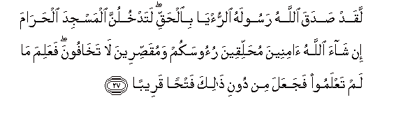
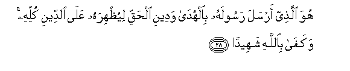
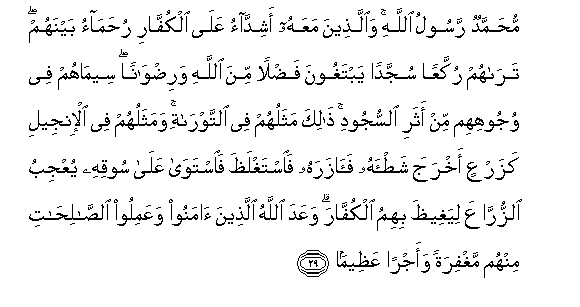

  
[Intangible Textual Heritage](../../index)  [Islam](../index.md) 
[Index](index.md)   
[Hypertext Qur'an](../htq/index)  [Unicode](../uq/048.htm#048_027.md) 
[Palmer](../sbe09/048)  [Pickthall](../pick/048.htm#048_027.md)  [Yusuf Ali
English](../yaq/yaq048)  [Rodwell](../qr/048.md)   
  
[Sūra XLVIII.: Fat-ḥ or Victory. Index](048.md)  
  [Previous](04803)  [Next](04901.md) 

------------------------------------------------------------------------

  
*The Holy Quran*, tr. by Yusuf Ali, \[1934\], at Intangible Textual
Heritage

------------------------------------------------------------------------

# Sūra XLVIII.: Fat-ḥ or Victory.

### Section 4

------------------------------------------------------------------------

27. Laqad <u>s</u>adaqa All<u>a</u>hu rasoolahu a**l**rru/y<u>a</u>
bi**a**l<u>h</u>aqqi latadkhulunna almasjida al<u>h</u>ar<u>a</u>ma in
sh<u>a</u>a All<u>a</u>hu <u>a</u>mineena mu<u>h</u>alliqeena ruoosakum
wamuqa<u>ss</u>ireena l<u>a</u> takh<u>a</u>foona faAAalima m<u>a</u>
lam taAAlamoo fajaAAala min dooni <u>tha</u>lika fat<u>h</u>an
qareeb<u>a</u>**n**

27\. Truly did God fulfil  
The vision for His Apostle:  
Ye shall enter the Sacred  
Mosque, if God wills,  
With minds secure, heads shaved,  
Hair cut short, and without fear.  
For He knew what ye  
Knew not, and He granted,  
Besides this, a speedy victory.

------------------------------------------------------------------------

28. Huwa alla<u>th</u>ee arsala rasoolahu bi**a**lhud<u>a</u> wadeeni
al<u>h</u>aqqi liyu*<u>th</u>*hirahu AAal<u>a</u> a**l**ddeeni kullihi
wakaf<u>a</u> bi**A**ll<u>a</u>hi shaheed<u>a</u>**n**

28\. It is He Who has sent  
His Apostle with Guidance  
And the Religion of Truth,  
To proclaim it over  
All religion: and enough  
Is God for a Witness.

------------------------------------------------------------------------

29. Mu<u>h</u>ammadun rasoolu All<u>a</u>hi wa**a**lla<u>th</u>eena
maAAahu ashidd<u>a</u>o AAal<u>a</u> alkuff<u>a</u>ri
ru<u>h</u>am<u>a</u>o baynahum tar<u>a</u>hum rukkaAAan sujjadan
yabtaghoona fa<u>d</u>lan mina All<u>a</u>hi wari<u>d</u>w<u>a</u>nan
seem<u>a</u>hum fee wujoohihim min athari a**l**ssujoodi <u>tha</u>lika
mathaluhum fee a**l**ttawr<u>a</u>ti wamathaluhum fee al-injeeli
kazarAAin akhraja sha<u>t</u>-ahu fa<u>a</u>zarahu
fa**i**staghla*<u>th</u>*a fa**i**staw<u>a</u> AAal<u>a</u> sooqihi
yuAAjibu a**l**zzurr<u>a</u>AAa liyaghee*<u>th</u>*a bihimu
alkuff<u>a</u>ra waAAada All<u>a</u>hu alla<u>th</u>eena <u>a</u>manoo
waAAamiloo a**l**<u>ssa</u>li<u>ha</u>ti minhum maghfiratan waajran
AAa*<u>th</u>*eem<u>a</u>**n**

29\. Muhammad is the Apostle  
Of God; and those who are  
With him are strong  
Against Unbelievers, (but)  
Compassionate amongst each other.  
Thou wilt see them bow  
And prostrate themselves  
(In prayer), seeking Grace  
From God and (His) Good  
Pleasure.  
On their faces are their  
Marks, (being) the traces  
Of their prostration.  
This is their similitude  
In the Taurāt;  
And their similitude  
In the Gospel is:  
Like a seed which sends  
Forth its blade, then  
Makes it strong; it then  
Becomes thick, and it stands  
On its own stem, (filling)  
The sowers with wonder  
And delight. As a result,  
It fills the Unbelievers  
With rage at them.  
God has promised those  
Among them who believe  
And do righteous deeds  
Forgiveness,  
And a great Reward.

------------------------------------------------------------------------

[Next: Section 1 (1-10)](04901.md)

