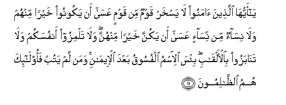

  
[Intangible Textual Heritage](../../index)  [Islam](../index.md) 
[Index](index.md)   
[Hypertext Qur'an](../htq/index)  [Unicode](../uq/049.htm#049_011.md) 
[Palmer](../sbe09/049)  [Pickthall](../pick/049.htm#049_011.md)  [Yusuf Ali
English](../yaq/yaq049)  [Rodwell](../qr/049.md)   
  
[Sūra XLIX.: Ḥujurāt, or the Inner Apartments. Index](049.md)  
  [Previous](04901)  [Next](05001.md) 

------------------------------------------------------------------------

  
*The Holy Quran*, tr. by Yusuf Ali, \[1934\], at Intangible Textual
Heritage

------------------------------------------------------------------------

# Sūra XLIX.: Ḥujurāt, or the Inner Apartments.

### Section 2

------------------------------------------------------------------------

11. Y<u>a</u> ayyuh<u>a</u> alla<u>th</u>eena <u>a</u>manoo l<u>a</u>
yaskhar qawmun min qawmin AAas<u>a</u> an yakoonoo khayran minhum
wal<u>a</u> nis<u>a</u>on min nis<u>a</u>-in AAas<u>a</u> an yakunna
khayran minhunna wal<u>a</u> talmizoo anfusakum wal<u>a</u>
tan<u>a</u>bazoo bi**a**l-alq<u>a</u>bi bi/sa al-ismu alfusooqu baAAda
al-eem<u>a</u>ni waman lam yatub faol<u>a</u>-ika humu
a**l***<u>thth</u>*<u>a</u>limoon**a**

11\. O ye who believe!  
Let not some men  
Among you laugh at others:  
It may be that  
The (latter) are better  
Than the (former):  
Nor let some women  
Laugh at others:  
It may be that  
The (latter) are better  
Than the (former):  
Nor defame nor be  
Sarcastic to each other,  
Nor call each other  
By (offensive) nicknames:  
Ill-seeming is a name  
Connoting wickedness,  
(To be used of one)  
After he has believed:  
And those who  
Do not desist are  
(Indeed) doing wrong.

------------------------------------------------------------------------

12. Y<u>a</u> ayyuh<u>a</u> alla<u>th</u>eena <u>a</u>manoo ijtaniboo
katheeran mina a**l***<u>thth</u>*anni inna baAA<u>d</u>a
a**l***<u>thth</u>*anni ithmun wal<u>a</u> tajassasoo wal<u>a</u>
yaghtab baAA<u>d</u>ukum baAA<u>d</u>an ayu<u>h</u>ibbu a<u>h</u>adukum
an ya/kula la<u>h</u>ma akheehi maytan fakarihtumoohu wa**i**ttaqoo
All<u>a</u>ha inna All<u>a</u>ha taww<u>a</u>bun ra<u>h</u>eem**un**

12\. O ye who believe!  
Avoid suspicion as much  
(As possible): for suspicion  
In some cases is a sin:  
And spy not on each other,  
Nor speak ill of each other  
Behind their backs. Would any  
Of you like to eat  
The flesh of his dead  
Brother? Nay, ye would  
Abhor it… But fear God:  
For God is Oft-Returning,  
Most Merciful.

------------------------------------------------------------------------

13. Y<u>a</u> ayyuh<u>a</u> a**l**nn<u>a</u>su inn<u>a</u>
khalaqn<u>a</u>kum min <u>th</u>akarin waonth<u>a</u>
wajaAAaln<u>a</u>kum shuAAooban waqab<u>a</u>-ila litaAA<u>a</u>rafoo
inna akramakum AAinda All<u>a</u>hi atq<u>a</u>kum inna All<u>a</u>ha
AAaleemun khabeer**un**

13\. O mankind! We created  
You from a single (pair)  
Of a male and a female,  
And made you into  
Nations and tribes, that  
Ye may know each other  
(Not that ye may despise  
(Each other). Verily  
The most honoured of you  
In the sight of God  
Is (he who is) the most  
Righteous of you.  
And God has full knowledge  
And is well acquainted  
(With all things).

------------------------------------------------------------------------

14. Q<u>a</u>lati al-aAAr<u>a</u>bu <u>a</u>mann<u>a</u> qul lam
tu/minoo wal<u>a</u>kin qooloo aslamn<u>a</u> walamm<u>a</u> yadkhuli
al-eem<u>a</u>nu fee quloobikum wa-in tu<u>t</u>eeAAoo All<u>a</u>ha
warasoolahu l<u>a</u> yalitkum min aAAm<u>a</u>likum shay-an inna
All<u>a</u>ha ghafoorun ra<u>h</u>eem**un**

14\. The desert Arabs say,  
"We believe." Say, ''Ye  
Have no faith; but ye  
(Only) say, "We have submitted  
Our wills to God,"  
For not yet has Faith  
Entered your hearts.  
But if ye obey God  
And His Apostle, He  
Will not belittle aught  
Of your deeds: for God  
Is Oft-Forgiving, Most Merciful."

------------------------------------------------------------------------

15. Innam<u>a</u> almu/minoona alla<u>th</u>eena <u>a</u>manoo
bi**A**ll<u>a</u>hi warasoolihi thumma lam yart<u>a</u>boo
waj<u>a</u>hadoo bi-amw<u>a</u>lihim waanfusihim fee sabeeli
All<u>a</u>hi ol<u>a</u>-ika humu a**l**<u>ssa</u>diqoon**a**

15\. Only those are Believers  
Who have believed in God  
And His Apostle, and have  
Never since doubted, but  
Have striven with their  
Belongings and their persons  
In the Cause of God:  
Such are the sincere ones.

------------------------------------------------------------------------

16. Qul atuAAallimoona All<u>a</u>ha bideenikum wa**A**ll<u>a</u>hu
yaAAlamu m<u>a</u> fee a**l**ssam<u>a</u>w<u>a</u>ti wam<u>a</u> fee
al-ar<u>d</u>i wa**A**ll<u>a</u>hu bikulli shay-in AAaleem**un**

16\. Say: "What! Will ye  
Instruct God about your  
Religion? But God knows  
All that is in the heavens  
And on earth: He has  
Full knowledge of all things.

------------------------------------------------------------------------

17. Yamunnoona AAalayka an aslamoo qul l<u>a</u> tamunnoo AAalayya
isl<u>a</u>makum bali All<u>a</u>hu yamunnu AAalaykum an had<u>a</u>kum
lil-eem<u>a</u>ni in kuntum <u>sa</u>diqeen**a**

17\. They impress on thee  
As favour that they  
Have embraced Islam.  
Say, "Count not your Islam  
As a favour upon me:  
Nay, God has conferred  
A favour upon you  
That He has guided you  
To the Faith, if ye  
Be true and sincere.

------------------------------------------------------------------------

18. Inna All<u>a</u>ha yaAAlamu ghayba a**l**ssam<u>a</u>w<u>a</u>ti
wa**a**l-ar<u>d</u>i wa**A**ll<u>a</u>hu ba<u>s</u>eerun bim<u>a</u>
taAAmaloon**a**

18\. "Verily God knows  
The secrets of the heavens  
And the earth: and God  
Sees well all  
That ye do."

------------------------------------------------------------------------

[Next: Section 1 (1-15)](05001.md)

