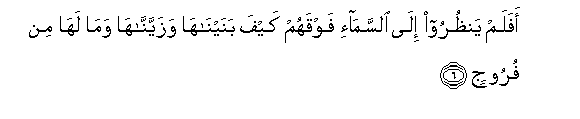

  
[Intangible Textual Heritage](../../index)  [Islam](../index) 
[Index](index)   
[Hypertext Qur'an](../htq/index)  [Unicode](../uq/050.htm#050_001) 
[Palmer](../sbe09/050)  [Pickthall](../pick/050.htm#050_001)  [Yusuf Ali
English](../yaq/yaq050)  [Rodwell](../qr/050)   
  
[Sūra L.: Qāf. Index](050)  
  [Previous](04902)  [Next](05002) 

------------------------------------------------------------------------

  
*The Holy Quran*, tr. by Yusuf Ali, \[1934\], at Intangible Textual
Heritage

------------------------------------------------------------------------

# Sūra L.: Qāf.

### Section 1

1. Q<u>a</u>f wa**a**lqur-<u>a</u>ni almajeed**i**

1\. Qāf.  
By the Glorious Qur-ān  
(Thou art God's Apostle).

------------------------------------------------------------------------

2. Bal AAajiboo an j<u>a</u>ahum mun<u>th</u>irun minhum faq<u>a</u>la
alk<u>a</u>firoona h<u>atha</u> shay-on AAajeeb**un**

2\. But they wonder that  
There has come to them  
A Warner from among  
Themselves.  
So the Unbelievers say:  
"This is a wonderful thing!

------------------------------------------------------------------------

3. A-i<u>tha</u> mitn<u>a</u> wakunn<u>a</u> tur<u>a</u>ban
<u>tha</u>lika rajAAun baAAeed**un**

3\. "What! When we die  
And become dust, (shall we  
Live again?) That is  
A (sort of) Return  
Far (from our understanding)."

------------------------------------------------------------------------

4. Qad AAalimn<u>a</u> m<u>a</u> tanqu<u>s</u>u al-ar<u>d</u>u minhum
waAAindan<u>a</u> kit<u>a</u>bun <u>h</u>afee*<u>th</u>***un**

4\. We already know  
How much of them  
The earth takes away:  
With Us is a Record  
Guarding (the full account).

------------------------------------------------------------------------

5. Bal ka<u>thth</u>aboo bi**a**l<u>h</u>aqqi lamm<u>a</u> j<u>a</u>ahum
fahum fee amrin mareej**in**

5\. But they deny the truth  
When it comes to them:  
So they are in  
A confused state.

------------------------------------------------------------------------

6. Afalam yan*<u>th</u>*uroo il<u>a</u> a**l**ssam<u>a</u>-i fawqahum
kayfa banayn<u>a</u>h<u>a</u> wazayyann<u>a</u>h<u>a</u> wam<u>a</u>
lah<u>a</u> min furooj**in**

6\. Do they not look  
At the sky above them?—  
How We have made it  
And adorned it,  
And there are no  
Flaws in it?

------------------------------------------------------------------------

7. Wa**a**l-ar<u>d</u>a madadn<u>a</u>h<u>a</u> waalqayn<u>a</u>
feeh<u>a</u> raw<u>a</u>siya waanbatn<u>a</u> feeh<u>a</u> min kulli
zawjin baheej**in**

7\. And the earth—  
We have spread it out,  
And set thereon mountains  
Standing firm, and produced  
Therein every kind of  
Beautiful growth (in pairs)—

------------------------------------------------------------------------

8. Tab<u>s</u>iratan wa<u>th</u>ikr<u>a</u> likulli AAabdin muneeb**in**

8\. To be observed  
And commemorated  
By every devotee  
Turning (to God).

------------------------------------------------------------------------

9. Wanazzaln<u>a</u> mina a**l**ssam<u>a</u>-i m<u>a</u>an
mub<u>a</u>rakan faanbatn<u>a</u> bihi jann<u>a</u>tin wa<u>h</u>abba
al<u>h</u>a<u>s</u>eed**i**

9\. And We send down  
From the sky Rain  
Charged with blessing,  
And We produce therewith  
Gardens and Grain for harvests;

------------------------------------------------------------------------

10. Wa**al**nnakhla b<u>a</u>siq<u>a</u>tin lah<u>a</u> <u>t</u>alAAun
na<u>d</u>eed**un**

10\. And tall (and stately)  
Palm-trees, with shoots  
Of fruit-stalks, piled  
One over another;—

------------------------------------------------------------------------

11. Rizqan lilAAib<u>a</u>di waa<u>h</u>yayn<u>a</u> bihi baldatan
maytan ka<u>tha</u>lika alkhurooj**u**

11\.

------------------------------------------------------------------------

12. Ka<u>thth</u>abat qablahum qawmu noo<u>h</u>in
waa<u>s</u>-<u>ha</u>bu a**l**rrassi wathamood**u**

12\. Before them was denied  
(The Hereafter) by the People  
Of Noah, the Companions  
Of the Rass, the <u>Th</u>amūd,

------------------------------------------------------------------------

13. WaAA<u>a</u>dun wafirAAawnu wa-ikhw<u>a</u>nu loo<u>t</u>**in**

13\. The ‘Ād, Pharaoh,  
The Brethren of Lūṭ,

------------------------------------------------------------------------

14. Waa<u>s</u>-<u>ha</u>bu al-aykati waqawmu tubbaAAin kullun
ka<u>thth</u>aba a**l**rrusula fa<u>h</u>aqqa waAAeed**i**

14\. The Companions of the Wood,  
And the People of Tubba‘;  
Each one (of them) rejected  
The apostles, and My warning  
Was duly fulfilled (in them).

------------------------------------------------------------------------

15. AfaAAayeen<u>a</u> bi**a**lkhalqi al-awwali bal hum fee labsin min
khalqin jadeed**in**

15\. Were We then weary  
With the first Creation,  
That they should be  
In confused doubt  
About a new Creation?

------------------------------------------------------------------------

[Next: Section 2 (16-29)](05002)

