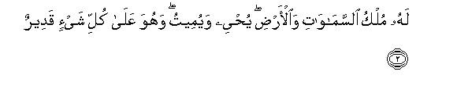
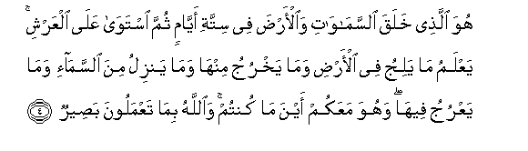
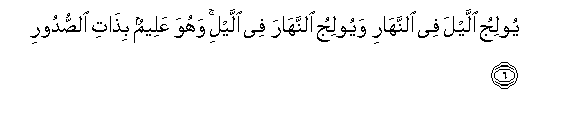
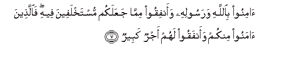
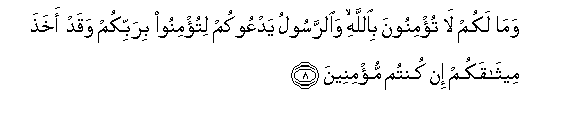
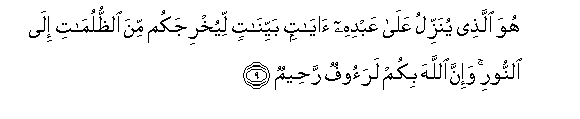
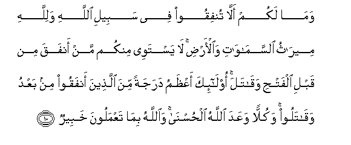

  
[Intangible Textual Heritage](../../index)  [Islam](../index) 
[Index](index)   
[Hypertext Qur'an](../htq/index)  [Unicode](../uq/057.htm#057_001) 
[Palmer](../sbe09/057)  [Pickthall](../pick/057.htm#057_001)  [Yusuf Ali
English](../yaq/yaq057)  [Rodwell](../qr/057)   
  
[Sūra LVII.: Ḥadīd, or Iron. Index](057)  
  [Previous](05603)  [Next](05702) 

------------------------------------------------------------------------

  
*The Holy Quran*, tr. by Yusuf Ali, \[1934\], at Intangible Textual
Heritage

------------------------------------------------------------------------

# Sūra LVII.: Ḥadīd, or Iron.

### Section 1

1. Sabba<u>h</u>a lill<u>a</u>hi m<u>a</u> fee
a**l**ssam<u>a</u>w<u>a</u>ti wa**a**l-ar<u>d</u>i wahuwa alAAazeezu
al<u>h</u>akeem**u**

1\. Whatever is in  
The heavens and on earth,—  
Let it declare  
The Praises and Glory of God:  
For He is the Exalted  
In Might, the Wise.

------------------------------------------------------------------------

2. Lahu mulku a**l**ssam<u>a</u>w<u>a</u>ti wa**a**l-ar<u>d</u>i
yu<u>h</u>yee wayumeetu wahuwa AAal<u>a</u> kulli shay-in qadeer**un**

2\. To Him belongs the dominion  
Of the heavens and the earth:  
It is He Who gives  
Life and Death; and He  
Has Power over all things.

------------------------------------------------------------------------

3. Huwa al-awwalu wa**a**l-<u>a</u>khiru
wa**al***<u>thth</u>*<u>a</u>hiru wa**a**lb<u>at</u>inu wahuwa bikulli
shay-in AAaleem**un**

3\. He is the First  
And the Last,  
The Evident  
And the Immanent:  
And He has full knowledge  
Of all things.

------------------------------------------------------------------------

4. Huwa alla<u>th</u>ee khalaqa a**l**ssam<u>a</u>w<u>a</u>ti
wa**a**l-ar<u>d</u>a fee sittati ayy<u>a</u>min thumma istaw<u>a</u>
AAal<u>a</u> alAAarshi yaAAlamu m<u>a</u> yaliju fee al-ar<u>d</u>i
wam<u>a</u> yakhruju minh<u>a</u> wam<u>a</u> yanzilu mina
a**l**ssam<u>a</u>-i wam<u>a</u> yaAAruju feeh<u>a</u> wahuwa maAAakum
ayna m<u>a</u> kuntum wa**A**ll<u>a</u>hu bim<u>a</u> taAAmaloona
ba<u>s</u>eer**un**

4\. He it is Who created  
The heavens and the earth  
In six Days, and is moreover  
Firmly established on the Throne  
(Of authority). He knows  
What enters within the earth  
And what comes forth out  
Of it, what comes down  
From heaven and what mounts  
Up to it. And He is  
With you wheresoever ye  
May be. And God sees  
Well all that ye do.

------------------------------------------------------------------------

5. Lahu mulku a**l**ssam<u>a</u>w<u>a</u>ti wa**a**l-ar<u>d</u>i
wa-il<u>a</u> All<u>a</u>hi turjaAAu al-omoor**u**

5\. To Him belongs the dominion  
Of the heavens and the earth:  
And all affairs are  
Referred back to God.

------------------------------------------------------------------------

6. Yooliju allayla fee a**l**nnah<u>a</u>ri wayooliju
a**l**nnah<u>a</u>ra fee allayi wahuwa AAaleemun bi<u>tha</u>ti
a**l**<u>ss</u>udoor**i**

6\. He merges Night into Day,  
And He merges Day into Night;  
And He has full knowledge  
Of the secrets of (all) hearts.

------------------------------------------------------------------------

7. <u>A</u>minoo bi**A**ll<u>a</u>hi warasoolihi waanfiqoo mimm<u>a</u>
jaAAalakum mustakhlafeena feehi fa**a**lla<u>th</u>eena <u>a</u>manoo
minkum waanfaqoo lahum ajrun kabeer**un**

7\. Believe in God  
And His Apostle,  
And spend (in charity)  
Out of the (substance)  
Whereof He has made you  
Heirs. For, those of you  
Who believe and spend  
(In charity),—for them  
Is a great Reward.

------------------------------------------------------------------------

8. Wam<u>a</u> lakum l<u>a</u> tu/minoona bi**A**ll<u>a</u>hi
wa**al**rrasoolu yadAAookum litu/minoo birabbikum waqad akha<u>th</u>a
meeth<u>a</u>qakum in kuntum mu/mineen**a**

8\. What cause have ye  
Why ye should not believe  
In God?—And the Apostle  
Invites you to believe  
In your Lord, and has  
Indeed taken your Covenant,  
If ye are men of faith.

------------------------------------------------------------------------

9. Huwa alla<u>th</u>ee yunazzilu AAal<u>a</u> AAabdihi
<u>a</u>y<u>a</u>tin bayyin<u>a</u>tin liyukhrijakum mina
a**l***<u>thth</u>*ulum<u>a</u>ti il<u>a</u> a**l**nnoori wa-inna
All<u>a</u>ha bikum laraoofun ra<u>h</u>eem**un**

9\. He is the One Who  
Sends to His Servant  
Manifest Signs, that He  
May lead you from  
The depths of Darkness  
Into the Light And verily,  
God is to you  
Most kind and Merciful.

------------------------------------------------------------------------

10. Wam<u>a</u> lakum all<u>a</u> tunfiqoo fee sabeeli All<u>a</u>hi
walill<u>a</u>hi meer<u>a</u>thu a**l**ssam<u>a</u>w<u>a</u>ti
wa**a**l-ar<u>d</u>i l<u>a</u> yastawee minkum man anfaqa min qabli
alfat<u>h</u>i waq<u>a</u>tala ol<u>a</u>-ika aAA*<u>th</u>*amu
darajatan mina alla<u>th</u>eena anfaqoo min baAAdu waq<u>a</u>taloo
wakullan waAAada All<u>a</u>hu al<u>h</u>usn<u>a</u> wa**A**ll<u>a</u>hu
bim<u>a</u> taAAmaloona khabeer**un**

10\. And what cause have ye  
Why ye should not spend  
In the cause of God?—  
For to God belongs  
The heritage of the heavens  
And the earth.  
Not equal among you  
Are those who spent (freely)  
And fought, before the Victory,  
(With those who did so later).  
Those are higher in rank  
Than those who spent (freely)  
And fought afterwards.  
But to all has God promised  
A goodly (reward). And God  
Is well acquainted  
With all that ye do.

------------------------------------------------------------------------

[Next: Section 2 (11-19)](05702)

