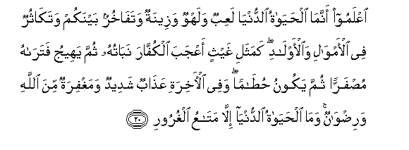
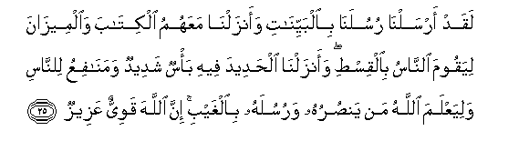

  
[Intangible Textual Heritage](../../index)  [Islam](../index.md) 
[Index](index.md)   
[Hypertext Qur'an](../htq/index)  [Unicode](../uq/057.htm#057_020.md) 
[Palmer](../sbe09/057)  [Pickthall](../pick/057.htm#057_020.md)  [Yusuf Ali
English](../yaq/yaq057)  [Rodwell](../qr/057.md)   
  
[Sūra LVII.: Ḥadīd, or Iron. Index](057.md)  
  [Previous](05702)  [Next](05704.md) 

------------------------------------------------------------------------

  
*The Holy Quran*, tr. by Yusuf Ali, \[1934\], at Intangible Textual
Heritage

------------------------------------------------------------------------

# Sūra LVII.: Ḥadīd, or Iron.

### Section 3

------------------------------------------------------------------------

20. IAAlamoo annam<u>a</u> al<u>h</u>ay<u>a</u>tu a**l**dduny<u>a</u>
laAAibun walahwun wazeenatun wataf<u>a</u>khurun baynakum
watak<u>a</u>thurun fee al-amw<u>a</u>li wa**a**l-awl<u>a</u>di
kamathali ghaythin aAAjaba alkuff<u>a</u>ra nab<u>a</u>tuhu thumma
yaheeju fatar<u>a</u>hu mu<u>s</u>farran thumma yakoonu
<u>h</u>u<u>ta</u>man wafee al-<u>a</u>khirati AAa<u>tha</u>bun
shadeedun wamaghfiratun mina All<u>a</u>hi wari<u>d</u>w<u>a</u>nun
wam<u>a</u> al<u>h</u>ay<u>a</u>tu a**l**dduny<u>a</u> ill<u>a</u>
mat<u>a</u>AAu alghuroor**i**

20\. Know ye (all), that  
The life of this world  
Is but play and amusement,  
Pomp and mutual boasting  
And multiplying, (in rivalry)  
Among yourselves, riches  
And children.  
Here is a similitude:  
How rain and the growth  
Which it brings forth, delight  
(The hearts of) the tillers;  
Soon it withers; thou  
Wilt see it grow yellow;  
Then it becomes dry  
And crumbles away.  
But in the Hereafter  
Is a Penalty severe  
(For the devotees of wrong).  
And Forgiveness from God  
And (His) Good Pleasure  
(For the devotees of God).  
And what is the life  
Of this world, but  
Goods and chattels  
Of deception?

------------------------------------------------------------------------

21. S<u>a</u>biqoo il<u>a</u> maghfiratin min rabbikum wajannatin
AAar<u>d</u>uh<u>a</u> kaAAar<u>d</u>i a**l**ssam<u>a</u>-i
wa**a**l-ar<u>d</u>i oAAiddat lilla<u>th</u>eena <u>a</u>manoo
bi**A**ll<u>a</u>hi warusulihi <u>tha</u>lika fa<u>d</u>lu All<u>a</u>hi
yu/teehi man yash<u>a</u>o wa**A**ll<u>a</u>hu <u>th</u>oo
alfa<u>d</u>li alAAa*<u>th</u>*eem**i**

21\. Be ye foremost (in seeking)  
Forgiveness from your Lord,  
And a Garden (of Bliss),  
The width whereof is  
As the width of  
Heaven and earth,  
Prepared for those who believe  
In God and His apostles:  
That is the Grace of God,  
Which He bestows on whom  
He pleases: and God is  
The Lord of Grace abounding.

------------------------------------------------------------------------

22. M<u>a</u> a<u>sa</u>ba min mu<u>s</u>eebatin fee al-ar<u>d</u>i
wal<u>a</u> fee anfusikum ill<u>a</u> fee kit<u>a</u>bin min qabli an
nabraah<u>a</u> inna <u>tha</u>lika AAal<u>a</u> All<u>a</u>hi
yaseer**un**

22\. No misfortune can happen  
On earth or in your souls  
But is recorded in  
A decree before We bring  
It into existence:  
That is truly easy for God:

------------------------------------------------------------------------

23. Likayl<u>a</u> ta/saw AAal<u>a</u> m<u>a</u> f<u>a</u>takum
wal<u>a</u> tafra<u>h</u>oo bim<u>a</u> <u>a</u>t<u>a</u>kum
wa**A**ll<u>a</u>hu l<u>a</u> yu<u>h</u>ibbu kulla mukht<u>a</u>lin
fakhoor**in**

23\. In order that ye may  
Not despair over matters  
That pass you by,  
Nor exult over favours  
Bestowed upon you.  
For God loveth not  
Any vainglorious boaster,—

------------------------------------------------------------------------

24. Alla<u>th</u>eena yabkhaloona waya/muroona a**l**nn<u>a</u>sa
bi**a**lbukhli waman yatawalla fa-inna All<u>a</u>ha huwa alghaniyyu
al<u>h</u>ameed**u**

24\. Such persons as are  
Covetous and commend  
Covetousness to men.  
And if any turn back  
(From God's Way), verily  
God is free of all needs,  
Worthy of all praise.

------------------------------------------------------------------------

25. Laqad arsaln<u>a</u> rusulan<u>a</u> bi**a**lbayyin<u>a</u>ti
waanzaln<u>a</u> maAAahumu alkit<u>a</u>ba wa**a**lmeez<u>a</u>na
liyaqooma a**l**nn<u>a</u>su bi**a**lqis<u>t</u>i waanzaln<u>a</u>
al<u>h</u>adeeda feehi ba/sun shadeedun waman<u>a</u>fiAAu
li**l**nn<u>a</u>si waliyaAAlama All<u>a</u>hu man yan<u>s</u>uruhu
warusulahu bi**a**lghaybi inna All<u>a</u>ha qawiyyun AAazeez**un**

25\. We sent aforetime  
Our apostles with Clear Signs  
And sent down with them  
The Book and the Balance  
(Of Right and Wrong), that men  
May stand forth in justice;  
And We sent down Iron  
In which is (material for)  
Mighty war, as well as  
Many benefits for mankind,  
That God may test who  
It is that will help,  
Unseen, Him and His apostles:  
For God is Full of Strength,  
Exalted in Might  
(And able to enforce His Will).

------------------------------------------------------------------------

[Next: Section 4 (26-29)](05704.md)

