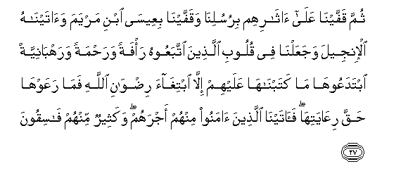
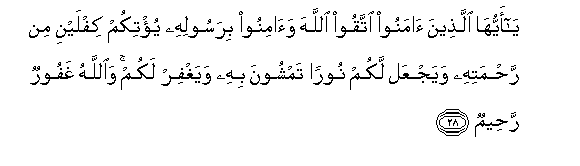

  
[Intangible Textual Heritage](../../index)  [Islam](../index.md) 
[Index](index.md)   
[Hypertext Qur'an](../htq/index)  [Unicode](../uq/057.htm#057_026.md) 
[Palmer](../sbe09/057)  [Pickthall](../pick/057.htm#057_026.md)  [Yusuf Ali
English](../yaq/yaq057)  [Rodwell](../qr/057.md)   
  
[Sūra LVII.: Ḥadīd, or Iron. Index](057.md)  
  [Previous](05703)  [Next](05801.md) 

------------------------------------------------------------------------

  
*The Holy Quran*, tr. by Yusuf Ali, \[1934\], at Intangible Textual
Heritage

------------------------------------------------------------------------

# Sūra LVII.: Ḥadīd, or Iron.

### Section 4

------------------------------------------------------------------------

26. Walaqad arsaln<u>a</u> noo<u>h</u>an wa-ibr<u>a</u>heema
wajaAAaln<u>a</u> fee <u>th</u>urriyyatihim<u>a</u> a**l**nnubuwwata
wa**a**lkit<u>a</u>ba faminhum muhtadin wakatheerun minhum
f<u>a</u>siqoon**a**

26\. And We sent Noah  
And Abraham, and established  
In their line Prophethood  
And Revelation: and some of them!  
Were on right guidance,  
But many of them  
Became rebellious transgressors.

------------------------------------------------------------------------

27. Thumma qaffayn<u>a</u> AAal<u>a</u> <u>a</u>th<u>a</u>rihim
birusulin<u>a</u> waqaffayn<u>a</u> biAAees<u>a</u> ibni maryama
wa<u>a</u>tayn<u>a</u>hu al-injeela wajaAAaln<u>a</u> fee quloobi
alla<u>th</u>eena ittabaAAoohu ra/fatan wara<u>h</u>matan
warahb<u>a</u>niyyatan ibtadaAAooh<u>a</u> m<u>a</u>
katabn<u>a</u>h<u>a</u> AAalayhim ill<u>a</u> ibtigh<u>a</u>a
ri<u>d</u>w<u>a</u>ni All<u>a</u>hi fam<u>a</u> raAAawh<u>a</u>
<u>h</u>aqqa riAA<u>a</u>yatih<u>a</u> fa<u>a</u>tayn<u>a</u>
alla<u>th</u>eena <u>a</u>manoo minhum ajrahum wakatheerun minhum
f<u>a</u>siqoon**a**

27\. Then, in their wake,  
We followed them up  
With (others of) Our apostles:  
We sent after them  
Jesus the son of Mary,  
And bestowed on him  
The Gospel; and We ordained  
In the hearts of those  
Who followed him  
Compassion and Mercy.  
But the Monasticism  
Which they invented  
For themselves, We did not  
Prescribe for them:  
(We commanded) only  
The seeking for the Good  
Pleasure of God; but that  
They did not foster  
As they should have done.  
Yet We bestowed, on those  
Among them who believed,  
Their (due) reward, but  
Many of them are  
Rebellious transgressors.

------------------------------------------------------------------------

28. Y<u>a</u> ayyuh<u>a</u> alla<u>th</u>eena <u>a</u>manoo ittaqoo
All<u>a</u>ha wa<u>a</u>minoo birasoolihi yu/tikum kiflayni min
ra<u>h</u>matihi wayajAAal lakum nooran tamshoona bihi wayaghfir lakum
wa**A**ll<u>a</u>hu ghafoorun ra<u>h</u>eem**un**

28\. O ye that believe!  
Fear God, and believe  
In His Apostle, and He will  
Bestow on you a double  
Portion of His Mercy:  
He will provide for you  
A Light by which ye  
Shall walk (straight  
In your path), and He  
Will forgive you (your past):  
For God is Oft-Forgiving,  
Most Merciful:

------------------------------------------------------------------------

29. Li-all<u>a</u> yaAAlama ahlu alkit<u>a</u>bi all<u>a</u> yaqdiroona
AAal<u>a</u> shay-in min fa<u>d</u>li All<u>a</u>hi waanna
alfa<u>d</u>la biyadi All<u>a</u>hi yu/teehi man yash<u>a</u>o
wa**A**ll<u>a</u>hu <u>th</u>oo alfa<u>d</u>li alAAa*<u>th</u>*eem**i**

29\. That the People of  
The Book may know  
That they have no power  
Whatever over the Grace  
Of God, that (His) Grace  
Is (entirely) in his hand,  
To bestow it on  
Whomsoever He wills.  
For God is the Lord.  
Of Grace abounding.

------------------------------------------------------------------------

[Next: Section 1 (1-6)](05801.md)

