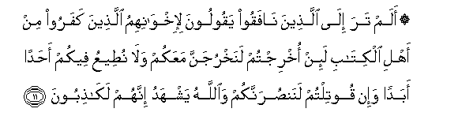
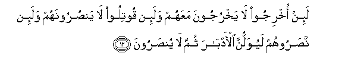
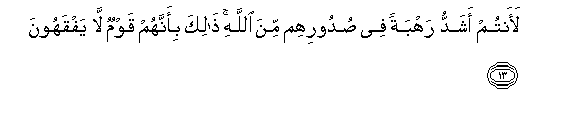
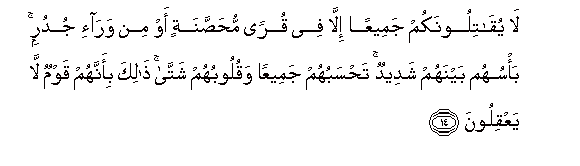
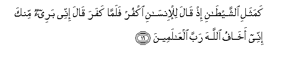

  
[Intangible Textual Heritage](../../index)  [Islam](../index.md) 
[Index](index.md)   
[Hypertext Qur'an](../htq/index)  [Unicode](../uq/059.htm#059_011.md) 
[Palmer](../sbe09/059)  [Pickthall](../pick/059.htm#059_011.md)  [Yusuf Ali
English](../yaq/yaq059)  [Rodwell](../qr/059.md)   
  
[Sūra LIX.: Ḥa&lt;u&gt;sh&lt;/u&gt;r, or The Gathering Index](059.md)  
  [Previous](05901)  [Next](05903.md) 

------------------------------------------------------------------------

  
*The Holy Quran*, tr. by Yusuf Ali, \[1934\], at Intangible Textual
Heritage

------------------------------------------------------------------------

# Sūra LIX.: Ḥa<u>sh</u>r, or The Gathering

### Section 2

------------------------------------------------------------------------

11. Alam tara il<u>a</u> alla<u>th</u>eena n<u>a</u>faqoo yaqooloona
li-ikhw<u>a</u>nihimu alla<u>th</u>eena kafaroo min ahli alkit<u>a</u>bi
la-in okhrijtum lanakhrujanna maAAakum wal<u>a</u> nu<u>t</u>eeAAu
feekum a<u>h</u>adan abadan wa-in qootiltum lanan<u>s</u>urannakum
wa**A**ll<u>a</u>hu yashhadu innahum lak<u>ath</u>iboon**a**

11\. Hast thou not observed  
The Hypocrites say  
To their misbelieving brethren  
Among the People of the Book?—  
"If ye are expelled,  
We too will go out  
With you, and we will  
Never hearken, to any one  
In your affair; and if  
Ye are attacked (in fight)  
We will help you".  
But God is witness  
That they are indeed liars.

------------------------------------------------------------------------

12. La-in okhrijoo l<u>a</u> yakhrujoona maAAahum wala-in qootiloo
l<u>a</u> yan<u>s</u>uroonahum wala-in na<u>s</u>aroohum layuwallunna
al-adb<u>a</u>ra thumma l<u>a</u> yun<u>s</u>aroon**a**

12\. If they are expelled,  
Never will they go out  
With them; and if they  
Are attacked (in fight),  
They will never help them;  
And if they do help them,  
They will turn their backs;  
So they will receive no help.

------------------------------------------------------------------------

13. Laantum ashaddu rahbatan fee <u>s</u>udoorihim mina All<u>a</u>hi
<u>tha</u>lika bi-annahum qawmun l<u>a</u> yafqahoon**a**

13\. Of a truth ye are  
Stronger (than they)  
Because of the terror  
In their hearts,  
(Sent) by God.  
This is because they are  
Men devoid of understanding.

------------------------------------------------------------------------

14. L<u>a</u> yuq<u>a</u>tiloonakum jameeAAan ill<u>a</u> fee quran
mu<u>h</u>a<u>ss</u>anatin aw min war<u>a</u>-i judurin ba/suhum
baynahum shadeedun ta<u>h</u>sabuhum jameeAAan waquloobuhum
shatt<u>a</u> <u>tha</u>lika bi-annahum qawmun l<u>a</u> yaAAqiloon**a**

14\. They will not fight you  
(Even) together, except  
In fortified townships,  
Or from behind walls.  
Strong is their fighting (spirit)  
Amongst themselves:  
Thou wouldst think  
They were united,  
But their hearts are divided:  
That is because they  
Are a people devoid  
Of wisdom.

------------------------------------------------------------------------

15. Kamathali alla<u>th</u>eena min qablihim qareeban <u>tha</u>qoo
wab<u>a</u>la amrihim walahum AAa<u>tha</u>bun aleem**un**

15\. Like those who lately  
Preceded them, they have  
Tasted the evil result  
Of their conduct; and  
(In the Hereafter there is)  
For them a grievous Penalty;—

------------------------------------------------------------------------

16. Kamathali a**l**shshay<u>ta</u>ni i<u>th</u> q<u>a</u>la
lil-ins<u>a</u>ni okfur falamm<u>a</u> kafara q<u>a</u>la innee baree-on
minka innee akh<u>a</u>fu All<u>a</u>ha rabba alAA<u>a</u>lameen**a**

16\. (Their allies deceived them),  
Like the Evil One,  
When he says to man,  
"Deny God": but when  
(Man) denies God,  
(The Evil One) says,  
"I am free of thee:  
I do fear God,  
The Lord of the Worlds!"

------------------------------------------------------------------------

17. Fak<u>a</u>na AA<u>a</u>qibatahum<u>a</u> annahum<u>a</u> fee
a**l**nn<u>a</u>ri kh<u>a</u>lidayni feeh<u>a</u> wa<u>tha</u>lika
jaz<u>a</u>o a**l***<u>thth</u>*<u>a</u>limeen**a**

17\. The end of both will be  
That they will go  
Into the Fire, dwelling  
Therein for ever.  
Such is the reward  
Of the wrong-doers.

------------------------------------------------------------------------

[Next: Section 3 (18-24)](05903.md)

