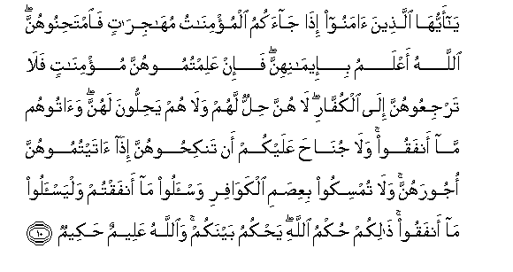

  
[Intangible Textual Heritage](../../index)  [Islam](../index.md) 
[Index](index.md)   
[Hypertext Qur'an](../htq/index)  [Unicode](../uq/060.htm#060_007.md) 
[Palmer](../sbe09/060)  [Pickthall](../pick/060.htm#060_007.md)  [Yusuf Ali
English](../yaq/yaq060)  [Rodwell](../qr/060.md)   
  
[Sūra LX.: Mumtaḥana, or the Woman to be Examined. Index](060.md)  
  [Previous](06001)  [Next](06101.md) 

------------------------------------------------------------------------

  
*The Holy Quran*, tr. by Yusuf Ali, \[1934\], at Intangible Textual
Heritage

------------------------------------------------------------------------

# Sūra LX.: Mumtaḥana, or the Woman to be Examined.

### Section 2

------------------------------------------------------------------------

7. AAas<u>a</u> All<u>a</u>hu an yajAAala baynakum wabayna
alla<u>th</u>eena AA<u>a</u>daytum minhum mawaddatan wa**A**ll<u>a</u>hu
qadeerun wa**A**ll<u>a</u>hu ghafoorun ra<u>h</u>eem**un**

7\. It may be that God  
Will grant love (and friendship)  
Between you and those whom  
Ye (now) hold as enemies.  
For God has power  
(Over all things); And God is  
Oft-Forgiving, Most Merciful.

------------------------------------------------------------------------

8. L<u>a</u> yanh<u>a</u>kumu All<u>a</u>hu AAani alla<u>th</u>eena lam
yuq<u>a</u>tilookum fee a**l**ddeeni walam yukhrijookum min
diy<u>a</u>rikum an tabarroohum watuqsi<u>t</u>oo ilayhim inna
All<u>a</u>ha yu<u>h</u>ibbu almuqsi<u>t</u>een**a**

8\. God forbids you not,  
With regard to those who  
Fight you not for (your) Faith  
Nor drive you out  
Of your homes,  
From dealing kindly and justly  
With them: For God loveth  
Those who are just.

------------------------------------------------------------------------

9. Innam<u>a</u> yanh<u>a</u>kumu All<u>a</u>hu AAani alla<u>th</u>eena
q<u>a</u>talookum fee a**l**ddeeni waakhrajookum min diy<u>a</u>rikum
wa*<u>th</u>*<u>a</u>haroo AAal<u>a</u> ikhr<u>a</u>jikum an tawallawhum
waman yatawallahum faol<u>a</u>-ika humu
a**l***<u>thth</u>*<u>a</u>limoon**a**

9\. God only forbids you,  
With regard to those who  
Fight you for (your) Faith,  
And drive you out  
Of your homes, and support  
(Others) in driving you out,  
From turning to them  
(For friendship and protection).  
It is such as turn to them  
(In these circumstances),  
That do wrong.

------------------------------------------------------------------------

10. Y<u>a</u> ayyuh<u>a</u> alla<u>th</u>eena <u>a</u>manoo i<u>tha</u>
j<u>a</u>akumu almu/min<u>a</u>tu muh<u>a</u>jir<u>a</u>tin
fa**i**mta<u>h</u>inoohunna All<u>a</u>hu aAAlamu bi-eem<u>a</u>nihinna
fa-in AAalimtumoohunna mu/min<u>a</u>tin fal<u>a</u> tarjiAAoohunna
il<u>a</u> alkuff<u>a</u>ri l<u>a</u> hunna <u>h</u>illun lahum
wal<u>a</u> hum ya<u>h</u>illoona lahunna wa<u>a</u>toohum m<u>a</u>
anfaqoo wal<u>a</u> jun<u>ah</u>a AAalaykum an tanki<u>h</u>oohunna
i<u>tha</u> <u>a</u>taytumoohunna ojoorahunna wal<u>a</u> tumsikoo
biAAi<u>s</u>ami alkaw<u>a</u>firi wa**i**s-aloo m<u>a</u> anfaqtum
walyas-aloo m<u>a</u> anfaqoo <u>tha</u>likum <u>h</u>ukmu All<u>a</u>hi
ya<u>h</u>kumu baynakum wa**A**ll<u>a</u>hu AAaleemun
<u>h</u>akeem**un**

10\. O ye who believe!  
When there come to you  
Believing women refugees,  
Examine (and test) them:  
God knows best as to  
Their Faith: if ye ascertain  
That they are Believers,  
Then send them not back  
To the Unbelievers.  
They are not lawful (wives)  
For the Unbelievers, nor are  
The (Unbelievers) lawful (husbands)  
For them. But pay  
The Unbelievers what they  
Have spent (on their dower).  
And there will be no blame  
On you if ye marry them  
On payment of their dower  
To them. But hold not  
To the guardianship of  
Unbelieving women: ask  
For what ye have spent  
On their dowers, and let  
The (Unbelievers) ask for  
What they have spent  
(On the dowers of women  
Who come over to you).  
Such is the command  
Of God: He judges  
(With justice) between you.  
And God is Full of  
Knowledge and Wisdom.

------------------------------------------------------------------------

11. Wa-in f<u>a</u>takum shay-on min azw<u>a</u>jikum il<u>a</u>
alkuff<u>a</u>ri faAA<u>a</u>qabtum fa<u>a</u>too alla<u>th</u>eena
<u>th</u>ahabat azw<u>a</u>juhum mithla m<u>a</u> anfaqoo wa**i**ttaqoo
All<u>a</u>ha alla<u>th</u>ee antum bihi mu/minoon**a**

11\. And if any  
Of your wives deserts you  
To the Unbelievers,  
And ye have an accession  
(By the coming over of  
A woman from the other side),  
Then pay to those  
Whose wives have deserted  
The equivalent of what they  
Had spent (on their dower).  
And fear God,  
In Whom ye believe.

------------------------------------------------------------------------

12. Y<u>a</u> ayyuh<u>a</u> a**l**nnabiyyu i<u>tha</u> j<u>a</u>aka
almu/min<u>a</u>tu yub<u>a</u>yiAAnaka AAal<u>a</u> an l<u>a</u>
yushrikna bi**A**ll<u>a</u>hi shay-an wal<u>a</u> yasriqna wal<u>a</u>
yazneena wal<u>a</u> yaqtulna awl<u>a</u>dahunna wal<u>a</u> ya/teena
bibuht<u>a</u>nin yaftareenahu bayna aydeehinna waarjulihinna
wal<u>a</u> yaAA<u>s</u>eenaka fee maAAroofin fab<u>a</u>yiAAhunna
wa**i**staghfir lahunna All<u>a</u>ha inna All<u>a</u>ha ghafoorun
ra<u>h</u>eem**un**

12\. O Prophet!  
When believing women come  
To thee to take the oath  
Of fealty to thee, that they  
Will not associate in worship  
Any other thing whatever  
With God, that they  
Will not steal, that they  
Will not commit adultery  
(Or fornication), that they  
Will not kill their children,  
That they will not utter  
Slander, intentionally forging  
Falsehood, and that they  
Will not disobey thee  
In any just matter,  
Then do thou receive  
Their fealty, and pray to God  
For the forgiveness (of  
Their sins): for God is  
Oft-Forgiving, Most Merciful.

------------------------------------------------------------------------

13. Y<u>a</u> ayyuh<u>a</u> alla<u>th</u>eena <u>a</u>manoo l<u>a</u>
tatawallaw qawman gha<u>d</u>iba All<u>a</u>hu AAalayhim qad ya-isoo
mina al-<u>a</u>khirati kam<u>a</u> ya-isa alkuff<u>a</u>ru min
a<u>s</u>-<u>ha</u>bi alquboor**i**

13\. O ye who believe!  
Turn not (for friendship)  
To people on whom  
Is the Wrath of God.  
Of the Hereafter they are  
Already in despair, just as  
The Unbelievers are  
In despair about those  
(Buried) in graves.

------------------------------------------------------------------------

[Next: Section 1 (1-9)](06101.md)

