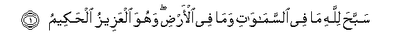
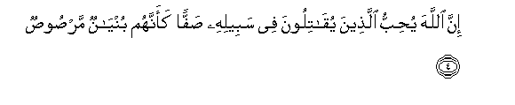
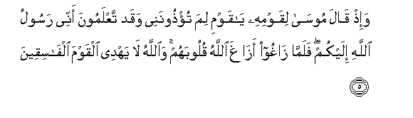
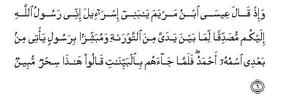
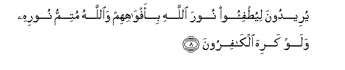
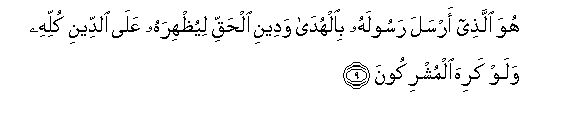

  
[Intangible Textual Heritage](../../index)  [Islam](../index.md) 
[Index](index.md)   
[Hypertext Qur'an](../htq/index)  [Unicode](../uq/061.htm#061_001.md) 
[Palmer](../sbe09/061)  [Pickthall](../pick/061.htm#061_001.md)  [Yusuf Ali
English](../yaq/yaq061)  [Rodwell](../qr/061.md)   
  
[Sūra LXI.: Ṣaff, or Battle Array. Index](061.md)  
  [Previous](06002)  [Next](06102.md) 

------------------------------------------------------------------------

  
*The Holy Quran*, tr. by Yusuf Ali, \[1934\], at Intangible Textual
Heritage

------------------------------------------------------------------------

# Sūra LXI.: Ṣaff, or Battle Array.

### Section 1

1. Sabba<u>h</u>a lill<u>a</u>hi m<u>a</u> fee
a**l**ssam<u>a</u>w<u>a</u>ti wam<u>a</u> fee al-ar<u>d</u>i wahuwa
alAAazeezu al<u>h</u>akeem**u**

1\. Whatever is  
In the heavens and  
On earth, let it declare  
The Praises and Glory  
Of God: for He is  
The Exalted in Might,  
The Wise.

------------------------------------------------------------------------

2. Y<u>a</u> ayyuh<u>a</u> alla<u>th</u>eena <u>a</u>manoo lima
taqooloona m<u>a</u> l<u>a</u> tafAAaloon**a**

2\. O ye who believe!  
Why say ye that  
Which ye do not?

------------------------------------------------------------------------

3. Kabura maqtan AAinda All<u>a</u>hi an taqooloo m<u>a</u> l<u>a</u>
tafAAaloon**a**

3\. Grievously odious is it  
In the sight of God  
That ye say that  
Which ye do not.

------------------------------------------------------------------------

4. Inna All<u>a</u>ha yu<u>h</u>ibbu alla<u>th</u>eena
yuq<u>a</u>tiloona fee sabeelihi <u>s</u>affan kaannahum buny<u>a</u>nun
mar<u>s</u>oo<u>s</u>**un**

4\. Truly God loves those  
Who fight in His Cause  
In battle array, as if  
They were a solid  
Cemented structure.

------------------------------------------------------------------------

5. Wa-i<u>th</u> q<u>a</u>la moos<u>a</u> liqawmihi y<u>a</u> qawmi lima
tu/<u>th</u>oonanee waqad taAAlamoona annee rasoolu All<u>a</u>hi
ilaykum falamm<u>a</u> z<u>a</u>ghoo az<u>a</u>gha All<u>a</u>hu
quloobahum wa**A**ll<u>a</u>hu l<u>a</u> yahdee alqawma
alf<u>a</u>siqeen**a**

5\. And remember, Moses said  
To his people: "O my people!  
Why do ye vex and insult  
Me, though ye know  
That I am the apostle  
Of God (sent) to you?"  
Then when they went wrong,  
God let their hearts go wrong.  
For God guides not those  
Who are rebellious transgressors.

------------------------------------------------------------------------

6. Wa-i<u>th</u> q<u>a</u>la AAees<u>a</u> ibnu maryama y<u>a</u> banee
isr<u>a</u>-eela innee rasoolu All<u>a</u>hi ilaykum mu<u>s</u>addiqan
lim<u>a</u> bayna yadayya mina a**l**ttawr<u>a</u>ti wamubashshiran
birasoolin ya/tee min baAAdee ismuhu a<u>h</u>madu falamm<u>a</u>
j<u>a</u>ahum bi**a**lbayyin<u>a</u>ti q<u>a</u>loo h<u>atha</u>
si<u>h</u>run mubeen**un**

6\. And remember, Jesus,  
The son of Mary, said:  
"O Children of Israel!  
I am the apostle of God  
(Sent) to you, confirming  
The Law (which came)  
Before me, and giving  
Glad Tidings of an Apostle  
To come after me,  
Whose name shall be Aḥmad."  
But when he came to them  
With Clear Signs,  
They said, "This is  
Evident sorcery!"

------------------------------------------------------------------------

7. Waman a*<u>th</u>*lamu mimmani iftar<u>a</u> AAal<u>a</u>
All<u>a</u>hi alka<u>th</u>iba wahuwa yudAA<u>a</u> il<u>a</u>
al-isl<u>a</u>mi wa**A**ll<u>a</u>hu l<u>a</u> yahdee alqawma
a**l***<u>thth</u>*<u>a</u>limeen**a**

7\. Who doth greater wrong  
Than one who invents  
Falsehood against God,  
Even as he is being invited  
To Islām? And God  
Guides not those  
Who do wrong.

------------------------------------------------------------------------

8. Yureedoona liyu<u>t</u>fi-oo noora All<u>a</u>hi bi-afw<u>a</u>hihim
wa**A**ll<u>a</u>hu mutimmu noorihi walaw kariha alk<u>a</u>firoon**a**

8\. Their intention is  
To extinguish God's Light  
(By blowing) with their mouths:  
But God will complete  
(The revelation of) His Light,  
Even though the Unbelievers  
May detest (it).

------------------------------------------------------------------------

9. Huwa alla<u>th</u>ee arsala rasoolahu bi**a**lhud<u>a</u> wadeeni
al<u>h</u>aqqi liyu*<u>th</u>*hirahu AAal<u>a</u> a**l**ddeeni kullihi
walaw kariha almushrikoon**a**

9\. It is He Who has sent  
His Apostle with Guidance  
And the Religion of Truth,  
That he may proclaim it  
Over all religion,  
Even though the Pagans  
May detest (it).

------------------------------------------------------------------------

[Next: Section 2 (10-14)](06102.md)

