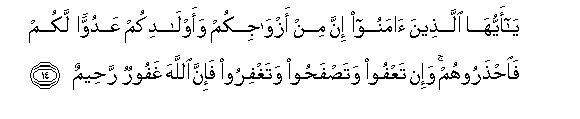
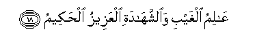

  
[Intangible Textual Heritage](../../index)  [Islam](../index.md) 
[Index](index.md)   
[Hypertext Qur'an](../htq/index)  [Unicode](../uq/064.htm#064_011.md) 
[Palmer](../sbe09/064)  [Pickthall](../pick/064.htm#064_011.md)  [Yusuf Ali
English](../yaq/yaq064)  [Rodwell](../qr/064.md)   
  
[Sūra LXIV.: Tagābun, or Mutual Loss and Gain. Index](064.md)  
  [Previous](06401)  [Next](06501.md) 

------------------------------------------------------------------------

  
*The Holy Quran*, tr. by Yusuf Ali, \[1934\], at Intangible Textual
Heritage

------------------------------------------------------------------------

# Sūra LXIV.: Tagābun, or Mutual Loss and Gain.

### Section 2

------------------------------------------------------------------------

11. M<u>a</u> a<u>sa</u>ba min mu<u>s</u>eebatin ill<u>a</u>
bi-i<u>th</u>ni All<u>a</u>hi waman yu/min bi**A**ll<u>a</u>hi yahdi
qalbahu wa**A**ll<u>a</u>hu bikulli shay-in AAaleem**un**

11\. No kind of calamity  
Can occur, except  
By the leave of God:  
And if any one believes  
In God, (God) guides his  
Heart (aright): for God  
Knows all things.

------------------------------------------------------------------------

12. Waa<u>t</u>eeAAoo All<u>a</u>ha waa<u>t</u>eeAAoo a**l**rrasoola
fa-in tawallaytum fa-innam<u>a</u> AAal<u>a</u> rasoolin<u>a</u>
albal<u>a</u>ghu almubeen**u**

12\. So obey God, and obey  
His Apostle: but if  
Ye turn back, the duty  
Of Our Apostle is but  
To proclaim (the Message)  
Clearly and openly.

------------------------------------------------------------------------

13. All<u>a</u>hu l<u>a</u> il<u>a</u>ha ill<u>a</u> huwa waAAal<u>a</u>
All<u>a</u>hi falyatawakkali almu/minoon**a**

13\. God! There is no god  
But He: and on God,  
Therefore, let the Believers  
Put their trust.

------------------------------------------------------------------------

14. Y<u>a</u> ayyuh<u>a</u> alla<u>th</u>eena <u>a</u>manoo inna min
azw<u>a</u>jikum waawl<u>a</u>dikum AAaduwwan lakum
fa**i**<u>hth</u>aroohum wa-in taAAfoo wata<u>s</u>fa<u>h</u>oo
wataghfiroo fa-inna All<u>a</u>ha ghafoorun ra<u>h</u>eem**un**

14\. O ye who believe!  
Truly, among your wives  
And your children are (some  
That are) enemies to  
Yourselves: so beware  
Of them! But if ye  
Forgive and overlook,  
And cover up (their faults),  
Verily God is  
Oft-Forgiving, Most Merciful.

------------------------------------------------------------------------

15. Innam<u>a</u> amw<u>a</u>lukum waawl<u>a</u>dukum fitnatun
wa**A**ll<u>a</u>hu AAindahu ajrun AAa*<u>th</u>*eem**un**

15\. Your riches and your children  
May be but a trial:  
But in the Presence of God,  
Is the highest Reward.

------------------------------------------------------------------------

16. Fa**i**ttaqoo All<u>a</u>ha m<u>a</u> ista<u>t</u>aAAtum
wa**i**smaAAoo waa<u>t</u>eeAAoo waanfiqoo khayran li-anfusikum waman
yooqa shu<u>hh</u>a nafsihi faol<u>a</u>-ika humu
almufli<u>h</u>oon**a**

16\. So fear God  
As much as ye can;  
Listen and obey;  
And spend in charity  
For the benefit of  
Your own souls.  
And those saved from  
The covetousness of their own  
Souls,—they are the ones  
That achieve prosperity.

------------------------------------------------------------------------

17. In tuqri<u>d</u>oo All<u>a</u>ha qar<u>d</u>an <u>h</u>asanan
yu<u>da</u>AAifhu lakum wayaghfir lakum wa**A**ll<u>a</u>hu shakoorun
<u>h</u>aleem**un**

17\. If ye loan to God  
A beautiful loan, He  
Will double it to  
Your (credit), and He  
Will grant you Forgiveness:  
For God is most Ready  
To appreciate (service)  
Most Forbearing,—

------------------------------------------------------------------------

18. AA<u>a</u>limu alghaybi wa**al**shshah<u>a</u>dati alAAazeezu
al<u>h</u>akeem**u**

18\. Knower of what is hidden  
And what is open,  
Exalted in Might,  
Full of Wisdom.

------------------------------------------------------------------------

[Next: Section 1 (1-7)](06501.md)

