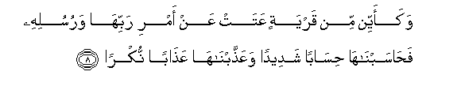
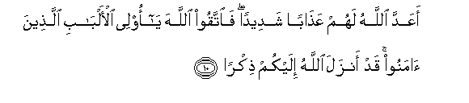
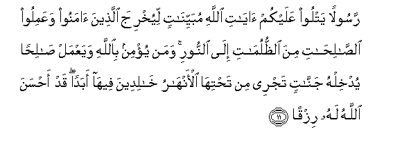
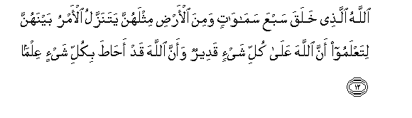

  
[Intangible Textual Heritage](../../index)  [Islam](../index.md) 
[Index](index.md)   
[Hypertext Qur'an](../htq/index)  [Unicode](../uq/065.htm#065_008.md) 
[Palmer](../sbe09/065)  [Pickthall](../pick/065.htm#065_008.md)  [Yusuf Ali
English](../yaq/yaq065)  [Rodwell](../qr/065.md)   
  
[Sūra LXV.: Ṭalāq, or Divorce. Index](065.md)  
  [Previous](06501)  [Next](06601.md) 

------------------------------------------------------------------------

  
*The Holy Quran*, tr. by Yusuf Ali, \[1934\], at Intangible Textual
Heritage

------------------------------------------------------------------------

# Sūra LXV.: Ṭalāq, or Divorce.

### Section 2

------------------------------------------------------------------------

8. Wakaayyin min qaryatin AAatat AAan amri rabbih<u>a</u> warusulihi
fa<u>ha</u>sabn<u>a</u>h<u>a</u> <u>h</u>is<u>a</u>ban shadeedan
waAAa<u>thth</u>abn<u>a</u>h<u>a</u> AAa<u>tha</u>ban nukr<u>a</u>**n**

8\. How many populations  
That insolently opposed  
The command of their Lord  
And of His apostles,  
Did We not then  
Call to account,  
To severe account?  
And We imposed on them  
An exemplary Punishment.

------------------------------------------------------------------------

9. Fa<u>tha</u>qat wab<u>a</u>la amrih<u>a</u> wak<u>a</u>na
AA<u>a</u>qibatu amrih<u>a</u> khusr<u>a</u>**n**

9\. Then did they taste  
The evil result of  
Their conduct, and the End  
Of their conduct  
Was Perdition.

------------------------------------------------------------------------

10. aAAadda All<u>a</u>hu lahum AAa<u>tha</u>ban shadeedan fa**i**ttaqoo
All<u>a</u>ha y<u>a</u> olee al-alb<u>a</u>bi alla<u>th</u>eena
<u>a</u>manoo qad anzala All<u>a</u>hu ilaykum <u>th</u>ikr<u>a</u>**n**

10\. God has prepared for them  
A severe Punishment  
(In the Hereafter).  
Therefore fear God,  
O ye men of understanding—  
Who have believed!  
For God hath indeed  
Sent down to you  
A Message,—

------------------------------------------------------------------------

11. Rasoolan yatloo AAalaykum <u>a</u>y<u>a</u>ti All<u>a</u>hi
mubayyin<u>a</u>tin liyukhrija alla<u>th</u>eena <u>a</u>manoo
waAAamiloo a**l**<u>ssa</u>li<u>ha</u>ti mina
a**l***<u>thth</u>*ulum<u>a</u>ti il<u>a</u> a**l**nnoori waman yu/min
bi**A**ll<u>a</u>hi wayaAAmal <u>sa</u>li<u>h</u>an yudkhilhu
jann<u>a</u>tin tajree min ta<u>h</u>tih<u>a</u> al-anh<u>a</u>ru
kh<u>a</u>lideena feeh<u>a</u> abadan qad a<u>h</u>sana All<u>a</u>hu
lahu rizq<u>a</u>**n**

11\. An Apostle, who rehearses  
To you the Signs of God  
Containing clear explanations,  
That he may lead forth  
Those who believe  
And do righteous deeds  
From the depths of Darkness  
Into Light. And those who  
Believe in God and work  
Righteousness, He will admit  
To Gardens beneath which rivers  
Flow, to dwell therein  
For ever: God has indeed  
Granted for them  
A most excellent provision.

------------------------------------------------------------------------

12. All<u>a</u>hu alla<u>th</u>ee khalaqa sabAAa sam<u>a</u>w<u>a</u>tin
wamina al-ar<u>d</u>i mithlahunna yatanazzalu al-amru baynahunna
litaAAlamoo anna All<u>a</u>ha AAal<u>a</u> kulli shay-in qadeerun
waanna All<u>a</u>ha qad a<u>hat</u>a bikulli shay-in AAilm<u>a</u>**n**

12\. God is He Who  
Created seven Firmaments  
And of the earth  
A similar number.  
Through the midst  
Of them (all) descends  
His Command: that ye may  
Know that God has power  
Over all things, and that  
God comprehends all things  
In (His) Knowledge.

------------------------------------------------------------------------

[Next: Section 1 (1-7)](06601.md)

