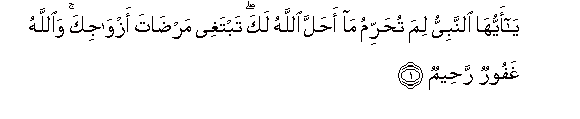
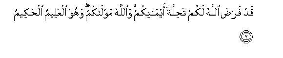
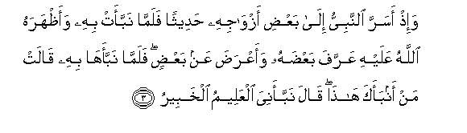
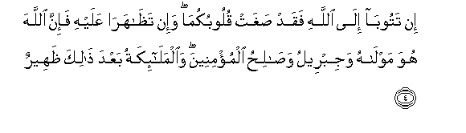
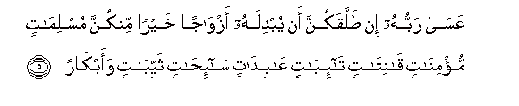
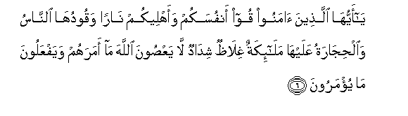
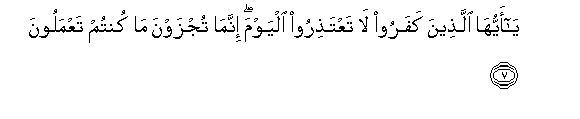

  
[Intangible Textual Heritage](../../index)  [Islam](../index.md) 
[Index](index.md)   
[Hypertext Qur'an](../htq/index)  [Unicode](../uq/066.htm#066_001.md) 
[Palmer](../sbe09/066)  [Pickthall](../pick/066.htm#066_001.md)  [Yusuf Ali
English](../yaq/yaq066)  [Rodwell](../qr/066.md)   
  
[Sūra LXVI.: Taḥrīm, or Holding (something) to be Forbidden.
Index](066.md)  
  [Previous](06502)  [Next](06602.md) 

------------------------------------------------------------------------

  
*The Holy Quran*, tr. by Yusuf Ali, \[1934\], at Intangible Textual
Heritage

------------------------------------------------------------------------

# Sūra LXVI.: Taḥrīm, or Holding (something) to be Forbidden.

### Section 1

1. Y<u>a</u> ayyuh<u>a</u> a**l**nnabiyyu lima tu<u>h</u>arrimu
m<u>a</u> a<u>h</u>alla All<u>a</u>hu laka tabtaghee mar<u>da</u>ta
azw<u>a</u>jika wa**A**ll<u>a</u>hu ghafoorun ra<u>h</u>eem**un**

1\. O Prophet! Why  
Holdest thou to be forbidden  
That which God has  
Made lawful to thee?  
Thou seekest to please  
Thy consorts. But God  
Is Oft-Forgiving, Most Merciful.

------------------------------------------------------------------------

2. Qad fara<u>d</u>a All<u>a</u>hu lakum ta<u>h</u>illata
aym<u>a</u>nikum wa**A**ll<u>a</u>hu mawl<u>a</u>kum wahuwa alAAaleemu
al<u>h</u>akeem**u**

2\. God has already ordained  
For you, (O men),  
The dissolution of your oaths  
(In some cases): and God  
Is your Protector, and He  
Is Full of Knowledge  
And Wisdom.

------------------------------------------------------------------------

3. Wa-i<u>th</u> asarra a**l**nnabiyyu il<u>a</u> baAA<u>d</u>i
azw<u>a</u>jihi <u>h</u>adeethan falamm<u>a</u> nabbaat bihi
waa*<u>th</u>*harahu All<u>a</u>hu AAalayhi AAarrafa baAA<u>d</u>ahu
waaAAra<u>d</u>a AAan baAA<u>d</u>in falamm<u>a</u> nabbaah<u>a</u> bihi
q<u>a</u>lat man anbaaka h<u>atha</u> q<u>a</u>la nabbaaniya alAAaleemu
alkhabeer**u**

3\. When the Prophet disclosed  
A matter in confidence  
To one of his consorts,  
And she then divulged it  
(To another), and God made it  
Known to him, he confirmed  
Part thereof and repudiated  
A part. Then when he  
Told her thereof, she said,  
"Who told thee this?"  
He said, "He told me  
Who knows and is well-acquainted  
(With all things)"

------------------------------------------------------------------------

4. In tatoob<u>a</u> il<u>a</u> All<u>a</u>hi faqad <u>s</u>aghat
quloobukum<u>a</u> wa-in ta*<u>th</u>*<u>a</u>har<u>a</u> AAalayhi
fa-inna All<u>a</u>ha huwa mawl<u>a</u>hu wajibreelu
wa<u>sa</u>li<u>h</u>u almu/mineena wa**a**lmal<u>a</u>-ikatu baAAda
<u>tha</u>lika *<u>th</u>*aheer**un**

4\. If ye two turn in repentance  
To Him, your hearts  
Are indeed so inclined;  
But if ye back up  
Each other against him,  
Truly God is his Protector,  
And Gabriel, and (every)  
Righteous one among those  
Who believe,—and furthermore,  
The angels—will back (him) up.

------------------------------------------------------------------------

5. AAas<u>a</u> rabbuhu in <u>t</u>allaqakunna an yubdilahu
azw<u>a</u>jan khayran minkunna muslim<u>a</u>tin mu/min<u>a</u>tin
q<u>a</u>nit<u>a</u>tin t<u>a</u>-ib<u>a</u>tin AA<u>a</u>bid<u>a</u>tin
s<u>a</u>-i<u>ha</u>tin thayyib<u>a</u>tin waabk<u>a</u>r<u>a</u>**n**

5\. It may be, if he  
Divorced you (all)  
That God will give him  
In exchange Consorts  
Better than you,  
Who submit (their wills),  
Who believe, who are devout,  
Who turn to God in repentance,  
Who worship (in humility),  
Who travel (for Faith) and fast,—  
Previously married or virgins.

------------------------------------------------------------------------

6. Y<u>a</u> ayyuh<u>a</u> alla<u>th</u>eena <u>a</u>manoo qoo anfusakum
waahleekum n<u>a</u>ran waqooduh<u>a</u> a**l**nn<u>a</u>su
wa**a**l<u>h</u>ij<u>a</u>ratu AAalayh<u>a</u> mal<u>a</u>-ikatun
ghil<u>a</u>*<u>th</u>*un shid<u>a</u>dun l<u>a</u> yaAA<u>s</u>oona
All<u>a</u>ha m<u>a</u> amarahum wayafAAaloona m<u>a</u> yu/maroon**a**

6\. O ye who believe!  
Save yourselves and your  
Families from a Fire  
Whose fuel is Men  
And Stones, over which  
Are (appointed) angels  
Stern (and) severe,  
Who flinch not (from  
Executing) the Commands  
They receive from God,  
But do (precisely) what  
They are commanded.

------------------------------------------------------------------------

7. Y<u>a</u> ayyuh<u>a</u> alla<u>th</u>eena kafaroo l<u>a</u>
taAAta<u>th</u>iroo alyawma innam<u>a</u> tujzawna m<u>a</u> kuntum
taAAmaloon**a**

7\. (They will say),  
"O ye Unbelievers!  
Make no excuses  
This Day! Ye are being  
But requited for  
All that ye did!"

------------------------------------------------------------------------

[Next: Section 2 (8-12)](06602.md)

