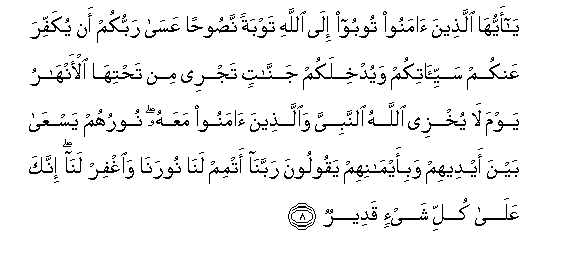
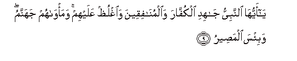
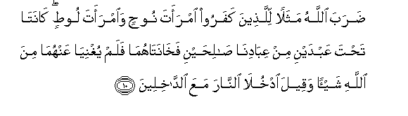
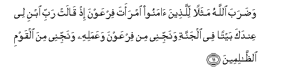
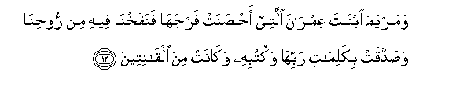

  
[Intangible Textual Heritage](../../index)  [Islam](../index) 
[Index](index)   
[Hypertext Qur'an](../htq/index)  [Unicode](../uq/066.htm#066_008) 
[Palmer](../sbe09/066)  [Pickthall](../pick/066.htm#066_008)  [Yusuf Ali
English](../yaq/yaq066)  [Rodwell](../qr/066)   
  
[Sūra LXVI.: Taḥrīm, or Holding (something) to be Forbidden.
Index](066)  
  [Previous](06601)  [Next](06701) 

------------------------------------------------------------------------

  
*The Holy Quran*, tr. by Yusuf Ali, \[1934\], at Intangible Textual
Heritage

------------------------------------------------------------------------

# Sūra LXVI.: Taḥrīm, or Holding (something) to be Forbidden.

### Section 2

------------------------------------------------------------------------

8. Y<u>a</u> ayyuh<u>a</u> alla<u>th</u>eena <u>a</u>manoo tooboo
il<u>a</u> All<u>a</u>hi tawbatan na<u>s</u>oo<u>h</u>an AAas<u>a</u>
rabbukum an yukaffira AAankum sayyi-<u>a</u>tikum wayudkhilakum
jann<u>a</u>tin tajree min ta<u>h</u>tih<u>a</u> al-anh<u>a</u>ru yawma
l<u>a</u> yukhzee All<u>a</u>hu a**l**nnabiyya wa**a**lla<u>th</u>eena
<u>a</u>manoo maAAahu nooruhum yasAA<u>a</u> bayna aydeehim
wabi-aym<u>a</u>nihim yaqooloona rabban<u>a</u> atmim lan<u>a</u>
nooran<u>a</u> wa**i**ghfir lan<u>a</u> innaka AAal<u>a</u> kulli
shay-in qadeer**un**

8\. O ye who believe!  
Turn to God  
With sincere repentance:  
In the hope that  
Your Lord will remove  
From you your ills  
And admit you to Gardens  
Beneath which Rivers flow,—  
The Day that God  
Will not permit  
To be humiliated  
The Prophet and those  
Who believe with him.  
Their Light will run  
Forward before them  
And by their right hands,  
While they say, "Our Lord!  
Perfect our Light for us,  
And grant us Forgiveness:  
For Thou hast power  
Over all things."

------------------------------------------------------------------------

9. Y<u>a</u> ayyuh<u>a</u> a**l**nnabiyyu j<u>a</u>hidi alkuff<u>a</u>ra
wa**a**lmun<u>a</u>fiqeena wa**o**ghlu*<u>th</u>* AAalayhim
wama/w<u>a</u>hum jahannamu wabi/sa alma<u>s</u>eer**u**

9\. O Prophet! Strive hard  
Against the Unbelievers  
And the Hypocrites,  
And be firm against them.  
Their abode is Hell,—  
An evil refuge (indeed).

------------------------------------------------------------------------

10. <u>D</u>araba All<u>a</u>hu mathalan lilla<u>th</u>eena kafaroo
imraata noo<u>h</u>in wa**i**mraata loo<u>t</u>in k<u>a</u>nat<u>a</u>
ta<u>h</u>ta AAabdayni min AAib<u>a</u>din<u>a</u>
<u>sa</u>li<u>h</u>ayni fakh<u>a</u>nat<u>a</u>hum<u>a</u> falam
yughniy<u>a</u> AAanhum<u>a</u> mina All<u>a</u>hi shay-an waqeela
odkhul<u>a</u> a**l**nn<u>a</u>ra maAAa a**l**dd<u>a</u>khileen**a**

10\. God sets forth,  
For an example  
To the Unbelievers,  
The wife of Noah  
And the wife of Lūṭ:  
They were (respectively)  
Under two of our righteous  
Servants, but they were  
False to their (husbands),  
And they profited nothing  
Before God on their account,  
But were told: "Enter ye  
The Fire along with  
(Others) that enter!"

------------------------------------------------------------------------

11. Wa<u>d</u>araba All<u>a</u>hu mathalan lilla<u>th</u>eena
<u>a</u>manoo imraata firAAawna i<u>th</u> q<u>a</u>lat rabbi ibni lee
AAindaka baytan fee aljannati wanajjinee min firAAawna waAAamalihi
wanajjinee mina alqawmi a**l***<u>thth</u>*<u>a</u>limeen**a**

11\. And God sets forth,  
As an example  
To those who believe,  
The wife of Pharaoh:  
Behold she said:  
"O my Lord! build  
For me, in nearness  
To Thee, a mansion  
In the Garden,  
And save me from Pharaoh  
And his doings,  
And save me from  
Those that do wrong";

------------------------------------------------------------------------

12. Wamaryama ibnata AAimr<u>a</u>na allatee a<u>hs</u>anat
farjah<u>a</u> fanafakhn<u>a</u> feehi min roo<u>h</u>in<u>a</u>
wa<u>s</u>addaqat bikalim<u>a</u>ti rabbih<u>a</u> wakutubihi
wak<u>a</u>nat mina alq<u>a</u>niteen**a**

12\. And Mary the daughter  
Of ‘Imrān, who guarded  
Her chastity; and We  
Breathed into (her body)  
Of Our spirit; and she  
Testified to the truth  
Of the words of her Lord  
And of his Revelations,  
And was one of the  
Devout (servants).

------------------------------------------------------------------------

[Next: Section 1 (1-14)](06701)

