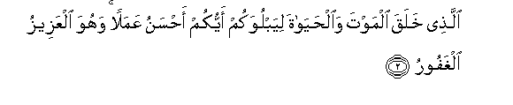
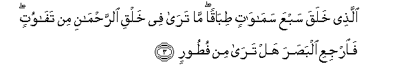
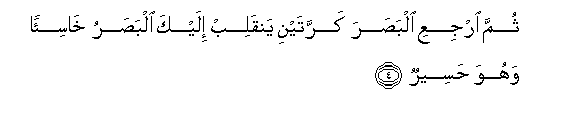
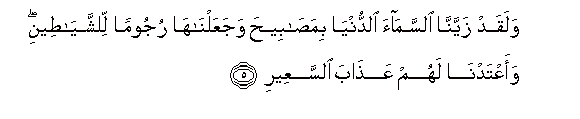
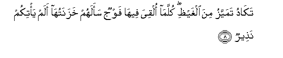
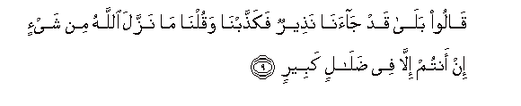
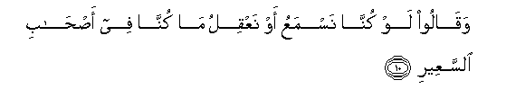
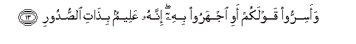

  
[Intangible Textual Heritage](../../index)  [Islam](../index) 
[Index](index)   
[Hypertext Qur'an](../htq/index)  [Unicode](../uq/067.htm#067_001) 
[Palmer](../sbe09/067)  [Pickthall](../pick/067.htm#067_001)  [Yusuf Ali
English](../yaq/yaq067)  [Rodwell](../qr/067)   
  
[Sūra LXVII.: Mulk, or Dominion. Index](067)  
  [Previous](06602)  [Next](06702) 

------------------------------------------------------------------------

  
*The Holy Quran*, tr. by Yusuf Ali, \[1934\], at Intangible Textual
Heritage

------------------------------------------------------------------------

# Sūra LXVII.: Mulk, or Dominion.

### Section 1

1. Tab<u>a</u>raka alla<u>th</u>ee biyadihi almulku wahuwa AAal<u>a</u>
kulli shay-in qadeer**un**

1\. Blessed be He  
In Whose hands  
Is Dominion;  
And He over all things  
Hath Power;—

------------------------------------------------------------------------

2. Alla<u>th</u>ee khalaqa almawta wa**a**l<u>h</u>ay<u>a</u>ta
liyabluwakum ayyukum a<u>h</u>sanu AAamalan wahuwa alAAazeezu
alghafoor**u**

2\. He Who created Death  
And Life, that He  
May try which of you  
Is best in deed:  
And He is the Exalted  
In Might, Oft-Forgiving;—

------------------------------------------------------------------------

3. Alla<u>th</u>ee khalaqa sabAAa sam<u>a</u>w<u>a</u>tin
<u>t</u>ib<u>a</u>qan m<u>a</u> tar<u>a</u> fee khalqi
a**l**rra<u>h</u>m<u>a</u>ni min taf<u>a</u>wutin fa**i**rjiAAi
alba<u>s</u>ara hal tar<u>a</u> min fu<u>t</u>oor**in**

3\. He Who created  
The seven heavens  
One above another:  
No want of proportion  
Wilt thou see  
In the Creation  
Of (God) Most Gracious.  
So turn thy vision again:  
Seest thou any flaw?

------------------------------------------------------------------------

4. Thumma irjiAAi alba<u>s</u>ara karratayni yanqalib ilayka
alba<u>s</u>aru kh<u>a</u>si-an wahuwa <u>h</u>aseer**un**

4\. Again turn thy vision  
A second time: (thy) vision  
Will come back to thee  
Dull and discomfited,  
In a state worn out.

------------------------------------------------------------------------

5. Walaqad zayyann<u>a</u> a**l**ssam<u>a</u>a a**l**dduny<u>a</u>
bima<u>sa</u>bee<u>h</u>a wajaAAaln<u>a</u>h<u>a</u> rujooman
li**l**shshay<u>at</u>eeni waaAAtadn<u>a</u> lahum AAa<u>tha</u>ba
a**l**ssaAAeer**i**

5\. And We have,  
(From of old),  
Adorned the lowest heaven  
With Lamps, and We  
Have made such (Lamps)  
(As) missiles to drive  
Away the Evil Ones,  
And have prepared for them  
The Penalty  
Of the Blazing Fire.

------------------------------------------------------------------------

6. Walilla<u>th</u>eena kafaroo birabbihim AAa<u>tha</u>bu jahannama
wabi/sa alma<u>s</u>eer**u**

6\. For those who reject  
Their Lord (and Cherisher)  
Is the Penalty of Hell:  
And evil is (such) destination.

------------------------------------------------------------------------

7. I<u>tha</u> olqoo feeh<u>a</u> samiAAoo lah<u>a</u> shaheeqan wahiya
tafoor**u**

7\. When they are cast therein,  
They will hear  
The (terrible) drawing in  
Of its breath  
Even as it blazes forth,

------------------------------------------------------------------------

8. Tak<u>a</u>du tamayyazu mina alghay*<u>th</u>*i kullam<u>a</u> olqiya
feeh<u>a</u> fawjun saalahum khazanatuh<u>a</u> alam ya/tikum
na<u>th</u>eer**un**

8\. Almost bursting with fury:  
Every time a Group  
Is cast therein, its Keepers  
Will ask, "Did no Warner  
Come to you?"

------------------------------------------------------------------------

9. Q<u>a</u>loo bal<u>a</u> qad j<u>a</u>an<u>a</u> na<u>th</u>eerun
faka<u>thth</u>abn<u>a</u> waquln<u>a</u> m<u>a</u> nazzala
All<u>a</u>hu min shay-in in antum ill<u>a</u> fee <u>d</u>al<u>a</u>lin
kabeer**in**

9\. They will say: "Yes indeed;  
A Warner did come to us,  
But we rejected him  
And said, "God never  
Sent down any (Message):  
Ye are innothing but  
An egregious delusion!"

------------------------------------------------------------------------

10. Waq<u>a</u>loo law kunn<u>a</u> nasmaAAu aw naAAqilu m<u>a</u>
kunn<u>a</u> fee a<u>s</u>-<u>ha</u>bi a**l**ssaAAeer**i**

10\. They will further say:  
"Had we but listened  
Or used our intelligence,  
We should not (now)  
Be among the Companions  
Of the Blazing Fire!"

------------------------------------------------------------------------

11. Fa**i**AAtarafoo bi<u>th</u>anbihim fasu<u>h</u>qan
li-a<u>s</u>-<u>ha</u>bi a**l**ssaAAeer**i**

11\. They will then confess  
Their sins: but far  
Will be (Forgiveness)  
From the Companions  
Of the Blazing Fire!

------------------------------------------------------------------------

12. Inna alla<u>th</u>eena yakhshawna rabbahum bi**a**lghaybi lahum
maghfiratun waajrun kabeer**un**

12\. As for those who  
Fear their Lord unseen,  
For them is Forgiveness  
And a great Reward.

------------------------------------------------------------------------

13. Waasirroo qawlakum awi ijharoo bihi innahu AAaleemun bi<u>tha</u>ti
a**l**<u>ss</u>udoor**i**

13\. And whether ye hide  
Your word or publish it,  
He certainly has (full) knowledge,  
Of the secrets of (all) hearts.

------------------------------------------------------------------------

14. Al<u>a</u> yaAAlamu man khalaqa wahuwa alla<u>t</u>eefu
alkhabeer**u**

14\. Should He not know,—  
He that created?  
And He is the One  
That understands the finest  
Mysteries (and) is  
Well-acquainted (with them).

------------------------------------------------------------------------

[Next: Section 2 (15-30)](06702)

