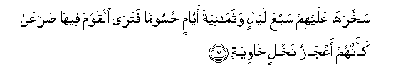
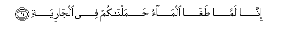
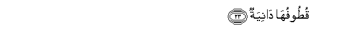
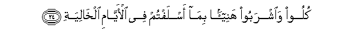

  
[Intangible Textual Heritage](../../index)  [Islam](../index) 
[Index](index)   
[Hypertext Qur'an](../htq/index)  [Unicode](../uq/069.htm#069_001) 
[Palmer](../sbe09/069)  [Pickthall](../pick/069.htm#069_001)  [Yusuf Ali
English](../yaq/yaq069)  [Rodwell](../qr/069)   
  
[Sūra LXIX.: Ḥāqqa, or the Sure Reality. Index](069)  
  [Previous](06802)  [Next](06902) 

------------------------------------------------------------------------

  
*The Holy Quran*, tr. by Yusuf Ali, \[1934\], at Intangible Textual
Heritage

------------------------------------------------------------------------

# Sūra LXIX.: Ḥāqqa, or the Sure Reality.

### Section 1

1. Al<u>ha</u>qqa**tu**

1\. The Sure Reality!

------------------------------------------------------------------------

2. M<u>a</u> al<u>ha</u>qqa**tu**

2\. What is the Sure Reality?

------------------------------------------------------------------------

3. Wam<u>a</u> adr<u>a</u>ka m<u>a</u> al<u>ha</u>qqa**tu**

3\. And what will make  
Thee realise what  
The Sure Reality is?

------------------------------------------------------------------------

4. Ka<u>thth</u>abat thamoodu waAA<u>a</u>dun
bi**a**lq<u>a</u>riAAa**ti**

4\. The <u>Th</u>amūd  
And the ‘Ād people  
(Branded) as false  
The Stunning Calamity!

------------------------------------------------------------------------

5. Faamm<u>a</u> thamoodu faohlikoo bi**al**<u>tta</u>ghiya**ti**

5\. But the <u>Th</u>amūd,—  
They were destroyed  
By a terrible Storm  
Of thunder and lightning!

------------------------------------------------------------------------

6. Waamm<u>a</u> AA<u>a</u>dun faohlikoo biree<u>h</u>in
<u>s</u>ar<u>s</u>arin AA<u>a</u>tiya**tin**

6\. And the ‘Ād,—  
They were destroyed  
By a furious Wind,  
Exceedingly violent;

------------------------------------------------------------------------

7. Sakhkharah<u>a</u> AAalayhim sabAAa lay<u>a</u>lin
watham<u>a</u>niyata ayy<u>a</u>min <u>h</u>usooman fatar<u>a</u>
alqawma feeh<u>a</u> <u>s</u>arAA<u>a</u> kaannahum aAAj<u>a</u>zu
nakhlin kh<u>a</u>wiya**tun**

7\. He made it rage  
Against them seven nights  
And eight days in succession:  
So that thou couldst see  
The (whole) people lying  
Prostrate in its (path),  
As if they had been  
Roots of hollow palm-trees  
Tumbled down!

------------------------------------------------------------------------

8. Fahal tar<u>a</u> lahum min b<u>a</u>qiya**tin**

8\. Then seest thou any  
Of them left surviving?

------------------------------------------------------------------------

9. Waj<u>a</u>a firAAawnu waman qablahu wa**a**lmu/tafik<u>a</u>tu
bi**a**lkh<u>at</u>i-a**ti**

9\. And Pharaoh,  
And those before him,  
And the Cities Overthrown,  
Committed habitual Sin,

------------------------------------------------------------------------

10. FaAAa<u>s</u>aw rasoola rabbihim faakha<u>th</u>ahum
akh<u>th</u>atan r<u>a</u>biya**tan**

10\. And disobeyed (each)  
The apostle of their Lord;  
So He punished them  
With an abundant Penalty.

------------------------------------------------------------------------

11. Inn<u>a</u> lamm<u>a</u> <u>t</u>agh<u>a</u> alm<u>a</u>o
<u>h</u>amaln<u>a</u>kum fee alj<u>a</u>riya**ti**

11\. We, when the water  
(Of Noah's Flood) overflowed  
Beyond its limits,  
Carried you (mankind),  
In the floating (Ark),

------------------------------------------------------------------------

12. LinajAAalah<u>a</u> lakum ta<u>th</u>kiratan wataAAiyah<u>a</u>
o<u>th</u>unun w<u>a</u>AAiya**tun**

12\. That We might  
Make it a Message  
Unto you, and that ears  
(That should hear the tale  
And) retain its memory  
Should bear its (lessons)  
In remembrance.

------------------------------------------------------------------------

13. Fa-i<u>tha</u> nufikha fee a**l**<u>ss</u>oori nafkhatun
w<u>ah</u>ida**tun**

13\. Then, when one  
Blast is sounded  
On the Trumpet,

------------------------------------------------------------------------

14. Wa<u>h</u>umilati al-ar<u>d</u>u wa**a**ljib<u>a</u>lu
fadukkat<u>a</u> dakkatan w<u>ah</u>ida**tan**

14\. And the earth is moved,  
And its mountains,  
And they are crushed to powder  
At one stroke,—

------------------------------------------------------------------------

15. Fayawma-i<u>th</u>in waqaAAati alw<u>a</u>qiAAa**tu**

15\. On that Day  
Shall the (Great) Event  
Come to pass,

------------------------------------------------------------------------

16. Wa**i**nshaqqati a**l**ssam<u>a</u>o fahiya yawma-i<u>th</u>in
w<u>a</u>hiya**tun**

16\. And the sky will be  
Rent asunder, for it will  
That Day be flimsy,

------------------------------------------------------------------------

17. Wa**a**lmalaku AAal<u>a</u> arj<u>a</u>-ih<u>a</u> waya<u>h</u>milu
AAarsha rabbika fawqahum yawma-i<u>th</u>in tham<u>a</u>niya**tun**

17\. And the angels will be  
On its sides,  
And eight will, that Day,  
Bear the Throne  
Of thy Lord above them.

------------------------------------------------------------------------

18. Yawma-i<u>th</u>in tuAAra<u>d</u>oona l<u>a</u> takhf<u>a</u> minkum
kh<u>a</u>fiya**tun**

18\. That Day shall ye be  
Brought to Judgment:  
Not an act of yours  
That ye hide will be hidden.

------------------------------------------------------------------------

19. Faamm<u>a</u> man ootiya kit<u>a</u>bahu biyameenihi fayaqoolu
h<u>a</u>omu iqraoo kit<u>a</u>biyah

19\. Then he that will be  
Given his Record  
In his right hand  
Will say: "Ah here!  
Read ye my Record!

------------------------------------------------------------------------

20. Innee *<u>th</u>*anantu annee mul<u>a</u>qin <u>h</u>is<u>a</u>biyah

20\. "I did really understand  
That my Account would  
(One Day) reach me!"

------------------------------------------------------------------------

21. Fahuwa fee AAeeshatin r<u>ad</u>iya**tin**

21\. And he will be  
In a life of Bliss,

------------------------------------------------------------------------

22. Fee jannatin AA<u>a</u>liya**tin**

22\. In a Garden on high,

------------------------------------------------------------------------

23. Qu<u>t</u>oofuh<u>a</u> d<u>a</u>niya**tun**

23\. The Fruits whereof  
(Will hang in bunches)  
Low and near.

------------------------------------------------------------------------

24. Kuloo wa**i**shraboo hanee-an bim<u>a</u> aslaftum fee
al-ayy<u>a</u>mi alkh<u>a</u>liya**ti**

24\. "Eat ye and drink ye,  
With full satisfaction;  
Because of the (good)  
That ye sent before you,  
In the days that are gone!"

------------------------------------------------------------------------

25. Waamm<u>a</u> man ootiya kit<u>a</u>bahu bishim<u>a</u>lihi
fayaqoolu y<u>a</u> laytanee lam oota kit<u>a</u>biyah

25\. And he that will  
Be given his Record  
In his left hand,  
Will say: "Ah! would  
That my record had not  
Been given to me!

------------------------------------------------------------------------

26. Walam adri m<u>a</u> <u>h</u>is<u>a</u>biyah

26\. "And that I had never  
Realised how  
My account (stood)!

------------------------------------------------------------------------

27. Y<u>a</u> laytah<u>a</u> k<u>a</u>nati alq<u>ad</u>iya**tu**

27\. "Ah! would that (Death)  
Had made an end of me!

------------------------------------------------------------------------

28. M<u>a</u> aghn<u>a</u> AAannee m<u>a</u>liyah

28\. "Of no profit to me  
Has been my wealth!

------------------------------------------------------------------------

29. Halaka AAannee sul<u>ta</u>niyah

29\. "My power has  
Perished from me!"…

------------------------------------------------------------------------

30. Khu<u>th</u>oohu faghullooh**u**

30\. (The stern command will say):  
"Seize ye him,  
And bind ye him,

------------------------------------------------------------------------

31. Thumma alja<u>h</u>eema <u>s</u>allooh**u**

31\. "And burn ye him  
In the Blazing Fire.

------------------------------------------------------------------------

32. Thumma fee silsilatin <u>th</u>arAAuh<u>a</u> sabAAoona
<u>th</u>ir<u>a</u>AAan fa**o**slukooh**u**

32\. "Further, make him march  
In a chain, whereof  
The length is seventy cubits!

------------------------------------------------------------------------

33. Innahu k<u>a</u>na l<u>a</u> yu/minu bi**A**ll<u>a</u>hi
alAAa*<u>th</u>*eem**i**

33\. "This was he that  
Would not believe  
In God Most High,

------------------------------------------------------------------------

34. Wal<u>a</u> ya<u>h</u>u<u>dd</u>u AAal<u>a</u> <u>t</u>aAA<u>a</u>mi
almiskeen**i**

34\. "And would not encourage  
The feeding of the indigent!

------------------------------------------------------------------------

35. Falaysa lahu alyawma h<u>a</u>hun<u>a</u> <u>h</u>ameem**un**

35\. "So no friend hath he  
Here this Day.

------------------------------------------------------------------------

36. Wal<u>a</u> <u>t</u>aAA<u>a</u>mun ill<u>a</u> min ghisleen**in**

36\. "Nor hath he any food  
Except the corruption  
From the washing of wounds,

------------------------------------------------------------------------

37. L<u>a</u> ya/kuluhu ill<u>a</u> alkh<u>at</u>i-oon**a**

37\. "Which none do eat  
But those in sin."

------------------------------------------------------------------------

[Next: Section 2 (38-52)](06902)

