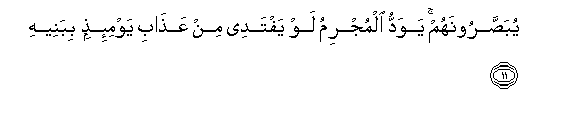

  
[Intangible Textual Heritage](../../index)  [Islam](../index.md) 
[Index](index.md)   
[Hypertext Qur'an](../htq/index)  [Unicode](../uq/070.htm#070_001.md) 
[Palmer](../sbe09/070)  [Pickthall](../pick/070.htm#070_001.md)  [Yusuf Ali
English](../yaq/yaq070)  [Rodwell](../qr/070.md)   
  
[Sūra LXX.: Ma‘ārij, or the Ways of Ascent. Index](070.md)  
  [Previous](06902)  [Next](07002.md) 

------------------------------------------------------------------------

  
*The Holy Quran*, tr. by Yusuf Ali, \[1934\], at Intangible Textual
Heritage

------------------------------------------------------------------------

# Sūra LXX.: Ma‘ārij, or the Ways of Ascent.

### Section 1

1. Saala s<u>a</u>-ilun biAAa<u>tha</u>bin w<u>a</u>qiAA**in**

1\. A questioner asked  
About a Penalty  
To befall—

------------------------------------------------------------------------

2. Lilk<u>a</u>fireena laysa lahu d<u>a</u>fiAA**un**

2\. The Unbelievers,  
The which there is none  
To ward off,—

------------------------------------------------------------------------

3. Mina All<u>a</u>hi <u>th</u>ee almaAA<u>a</u>rij**i**

3\. (A Penalty) from God,  
Lord of the Ways  
Of Ascent.

------------------------------------------------------------------------

4. TaAAruju almal<u>a</u>-ikatu wa**al**rroo<u>h</u>u ilayhi fee yawmin
k<u>a</u>na miqd<u>a</u>ruhu khamseena alfa sana**tin**

4\. The angels and  
The Spirit ascend  
Unto Him in a Day  
The measure whereof  
Is (as) fifty thousand years:

------------------------------------------------------------------------

5. Fa**i**<u>s</u>bir <u>s</u>abran jameel<u>a</u>**n**

5\. Therefore do thou hold  
Patience,—a Patience  
Of beautiful (contentment).

------------------------------------------------------------------------

6. Innahum yarawnahu baAAeed<u>a</u>**n**

6\. They see the (Day) indeed  
As a far-off (event):

------------------------------------------------------------------------

7. Wanar<u>a</u>hu qareeb<u>a</u>**n**

7\. But We see it  
(Quite) near.

------------------------------------------------------------------------

8. Yawma takoonu a**l**ssam<u>a</u>o ka**a**lmuhl**i**

8\. The Day that  
The sky will be like  
Molten brass,

------------------------------------------------------------------------

9. Watakoonu aljib<u>a</u>lu ka**a**lAAihn**i**

9\. And the mountains will be  
Like wool,

------------------------------------------------------------------------

10. Wal<u>a</u> yas-alu <u>h</u>ameemun <u>h</u>ameem<u>a</u>**n**

10\. And no friend will ask  
After a friend,

------------------------------------------------------------------------

11. Yuba<u>ss</u>aroonahum yawaddu almujrimu law yaftadee min
AAa<u>tha</u>bi yawmi-i<u>th</u>in bibaneeh**i**

11\. Though they will be put  
In sight of each other,—  
The sinner's desire will be:  
Would that he could  
Redeem himself from  
The Penalty of that Day  
By (sacrificing) his children,

------------------------------------------------------------------------

12. Wa<u>sah</u>ibatihi waakheeh**i**

12\. His wife and his brother,

------------------------------------------------------------------------

13. Wafa<u>s</u>eelatihi allatee tu/weeh**i**

13\. His kindred who sheltered him,

------------------------------------------------------------------------

14. Waman fee al-ar<u>d</u>i jameeAAan thumma yunjeeh**i**

14\. And all, all that is  
On earth,—so it could  
Deliver him:

------------------------------------------------------------------------

15. Kall<u>a</u> innah<u>a</u> la*<u>th</u>*<u>a</u>

15\. By no means!  
For it would be  
The Fire of Hell!—

------------------------------------------------------------------------

16. Nazz<u>a</u>AAatan li**l**shshaw<u>a</u>

16\. Plucking out (his being)  
Right to the skull!—

------------------------------------------------------------------------

17. TadAAoo man adbara watawall<u>a</u>

17\. Inviting (all) such  
As turn their backs  
And turn away their faces  
(From the Right),

------------------------------------------------------------------------

18. WajamaAAa faawAA<u>a</u>

18\. And collect (wealth)  
And hide it (from use)!

------------------------------------------------------------------------

19. Inna al-ins<u>a</u>na khuliqa halooAA<u>a</u>**n**

19\. Truly man was created  
Very impatient;—

------------------------------------------------------------------------

20. I<u>tha</u> massahu a**l**shsharru jazooAA<u>a</u>**n**

20\. Fretful when evil  
Touches him;

------------------------------------------------------------------------

21. Wa-i<u>tha</u> massahu alkhayru manooAA<u>a</u>**n**

21\. And niggardly when  
Good reaches him;—

------------------------------------------------------------------------

22. Ill<u>a</u> almu<u>s</u>alleen**a**

22\. Not so those devoted  
To Prayer;—

------------------------------------------------------------------------

23. Alla<u>th</u>eena hum AAal<u>a</u> <u>s</u>al<u>a</u>tihim
d<u>a</u>-imoon**a**

23\. Those who remain steadfast  
To their prayer;

------------------------------------------------------------------------

24. Wa**a**lla<u>th</u>eena fee amw<u>a</u>lihim <u>h</u>aqqun
maAAloom**un**

24\. And those in whose wealth  
Is a recognised right

------------------------------------------------------------------------

25. Li**l**ss<u>a</u>-ili wa**a**lma<u>h</u>room**i**

25\. For the (needy) who asks  
And him who is prevented  
(For some reason from asking);

------------------------------------------------------------------------

26. Wa**a**lla<u>th</u>eena yu<u>s</u>addiqoona biyawmi a**l**ddeen**i**

26\. And those who hold  
To the truth of the Day  
Of Judgment;

------------------------------------------------------------------------

27. Wa**a**lla<u>th</u>eena hum min AAa<u>tha</u>bi rabbihim
mushfiqoon**a**

27\. And those who fear  
The displeasure of their Lord,—

------------------------------------------------------------------------

28. Inna AAa<u>tha</u>ba rabbihim ghayru ma/moon**in**

28\. For their Lord's displeasure  
Is the opposite of Peace  
And Tranquillity;—

------------------------------------------------------------------------

29. Wa**a**lla<u>th</u>eena hum lifuroojihim
<u>ha</u>fi*<u>th</u>*oon**a**

29\. And those who guard  
Their chastity,

------------------------------------------------------------------------

30. Ill<u>a</u> AAal<u>a</u> azw<u>a</u>jihim aw m<u>a</u> malakat
aym<u>a</u>nuhum fa-innahum ghayru maloomeen**a**

30\. Except with their wives  
And the (captives) whom  
Their right hands possess,—  
For (then) they are not  
To be blamed,

------------------------------------------------------------------------

31. Famani ibtagh<u>a</u> war<u>a</u>a <u>tha</u>lika faol<u>a</u>-ika
humu alAA<u>a</u>doon**a**

31\. But those who trespass  
Beyond this are transgressors;—

------------------------------------------------------------------------

32. Wa**a**lla<u>th</u>eena hum li-am<u>a</u>n<u>a</u>tihim waAAahdihim
r<u>a</u>AAoon**a**

32\. And those who respect  
Their trusts and covenants;

------------------------------------------------------------------------

33. Wa**a**lla<u>th</u>eena hum bishah<u>a</u>d<u>a</u>tihim
q<u>a</u>-imoon**a**

33\. And those who stand firm  
In their testimonies;

------------------------------------------------------------------------

34. Wa**a**lla<u>th</u>eena hum AAal<u>a</u> <u>s</u>al<u>a</u>tihim
yu<u>ha</u>fi*<u>th</u>*oon**a**

34\. And those who guard  
(The sacredness) of their  
worship;—

------------------------------------------------------------------------

35. Ol<u>a</u>-ika fee jann<u>a</u>tin mukramoon**a**

35\. Such will be  
The honoured ones  
In the Gardens (of Bliss).

------------------------------------------------------------------------

[Next: Section 2 (36-44)](07002.md)

