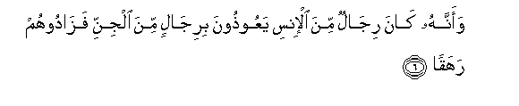
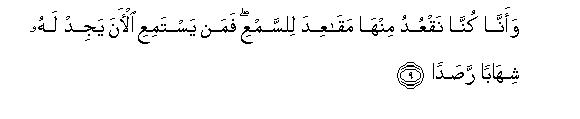
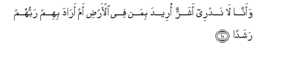
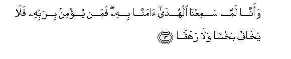
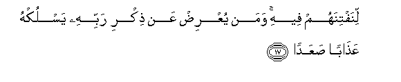

  
[Intangible Textual Heritage](../../index)  [Islam](../index) 
[Index](index)   
[Hypertext Qur'an](../htq/index)  [Unicode](../uq/072.htm#072_001) 
[Palmer](../sbe09/072)  [Pickthall](../pick/072.htm#072_001)  [Yusuf Ali
English](../yaq/yaq072)  [Rodwell](../qr/072)   
  
[Sūra LXXII.: Jinn, or the Spirits. Index](072)  
  [Previous](07102)  [Next](07202) 

------------------------------------------------------------------------

  
*The Holy Quran*, tr. by Yusuf Ali, \[1934\], at Intangible Textual
Heritage

------------------------------------------------------------------------

# Sūra LXXII.: Jinn, or the Spirits.

### Section 1

1. Qul oo<u>h</u>iya ilayya annahu istamaAAa nafarun mina aljinni
faq<u>a</u>loo inn<u>a</u> samiAAn<u>a</u> qur-<u>a</u>nan
AAajab<u>a</u>**n**

1\. Say: It has been  
Revealed to me that  
A company of Jinns  
Listened (to the Qur-ān).  
They said, 'We have  
Really heard a wonderful Recital!

------------------------------------------------------------------------

2. Yahdee il<u>a</u> a**l**rrushdi fa<u>a</u>mann<u>a</u> bihi walan
nushrika birabbin<u>a</u> a<u>h</u>ad<u>a</u>**n**

2\. 'It gives guidance  
To the Right,  
And we have believed therein:  
We shall not join (in worship)  
Any (gods) with our Lord.

------------------------------------------------------------------------

3. Waannahu taAA<u>a</u>l<u>a</u> jaddu rabbin<u>a</u> m<u>a</u>
ittakha<u>th</u>a <u>sah</u>ibatan wal<u>a</u> walad<u>a</u>**n**

3\. 'And exalted is the Majesty  
Of our Lord: He has  
Taken neither a wife  
Nor a son.

------------------------------------------------------------------------

4. Waannahu k<u>a</u>na yaqoolu safeehun<u>a</u> AAal<u>a</u>
All<u>a</u>hi sha<u>t</u>a<u>ta</u>**n**

4\. 'There were some foolish ones  
Among us, who used  
To utter extravagant lies  
Against God;

------------------------------------------------------------------------

5. Waann<u>a</u> *<u>th</u>*anann<u>a</u> an lan taqoola al-insu
wa**a**ljinnu AAal<u>a</u> All<u>a</u>hi ka<u>th</u>ib<u>a</u>**n**

5\. 'But we do think  
That no man or spirit  
Should say aught that is  
Untrue against God.

------------------------------------------------------------------------

6. Waannahu k<u>a</u>na rij<u>a</u>lun mina al-insi yaAAoo<u>th</u>oona
birij<u>a</u>lin mina aljinni faz<u>a</u>doohum rahaq<u>a</u>**n**

6\. 'True, there were persons  
Among mankind who took shelter  
With persons among the Jinns,  
But they increased them  
In folly.

------------------------------------------------------------------------

7. Waannahum *<u>th</u>*annoo kam<u>a</u> *<u>th</u>*anantum an lan
yabAAatha All<u>a</u>hu a<u>h</u>ad<u>a</u>**n**

7\. 'And they (came to) think  
As ye thought, that God  
Would not raise up  
Any one (to Judgment).

------------------------------------------------------------------------

8. Waann<u>a</u> lamasn<u>a</u> a**l**ssam<u>a</u>a
fawajadn<u>a</u>h<u>a</u> muli-at <u>h</u>arasan shadeedan
washuhub<u>a</u>**n**

8\. 'And we pried into  
The secrets of heaven;  
But we found it filled  
With stern guards  
And flaming fires.

------------------------------------------------------------------------

9. Waann<u>a</u> kunn<u>a</u> naqAAudu minh<u>a</u> maq<u>a</u>AAida
li**l**ssamAAi faman yastamiAAi al-<u>a</u>na yajid lahu shih<u>a</u>ban
ra<u>s</u>ad<u>a</u>**n**

9\. 'We used, indeed, to sit there  
In (hidden) stations, to (steal)  
A hearing; but any  
Who listens now  
Will find a flaming fire  
Watching him in ambush.

------------------------------------------------------------------------

10. Waann<u>a</u> l<u>a</u> nadree asharrun oreeda biman fee
al-ar<u>d</u>i am ar<u>a</u>da bihim rabbuhum rashad<u>a</u>**n**

10\. 'And we understand not  
Whether ill is intended  
To those on earth,  
Or whether their Lord  
(Really) intends to guide  
Them to right conduct.

------------------------------------------------------------------------

11. Waann<u>a</u> minn<u>a</u> a**l**<u>ssa</u>li<u>h</u>oona
waminn<u>a</u> doona <u>tha</u>lika kunn<u>a</u> <u>t</u>ar<u>a</u>-iqa
qidad<u>a</u>**n**

11\. 'There are among us  
Some that are righteous,  
And some the contrary:  
We follow divergent paths.

------------------------------------------------------------------------

12. Wann<u>a</u> *<u>th</u>*anann<u>a</u> an lan nuAAjiza All<u>a</u>ha
fee al-ar<u>d</u>i walan nuAAjizahu harab<u>a</u>**n**

12\. 'But we think that we  
Can by no means frustrate  
God throughout the earth,  
Nor can we frustrate Him  
By flight.

------------------------------------------------------------------------

13. Waann<u>a</u> lamm<u>a</u> samiAAn<u>a</u> alhud<u>a</u>
<u>a</u>mann<u>a</u> bihi faman yu/min birabbihi fal<u>a</u>
yakh<u>a</u>fu bakhsan wal<u>a</u> rahaq<u>a</u>**n**

13\. 'And as for us,  
Since we have listened  
To the Guidance, we have  
Accepted it: and any  
Who believes in his Lord  
Has no fear, either  
Of a short (account)  
Or of any injustice.

------------------------------------------------------------------------

14. Waann<u>a</u> minn<u>a</u> almuslimoona waminn<u>a</u>
alq<u>a</u>si<u>t</u>oona faman aslama faol<u>a</u>-ika ta<u>h</u>arraw
rashad<u>a</u>**n**

14\. 'Amongst us are some  
That submit their wills  
(To God), and some  
That swerve from justice.  
Now those who submit  
Their wills—they have  
Sought out (the path)  
Of right conduct:

------------------------------------------------------------------------

15. Waam<u>a</u> alq<u>a</u>si<u>t</u>oona fak<u>a</u>noo lijahannama
<u>h</u>a<u>t</u>ab<u>a</u>**n**

15\. 'But those who swerve,—  
They are (but) fuel  
For Hell-fire'—

------------------------------------------------------------------------

16. Waallawi istaq<u>a</u>moo AAal<u>a</u> a**l**<u>tt</u>areeqati
laasqayn<u>a</u>hum m<u>a</u>an ghadaq<u>a</u>**n**

16\. (And God's Message is):  
"If they (the Pagans)  
Had (only) remained  
On the (right) Way,  
We should certainly have  
Bestowed on them Rain  
In abundance.

------------------------------------------------------------------------

17. Linaftinahum feehi waman yuAAri<u>d</u> AAan <u>th</u>ikri rabbihi
yasluk-hu AAa<u>tha</u>ban <u>s</u>aAAad<u>a</u>**n**

17\. "That We might try them  
By that (means).  
But if any turns away  
From the remembrance  
Of his Lord, He will  
Cause him to undergo  
A severe Penalty.

------------------------------------------------------------------------

18. Waanna almas<u>a</u>jida lill<u>a</u>hi fal<u>a</u> tadAAoo maAAa
All<u>a</u>hi a<u>h</u>ad<u>a</u>**n**

18\. "And the places of worship  
Are for God (alone):  
So invoke not any one  
Along with God;

------------------------------------------------------------------------

19. Waannahu lamm<u>a</u> q<u>a</u>ma AAabdu All<u>a</u>hi yadAAoohu
k<u>a</u>doo yakoonoona AAalayhi libad<u>a</u>**n**

19\. "Yet when the Devotee  
Of God stands forth  
To invoke Him, they just  
Make round him a dense crowd."

------------------------------------------------------------------------

[Next: Section 2 (20-28)](07202)

