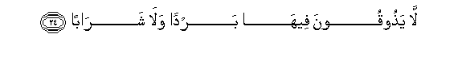

  
[Intangible Textual Heritage](../../index)  [Islam](../index.md) 
[Index](index.md)   
[Hypertext Qur'an](../htq/index)  [Unicode](../uq/078.htm#078_001.md) 
[Palmer](../sbe09/078)  [Pickthall](../pick/078.htm#078_001.md)  [Yusuf Ali
English](../yaq/yaq078)  [Rodwell](../qr/078.md)   
  
[Sūra LXXVIII.: Nabaa, or The (Great) News. Index](078.md)  
  [Previous](07702)  [Next](07802.md) 

------------------------------------------------------------------------

  
*The Holy Quran*, tr. by Yusuf Ali, \[1934\], at Intangible Textual
Heritage

------------------------------------------------------------------------

# Sūra LXXVIII.: Nabaa, or The (Great) News.

### Section 1

1. AAamma yatas<u>a</u>aloon**a**

1\. Concerning what  
Are they disputing?

------------------------------------------------------------------------

2. AAani a**l**nnaba-i alAAa*<u>th</u>*eem**i**

2\. Concerning the Great News,

------------------------------------------------------------------------

3. Alla<u>th</u>ee hum feehi mukhtalifoon**a**

3\. About which they  
Cannot agree.

------------------------------------------------------------------------

4. Kall<u>a</u> sayaAAlamoon**a**

4\. Verily, they shall soon  
(Come to) know!

------------------------------------------------------------------------

5. Thumma kall<u>a</u> sayaAAlamoon**a**

5\. Verily, verily they shall  
Soon (come to) know!

------------------------------------------------------------------------

6. Alam najAAali al-ar<u>d</u>a mih<u>a</u>d<u>a</u>**n**

6\. Have We not made  
The earth as a wide  
Expanse,

------------------------------------------------------------------------

7. Wa**a**ljib<u>a</u>la awt<u>a</u>d<u>a</u>**n**

7\. And the mountains as pegs?

------------------------------------------------------------------------

8. Wakhalaqn<u>a</u>kum azw<u>a</u>j<u>a</u>**n**

8\. And (have We not) created  
You in pairs,

------------------------------------------------------------------------

9. WajaAAaln<u>a</u> nawmakum sub<u>a</u>t<u>a</u>**n**

9\. And made your sleep  
For rest,

------------------------------------------------------------------------

10. WajaAAaln<u>a</u> allayla lib<u>a</u>s<u>a</u>**n**

10\. And made the night  
As a covering,

------------------------------------------------------------------------

11. WajaAAaln<u>a</u> a**l**nnah<u>a</u>ra maAA<u>a</u>sh<u>a</u>**n**

11\. And made the day  
As a means of subsistence?

------------------------------------------------------------------------

12. Wabanayn<u>a</u> fawqakum sabAAan shid<u>a</u>d<u>a</u>**n**

12\. And (have We not)  
Built over you  
The seven firmaments,

------------------------------------------------------------------------

13. WajaAAaln<u>a</u> sir<u>a</u>jan wahh<u>a</u>j<u>a</u>**n**

13\. And placed (therein)  
A Light of Splendour?

------------------------------------------------------------------------

14. Waanzaln<u>a</u> mina almuAA<u>s</u>ir<u>a</u>ti m<u>a</u>an
thajj<u>a</u>j<u>a</u>**n**

14\. And do We not send down  
From the clouds water  
In abundance,

------------------------------------------------------------------------

15. Linukhrija bihi <u>h</u>abban wanab<u>a</u>t<u>a</u>**n**

15\. That We may produce  
Therewith corn and vegetables,

------------------------------------------------------------------------

16. Wajann<u>a</u>tin alf<u>a</u>f<u>a</u>**n**

16\. And gardens of luxurious growth?

------------------------------------------------------------------------

17. Inna yawma alfa<u>s</u>li k<u>a</u>na meeq<u>a</u>t<u>a</u>**n**

17\. Verily the Day  
Of Sorting Out  
Is a thing appointed,—

------------------------------------------------------------------------

18. Yawma yunfakhu fee a**l**<u>ss</u>oori fata/toona
afw<u>a</u>j<u>a</u>**n**

18\. The Day that the Trumpet  
Shall be sounded, and ye  
Shall come forth in crowds;

------------------------------------------------------------------------

19. Wafuti<u>h</u>ati a**l**ssam<u>a</u>o fak<u>a</u>nat
abw<u>a</u>b<u>a</u>**n**

19\. And the heavens  
Shall be opened  
As if there were doors,

------------------------------------------------------------------------

20. Wasuyyirati aljib<u>a</u>lu fak<u>a</u>nat sar<u>a</u>b<u>a</u>**n**

20\. And the mountains  
Shall vanish, as if  
They were a mirage.

------------------------------------------------------------------------

21. Inna jahannama k<u>a</u>nat mir<u>sa</u>d<u>a</u>**n**

21\. Truly Hell is  
As a place of ambush,—

------------------------------------------------------------------------

22. Li**l**<u>tta</u>gheena ma<u>a</u>b<u>a</u>**n**

22\. For the transgressors  
A place of destination:

------------------------------------------------------------------------

23. L<u>a</u>bitheena feeh<u>a</u> a<u>h</u>q<u>a</u>b<u>a</u>**n**

23\. They will dwell therein  
For ages.

------------------------------------------------------------------------

24. L<u>a</u> ya<u>th</u>ooqoona feeh<u>a</u> bardan wal<u>a</u>
shar<u>a</u>b<u>a</u>**n**

24\. Nothing cool shall they taste  
Therein, nor any drink,

------------------------------------------------------------------------

25. Ill<u>a</u> <u>h</u>ameeman waghass<u>a</u>q<u>a</u>**n**

25\. Save a boiling fluid  
And a fluid, dark, murky,  
Intensely cold,—

------------------------------------------------------------------------

26. Jaz<u>a</u>an wif<u>a</u>q<u>a</u>**n**

26\. A fitting recompense  
(For them).

------------------------------------------------------------------------

27. Innahum k<u>a</u>noo l<u>a</u> yarjoona
<u>h</u>is<u>a</u>b<u>a</u>**n**

27\. For that they used not  
To fear any account  
(For their deeds),

------------------------------------------------------------------------

28. Waka<u>thth</u>aboo bi-<u>a</u>y<u>a</u>tin<u>a</u>
ki<u>ththa</u>b<u>a</u>**n**

28\. But they (impudently) treated  
Our Signs as false.

------------------------------------------------------------------------

29. Wakulla shay-in a<u>hs</u>ayn<u>a</u>hu kit<u>a</u>b<u>a</u>**n**

29\. And all things have We  
Preserved on record.

------------------------------------------------------------------------

30. Fa<u>th</u>ooqoo falan nazeedakum ill<u>a</u>
AAa<u>tha</u>b<u>a</u>**n**

30\. "So taste ye (the fruits  
Of your deeds);  
For no increase  
Shall We grant you,  
Except in Punishment.

------------------------------------------------------------------------

[Next: Section 2 (31-40)](07802.md)

