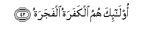

  
[Intangible Textual Heritage](../../index)  [Islam](../index.md) 
[Index](index.md)   
[Hypertext Qur'an](../htq/index)  [Unicode](../uq/080.htm#080_001.md) 
[Palmer](../sbe09/080)  [Pickthall](../pick/080.htm#080_001.md)  [Yusuf Ali
English](../yaq/yaq080)  [Rodwell](../qr/080.md)   
  
[Sūra LXXX.: ’Abasa, or He Frowned. Index](080.md)  
  [Previous](07902)  [Next](08101.md) 

------------------------------------------------------------------------

  
*The Holy Quran*, tr. by Yusuf Ali, \[1934\], at Intangible Textual
Heritage

------------------------------------------------------------------------

# Sūra LXXX.: ’Abasa, or He Frowned.

### Section 1

1. AAabasa watawall<u>a</u>

1\. (The Prophet) frowned  
And turned away,

------------------------------------------------------------------------

2. An j<u>a</u>ahu al-aAAm<u>a</u>

2\. Because there came to him  
The blind man (interrupting).

------------------------------------------------------------------------

3. Wam<u>a</u> yudreeka laAAallahu yazzakk<u>a</u>

3\. But what could tell thee  
But that perchance he might  
Grow (in spiritual understanding)?—

------------------------------------------------------------------------

4. Aw ya<u>thth</u>akkaru fatanfaAAahu a**l**<u>thth</u>ikr<u>a</u>

4\. Or that he might receive  
Admonition, and the teaching  
Might profit him?

------------------------------------------------------------------------

5. Amm<u>a</u> mani istaghn<u>a</u>

5\. As to one who regards  
Himself as self-sufficient,

------------------------------------------------------------------------

6. Faanta lahu ta<u>s</u>add<u>a</u>

6\. To him dost thou attend;

------------------------------------------------------------------------

7. Wam<u>a</u> AAalayka all<u>a</u> yazzakk<u>a</u>

7\. Though it is no blame  
To thee if he grow not  
(In spiritual understanding).

------------------------------------------------------------------------

8. Waamm<u>a</u> man j<u>a</u>aka yasAA<u>a</u>

8\. But as to him who came  
To thee striving earnestly,

------------------------------------------------------------------------

9. Wahuwa yakhsh<u>a</u>

9\. And with fear  
(In his heart),

------------------------------------------------------------------------

10. Faanta AAanhu talahh<u>a</u>

10\. Of him wast thou unmindful.

------------------------------------------------------------------------

11. Kall<u>a</u> innah<u>a</u> ta<u>th</u>kira**tun**

11\. By no means  
(Should it be so)!  
For it is indeed  
A Message of instruction:

------------------------------------------------------------------------

12. Faman sh<u>a</u>a <u>th</u>akarah**u**

12\. Therefore let whoso will,  
Keep it in remembrance.

------------------------------------------------------------------------

13. Fee <u>s</u>u<u>h</u>ufin mukarrama**tin**

13\. (It is) in Books  
Held (greatly) in honour,

------------------------------------------------------------------------

14. MarfooAAatin mu<u>t</u>ahhara**tin**

14\. Exalted (in dignity),  
Kept pure and holy,

------------------------------------------------------------------------

15. Bi-aydee safara**tin**

15\. (Written) by the hands  
Of scribes—

------------------------------------------------------------------------

16. Kir<u>a</u>min barara**tin**

16\. Honourable and  
Pious and Just.

------------------------------------------------------------------------

17. Qutila al-ins<u>a</u>nu m<u>a</u> akfarah**u**

17\. Woe to man!  
What hath made him  
Reject God:

------------------------------------------------------------------------

18. Min ayyi shay-in khalaqah**u**

18\. From what stuff  
Hath He created him?

------------------------------------------------------------------------

19. Min nu<u>t</u>fatin khalaqahu faqaddarah**u**

19\. From a sperm-drop:  
He hath created him, and then  
Mouldeth him in due proportions;

------------------------------------------------------------------------

20. Thumma a**l**ssabeela yassarah**u**

20\. Then doth He make  
His path smooth for him;

------------------------------------------------------------------------

21. Thumma am<u>a</u>tahu faaqbarah**u**

21\. Then He causeth him to die,  
And putteth him in his Grave;

------------------------------------------------------------------------

22. Thumma i<u>tha</u> sh<u>a</u>a ansharah**u**

22\. Then, when it is  
His Will, He will  
Raise him up (again).

------------------------------------------------------------------------

23. Kall<u>a</u> lamm<u>a</u> yaq<u>d</u>i m<u>a</u> amarah**u**

23\. By no means hath he  
Fulfilled what God  
Hath commanded him.

------------------------------------------------------------------------

24. Falyan*<u>th</u>*uri al-ins<u>a</u>nu il<u>a</u>
<u>t</u>aAA<u>a</u>mih**i**

24\. Then let man look  
At his Food,  
(And how We provide it):

------------------------------------------------------------------------

25. Ann<u>a</u> <u>s</u>ababn<u>a</u> alm<u>a</u>a
<u>s</u>abb<u>a</u>**n**

25\. For that We pour forth  
Water in abundance,

------------------------------------------------------------------------

26. Thumma shaqaqn<u>a</u> al-ar<u>d</u>a shaqq<u>a</u>**n**

26\. And We split the earth  
In fragments,

------------------------------------------------------------------------

27. Faanbatn<u>a</u> feeh<u>a</u> <u>h</u>abb<u>a</u>**n**

27\. And produce therein Corn,

------------------------------------------------------------------------

28. WaAAinaban waqa<u>d</u>b<u>a</u>**n**

28\. And Grapes and nutritious Plants,

------------------------------------------------------------------------

29. Wazaytoonan wanakhl<u>a</u>**n**

29\. And Olives and Dates,

------------------------------------------------------------------------

30. Wa<u>h</u>ad<u>a</u>-iqa ghulb<u>a</u>**n**

30\. And enclosed Gardens,  
Dense with lofty trees,

------------------------------------------------------------------------

31. Waf<u>a</u>kihatan waabb<u>a</u>**n**

31\. And Fruits and Fodder,—

------------------------------------------------------------------------

32. Mat<u>a</u>AAan lakum wali-anAA<u>a</u>mikum

32\. For use and convenience  
To you and your cattle.

------------------------------------------------------------------------

33. Fa-i<u>tha</u> j<u>a</u>ati a**l**<u>ssa</u>khkha**tu**

33\. At length, when there  
Comes the Deafening Noise,—

------------------------------------------------------------------------

34. Yawma yafirru almaro min akheeh**i**

34\. That Day shall a man  
Flee from his own brother,

------------------------------------------------------------------------

35. Waommihi waabeeh**i**

35\. And from his mother  
And his father,

------------------------------------------------------------------------

36. Wa<u>sah</u>ibatihi wabaneeh**i**

36\. And from his wife  
And his children.

------------------------------------------------------------------------

37. Likulli imri-in minhum yawma-i<u>th</u>in sha/nun yughneeh**i**

37\. Each one of them,  
That Day, will have  
Enough concern (of his own)  
To make him indifferent  
To the others,

------------------------------------------------------------------------

38. Wujoohun yawma-i<u>th</u>in musfira**tun**

38\. Some Faces that Day  
Will be beaming,

------------------------------------------------------------------------

39. <u>Dah</u>ikatun mustabshira**tun**

39\. Laughing, rejoicing.

------------------------------------------------------------------------

40. Wawujoohun yawma-i<u>th</u>in AAalayh<u>a</u> ghabara**tun**

40\. And other faces that Day  
Will be dust-stained;

------------------------------------------------------------------------

41. Tarhaquh<u>a</u> qatara**tun**

41\. Blackness will cover them:

------------------------------------------------------------------------

42. Ol<u>a</u>-ika humu alkafaratu alfajara**tu**

42\. Such will be  
The Rejecters of God,  
The Doers of Iniquity.

------------------------------------------------------------------------

[Next: Section 1 (1-29)](08101.md)

