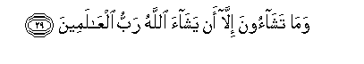

  
[Intangible Textual Heritage](../../index)  [Islam](../index) 
[Index](index)   
[Hypertext Qur'an](../htq/index)  [Unicode](../uq/081.htm#081_001) 
[Palmer](../sbe09/081)  [Pickthall](../pick/081.htm#081_001)  [Yusuf Ali
English](../yaq/yaq081)  [Rodwell](../qr/081)   
  
[Sūra LXXXI.: Takwīr, or the Folding Up. Index](081)  
  [Previous](08001)  [Next](08201) 

------------------------------------------------------------------------

  
*The Holy Quran*, tr. by Yusuf Ali, \[1934\], at Intangible Textual
Heritage

------------------------------------------------------------------------

# Sūra LXXXI.: Takwīr, or the Folding Up.

### Section 1

1. I<u>tha</u> a**l**shshamsu kuwwirat

1\. When the sun  
(With its spacious light)  
Is folded up;

------------------------------------------------------------------------

2. Wa-i<u>tha</u> a**l**nnujoomu inkadarat

2\. When the stars  
Fall, losing their lustre;

------------------------------------------------------------------------

3. Wa-i<u>tha</u> aljib<u>a</u>lu suyyirat

3\. When the mountains vanish  
(Like a mirage);

------------------------------------------------------------------------

4. Wa-i<u>tha</u> alAAish<u>a</u>ru AAu<u>tt</u>ilat

4\. When the she-camels,  
Ten months with young,  
Are left untended;

------------------------------------------------------------------------

5. Wa-i<u>tha</u> alwu<u>h</u>ooshu <u>h</u>ushirat

5\. When the wild beasts  
Are herded together  
(In human habitations);

------------------------------------------------------------------------

6. Wa-i<u>tha</u> albi<u>ha</u>ru sujjirat

6\. When the oceans  
Boil over with a swell;

------------------------------------------------------------------------

7. Wa-i<u>tha</u> a**l**nnufoosu zuwwijat

7\. When the souls  
Are sorted out,  
(Being joined, like with like);

------------------------------------------------------------------------

8. Wa-i<u>tha</u> almawoodatu su-ilat

8\. When the female (infant),  
Buried alive, is questioned—

------------------------------------------------------------------------

9. Bi-ayyi <u>th</u>anbin qutilat

9\. For what crime  
She was killed;

------------------------------------------------------------------------

10. Wa-i<u>tha</u> a**l**<u>ss</u>u<u>h</u>ufu nushirat

10\. When the Scrolls  
Are laid open;

------------------------------------------------------------------------

11. Wa-i<u>tha</u> a**l**ssam<u>a</u>o kushi<u>t</u>at

11\. When the World on High  
Is unveiled;

------------------------------------------------------------------------

12. Wa-i<u>tha</u> alja<u>h</u>eemu suAAAAirat

12\. When the Blazing Fire  
Is kindled to fierce heat;

------------------------------------------------------------------------

13. Wa-i<u>tha</u> aljannatu ozlifat

13\. And when the Garden  
Is brought near;—

------------------------------------------------------------------------

14. AAalimat nafsun m<u>a</u> a<u>hd</u>arat

14\. (Then) shall each soul know  
What it has put forward.

------------------------------------------------------------------------

15. Fal<u>a</u> oqsimu bi**a**lkhunnas**i**

15\. So verily I call  
To witness the Planets—  
That recede,

------------------------------------------------------------------------

16. Aljaw<u>a</u>ri alkunnas**i**

16\. Go straight, or hide;

------------------------------------------------------------------------

17. Wa**a**llayli i<u>tha</u> AAasAAas**a**

17\. And the Night  
As it dissipates;

------------------------------------------------------------------------

18. Wa**al**<u>ss</u>ub<u>h</u>i i<u>tha</u> tanaffas**a**

18\. And the Dawn  
As it breathes away  
The darkness;—

------------------------------------------------------------------------

19. Innahu laqawlu rasoolin kareem**in**

19\. Verily this is the word  
Of a most honourable Messenger,

------------------------------------------------------------------------

20. <u>Th</u>ee quwwatin AAinda <u>th</u>ee alAAarshi makeen**in**

20\. Endued with Power,  
With rank before  
The Lord of the Throne,

------------------------------------------------------------------------

21. Mu<u>ta</u>AAin thamma ameen**in**

21\. With authority there,  
(And) faithful to his trust.

------------------------------------------------------------------------

22. Wam<u>a</u> <u>sah</u>ibukum bimajnoon**in**

22\. And (O people!)  
Your Companion is not  
One possessed;

------------------------------------------------------------------------

23. Walaqad ra<u>a</u>hu bi**a**lofuqi almubeen**i**

23\. And without doubt he saw him  
In the clear horizon.

------------------------------------------------------------------------

24. Wam<u>a</u> huwa AAal<u>a</u> alghaybi bi<u>d</u>aneen**in**

24\. Neither doth he withhold  
Grudgingly a knowledge  
Of the Unseen.

------------------------------------------------------------------------

25. Wam<u>a</u> huwa biqawli shay<u>ta</u>nin rajeem**in**

25\. Nor is it the word  
Of an evil spirit accursed!

------------------------------------------------------------------------

26. Faayna ta<u>th</u>haboon**a**

26\. When whither go ye?

------------------------------------------------------------------------

27. In huwa ill<u>a</u> <u>th</u>ikrun lilAA<u>a</u>lameen**a**

27\. Verily this is no less  
Than a Message  
To (all) the Worlds:

------------------------------------------------------------------------

28. Liman sh<u>a</u>a minkum an yastaqeem**a**

28\. (With profit) to whoever  
Among you wills  
To go straight:

------------------------------------------------------------------------

29. Wam<u>a</u> tash<u>a</u>oona ill<u>a</u> an yash<u>a</u>a
All<u>a</u>hu rabbu alAA<u>a</u>lameen**a**  

29\. But ye shall not will  
Except as God wills,—  
The Cherisher of the Worlds.

------------------------------------------------------------------------

[Next: Section 1 (1-19)](08201)

