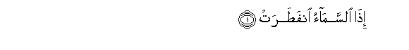
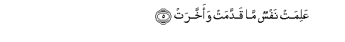
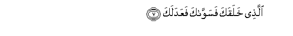
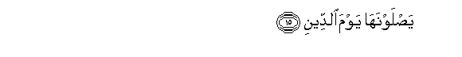
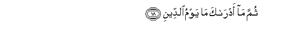
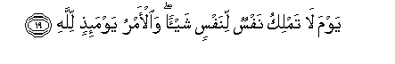

  
[Intangible Textual Heritage](../../index)  [Islam](../index) 
[Index](index)   
[Hypertext Qur'an](../htq/index)  [Unicode](../uq/082.htm#082_001) 
[Palmer](../sbe09/082)  [Pickthall](../pick/082.htm#082_001)  [Yusuf Ali
English](../yaq/yaq082)  [Rodwell](../qr/082)   
  
[Sūra LXXXII.: Infiṭār, or The Cleaving Asunder. Index](082)  
  [Previous](08101)  [Next](08301) 

------------------------------------------------------------------------

  
*The Holy Quran*, tr. by Yusuf Ali, \[1934\], at Intangible Textual
Heritage

------------------------------------------------------------------------

# Sūra LXXXII.: Infiṭār, or The Cleaving Asunder.

### Section 1

1. I<u>tha</u> a**l**ssam<u>a</u>o infa<u>t</u>arat

1\. When the Sky  
Is cleft asunder;

------------------------------------------------------------------------

2. Wa-i<u>tha</u> alkaw<u>a</u>kibu intatharat

2\. When the Stars  
Are scattered;

------------------------------------------------------------------------

3. Wa-i<u>tha</u> albi<u>ha</u>ru fujjirat

3\. When the Oceans  
Are suffered to burst forth;

------------------------------------------------------------------------

4. Wa-i<u>tha</u> alqubooru buAAthirat

4\. And when the Graves  
Are turned upside down;—

------------------------------------------------------------------------

5. AAalimat nafsun m<u>a</u> qaddamat waakhkharat

5\. (Then) shall each soul know  
What it hath sent forward  
And (what it hath) kept back.

------------------------------------------------------------------------

6. Y<u>a</u> ayyuh<u>a</u> al-ins<u>a</u>nu m<u>a</u> gharraka birabbika
alkareem**i**

6\. O man! what has  
Seduced thee from  
Thy Lord Most Beneficent?—

------------------------------------------------------------------------

7. Alla<u>th</u>ee khalaqaka fasaww<u>a</u>ka faAAadalak**a**

7\. Him Who created thee.  
Fashioned thee in due proportion  
And gave thee a just bias;

------------------------------------------------------------------------

8. Fee ayyi <u>s</u>ooratin m<u>a</u> sh<u>a</u>a rakkabak**a**

8\. In whatever Form He wills,  
Does He put thee together.

------------------------------------------------------------------------

9. Kall<u>a</u> bal tuka<u>thth</u>iboona bi**al**ddeen**i**

9\. Nay! but ye do  
Reject Right and Judgment!

------------------------------------------------------------------------

10. Wa-inna AAalaykum la<u>ha</u>fi*<u>th</u>*een**a**

10\. But verily over you  
(Are appointed angels)  
To protect you,—

------------------------------------------------------------------------

11. Kir<u>a</u>man k<u>a</u>tibeen**a**

11\. Kind and honourable,—  
Writing down (your deeds):

------------------------------------------------------------------------

12. YaAAlamoona m<u>a</u> tafAAaloon**a**

12\. They know (and understand)  
All that ye do.

------------------------------------------------------------------------

13. Inna al-abr<u>a</u>ra lafee naAAeem**in**

13\. As for the Righteous,  
They will be in Bliss;

------------------------------------------------------------------------

14. Wa-inna alfujj<u>a</u>ra lafee ja<u>h</u>eem**in**

14\. And the Wicked—  
They will be in the Fire,

------------------------------------------------------------------------

15. Ya<u>s</u>lawnah<u>a</u> yawma a**l**ddeen**i**

15\. Which they will enter  
On the Day of Judgment,

------------------------------------------------------------------------

16. Wam<u>a</u> hum AAanh<u>a</u> bigh<u>a</u>-ibeen**a**

16\. And they will not be  
Able to keep away therefrom.

------------------------------------------------------------------------

17. Wam<u>a</u> adr<u>a</u>ka m<u>a</u> yawmu a**l**ddeeni

17\. And what will explain  
To thee what the Day  
Of Judgment is?

------------------------------------------------------------------------

18. Thumma m<u>a</u> adr<u>a</u>ka m<u>a</u> yawmu a**l**ddeen**i**

18\. Again, what will explain  
To thee what the Day  
Of Judgment is?

------------------------------------------------------------------------

19. Yawma l<u>a</u> tamliku nafsun linafsin shay-an wa**a**l-amru
yawma-i<u>th</u>in lill<u>a</u>h**i**

19\. (It will be) the Day  
When no soul shall have  
Power (to do) aught  
For another  
For the Command, that Day,  
Will be (wholly) with God.

------------------------------------------------------------------------

[Next: Section 1 (1-36)](08301)

