

  
[Intangible Textual Heritage](../../index)  [Islam](../index) 
[Index](index)   
[Hypertext Qur'an](../htq/index)  [Unicode](../uq/083.htm#083_001) 
[Palmer](../sbe09/083)  [Pickthall](../pick/083.htm#083_001)  [Yusuf Ali
English](../yaq/yaq083)  [Rodwell](../qr/083)   
  
[Sūra LXXXIII.: Taṭfīf, or Dealing in Fraud. Index](083)  
  [Previous](08201)  [Next](08401) 

------------------------------------------------------------------------

  
*The Holy Quran*, tr. by Yusuf Ali, \[1934\], at Intangible Textual
Heritage

------------------------------------------------------------------------

# Sūra LXXXIII.: Taṭfīf, or Dealing in Fraud.

### Section 1

1. Waylun lilmu<u>t</u>affifeen**a**

1\. Woe to those  
That deal in fraud,—

------------------------------------------------------------------------

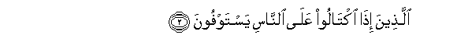

2. Alla<u>th</u>eena i<u>tha</u> ikt<u>a</u>loo AAal<u>a</u>
a**l**nn<u>a</u>si yastawfoon**a**

2\. Those who, when they  
Have to receive by measure  
From men, exact full measure,

------------------------------------------------------------------------

3. Wa-i<u>tha</u> k<u>a</u>loohum aw wazanoohum yukhsiroon**a**

3\. But when they have  
To give by measure  
Or weight to men,  
Give less than due.

------------------------------------------------------------------------

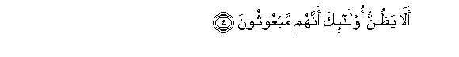

4. Al<u>a</u> ya*<u>th</u>*unnu ol<u>a</u>-ika annahum mabAAoothoon**a**

4\. Do they not think  
That they will be called  
To account?—

------------------------------------------------------------------------

5. Liyawmin AAa*<u>th</u>*eem**in**

5\. On a Mighty Day,

------------------------------------------------------------------------

6. Yawma yaqoomu a**l**nn<u>a</u>su lirabbi alAA<u>a</u>lameen**a**

6\. A Day when (all) mankind  
Will stand before  
The Lord of the Worlds?

------------------------------------------------------------------------

7. Kall<u>a</u> inna kit<u>a</u>ba alfujj<u>a</u>ri lafee sijjeen**in**

7\. Nay! Surely the Record  
Of the Wicked is  
(Preserved) in Sijjīn.

------------------------------------------------------------------------

8. Wam<u>a</u> adr<u>a</u>ka m<u>a</u> sijjeen**un**

8\. And what will explain  
To thee what Sijjīn is?

------------------------------------------------------------------------

9. Kit<u>a</u>bun marqoom**un**

9\. (There is) a Register  
(Fully) inscribed.

------------------------------------------------------------------------

10. Waylun yawma-i<u>th</u>in lilmuka<u>thth</u>ibeen**a**

10\. Woe, that Day, to those  
That deny—

------------------------------------------------------------------------

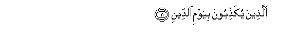

11. Alla<u>th</u>eena yuka<u>thth</u>iboona biyawmi a**l**ddeen**i**

11\. Those that deny  
The Day of Judgment.

------------------------------------------------------------------------

12. Wam<u>a</u> yuka<u>thth</u>ibu bihi ill<u>a</u> kullu muAAtadin
atheem**in**

12\. And none can deny it  
But the Transgressor  
Beyond bounds,  
The Sinner!

------------------------------------------------------------------------

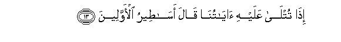

13. I<u>tha</u> tutl<u>a</u> AAalayhi <u>a</u>y<u>a</u>tun<u>a</u>
q<u>a</u>la as<u>at</u>eeru al-awwaleen**a**

13\. When Our Signs are rehearsed  
To him, he says,  
"Tales of the Ancients!"

------------------------------------------------------------------------

14. Kall<u>a</u> bal r<u>a</u>na AAal<u>a</u> quloobihim m<u>a</u>
k<u>a</u>noo yaksiboon**a**

14\. By no means!  
But on their hearts  
Is the stain of the (ill)  
Which they do!

------------------------------------------------------------------------

15. Kall<u>a</u> innahum AAan rabbihim yawma-i<u>th</u>in
lama<u>h</u>jooboon**a**

15\. Verily, from (the Light  
Of) their Lord, that Day,  
Will they be veiled.

------------------------------------------------------------------------

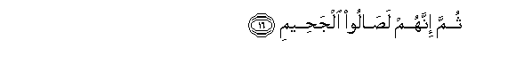

16. Thumma innahum la<u>sa</u>loo alja<u>h</u>eem**i**

16\. Further, they will enter  
The Fire of Hell.

------------------------------------------------------------------------

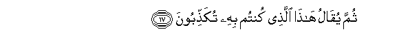

17. Thumma yuq<u>a</u>lu h<u>atha</u> alla<u>th</u>ee kuntum bihi
tuka<u>thth</u>iboon**a**

17\. Further, it will be said  
To them: "This is  
The (reality) which ye  
Rejected as false!

------------------------------------------------------------------------

18. Kall<u>a</u> inna kit<u>a</u>ba al-abr<u>a</u>ri lafee
AAilliyyeen**a**

18\. Nay, verily the Record  
Of the Righteous is  
(Preserved) in ‘Illīyīn.

------------------------------------------------------------------------

19. Wam<u>a</u> adr<u>a</u>ka m<u>a</u> AAilliyyoon**a**

19\. And what will explain  
To thee what ‘Illīyīn is?

------------------------------------------------------------------------

20. Kit<u>a</u>bun marqoom**un**

20\. (There is) a Register  
(Fully) inscribed,

------------------------------------------------------------------------

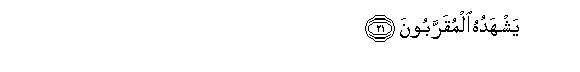

21. Yashhaduhu almuqarraboon**a**

21\. To which bear witness  
Those Nearest (to God),

------------------------------------------------------------------------

22. Inna al-abr<u>a</u>ra lafee naAAeem**in**

22\. Truly the Righteous  
Will be in Bliss:

------------------------------------------------------------------------

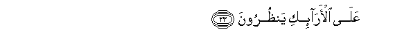

23. AAal<u>a</u> al-ar<u>a</u>-iki yan*<u>th</u>*uroon**a**

23\. On Thrones (of Dignity)  
Will they command a sight  
(Of all things):

------------------------------------------------------------------------

24. TaAArifu fee wujoohihim na<u>d</u>rata a**l**nnaAAeem**i**

24\. Thou wilt recognise  
In their Faces  
The beaming brightness of Bliss.

------------------------------------------------------------------------

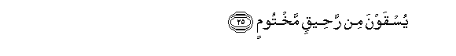

25. Yusqawna min ra<u>h</u>eeqin makhtoom**in**

25\. Their thirst will be slaked  
With Pure Wine sealed:

------------------------------------------------------------------------

26. Khit<u>a</u>muhu miskun wafee <u>tha</u>lika falyatan<u>a</u>fasi
almutan<u>a</u>fisoon**a**

26\. The seal thereof will be  
Musk: and for this  
Let those aspire,  
Who have aspirations:

------------------------------------------------------------------------

27. Wamiz<u>a</u>juhu min tasneem**in**

27\. With it will be (given)  
A mixture of Tasnīm:

------------------------------------------------------------------------

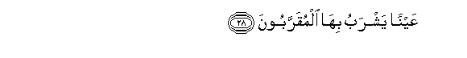

28. AAaynan yashrabu bih<u>a</u> almuqarraboon**a**

28\. A spring, from (the waters)  
Whereof drink  
Those Nearest to God.

------------------------------------------------------------------------

29. Inna alla<u>th</u>eena ajramoo k<u>a</u>noo mina alla<u>th</u>eena
<u>a</u>manoo ya<u>dh</u>akoon**a**

29\. Those in sin used  
To laugh at those  
Who believed,

------------------------------------------------------------------------

30. Wa-i<u>tha</u> marroo bihim yatagh<u>a</u>mazoon**a**

30\. And whenever they passed  
By them, used to wink  
At each other (in mockery);

------------------------------------------------------------------------

31. Wa-i<u>tha</u> inqalaboo il<u>a</u> ahlihimu inqalaboo fakiheen**a**

31\. And when they returned  
To their own people,  
They would return jesting;

------------------------------------------------------------------------

32. Wa-i<u>tha</u> raawhum q<u>a</u>loo inna h<u>a</u>ol<u>a</u>-i
la<u>da</u>lloon**a**

32\. And whenever they saw them,  
They would say, "Behold!  
These are the people  
Truly astray!"

------------------------------------------------------------------------

33. Wam<u>a</u> orsiloo AAalayhim <u>ha</u>fi*<u>th</u>*een**a**

33\. But they had not been  
Sent as Keepers over them!

------------------------------------------------------------------------

34. Fa**a**lyawma alla<u>th</u>eena <u>a</u>manoo mina alkuff<u>a</u>ri
ya<u>dh</u>akoon**a**

34\. But on this Day  
The Believers will laugh  
At the Unbelievers:

------------------------------------------------------------------------

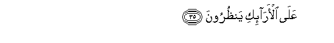

35. AAal<u>a</u> al-ar<u>a</u>-iki yan*<u>th</u>*uroon**a**

35\. On Thrones (of Dignity)  
They will command (a sight)  
(Of all things),

------------------------------------------------------------------------

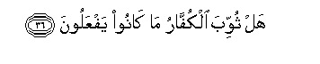

36. Hal thuwwiba alkuff<u>a</u>ru m<u>a</u> k<u>a</u>noo yafAAaloon**a**

36\. Will not the Unbelievers  
Have been paid back  
For what they did?

------------------------------------------------------------------------

[Next: Section 1 (1-25)](08401)

