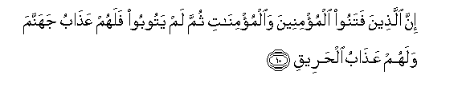
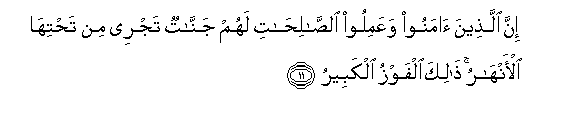

  
[Intangible Textual Heritage](../../index)  [Islam](../index.md) 
[Index](index.md)   
[Hypertext Qur'an](../htq/index)  [Unicode](../uq/085.htm#085_001.md) 
[Palmer](../sbe09/085)  [Pickthall](../pick/085.htm#085_001.md)  [Yusuf Ali
English](../yaq/yaq085)  [Rodwell](../qr/085.md)   
  
[Sūra LXXXV.: Burūj, or The Zodiacal Signs. Index](085.md)  
  [Previous](08401)  [Next](08601.md) 

------------------------------------------------------------------------

  
*The Holy Quran*, tr. by Yusuf Ali, \[1934\], at Intangible Textual
Heritage

------------------------------------------------------------------------

# Sūra LXXXV.: Burūj, or The Zodiacal Signs.

### Section 1

1. Wa**al**ssam<u>a</u>-i <u>tha</u>ti alburooj**i**

1\. By the Sky, (displaying)  
The Zodiacal Signs;

------------------------------------------------------------------------

2. Wa**a**lyawmi almawAAood**i**

2\. By the promised Day  
(Of Judgment);

------------------------------------------------------------------------

3. Wash<u>a</u>hidin wamashhood**in**

3\. By one that witnesses,  
And the subject of the witness;—

------------------------------------------------------------------------

4. Qutila a<u>s</u>-<u>ha</u>bu alukhdood**i**

4\. Woe to the makers  
Of the pit (of fire),

------------------------------------------------------------------------

5. A**l**nn<u>a</u>ri <u>tha</u>ti alwaqood**i**

5\. Fire supplied (abundantly)  
With Fuel:

------------------------------------------------------------------------

6. I<u>th</u> hum AAalayh<u>a</u> quAAood**un**

6\. Behold! they sat  
Over against the (fire),

------------------------------------------------------------------------

7. Wahum AAal<u>a</u> m<u>a</u> yafAAaloona bi**a**lmu/mineena
shuhood**un**

7\. And they witnessed  
(All) that they were doing  
Against the Believers.

------------------------------------------------------------------------

8. Wam<u>a</u> naqamoo minhum ill<u>a</u> an yu/minoo
bi**A**ll<u>a</u>hi alAAazeezi al<u>h</u>ameed**i**

8\. And they ill-treated them  
For no other reason than  
That they believed in God,  
Exalted in Power,  
Worthy of all Praise!—

------------------------------------------------------------------------

9. Alla<u>th</u>ee lahu mulku a**l**ssam<u>a</u>w<u>a</u>ti
wa**a**l-ar<u>d</u>i wa**A**ll<u>a</u>hu AAal<u>a</u> kulli shay-in
shaheed**un**

9\.

------------------------------------------------------------------------

10. Inna alla<u>th</u>eena fatanoo almu/mineena wa**a**lmu/min<u>a</u>ti
thumma lam yatooboo falahum AAa<u>tha</u>bu jahannama walahum
AAa<u>tha</u>bu al<u>h</u>areeq**i**

10\. Those who persecute (or draw  
into temptation)  
The Believers, men and women,  
And do not turn  
In repentance, will have  
The Penalty of Hell:  
They will have the Penalty  
Of the Burning Fire.

------------------------------------------------------------------------

11. Inna alla<u>th</u>eena <u>a</u>manoo waAAamiloo
a**l**<u>ssa</u>li<u>ha</u>ti lahum jann<u>a</u>tun tajree min
ta<u>h</u>tih<u>a</u> al-anh<u>a</u>ru <u>tha</u>lika alfawzu
alkabeer**u**

11\. For those who believe  
And do righteous deeds,  
Will be Gardens,  
Beneath which Rivers flow:  
That is the great Salvation,  
(The fulfilment of all desires),

------------------------------------------------------------------------

12. Inna ba<u>t</u>sha rabbika lashadeed**un**

12\. Truly strong is the Grip  
(And Power) of thy Lord.

------------------------------------------------------------------------

13. Innahu huwa yubdi-o wayuAAeed**u**

13\. It is He Who creates  
From the very beginning,  
And He can restore (life).

------------------------------------------------------------------------

14. Wahuwa alghafooru alwadood**u**

14\. And He is the Oft-Forgiving,  
Full of loving-kindness,

------------------------------------------------------------------------

15. <u>Th</u>oo alAAarshi almajeed**i**

15\. Lord of the Throne of Glory,

------------------------------------------------------------------------

16. FaAAAA<u>a</u>lun lim<u>a</u> yureed**u**

16\. Doer (without let)  
Of all that He intends.

------------------------------------------------------------------------

17. Hal at<u>a</u>ka <u>h</u>adeethu aljunood**i**

17\. Has the story  
Reached thee,  
Of the Forces—

------------------------------------------------------------------------

18. FirAAawna wathamood**a**

18\. Of Pharaoh  
And the <u>Th</u>amūd?

------------------------------------------------------------------------

19. Bali alla<u>th</u>eena kafaroo fee tak<u>th</u>eeb**in**

19\. And yet the Unbelievers  
(Persist) in rejecting  
(The Truth)!

------------------------------------------------------------------------

20. Wa**A**ll<u>a</u>hu min war<u>a</u>-ihim mu<u>h</u>ee<u>t</u>**un**

20\. But God doth  
Encompass them  
From behind!

------------------------------------------------------------------------

21. Bal huwa qur-<u>a</u>nun majeed**un**

21\. Nay, this is  
A Glorious Qur-ān,

------------------------------------------------------------------------

22. Fee law<u>h</u>in ma<u>h</u>foo*<u>th</u>***in**

22\. (Inscribed) in  
A Tablet Preserved!

------------------------------------------------------------------------

[Next: Section 1 (1-17)](08601.md)

