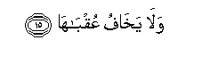

  
[Intangible Textual Heritage](../../index)  [Islam](../index) 
[Index](index)   
[Hypertext Qur'an](../htq/index)  [Unicode](../uq/091.htm#091_001) 
[Palmer](../sbe09/091)  [Pickthall](../pick/091.htm#091_001)  [Yusuf Ali
English](../yaq/yaq091)  [Rodwell](../qr/091)   
  
[Sūra XCI.: Shams, or The Sun. Index](091)  
  [Previous](09001)  [Next](09201) 

------------------------------------------------------------------------

  
*The Holy Quran*, tr. by Yusuf Ali, \[1934\], at Intangible Textual
Heritage

------------------------------------------------------------------------

# Sūra XCI.: Shams, or The Sun.

### Section 1

1. Wa**al**shshamsi wa<u>d</u>u<u>ha</u>h<u>a</u>

1\. By the Sun  
And his (glorious) splendour;

------------------------------------------------------------------------

2. Wa**a**lqamari i<u>tha</u> tal<u>a</u>h<u>a</u>

2\. By the Moon  
As she follows him;

------------------------------------------------------------------------

3. Wa**al**nnah<u>a</u>ri i<u>tha</u> jall<u>a</u>h<u>a</u>

3\. By the Day as it  
Shows up (the Sun's) glory;

------------------------------------------------------------------------

4. Wa**a**llayli i<u>tha</u> yaghsh<u>a</u>h<u>a</u>

4\. By the Night as it  
Conceals it;

------------------------------------------------------------------------

5. Wa**al**ssam<u>a</u>-i wam<u>a</u> ban<u>a</u>h<u>a</u>

5\. By the Firmament  
And its (wonderful) structure;

------------------------------------------------------------------------

6. Wa**a**l-ar<u>d</u>i wam<u>a</u> <u>t</u>a<u>ha</u>h<u>a</u>

6\. By the Earth  
And its (wide) expanse;

------------------------------------------------------------------------

7. Wanafsin wam<u>a</u> saww<u>a</u>h<u>a</u>

7\. By the Soul,  
And the proportion and order  
Given to it;

------------------------------------------------------------------------

8. Faalhamah<u>a</u> fujoorah<u>a</u> wataqw<u>a</u>h<u>a</u>

8\. And its enlightenment  
As to its wrong  
And its right;—

------------------------------------------------------------------------

9. Qad afla<u>h</u>a man zakk<u>a</u>h<u>a</u>

9\. Truly he succeeds  
That purifies it,

------------------------------------------------------------------------

10. Waqad kh<u>a</u>ba man dass<u>a</u>h<u>a</u>

10\. And he fails  
That corrupts it!

------------------------------------------------------------------------

11. Ka<u>thth</u>abat thamoodu bi<u>t</u>aghw<u>a</u>h<u>a</u>

11\. The <u>Th</u>amūd (people)  
Rejected (their prophet)  
Through their inordinate  
Wrong-doing.

------------------------------------------------------------------------

12. I<u>th</u>i inbaAAatha ashq<u>a</u>h<u>a</u>

12\. Behold, the most wicked  
Man among them was  
Deputed (for impiety).

------------------------------------------------------------------------

13. Faq<u>a</u>la lahum rasoolu All<u>a</u>hi n<u>a</u>qata
All<u>a</u>hi wasuqy<u>a</u>h<u>a</u>

13\. But the apostle of God  
Said to them: "It is  
A She-camel of God!  
And (bar her not  
From) having her drink!"

------------------------------------------------------------------------

14. Faka<u>thth</u>aboohu faAAaqarooh<u>a</u> fadamdama AAalayhim
rabbuhum bi<u>th</u>anbihim fasaww<u>a</u>h<u>a</u>

14\. Then they rejected him  
(As a false prophet),  
And they hamstrung her.  
So their Lord, on account  
Of their crime, obliterated  
Their traces and made them  
Equal (in destruction,  
High and low)!

------------------------------------------------------------------------

15. Wal<u>a</u> yakh<u>a</u>fu AAuqb<u>a</u>h<u>a</u>

15\. And for Him  
Is no fear  
Of its consequences.

------------------------------------------------------------------------

[Next: Section 1 (1-21)](09201)

