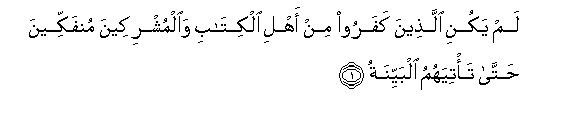
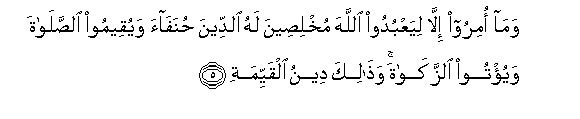
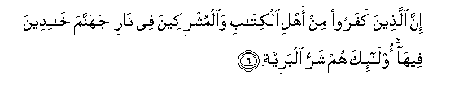
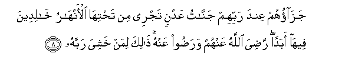

  
[Intangible Textual Heritage](../../index)  [Islam](../index) 
[Index](index)   
[Hypertext Qur'an](../htq/index)  [Unicode](../uq/098.htm#098_001) 
[Palmer](../sbe09/098)  [Pickthall](../pick/098.htm#098_001)  [Yusuf Ali
English](../yaq/yaq098)  [Rodwell](../qr/098)   
  
[Sūra XCVIII.: Baiyina, or The Clear Evidence. Index](098)  
  [Previous](09701)  [Next](09901) 

------------------------------------------------------------------------

  
*The Holy Quran*, tr. by Yusuf Ali, \[1934\], at Intangible Textual
Heritage

------------------------------------------------------------------------

# Sūra XCVIII.: Baiyina, or The Clear Evidence.

### Section 1

1. Lam yakuni alla<u>th</u>eena kafaroo min ahli alkit<u>a</u>bi
wa**a**lmushrikeena munfakkeena <u>h</u>att<u>a</u> ta/tiyahumu
albayyina**tu**

1\. Those who reject (Truth),  
Among the People of the Book  
And among the Polytheists,  
Were not going to depart  
(From their ways) until  
There should come to them  
Clear Evidence,—

------------------------------------------------------------------------

2. Rasoolun mina All<u>a</u>hi yatloo <u>s</u>u<u>h</u>ufan
mu<u>t</u>ahhara**tan**

2\. An apostle from God,  
Rehearsing scriptures  
Kept pure and holy:

------------------------------------------------------------------------

3. Feeh<u>a</u> kutubun qayyima**tun**

3\. Wherein are laws (or decrees)  
Right and straight.

------------------------------------------------------------------------

4. Wam<u>a</u> tafarraqa alla<u>th</u>eena ootoo alkit<u>a</u>ba
ill<u>a</u> min baAAdi m<u>a</u> j<u>a</u>at-humu albayyina**tu**

4\. Nor did the People  
Of the Book  
Make schisms,  
Until after there came  
To them Clear Evidence.

------------------------------------------------------------------------

5. Wam<u>a</u> omiroo ill<u>a</u> liyaAAbudoo All<u>a</u>ha
mukhli<u>s</u>eena lahu a**l**ddeena <u>h</u>unaf<u>a</u>a wayuqeemoo
a**l**<u>ss</u>al<u>a</u>ta wayu/too a**l**zzak<u>a</u>ta
wa<u>tha</u>lika deenu alqayyima**ti**

5\. And they have been commanded  
No more than this:  
To worship God,  
Offering Him sincere devotion,  
Being True (in faith);  
To establish regular Prayer;  
And to practise regular Charity;  
And that is the Religion  
Right and Straight.

------------------------------------------------------------------------

6. Inna alla<u>th</u>eena kafaroo min ahli alkit<u>a</u>bi
wa**a**lmushrikeena fee n<u>a</u>ri jahannama kh<u>a</u>lideena
feeh<u>a</u> ol<u>a</u>-ika hum sharru albariyya**ti**

6\. Those who reject (Truth),  
Among the People of the Book  
And among the Polytheists,  
Will be in hell-fire,  
To dwell therein (for aye).  
They are the worst  
Of creatures.

------------------------------------------------------------------------

7. Inna alla<u>th</u>eena <u>a</u>manoo waAAamiloo
a**l**<u>ssa</u>li<u>ha</u>ti ol<u>a</u>-ika hum khayru albariyya**ti**

7\. Those who have faith  
And do righteous deeds,—  
They are the best  
Of creatures.

------------------------------------------------------------------------

8. Jaz<u>a</u>ohum AAinda rabbihim jann<u>a</u>tu AAadnin tajree min
ta<u>h</u>tih<u>a</u> al-anh<u>a</u>ru kh<u>a</u>lideena feeh<u>a</u>
abadan ra<u>d</u>iya All<u>a</u>hu AAanhum wara<u>d</u>oo AAanhu
<u>tha</u>lika liman khashiya rabbah**u**

8\. Their reward is with God:  
Gardens of Eternity,  
Beneath which rivers flow;  
They will dwell therein  
For ever; God well pleased  
With them, and they with Him;  
All this for such as  
Fear their Lord and Cherisher.

------------------------------------------------------------------------

[Next: Section 1 (1-8)](09901)

