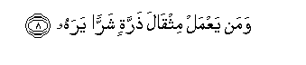

  
[Intangible Textual Heritage](../../index)  [Islam](../index) 
[Index](index)   
[Hypertext Qur'an](../htq/index)  [Unicode](../uq/099.htm#099_001) 
[Palmer](../sbe09/099)  [Pickthall](../pick/099.htm#099_001)  [Yusuf Ali
English](../yaq/yaq099)  [Rodwell](../qr/099)   
  
[Sūra XCIX.: Zilzāl, or The Convulsion. Index](099)  
  [Previous](09801)  [Next](10001) 

------------------------------------------------------------------------

  
*The Holy Quran*, tr. by Yusuf Ali, \[1934\], at Intangible Textual
Heritage

------------------------------------------------------------------------

# Sūra XCIX.: Zilzāl, or The Convulsion.

### Section 1

1. I<u>tha</u> zulzilati al-ar<u>d</u>u zilz<u>a</u>lah<u>a</u>

1\. When the Earth is  
Shaken to her (utmost)  
convulsion,

------------------------------------------------------------------------

2. Waakhrajati al-ar<u>d</u>u athq<u>a</u>lah<u>a</u>

2\. And the Earth throws up  
Her burdens (from within),

------------------------------------------------------------------------

3. Waq<u>a</u>la al-ins<u>a</u>nu m<u>a</u> lah<u>a</u>

3\. And man cries (distressed):  
"What is the matter with her?"—

------------------------------------------------------------------------

4. Yawma-i<u>th</u>in tu<u>h</u>addithu akhb<u>a</u>rah<u>a</u>

4\. On that Day will she  
Declare her tidings:

------------------------------------------------------------------------

5. Bi-anna rabbaka aw<u>ha</u> lah<u>a</u>

5\. For that thy Lord will  
Have given her inspiration,

------------------------------------------------------------------------

6. Yawma-i<u>th</u>in ya<u>s</u>duru a**l**nn<u>a</u>su asht<u>a</u>tan
liyuraw aAAm<u>a</u>lahum

6\. On that Day will men  
Proceed in companies sorted out,  
To be shown the Deeds  
That they (had done).

------------------------------------------------------------------------

7. Faman yaAAmal mithq<u>a</u>la <u>th</u>arratin khayran yarah**u**

7\. Then shall anyone who  
Has done an atom's weight  
Of good, see it!

------------------------------------------------------------------------

8. Waman yaAAmal mithq<u>a</u>la <u>th</u>arratin sharran yarah**u**  

8\. And anyone who  
Has done an atom's weight  
Of evil, shall see it.

------------------------------------------------------------------------

[Next: Section 1 (1-11)](10001)

