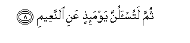

  
[Intangible Textual Heritage](../../index)  [Islam](../index) 
[Index](index)   
[Hypertext Qur'an](../htq/index)  [Unicode](../uq/102.htm#102_001) 
[Palmer](../sbe09/102)  [Pickthall](../pick/102.htm#102_001)  [Yusuf Ali
English](../yaq/yaq102)  [Rodwell](../qr/102)   
  
[Sūra CII.: Taka&lt;u&gt;th&lt;/u&gt;ur or Piling Up. Index](102)  
  [Previous](10101)  [Next](10301) 

------------------------------------------------------------------------

  
*The Holy Quran*, tr. by Yusuf Ali, \[1934\], at Intangible Textual
Heritage

------------------------------------------------------------------------

# Sūra CII.: Taka<u>th</u>ur or Piling Up.

### Section 1

1. Alh<u>a</u>kumu a**l**ttak<u>a</u>thur**u**

1\. The mutual rivalry  
For piling up (the good things  
Of this world) diverts you  
(From the more serious things),

------------------------------------------------------------------------

2. <u>H</u>att<u>a</u> zurtumu almaq<u>a</u>bir**a**

2\. Until ye visit the graves.

------------------------------------------------------------------------

3. Kall<u>a</u> sawfa taAAlamoon**a**

3\. But nay, ye soon shall  
Know (the reality).

------------------------------------------------------------------------

4. Thumma kall<u>a</u> sawfa taAAlamoon**a**

4\. Again, ye soon shall know!

------------------------------------------------------------------------

5. Kall<u>a</u> law taAAlamoona AAilma alyaqeen**i**

5\. Nay, were ye to know  
With certainty of mind,  
(Ye would beware!)

------------------------------------------------------------------------

6. Latarawunna alja<u>h</u>eem**a**

6\. Ye shall certainly see  
Hell-fire!

------------------------------------------------------------------------

7. Thumma latarawunnah<u>a</u> AAayna alyaqeen**i**

7\. Again, ye shall see it  
With certainty of sight!

------------------------------------------------------------------------

8. Thumma latus-alunna yawma-i<u>th</u>in AAani a**l**nnaAAeem**i**

8\. Then, shall ye be  
Questioned that Day  
About the joy  
(Ye indulged in!)

------------------------------------------------------------------------

[Next: Section 1 (1-3)](10301)

