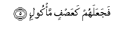

  
[Intangible Textual Heritage](../../index)  [Islam](../index) 
[Index](index)   
[Hypertext Qur'an](../htq/index)  [Unicode](../uq/105.htm#105_001) 
[Palmer](../sbe09/105)  [Pickthall](../pick/105.htm#105_001)  [Yusuf Ali
English](../yaq/yaq105)  [Rodwell](../qr/105)   
  
[Sūra CV.: Fīl, or The Elephant. Index](105)  
  [Previous](10401)  [Next](10601) 

------------------------------------------------------------------------

  
*The Holy Quran*, tr. by Yusuf Ali, \[1934\], at Intangible Textual
Heritage

------------------------------------------------------------------------

# Sūra CV.: Fīl, or The Elephant.

### Section 1

1. Alam tara kayfa faAAala rabbuka bi-a<u>s</u>-<u>ha</u>bi alfeel**i**

1\. Seest thou not  
How thy Lord dealt  
With the Companions  
Of the Elephant?

------------------------------------------------------------------------

2. Alam yajAAal kaydahum fee ta<u>d</u>leel**in**

2\. Did He not make  
Their treacherous plan  
Go astray?

------------------------------------------------------------------------

3. Waarsala AAalayhim <u>t</u>ayran ab<u>a</u>beel**a**

3\. And He sent against them  
Flights of Birds,

------------------------------------------------------------------------

4. Tarmeehim bi<u>h</u>ij<u>a</u>ratin min sijjeel**in**

4\. Striking them with stones  
Of baked clay.

------------------------------------------------------------------------

5. FajaAAalahum kaAAa<u>s</u>fin ma/kool**in**

5\. Then did He make them  
Like an empty field  
Of stalks and straw,  
(Of which the corn)  
Has been eaten up.

------------------------------------------------------------------------

[Next: Section 1 (1-4)](10601)

