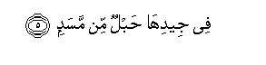

  
[Intangible Textual Heritage](../../index)  [Islam](../index) 
[Index](index)   
[Hypertext Qur'an](../htq/index)  [Unicode](../uq/111.htm#111_001) 
[Palmer](../sbe09/111)  [Pickthall](../pick/111.htm#111_001)  [Yusuf Ali
English](../yaq/yaq111)  [Rodwell](../qr/111)   
  
[Sūra CXI.: Lahab, or (the Father of) Flame. Index](111)  
  [Previous](11001)  [Next](11201) 

------------------------------------------------------------------------

  
*The Holy Quran*, tr. by Yusuf Ali, \[1934\], at Intangible Textual
Heritage

------------------------------------------------------------------------

# Sūra CXI.: Lahab, or (the Father of) Flame.

### Section 1

1. Tabbat yad<u>a</u> abee lahabin watab**ba**

1\. Perish the hands  
Of the Father of Flame!  
Perish he!

------------------------------------------------------------------------

2. M<u>a</u> aghn<u>a</u> AAanhu m<u>a</u>luhu wam<u>a</u> kasab**a**

2\. No profit to him  
From all his wealth,  
And all his gains!

------------------------------------------------------------------------

3. Saya<u>s</u>l<u>a</u> n<u>a</u>ran <u>tha</u>ta lahab**in**

3\. Burnt soon will he be  
In a Fire  
Of blazing Flame!

------------------------------------------------------------------------

4. Wa**i**mraatuhu <u>h</u>amm<u>a</u>lata al<u>h</u>a<u>t</u>ab**i**

4\. His wife shall carry  
The (crackling) wood—  
As fuel!—

------------------------------------------------------------------------

5. Fee jeedih<u>a</u> <u>h</u>ablun min masad**in**

5\. A twisted rope  
Of palm-leaf fibre  
Round her (own) neck!

------------------------------------------------------------------------

[Next: Section 1 (1-4)](11201)

