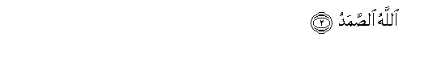
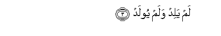
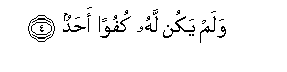

  
[Intangible Textual Heritage](../../index)  [Islam](../index.md) 
[Index](index.md)   
[Hypertext Qur'an](../htq/index)  [Unicode](../uq/112.htm#112_001.md) 
[Palmer](../sbe09/112)  [Pickthall](../pick/112.htm#112_001.md)  [Yusuf Ali
English](../yaq/yaq112)  [Rodwell](../qr/112.md)   
  
[Sūra CXII.: I&lt;u&gt;kh&lt;/u&gt;lāṣ, or Purity (of Faith).
Index](112.md)  
  [Previous](11101)  [Next](11301.md) 

------------------------------------------------------------------------

  
*The Holy Quran*, tr. by Yusuf Ali, \[1934\], at Intangible Textual
Heritage

------------------------------------------------------------------------

# Sūra CXII.: I<u>kh</u>lāṣ, or Purity (of Faith).

### Section 1

1. Qul huwa All<u>a</u>hu a<u>h</u>ad**un**

1\. Say: He is God,  
The One and Only;

------------------------------------------------------------------------

2. All<u>a</u>hu a**l**<u>ss</u>amad**u**

2\. God, the Eternal, Absolute;

------------------------------------------------------------------------

3. Lam yalid walam yoolad**u**

3\. He begetteth not,  
Nor is He begotten;

------------------------------------------------------------------------

4. Walam yakun lahu kufuwan a<u>h</u>ad**un**  

4\. And there is none  
Like unto Him.

------------------------------------------------------------------------

[Next: Section 1 (1-5)](11301.md)

