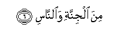

  
[Intangible Textual Heritage](../../index)  [Islam](../index.md) 
[Index](index.md)   
[Hypertext Qur'an](../htq/index)  [Unicode](../uq/114.htm#114_001.md) 
[Palmer](../sbe09/114)  [Pickthall](../pick/114.htm#114_001.md)  [Yusuf Ali
English](../yaq/yaq114)  [Rodwell](../qr/114.md)   
  
[Sūra CXIV.: Nās, or Mankind. Index](114.md)  
  [Previous](11301.md) 

------------------------------------------------------------------------

  
*The Holy Quran*, tr. by Yusuf Ali, \[1934\], at Intangible Textual
Heritage

------------------------------------------------------------------------

# Sūra CXIV.: Nās, or Mankind.

### Section 1

1. Qul aAAoo<u>th</u>u birabbi a**l**nn<u>a</u>s**i**

1\. Say: I seek refuge  
With the Lord  
And Cherisher of Mankind,

------------------------------------------------------------------------

2. Maliki a**l**nn<u>a</u>s**i**

2\. The King (or Ruler)  
Of Mankind,

------------------------------------------------------------------------

3. Il<u>a</u>hi a**l**nn<u>a</u>s**i**

3\. The God (or Judge)  
Of Mankind,—

------------------------------------------------------------------------

4. Min sharri alwasw<u>a</u>si alkhann<u>a</u>s**i**

4\. From the mischief  
Of the Whisperer  
(Of Evil), who withdraws  
(After his whisper),—

------------------------------------------------------------------------

5. Alla<u>th</u>ee yuwaswisu fee <u>s</u>udoori a**l**nn<u>a</u>s**i**

5\. (The same) who whispers  
Into the hearts of Mankind,—

------------------------------------------------------------------------

6. Mina aljinnati wa**al**nn<u>a</u>s**i**

6\. Among Jinns  
And among Men.  
   
   
 
