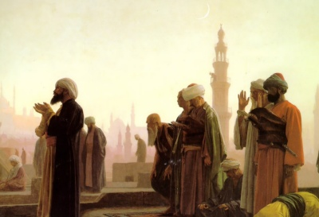

  
[Intangible Textual Heritage](../../index)  [Islam](../index.md) 

------------------------------------------------------------------------

[Buy this Book at
Amazon.com](https://www.amazon.com/exec/obidos/ASIN/B00295RH82/internetsacredte.md)

------------------------------------------------------------------------

<table width="75%">
<colgroup>
<col style="width: 50%" />
<col style="width: 50%" />
</colgroup>
<tbody>
<tr class="odd">
<td width="50%" data-valign="TOP"></td>
<td width="50%" data-valign="CENTER"><h1 id="the-religion-of-the-koran" data-align="CENTER">The Religion of the Koran</h1>
<h2 id="by-arthur-n.-wollaston" data-align="CENTER">by Arthur N. Wollaston</h2>
<h4 id="section" data-align="CENTER">[1911]</h4></td>
</tr>
</tbody>
</table>

------------------------------------------------------------------------

[Contents](#contents)    [Start Reading](rok00.md)    [Page
Index](pageidx)    [Text \[Zipped\]](rok.txt.gz.md)

------------------------------------------------------------------------

|                                                                                                                           |
|---------------------------------------------------------------------------------------------------------------------------|
|  |

This short entry in the Wisdom of the East series includes a short
introduction to Islam, and a set of topical quotations from the
[Palmer](../sbe06/index.md) translation of the Qur'an. The author was an
English academic sympathetic to Islam who was writing at the turn of the
20th century, and this should be kept in mind while reading this.

------------------------------------------------------------------------

 [Title Page](rok00.md)  
[Contents](rok01.md)  
[Editorial Note](rok02.md)  
[Introduction](rok03.md)  
[Extracts From the Koran](rok04.md)  
[Unity of God](rok05.md)  
[Muhammad the Apostle of God](rok06.md)  
[Resurrection](rok07.md)  
[Hell](rok08.md)  
[Paradise](rok09.md)  
[Genii or Jinns](rok10.md)  
[Angels](rok11.md)  
[The Devil](rok12.md)  
[Predestination](rok13.md)  
[Prayer](rok14.md)  
[Almsgiving](rok15.md)  
[Fasting](rok16.md)  
[Pilgrimage to Mecca](rok17.md)  
[Wine, Gaming, Foods, and Usury, Infanticide, Ill-Treatment of
Orphans](rok18.md)  
[Marriage and Divorce](rok19.md)  
[Proselytism](rok20.md)  
[Advertisements](rok21.md)  
