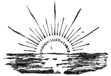

  
[Intangible Textual Heritage](../../index)  [Islam](../index) 
[Index](index)  [Next](rok01) 

------------------------------------------------------------------------

[Buy this Book at
Amazon.com](https://www.amazon.com/exec/obidos/ASIN/B00295RH82/internetsacredte)

------------------------------------------------------------------------

  
*The Religion of the Koran*, by Arthur N. Wollaston, \[1911\], at
Intangible Textual Heritage

------------------------------------------------------------------------

p. 1 p. 2

**The Wisdom of the East Series**

Edited By  
L. Cranmer-Byng  
Dr. S. A. Kapadia

p. 3

### THE RELIGION OF THE KORAN

p. 4 p. 5

WISDOM OF THE EAST

# THE RELIGION OF THE KORAN

## BY ARTHUR N. WOLLASTON K. C .I. E.

##### THIRD IMPRESSION

 

#### LONDON

#### JOHN MURRAY, ALBEMARLE STREET

#### \[1911\]

Scanned, proofed and formatted at Intangible Textual Heritage, November
2008. This text is in the public domain because it was published prior
to 1923.

  [  
Click to enlarge](img/cover.jpg)  
Front Cover and Spine  

p. 6

PRINTED BY  
HAZELL, WATSON AND VINEY, LD.,  
LONDON AND AYLESBURY.

------------------------------------------------------------------------

[Next: Contents](rok01)
