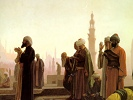

  
[Intangible Textual Heritage](../../index)  [Islam](../index) 
[Index](index)  [Previous](rok16)  [Next](rok18) 

------------------------------------------------------------------------

[Buy this Book at
Amazon.com](https://www.amazon.com/exec/obidos/ASIN/B00295RH82/internetsacredte)

------------------------------------------------------------------------

  
*The Religion of the Koran*, by Arthur N. Wollaston, \[1911\], at
Intangible Textual Heritage

------------------------------------------------------------------------

p. 62

### PILGRIMAGE TO MECCA

CHAPTER II., Verse 192.—And fulfil the pilgrimage and the visitation to
God; but if ye be besieged, then what is easiest for you by way of gift.
But shave not your heads until your gift shall reach its destination;
and he amongst you who is sick or has a hurt upon his head, then the
redemption is by fasting, or by alms, or by an offering. But when ye are
safe again, then let him who would enjoy the visitation until the
pilgrimage (bring) what is easiest as a gift. And he who cannot find
(anything to bring), then let him fast three days on the pilgrimage and
seven when ye return; these make ten days complete. That is, for him
whose family are not present in the sacred mosque; and fear God, and
know that God is keen to punish.

Chapter III., Verse 90.—Verily, the first house founded for men was
surely that at Bekkah, for a blessing and a guidance to the worlds.
Therein are manifest signs,—Abraham's station, and whosoever enters in
is safe. There is due to God from man a pilgrimage unto the House, for
whosoever can find his way there. But whoso misbelieves—God is
independent of the worlds.

Chapter XXII., Verse 25.—Verily, those who

p. 63

misbelieve and who turn men away from God's path and the sacred mosque,
which we have made for all men alike, the dweller therein, and the
stranger, and he who desires therein profanation with injustice, we will
make him taste grievous woe.

And when we established for Abraham the place of the House (saying),
"Associate naught with Me, but cleanse My House for those who make the
circuits, for those who stand to pray; for those who bow, and for those
too who adore.

"And proclaim amongst men the Pilgrimage, let them come to you on foot
and on every slim camel, from every deep pass, that they may witness
advantages for them, and may mention the name of God for the stated days
over what God has provided them with of brute beasts, then eat thereof
and feed the badly off, the poor.

(30).—"Then let them finish the neglect of their persons, and let them
pay their vows and make the circuit round the old House.

"That do, And whoso magnifies the sacred things of God, it is better for
him with his Lord."

------------------------------------------------------------------------

[Next: Wine, Gaming, Foods, and Usury, Infanticide, Ill-Treatment of
Orphans](rok18)
