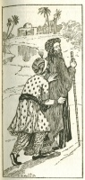

  
[Intangible Textual Heritage](../../index)  [Islam](../index.md) 
[Index](index)  [Previous](saab06)  [Next](saab08.md) 

------------------------------------------------------------------------

  
*Salaman and Absal*, by Jami, tr. Edward Fitzgerald, \[1904\], at
Intangible Textual Heritage

------------------------------------------------------------------------

p. 10

### V.

One Night The Shah of Yúnan, as his
wont,  
Consider’d of his Power, and told his State,  
How great it was, and how about him sat  
The Robe of Honour of Prosperity;  
Then found he nothing wanted to his Heart,  
Unless a Son, who his Dominion  
And Glory might inherit after him.  
And then he turn’d him to The Shah, and
said;  
"Oh Thou, whose Wisdom is the Rule of Kings—  
"(Glory to God who gave it!)—answer me;  
"Is any Blessing better than a Son?  
"Man's prime Desire; by which his Name and He  
"Shall live beyond Himself; by whom his Eyes  
"Shine living, and his Dust with Roses blows;  
"A Foot for Thee to stand on, he shall be  
"A Hand to stop thy Falling; in his Youth  
"Thou shalt be Young, and in his Strength be Strong;  
"Sharp shall he be in Battle as a Sword,  
"A Cloud of Arrows on the Enemy's Head;  
"His Voice shall cheer his Friends to "Plight,  
"And turn the Foeman's Glory into Flight."

p. 11

Thus much of a Good Son, whose wholesome Growth  
Approves the Root he grew from; but for one  
Kneaded of Evil—Well, could one undo  
His Generation, and as early pull  
Hint and his Vices from the String of Time.  
Like Noah's, puff’d with Ignorance and Pride,  
Who felt the Stab of "He is none of
Thine!"  
And perish’d in the Deluge. And because  
All are not Good, be slow to pray for One,  
Whom having you may have to pray to lose.

Crazy for the Curse of Children,  
Ran before the Sheikh a Fellow,  
Crying out, "Oh hear and help me!  
"Pray to Allah from my Clay  
"To raise me up a fresh young Cypress,  
"Who my Childless Eyes may lighten  
"With the Beauty of his Presence."  
Said the Sheikh, "Be wise, and leave it  
"Wholly in the Hand of Allah,  
"Who, whatever we are after,  
"Understands our Business best."  
But the Man persisted, saying,  
"Sheikh, I languish in my Longing;  
"Help, and set my Prayer a-going!"  
Then the Sheikh held up his Hand—  
Pray’d—his Arrow flew to Heaven—  
From the Hunting-ground of Darkness  
Down a musky Fawn of China  
Brought—a Boy—who, when the Tender  
Shoot of Passion in him planted  
Found sufficient Soil and Sap,  
Took to Drinking with his Fellows;  
From a Corner of the House-top

p. 12

Ill affronts a Neighbour's Wife,  
Draws his Dagger on the Husband,  
Who complains before the Justice,  
And the Father has to pay.  
Day and Night the Youngster's Doings  
Such—the Talk of all the City;  
Nor Entreaty, Threat, or Counsel  
Held him; till the Desperate Father  
Once more to the Sheikh a-running,  
Catches at his Garment, crying—  
"Sheikh, my only Hope and Helper!  
"One more Prayer! that God who laid  
"Will take that Trouble from my Head!"  
But the Sheikh replied: "Remember  
"How that very Day I warn’d you  
"Better not importune Allah;  
"Unto whom remains no other  
"Prayer, unless to pray for Pardon.  
"When from this World we are summon’d  
"On to bind the pack of Travel  
"Son or Daughter ill shall help us;  
"Slaves we are, and unencumber’d  
"Best may do the Master's mind;  
"And, whatever he may order,  
"Do it with a Will Resign’d."

  [  
Click to enlarge](img/01200.jpg.md)

------------------------------------------------------------------------

[Next: VI](saab08.md)
