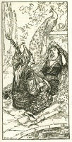

  
[Intangible Textual Heritage](../../index)  [Islam](../index.md) 
[Index](index)  [Previous](saab20)  [Next](saab22.md) 

------------------------------------------------------------------------

  
*Salaman and Absal*, by Jami, tr. Edward Fitzgerald, \[1904\], at
Intangible Textual Heritage

------------------------------------------------------------------------

p. 32

### XIX.

Six days Salámán on the Camel rode,  
And then Remembrance of foregone Reproach  
Abode not by him; and upon the Seventh  
He halted on the Seashore, and beheld  
An Ocean boundless as the Heaven above,  
That, reaching its Circumference from Káf  
To Káf, down to the Back of Gau and Mani  
Descended, and its Stars were Creatures’ Eyes.  
The Face of it was as it were a Range  
Of moving Mountains; or as endless Hosts  
Of Camels trooping from all Quarters up,  
Furious, with the Foam upon their Lips.  
In it innumerable glittering Fish  
Like Jewels polish-sharp, to the sharp Eye  
But for an Instant visible, glancing through  
As Silver Scissors slice a blue Brocade;  
Though were the Dragon from its Hollow roused,  
The Dragon of the Stars would stare
Aghast.  
Salámán eyed the Sea, and cast about  
To cross it—and forthwith upon the Shore  
Devis’d a Shallop like a Crescent Moon,  
Wherein that Sun and Moon in happy Hour  
Enter’d as into some Celestial Sign;  
That, figured like a Bow, but Arrow-like  
In Flight, was feather’d with a little Sail,  
And, pitcht upon the Water like a Duck,  
So with her Bosom sped to her Desire.

p. 33

When they had sail’d their Vessel for a Moon,  
And marr’d their Beauty with the wind o’ th’ Sea,  
Suddenly in mid Sea reveal’d itself  
An Isle, beyond Description beautiful;  
An Isle that all was Garden; not a Bird  
Of Note or Plume in all the World but there;  
There as in Bridal Retinue array’d  
The Pheasant in his Crown, the Dove in her Collar;  
And those who tuned their Bills among the Trees  
That Arm in Arm from Fingers paralyz’d  
With any Breath of Air Fruit moist and dry  
Down scatter’d in Profusion to their Feet,  
Where Fountains of Sweet Water ran, and round  
Sunshine and Shadow chequer-chased the Ground.  
Here Iram Garden seem’d in Secresy  
Blowing the Rosebud of its Revelation;  
Or Paradise, forgetful of the Day  
Of Audit, lifted from her Face the Veil.

Salámán saw the Isle, and thought no
more  
Of Further—there with Absál, he sat
down,  
Absál and He together side by side  
Rejoicing like the Lily and the Rose,  
Together like the Body and the Soul.  
Under its Trees in one another's Arms  
They slept—they drank its Fountains hand in hand—

p. 34

Sought Sugar with the Parrot—or in Sport  
Paraded with the Peacock—raced the Partridge  
Or fell a-talking with the Nightingale.  
There was the Rose without a Thorn, and there  
The Treasure and no Serpent to beware—  
What sweeter than your Mistress at your side  
In such a Solitude, and none to Chide!

Whisper’d one to Wámik—"Oh Thou  
"Victim of the Wound of Azra,  
"What is it that like a Shadow  
"Movest thou about in Silence  
"Meditating Night and Day?  
Wámik answer’d, "Even this—  
"To fly with Azra to the Desert;  
"There by so remote a Fountain  
"That, whichever way one travell’d  
"League on League, one yet should never,  
"Never meet the Face of Man—  
"There to pitch my Tent—for ever  
"There to gaze on my Belovéd;  
"Gaze, till Gazing out of Gazing  
"Grew to Being Her I gaze on,  
"She and I no more, but in One  
"Undivided Being blended.  
"All that is not One must ever  
"Suffer with the Wound of Absence;  
"And whoever in Love's City  
"Enters, finds but Room for One,  
"And but in Oneness Union."

  [  
Click to enlarge](img/03400.jpg.md)

------------------------------------------------------------------------

[Next: XX](saab22.md)
