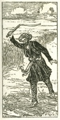

  
[Intangible Textual Heritage](../../index)  [Islam](../index) 
[Index](index)  [Previous](saab23)  [Next](saab25) 

------------------------------------------------------------------------

  
*Salaman and Absal*, by Jami, tr. Edward Fitzgerald, \[1904\], at
Intangible Textual Heritage

------------------------------------------------------------------------

### XXII.

When The Shah saw Salámán's face again,  
And breath’d the Breath of Reconciliation,  
He laid the Hand of Love upon his Shoulder,

p. 38

The Kiss of Welcome on his Cheek, and said,  
"Oh Thou, who lost, Love's Banquet lost its Salt,  
"And Mankind's Eye its Pupil!—Thy Return  
"Is as another Sun to Heaven; a new  
"Rose blooming in the Garden of the Soul.  
"Arise, Oh Moon of Majesty unwaned!  
"The Court of the Horizon is thy Court,  
"Thy Kingdom is the Kingdom of the World!—  
"Lo! Throne and Crown await Thee—Throne and Crown  
"Without thy Impress but uncurrent Gold,  
"Not to be stamp’d by one not worthy Them;  
"Behold! The Rebel's Face is at thy Door;  
"Let him not triumph—let the Wicked dread  
"The Throne under thy Feet, the Crown upon thy Head.  
"Oh Spurn them not behind Thee! Oh my Son,  
"Wipe Thou the Woman's Henna from thy Hand:  
"Withdraw Thee from the Minion who from Thee  
"Dominion draws; the Time is come to choose,  
"Thy Mistress or the World to hold or lose."

  [  
Click to enlarge](img/03800.jpg)

p. 39

Four are the Signs of Kingly Aptitude;  
Wise Head—clean Heart—strong Arm —and open Hand.  
Wise is He not—Continent cannot be—  
Who binds himself to an unworthy Lust;  
Nor Valiant, who submits to a weak Woman;  
Nor Liberal, who cannot draw his Hand  
From that in which so basely he is busied.  
And of these Four who misses All or One  
Is not the Bridegroom of Dominion.

------------------------------------------------------------------------

[Next: XXIII](saab25)
