  
[Intangible Textual Heritage](../../index)  [Islam](../index) 
[Index](index)  [Previous](siim00)  [Next](siim02) 

------------------------------------------------------------------------

[Buy this Book at
Amazon.com](https://www.amazon.com/exec/obidos/ASIN/0548805903/internetsacredte)

------------------------------------------------------------------------

  
*Studies in Islamic Mysticism*, by Reynold A. Nicholson, \[1921\], at
Intangible Textual Heritage

------------------------------------------------------------------------

p. v

### PREFACE

As was explained in the preface to my *Studies in Islamic Poetry*, the
following essays conclude a series of five, which fall into two groups
and are therefore published in separate volumes. While mysticism, save
for a few casual references, found no place in the studies on the
Lubádbu ’l-Albáb of ‘Awfí and the *Luzúmiyyát* of Abú ’l-‘Alá
al-Ma‘arrí, in these now brought together it has taken entire possession
of the field. Ibnu ’l-Fáriḍ, indeed, is an exquisite poet; and the
picture of Abú Sa‘íd ibn Abi ’l-Khayr, drawn by pious faith and coloured
with legendary romance, may be looked upon as a work of art in its way.
But on the whole the literary interest of the present volume is
subordinate to the religious and philosophical. I have tried to make the
reader acquainted with three Ṣúfís famous in the East and worthy of
being known in Europe. Most of what has hitherto been written concerning
Abú Sa‘íd begins and ends with the quatrains passing as his, though (for
the chief part, at any rate) they were neither composed nor recited by
him. As to Jílí, the masterly sketch in Dr Muḥammad Iqbál's *Development
of Metaphysics in Persia* stands almost alone. Ibnu ’l-Fáriḍ had the
misfortune to be translated by Von Hammer, and the first intelligent or
intelligible version of his great *Tá’iyya* appeared in Italy four years
ago. It will be seen that the subjects chosen illustrate different
aspects of Ṣúfisim and exhibit racial contrasts, of which perhaps the
importance has not yet been sufficiently recognised. Abú Sa‘íd, the
free-thinking free-living dervish, is a Persian through and through,
while Ibnu ’l-Fáriḍ in the form of his poetry as well as in the
individuality of his spiritual enthusiasm displays the narrower and
tenser genius of the Semite. Nearly a third of this volume is concerned
with a type of Ṣúfisim, which—

p. vi

as represented by Ibnu ’l-‘Arabí and Jílí—possesses great interest for
students of medieval thought and may even claim a certain significance
in relation to modern philosophical and theological problems. Mysticism
is such a vital element in Islam that without some understanding of its
ideas and of the forms which they assume we should seek in vain to
penetrate below the surface of Mohammedan religious life. The forms may
be fantastic and the ideas difficult to grasp; nevertheless we shall do
well to follow them, for in their company East and West often meet and
feel themselves akin.

I regret that I have not been able to make full use of several books and
articles published during the final stages of the war or soon
afterwards, which only came into my hands when these studies were
already in the press. Tor Andrae's *Die person Muhammeds in lehre and
glauben seiner gemeinde* (Upsala, 1917) contains by far the best survey
that has yet appeared of the sources, historical evolution and general
characteristics of the Mohammedan Logos doctrine. This, as I have said,
is the real subject of the *Insánu ’l-Kámil*. Its roots lie, of course,
in Hellenism. Andrae shows how the notion of the θεῖος ἄνθρωπος passed
over into Islam through the Shí‘ites and became embodied in the Imám,
regarded as the living representative of God and as a semi-divine
personality on whom the world depends for its existence. Many Shí‘ites
were in close touch with Ṣúfisim, and there can be no doubt that, as Ibn
Khaldún observed, the Shí‘ite Imám is the prototype of the Ṣúfistic
*Quṭb*. It was inevitable that the attributes of the Imám and *Quṭb*
should be transferred to the Prophet, so that even amongst orthodox
Moslems the belief in his pre-existence rapidly gained ground.
Particularly instructive to students of the *Insánu ’l-Kámil* is
Andrae's account of the Logos doctrine of Ibnu ’l-‘Arabí, whose
influence is manifest in every page that Jílí wrote. In this connexion
another book by another Swedish scholar—H. S. Nyberg's *Kleinere
Schriften des Ibn al-‘Arabī* (Leiden, 1919)—provides new and valuable
material. The introduction, to which I have now and then referred in the
footnotes, not only elucidates the mystical philosophy of the *Insánu
’l-Kámil*

p. vii

but enables us to trace in detail the indebtedness of Jílí to his great
predecessor. In the 16th and 17th centuries the *Insánu ’l-Kámil*
exerted a powerful influence upon Indonesian Ṣúfisim, which has been
studied by the Dutch Orientalists D. A. Rinkes, B. J. O. Schrieke, and
H. Kraemer. I should like to call attention to the account given by the
last-named scholar in *Een Javaansche primbon uit de zestiende eeuw*
(Leiden, 1921), p. 40 foll. and p. 83 foll.

Some months after my work had gone to the press, I received from Prof.
C. A. Nallino an off-print of his article *Il poema mistico arabo d’Ibn
al-Fāriḍ in una recente traduzione italiana* [1](#fn_0), from which I learned that a prose
translation by Sac. Ignazio Di Matteo of Ibnu ’l-Fáriḍ's most celebrated
ode, the *Tá’iyyatu ’l-Kubrá*, had been published in 1917 at Rome. As
this book was reproduced in autograph for private circulation, it would
have been inaccessible to me, if the author had not kindly presented me
with a copy. He replied to Nallino in a paper entitled *Sulla mia
interpretazione del poema mistico d’Ibn al-Fāriḍ* (*RDSO*., 1920, vol.
VIII. 479-500), which was immediately followed by a second article from
Nallino, *Ancora su Ibn al-Fāriḍ e sulla mistica musulmana* (*ibid*.
vol. VIII. 501-562). Having myself attempted to translate the *Tá’iyya*,
I am impressed with the merit of Di Matteo's version rather than
inclined to dwell on its faults. He has given us, for the first time, a
careful and tolerably correct rendering of the original; and that is no
slight achievement. The articles by Nallino, which include a critical
examination of numerous passages in the poem, are the most important
contribution that any European Orientalist has so far made to the study
of Ibnu ’l-Fáriḍ. In an essay consisting largely of translations, I
could but indicate (pp. [193](siim17.htm#page_193)-5 *infra*) my views
on the main question which he has discussed in his friendly controversy
with Di Matteo. To him, as to me, it seems clear that the view put
forward by Di Matteo is erroneous. Neither the form nor the substance of
the *Tá’iyya* suggests that it was inspired by Ibnu ’l-‘Arabí, though
some traces of his influence may perhaps be found in

p. viii

it [1](#fn_1). It differs in kind from poems
indubitably so inspired, such as the *‘Ayniyya* of Jílí. Above all, it
is a mystic's autobiography, a poet's description of his inner life, and
the terms which it employs belong to the psychological vocabulary of
Ṣúfisim, with few exceptions. I have no quarrel with those who call Ibnu
’l-Fáriḍ a pantheist; but his pantheism (unlike that of his
commentators) is essentially a state of feeling, not a system of
thought. The poem, however, requires explanation, and I do not think it
can be interpreted without reference to the corresponding philosophical
doctrine. In other words, if we are to elicit any definite meaning from
the symbols which shadow forth a consciousness of mystical union, we
must somehow connect them with metaphysical propositions. But although
mysticism is not an allegory, still less is it a theology or philosophy.
Hence the sayings of "God-intoxicated" men will not serve as a sure
criterion of their attitude towards religion. Moslems themselves, as a
rule, want better evidence of heresy than this.

I desire to express my gratitude to Prof. C. A. Nallino and Sac. Ignazio
Di Matteo for their gifts of books and for the courtesy which
accompanied them; to Mr A. G. Ellis for the loan of his copy of the
*Insánu ’l-Kámil*; and to the authorities of the India Office Library
for placing at my disposal the manuscripts mentioned on [p.
77](siim07.htm#page_77) *infra*. Especial thanks are due to Mr Rhuvon
Guest, who most generously sent me his unpublished translation of the
*Tá’iyya* of Ibnu ’l-Fáriḍ and allowed me to use it for the purpose of
correcting and improving my own, before the latter was in print. Mr
Guest's version, while keeping very close to the original, is thoughtful
and judicious, and I found it of great service in dealing with passages
which to me seemed obscure. If I have sometimes preferred my
interpretation to his, he has at least as often

p. ix

convinced me that his was more likely to be the right one. Besides
thanking the scholars who have helped me in the second part of these
studies, I wish to acknowledge the appreciative criticism which the
first volume has received. Both Nöldeke and Goldziher have declared
their agreement with the view there taken of the character of Ma‘arrí.
The remarks of my old teacher, Prof. Nöldeke, are so interesting that I
cannot refrain from quoting them:

In der Gesammtauffassung des Dichters und Denkers
muss ich Ihnen durchweg beistimmen. Zunächst darin, dass M. kein Muslim
mehr war, sondern als einzigen, allerdings festen Punct aus der
religiösen Ueberlieferung das Vorhandensein eines allmächtigen Gottes
behielt, der in seiner Willkür so ziemlich dem koranischen glich. Dabei
halte ich es immerhin für möglich, dass M. hie und da auch sonst an
Einzelheiten der Lehre Muhammeds festhielt, je nach verschiedenen Zeiten
und Stimmungen. Dass die Widersprüche innerhalb der Sammlung nicht alle
auf absichtliche Täuschung herauskommen, möchte ich damit betonen.
Welche Weltanschauung und welche Dogmatik ist ohne innere Widersprüche?
Das christliche Dogma habe ich hier vor Allem im Auge; ich meine die
Dogmatik aller christlichen Confessionen. …Was man auch an M. aussetzen
mag, man muss vor seiner Selbständigkeit doch die grösste Achtung haben.
Wie eigen berühren uns nr. 117-119, worin die Fürsten als Diener und
Besoldete des Volkes erscheinen, bei einem Orientalen! (Friedrich der
Grosse dachte wenigstens *theoretisch* auch so.) So fern uns oder mir
(da ich mich doch als strenger Rationalist ihm verwandt fühle) seine
übertriebene Askese liegt, die z. B. nicht berücksichtigt, dass "Die
grossen Fische fressen stets die kleinen," dass die Singvögel
grösstenteils von Insecten leben und dazu, dass wir Menschen von den
Tieren direct oder indirect aufgefressen würden, wenn wir sie nicht
vielfach töteten, so muss man doch auch in der Hinsicht vor ihm Achtung
haben. Wenn er den Wein verabscheut, so muss man bedenken, dass dieser
damals wie jetzt (namentlich bei den Persern) ganz besonders dazu
diente, rasch sinnlos betrunken zu werden (cfr. Gen. xliii. 34,
‏וישכרו‎). Der Standpunct war also vernünftiger als der der
americanischen Gesetzgebung, die das Kind mit dem Bade ausschüttet. Wie
verständig ist M. auch darin, das er nicht an dem fast zum Dogma der
islamischen Ueberlieferung gewordenen Satze festhielt, dass die Menschen
in früheren Zeiten besser gewesen wären als die Zeitgenossen (nr. 162, 4
als zweifelhaft, 146, 3 bestimmt ausgesprochen)! Vermutlich wollte er
damit besonders den Vorzug der "Genossen des Propheten" treffen.

p. x

Prof. Nöldeke laid me under a further obligation by reading the text of
the pieces selected from the *Luzúmiyyát* and proposing a number of
emendations. These are given below, together with some which I owe to
the kindness of Prof. Bevan. Misprints are included, and the English
version has been corrected in a few places where, as Prof. Bevan pointed
out, the original was mistranslated or not fully understood.

P. 66, No. 20, first line. *Read*

  "Ah, let us go, whom nature joined of old in friendship fast."

P. 79, No. 52, eighth line. *Read*

  "With blackness of stony wastes, parched desolate highlands."

P. 101, note 4. "The dark raiment" (
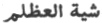) refers to Death. "Er (Abú Muslim) hatte der
Dynastie treu gedient: darauf bekleidete die ihn mit der Farbe der
Finsterniss" (N.).

P. 109, No. 124. Although I have deliberately rendered  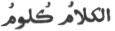 by "words are wounds," that
rendering gives too wide an application to the Arabic phrase. As the
context shows,  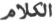 has
here its technical meaning and refers to the dialectic of the
*mutakallimún* (scholastic theologians).

P. 116, No. 144, lines 5-6. *Read*

"Be just and live on earth what can?  
And none is more unjust than Man."

In the original,  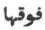
stands for  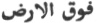 (B.).

P. 121, No. 163, third line. Read

"Thou deem’st thy being here calamity."

P. 123, No. 171, third line. Read

"If nonsense be all the coin we exchange, then better."

P. 132, No. 192, last line. Read

"To succour, and shall surpass in excellence Ḥájib's bow."

Note 2 should be deleted. For "Ḥájib's bow" see *Naqá’iḍ*, 462 (B.).

P. 141, seventh line from foot. By an oversight, "Jáḥiẓ" has been
written instead of "Abú ‘Abdallah al-Khwárizmí."

P. 145, note 1. The animal called by the Arabs  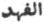 and by the Persians  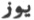 is not the lynx but, as
Prof. Nöldeke reminds me, the hunting-leopard (cynaelurus), commonly
known in Europe as the cheetah.

P. 157, note 2, last line. *Read* 
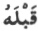 *for* 
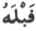.

P. 165, note 2, first line. *Read* 
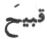 *for* 
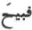.

P. 167, No. 240, first verse. *Read*

"Say to wine, which is a foe to (men's) understandings, ever drawing
against them the swords of a warrior."

p. xi

Nöldeke writes: "240, 1 ist 
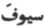 doch wohl richtig, da 
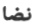 schwerlich als Intransitiv gebraucht werden kann.
 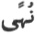 *wird* als Fem.
gebraucht, Ibn Qotaiba, *‘Uyūn*, 277, 2, wie es ja regelrechter Plural
von  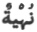 ist (Baiḍāwī zu
Sūra xx, 56, 128); and so passt das 
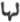 gut."

P. 178, No. 264, first verse. *For* "my nose" *read* "noses."

P. 19r, No. 301, second verse. *Read* "howbeit akin to them are stones
that were kicked."

P. 192, No. 303, second verse. *Read*

"But pardon me, O my God! At Mecca shall I throw off  
 Amongst pilgrims newly come the weeds of a widowed frame."

Prof. Bevan justly observes that 
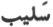 in conjunction with 
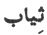 can scarcely have any other meaning than "a woman
who is wearing the black garments of mourning." Moreover, although  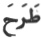 when followed by  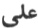, can be used of "throwing on
(a garment)," it properly means "to throw off." I suggest that  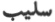 denotes here the poet's
body, which-as bereaved of sight, strength, and all its pleasures—he
compares to a woman clad in mourning, while  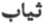 refers to the garments which
would be laid aside on assuming the *iḥrám*.

P. 204, No. 326, lines 3-4. The general sense is given correctly, but I
should have noticed that the words 
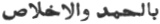 allude to two short *Súras* of the Koran, *viz*.
*Súra* 1 (cf. the Commentary of Bayḍáwí, ed. Fleischer, p. 3, l. 6) and
*Súra* CXII. These are contrasted with the two long *Súras* mentioned in
note 1.

P. 216, No. 30, *v*. 8. *For* 
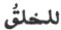 *read* 
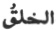.

P. 220, No. 40, *v*. 16. *For* 
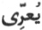 *read* 
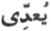 (B.).

P. 228, No. 69, *v*. 3. *For* 
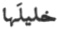 *read* 
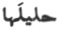 (B.).

P. 229, No. 72, *v*. 8. 
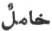 (B.) is better than 
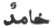.

P. 237, No. 107, *v*. 5. *Read* 
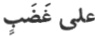 "im Zorne" (N.).

P. 240, No. 115, *v*. 3. *For* 
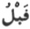 *read* 
.

P. 246, No. 143, *v*. 2. *For* 
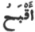 *read* 
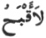. (N.).

P. 248, No. 149, *v*. 4. *For* 
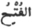 *read* 
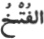.

*Ibid*. *For*  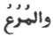 *read*
 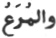 Cf. Wellhausen,
Scholien zum Diwan Huḏail, 277, 5 (*ZDMG*., xxxix, 479) and *Lisán*, x,
211, 4 fr. foot and foll. "Die Bedeutung scheint 'Wachtel' zu sein"
(N.).

P. 251, No. 263, *v*. 2. *For* 
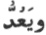 *read* 
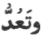 (B.).

p. xii

P. 251, No. 167, *v*. 1. *For* 
 *read* 
.

P. 253. No. 174, *v*. 6. *For* 
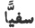 *read* 
.

P. 255, No. 181, *v*. 3. *For* 
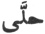 *read*, 
, "ihre Geheimnisse mit Wissen aufdeckt = klar
erkennt.  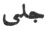 und  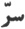 bilden ja natürliche
Gegensätze" (N.).

P. 262, No. 210, *v*. 4. *For* 
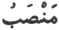 *read* 
 (B.).

P. 265, No. 225, *v*. 2. *For* 
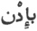 *read* 
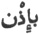.

P. 266, No. 229, *v*. 6. *For* 
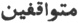 *read* 
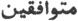.

P. 268, No. 238, *v*. 1. *For* 
 *read* 
.

P. 269, No. 240, *v*. 1. *For* 
, *read* 
 (N.).

P. 274, No. 262, *v*. 2. *For* 
 *read* 
.

P. 274, No. 264, *v*. 1. *For* 
 *read* 
 (N.).

P. 277, No. 274, *v*. 7. There is, of course, a word-play here, as   can also mean "the male
ostrich" and   "the
female ostrich." Nöldeke suggests that the sense may be, "Fear the
prayer of an oppressed man on behalf of his wife."

P. 279, No. 284, *v*. 1. *Read* 
 *for* 
.

P. 282, No. 302, *v*. 4. *Read* 
 *for* 
 (the rhyme-word).

P. 286, No. 318, *v*. 1. If 
 be retained, its subject is the individual implied
by the preceding words. The reading 
 gives an easier and more natural sense.

Even the minutiae in this list will be carefully noted, I hope, by
students of the *Luzúmiyyát*. Success in mastering the difficulties of
Arabic poetry depends on the conviction that no detail is small enough
to be neglected.

REYNOLD A. NICHOLSON.

*March*, 1921.

------------------------------------------------------------------------

### Footnotes

[vii:1](siim01.htm#fr_0) Published in *Rivista
degli studi orientali* (1919), vol. VIII. l-106.

[viii:1](siim01.htm#fr_1) There is no trustworthy
basis (cf. [p. 164](siim17.htm#page_164) *infra*) for the statement that
Ibnu ’l-Fáriḍ was acquainted with Ibnu ’l-‘Arabí. The latter is said to
have asked the poet's permission to write a commentary on his *Tá’iyya*,
and to have received the reply that the *Futúḥátu ’l-Makkiyya* was a
commentary on it (Maqqarí, Leiden ed., 1. 570, 16-18); this, however, is
the kind of story that could scarcely fail to be invented. The *Futúḥát*
was completed in a.h. 629, only three
years before the death of Ibnu ’l-Fáriḍ.

------------------------------------------------------------------------

[Next: Contents](siim02)
