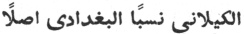

  
[Intangible Textual Heritage](../../index)  [Islam](../index) 
[Index](index)  [Previous](siim06)  [Next](siim08) 

------------------------------------------------------------------------

[Buy this Book at
Amazon.com](https://www.amazon.com/exec/obidos/ASIN/0548805903/internetsacredte)

------------------------------------------------------------------------

  
*Studies in Islamic Mysticism*, by Reynold A. Nicholson, \[1921\], at
Intangible Textual Heritage

------------------------------------------------------------------------

p. 77

### CHAPTER II

### THE PERFECT MAN [1](#fn_218)

Man, is not he Creation's last appeal,  
The light of Wisdom's eye? Behold the wheel  
Of universal life as ’twere a ring,  
But Man the superscription and the seal.  
                                      Omar
Khayyam.

Οὕτως, φησίν, ἐστι πάνυ βαθεῖα καὶ δυσκατάληπτος ἡ τοῦ τελείου ἀνθρώπου
γνῶσις. Ἀρχὴ γάρ, φησίν, τελειώσεως γνῶσις ἀνθρώπου· θεοῦ δὲ γνῶσις
ἀπηρτισμένη τελείωσις· Hippolytus.

Ἄνθρωπος θεοῦ τοῦ ἀϊδίου λόγος. Philo.

What do Ṣúfís mean when they speak of the
Perfect Man (*al-insánu ’l-kámil*), a phrase which seems first to have
been used by the celebrated Ibnu ’l-‘Arabí, although the notion
underlying it is almost as old as Ṣúfisim itself [2](#fn_219)? The question

p. 78

might be answered in different ways, but if we seek a general
definition, perhaps we may describe the Perfect Man as a man who has
fully realised his essential oneness with the Divine Being in whose
likeness he is made. This experience, enjoyed by prophets and saints and
shadowed forth in symbols to others, is the foundation of the Ṣúfí
theosophy. Therefore, the class of Perfect Men comprises not only the
prophets from Adam to Mohammed, but also the superlatively elect
(*khuṣúṣu ’l-khuṣúṣ*) amongst the Ṣúfís, *i.e.*, the persons named
collectively *awliyá*, plural of *walí*, a word originally meaning
"near," which is used for "friend," "protégé," or "devotee." Since the
*walí* or saint is the popular type of Perfect Man, it should be
understood that the essence of Mohammedan saintship, as of prophecy, is
nothing less than Divine illumination, immediate vision and knowledge of
things unseen and unknown, when the veil of sense is suddenly lifted and
the conscious self passes away in the overwhelming glory of "the One
true Light." An ecstatic feeling of oneness with God constitutes the
*walí*. It is the end of the Path (*ṭaríqa*) in so far as the discipline
of the Path is meant to predispose and prepare the disciple to receive
this incalculable gift of Divine grace, which is not gained or lost by
anything that a man may do, but comes to him in proportion to the
measure and degree of spiritual capacity with which he was created.

Two special functions of the *walí* further illustrate the relation of
the popular saint-cult to mystical philosophy—(1) his function as a
mediator, (2) his function as a cosmic power. The Perfect Man, as will
be explained in the course of our argument, unites the One and the Many,
so that the universe depends on him for its continued existence. In
Mohammedan religious life the *walí* occupies the same middle position:
he bridges the chasm which the Koran and scholasticism have set between
man and an absolutely transcendent God. He brings relief to the
distressed, health to the sick, children to the childless, food to the
famished, spiritual guidance to those who entrust their souls to his
care, blessing to all who visit his tomb and invoke Allah in his name.
The *walís*, from the highest to the lowest, are arranged in a graduated
hierarchy,

p. 79

with the *Quṭb* at their head, forming "a saintly board of
administration by which the invisible government of the world is carried
on [1](#fn_220)." Speaking of the *Awtád*—four
saints whose rank is little inferior to that of the *Quṭb*
himself—Hujwírí says:

It is their office to go round the whole world every
night, and if there be any place on which their eyes have not fallen,
next day some flaw will appear in that place; and they must then inform
the *Quṭb*, in order that he may direct his attention to the weak spot,
and that by his blessing the imperfection may be remedied [2](#fn_221).

Such experiences and beliefs were partly the cause and partly the
consequence of speculation concerning the nature of God and man,
speculation which drifted far away from Koranic monotheism into
pantheistic and monistic philosophies. The Ṣúfí reciting the Koran in
ecstatic prayer and seeming to hear, in the words which he intoned, not
his own voice but the voice of God speaking through him, could no longer
acquiesce in the orthodox conception of Allah as a Being utterly
different from all other beings. This dogma was supplanted by faith in a
Divine Reality (*al-Ḥaqq*), a God who is the creative principle and
ultimate ground of all that exists. While Ṣúfís, like Moslems in
general, affirm the transcendence of God and reject the notion of
infusion or incarnation (*ḥulúl*), it is an interesting fact that one of
the first attempts in Islam to indicate more precisely the meaning of
mystical union was founded on the Christian doctrine of two natures in
God. Ḥalláj, who dared to say *Ana ’l-Ḥaqq*, "I am the *Ḥaqq* [3](#fn_222)," thereby announced that the saint in
his deification "becomes the living and personal witness of God." The
Jewish tradition that God created Adam in His own image reappeared as a
*ḥadíth* (saying of the Prophet) and was put to strange uses by
Mohammedan theosophists.

p. 80

\[paragraph continues\] Even the orthodox
Ghazálí hints that here is the key of a great mystery which nothing will
induce him to divulge [1](#fn_223). According
to Ḥalláj, the essence of God's essence is Love. Before the creation God
loved Himself in absolute unity and through love revealed Himself to
Himself alone. Then, desiring to behold that love-in-aloneness, that
love without otherness and duality, as an external object, He brought
forth from non-existence an image of Himself, endowed with all His
attributes and names. This Divine image is Adam, in and by whom God is
made manifest—divinity objectified in humanity [2](#fn_224). Ḥalláj, however, distinguishes the
human nature (*násút*) from the Divine (*láhút*). Though mystically
united, they are not essentially identical and interchangeable.
Personality survives even in union: water does not become wine, though
wine be mixed with it. Using a more congenial metaphor, Ḥalláj says in
verses which are often quoted:

I am He whom I love, and He whom I love is I.  
We are *two* spirits dwelling in one body [3](#fn_225),  
If thou seest me, thou seest Him;  
And if thou seest Him, thou seest us both.

The markedly Christian flavour of the Ḥallájian doctrine condemned it in
Moslem eyes, and while later Ṣúfís develop its main ideas and venerate
Ḥalláj himself as a martyr who was barbarously done to death because he
had proclaimed the Truth, they interpret his *Ana ’l-Ḥaqq* in the light
of an idealistic monism which reduces all antitheses—including *láhút*
and *násút*—to necessarily correlated aspects of the universal Essence.
His doctrine in its original form has only

p. 81

recently been recovered and given to the world by M. Louis Massignon, to
whose learned and brilliant monograph every student of Ṣúfisim is deeply
indebted.

‘Abdu ’l-Karím ibn Ibráhím al-Jílí, author of *al-Insánu ’l-kámil fí
ma‘rifati ’l-awákhir wa ’l-awá’il* ("The Man perfect in knowledge of the
last and first things"), was born in a.d.
1365-6 and probably died some time between a.d. 1406 and 1417. His surname, which is
derived from Jílán or Gílán, the province south of the Caspian,
commemorates his descent from the founder of the Qádirite order of
dervishes, ‘Abdu l-Qádir al-Jílí (Gílání), who died almost exactly 200
years before the date of Jílí's birth [1](#fn_226). In the *Insánu ’l-kámil* he more than
once refers to ‘Abdu ’l-Qádir as "our Shaykh," so that he must have been
a member of the fraternity. The Moslem biographers leave him unnoticed,
but he himself tells us that he lived at Zabíd in Yemen with his Shaykh,
Sharafu’ddín Ismá‘íl ibn Ibráhím al-Jabartí, and had previously
travelled in India [2](#fn_227). Of his
mystical writings twenty are known to be extant, and it is not unlikely
that as many have been lost.

Jílí begins his work with a statement of his object in composing
it [3](#fn_228). That object is God
(*al-Ḥaqq*): therefore he must treat in the first place, of the Divine
names, then of the Divine attributes, and lastly of the Divine essence.
"I will call attention," he says, "to mysteries which no author has ever
put into a book [4](#fn_229), matters
concerning the gnosis of God and of the universe, and will tread a path
between reserve and divulgation." He writes throughout as one reporting
what has been communicated to him in mystical converse (*mukálama*),

p. 82

so that "the hearer knows it intuitively to be the word of God [1](#fn_230)." These private revelations are
supported, he asserts, by the Koran and the Sunna, and he warns his
readers not to charge him with errors which may arise from their own
want of understanding; but while he professes belief in the Mohammedan
articles of faith [2](#fn_231), he interprets
them by an allegorising method that yields any and every meaning
desired. As a writer, he is not without talent, though his work belongs
to mysticism rather than to literature. Besides many poems which he
seems to have admired inordinately [3](#fn_232), he introduces *maqámas* in rhymed prose
and specimens of the Platonic myth. Thus he tells how the stranger,
whose name is the Spirit, returned from long exile and imprisonment to
the world known as Yúḥ, and entered a spacious city where Khaḍir rules
over "the Men of the Unseen" (*rijálu ’l-ghayb*)—exalted saints and
angels, of whom six classes are described [4](#fn_233).

The characteristic of the *Insánu ’l-kámil* is the idea of the Perfect
Man, "who as a microcosmos of a higher order reflects not only the
powers of nature but also the divine powers \`as in a mirror' (comp. the
γενικὸς ἄνθρωπος of Philo) [5](#fn_234)." On
this basis Jílí builds his mystical philosophy. It will be better
grasped as a whole, if before coming to details I endeavour to sketch it
in outline.

Jílí belongs to the school of Ṣúfís who hold that Being is one [6](#fn_235), that all apparent differences are
modes, aspects, and manifestations of reality, that the phenomenal is
the outward expression of the real. He begins by defining essence as
that

p. 83

to which names and attributes are referred; it may be either existent or
non-existent, *i.e.*, existing only in name, like the fabulous bird
called *‘Anqá*. Essence that really exists is of two kinds: Pure Being,
or God, and Being joined to not-being, *i.e.*, the world of created
things. The essence of God is unknowable *per se*; we must seek
knowledge of it through its names and attributes. It is a substance with
two accidents, eternity and everlastingness; with two qualities,
creativeness and creatureliness; with two descriptions, uncreatedness
and origination in time; with two names, Lord and slave (God and man);
with two aspects, the outward or visible, which is the present world,
and the inward or invisible, which is the world to come; both necessity
and contingency are predicated of it, and it may be regarded either as
non-existent for itself but existent for other, or as non-existent for
other but existent for itself [1](#fn_236).

Pure Being, as such, has neither name nor attribute; only when it
gradually descends from its absoluteness and enters the realm of
manifestation, do names and attributes appear imprinted on it. The sum
of these attributes is the universe, which is "phenomenal" only in the
sense that it shows reality under the form of externality. Although,
from this standpoint, the distinction of essence and attribute must be
admitted, the two are ultimately one, like water and ice. The so-called
phenomenal world—the world of attributes—is no illusion: it really
exists as the self-revelation or other self of the Absolute. In denying
any real difference between essence and attribute, Jílí makes Being
identical with Thought. The world expresses God's idea of Himself, or as
Ibnu ’l-‘Arabí puts it, "we ourselves are the attributes by which we
describe God; our existence is merely an objectification of His
existence. God is necessary to us in order that we may exist, while we
are necessary to Him in order that He may be manifested to Himself [2](#fn_237)."

Jílí calls the simple essence, apart from all qualities and relations,
"the dark mist" (*al-‘Amá*). It develops consciousness

p. 84

by passing through three stages of manifestation, which modify its
simplicity. The first stage is Oneness (*Aḥadiyya*), the second is
He-ness (*Huwiyya*), and the third is I-ness (*Aniyya*). By this process
of descent Absolute Being has become the subject and object of all
thought and has revealed itself as Divinity with distinctive attributes
embracing the whole series of existence. The created world is the
outward aspect of that which in its inward aspect is God. Thus in the
Absolute we find a principle of diversity, which it evolves by moving
downwards, so to speak, from a plane beyond quality and relation, beyond
even the barest unity, until by degrees it clothes itself with manifold
names and attributes and takes visible shape in the infinite variety of
Nature. But "the One remains, the Many change and pass." The Absolute
cannot rest in diversity. Opposites must be reconciled and at last
united, the Many must again be One. Recurring to Jílí's metaphor, we may
say that as water becomes ice and then water once more, so the Essence
crystallised in the world of attributes seeks to return to its pure and
simple self. And in order to do so, it must move upwards, reversing the
direction of its previous descent from absoluteness. We have seen how
reality, without ceasing to be reality, presents itself in the form of
appearance: by what means, then, does appearance cease to be appearance
and disappear in the abysmal darkness of reality?

Man, in virtue of his essence, is the cosmic Thought assuming flesh and
connecting Absolute Being with the world of Nature.

While every appearance shows some attribute of reality, Man is the
microcosm in which all attributes are united, and in him alone does the
Absolute become conscious of itself in all its diverse aspects. To put
it in another way, the Absolute, having completely realised itself in
human nature, returns into itself through the medium of human nature;
or, more intimately, God and man become one in the Perfect Man—the
enraptured prophet or saint—whose religious function as a mediator
between man and God corresponds with his metaphysical function as the
unifying principle by means of

p. 85

which the opposed terms of reality and appearance are harmonised. Hence
the upward movement of the Absolute from the sphere of manifestation
back to the unmanifested Essence takes place in and through the unitive
experience of the soul; and so we have exchanged philosophy for
mysticism.

Jílí distinguishes three phases of mystical illumination or revelation
(*tajallí*), which run parallel, as it were, to the three
stages—Oneness, He-ness, and I-ness—traversed by the Absolute in its
descent to consciousness.

In the first phase, called the Illumination of the Names, the Perfect
Man receives the mystery that is conveyed by each of the names of God,
and he becomes one with the name in such sort that he answers the prayer
of any person who invokes God by the name in question.

Similarly, in the second phase he receives the Illumination of the
Attributes and becomes one with them, *i.e.*, with the Divine Essence as
qualified by its various attributes: life, knowledge, power, will, and
so forth. For example, God reveals Himself to some mystics through the
attribute of life. Such a man, says Jílí, is the life of the whole
universe; he feels that his life permeates all things sensible and
ideal, that all words, deeds, bodies, and spirits derive their existence
from him. If he be endued with the attribute of knowledge, he knows the
entire content of past, present, and future existence, how everything
came to be or is coming or will come to be, and why the non-existent
does not exist: all this he knows both synthetically and analytically.
The Divine attributes are classified by the author under four heads: (1)
attributes of the Essence, (2) attributes of Beauty, (3) attributes of
Majesty, (4) attributes of Perfection. He says that all created things
are mirrors in which Absolute Beauty is reflected. What is ugly has its
due place in the order of existence no less than what is beautiful, and
equally belongs to the Divine perfection: evil, therefore, is only
relative. As was stated above, the Perfect Man reflects all the Divine
attributes, including even the Essential ones, such as unity and
eternity, which he shares with no other being in this world or the next.

The third and last phase is the Illumination of the Essence.

p. 86

\[paragraph continues\] Here the Perfect
Man becomes *absolutely* perfect. Every attribute has vanished, the
Absolute has returned into itself.

In the theory thus outlined we can recognise a monistic form of the myth
which represents the Primal Man, the first-born of God, as sinking into
matter, working there as a creative principle, longing for deliverance,
and, at last finding the way back to his source [1](#fn_238). Jílí calls the Perfect Man the
preserver of the universe, the *Quṭb* or Pole on which all the spheres
of existence revolve. He is the final cause of creation, *i.e.*, the
means by which God sees Himself, for the Divine names and attributes
cannot be seen, as a whole, except in the Perfect Man. He is a copy made
in the image of God; therefore in him is that which corresponds to the
Essence with its two correlated aspects of He-ness and I-ness, *i.e.*,
inwardness and outwardness, or divinity and humanity. His real nature is
threefold, as Jílí expressly declares in the following verses, which no
one can read without wondering how a Moslem could have written them:

If you say that it (the Essence) is One, you are right; or if you say
that it is Two, it is in fact Two.  
Or if you say, "No, it is Three," you are right, for that is the real
nature of Man [2](#fn_239).

\[paragraph continues\] Here we have a
Trinity consisting of the Essence together with its two complementary
aspects, namely, Creator and creature—God and man. Now, all men are
perfect potentially, but few are actually so. These few are the prophets
and saints. And since their perfection varies in degree according to
their capacity for receiving illumination, one of them must stand out
above all the rest. Jílí remains a Moslem in spite of his philosophy,
and for him this absolutely Perfect Man is the Prophet Mohammed. In the
poem from which I have quoted he identifies the Three-in-One with
Mohammed and addresses him as follows:

O centre of the compass! O inmost ground of the truth! O pivot of
necessity and contingency! p. 87  
O eye of the entire circle of existence! O point of the Koran and the
*Furqán*! [1](#fn_240)  
O perfect one, and perfecter of the most perfect, who have been
beautified by the majesty of God the Merciful!  
Thou art the Pole (*Quṭb*) of the most wondrous things. The sphere of
perfection in its solitude turns on thee.  
Thou art transcendent; nay, thou art immanent; nay, thine is all  
that is known and unknown, everlasting and perishable.  
Thine in reality is Being and not-being; nadir and zenith are thy two
garments.  
Thou art both the light and its opposite; nay, but thou art only
darkness to a gnostic that is dazed [2](#fn_241).

Jílí also holds that in every age the Perfect Men are an outward
manifestation of the essence of Mohammed [3](#fn_242), which has the power of assuming
whatever form it will; and he records the time and place of his own
meeting with the Prophet, who appeared to him in the guise of his
spiritual director, Sharafu’ddín Ismá‘íl al-Jabartí. In the 60th chapter
of the *Insánu ’l-kámil* he depicts Mohammed as the absolutely perfect
man, the first-created of God and the archetype of all other created
beings. This, of course, is an Islamic Logos doctrine [4](#fn_243). It brings Mohammed in some respects
very near to the Christ of the Fourth Gospel and the Pauline Epistles.
But if the resemblance is great, so is the difference. The Fatherhood of
God, the Incarnation, and the Atonement suggest an infinitely rich and
sympathetic personality, whereas the Mohammedan Logos tends to identify
itself with the active principle of revelation in the Divine essence.
Mohammed is

p. 88

loved and adored as the perfect image or copy of God: "he that has seen
me has seen Allah," says the Tradition [1](#fn_244). Except that he is not quite co-equal
and co-eternal with his Maker, there can be no limit to glorification of
the Perfect Man [2](#fn_245). I need hardly say
that Mohammed gave the lie direct to those who would have thrust this
sort of greatness upon him: his apotheosis is the triumph of religious
feeling over historical fact.

These ideas in part go back to Ḥalláj but were first worked out and
systematised by the most prolific of Moslem theosophists and one of the
most original, Muḥyi’ddín Ibnu ’l-‘Arabí, of whose influence on the
course of later Ṣúfí speculation the traces are so broad and deep that
he well deserves the honorary title of *doctor maximus* (*al-shaykhu
’l-akbar*), by which he is frequently designated. Although Jílí does not
follow him everywhere, he has learned much from his predecessor's manner
of philosophising; he looks at things from a similar standpoint, and his
thought moves in the same circle of mystical phantasies struggling to
clothe themselves with forms of logic. Ibnu ’l-‘Arabí would be better
known to us, if he had written more briefly, lucidly, and methodically.
In all these respects Jílí has the advantage: we can say of the *Insánu
’l-kámil* what cannot be said of the *Futúḥátu ’l-Makkiyya* or the
*Fuṣúṣu ’l-ḥikam*—that the author is not so difficult as the subject.
The philosophy of Ibnu ’l-‘Arabí requires a volume for itself, but I
will attempt to give my readers some account of the *Fuṣúṣ*, where he
treats particularly of the Divine attributes displayed by the prophetic
class of Perfect Men [3](#fn_246).

The *Insánu ’l-kámil*, though strongly marked with a character and
expression of its own, is one of those books which gather up the threads
of a whole system of thought and serve as a clue to it. After having
explored the visionary world of reality through which the author
conducts us step by step,

p. 89

we at least know where we are when hierophants of the same guild beckon
us to their company and bid us soar with them

Into the height of Love's rare universe.

\[paragraph continues\] I trust that the
following analysis and exposition is full enough to bring out the
principal features of the work and open an avenue for further study. The
subject-matter of Jílí's sixty-three chapters has been arranged under a
few heads in the way that seemed most suitable.

------------------------------------------------------------------------

### Footnotes

[77:1](siim07.htm#fr_218) The title is borrowed
from Jílí's work, the *Insánu ’l-kámil*, of which a brief but
illuminating exposition will be found in Dr Muḥammad Iqbál's
*Development of metaphysics in Persia* (London, 1908), p. 150 foll. I
may also refer to two articles written by myself: "A Moslem philosophy
of religion" (*Muséon*, Cambridge, 1915, p. 83 foll.) and "The Ṣúfí
doctrine of the Perfect Man" (*Quest*, 1917, p. 545 foll.); passages
from both have been incorporated in this essay, with or without
alteration. The following abbreviations are used: K = the edition of the
*Insánu ’l-kámil* published at Cairo in a.h. 1300; Comm. K = the commentary by Aḥmad
ibn Muḥammad al-Madaní on chapters 50-54 of the *Insánu ’l-kámil*
(Loth's *Catalogue of the Arabic manuscripts in the Library of the India
Office*, No. 667); M = the commentary by Jílí on the 559th chapter of
Ibnu ’l-‘Arabí's *Futúḥátu ’l-Makkiyya* (Loth's Catalogue, No. 6931).

[77:2](siim07.htm#fr_219) In the first chapter
of the *Fuṣúṣu ’l-ḥikam* (Cairo, a.h.
1321) Ibnu ’l-‘Arabí (*ob*. a.d. 1240)
says that when God willed that His attributes should be displayed, He
created a microcosmic being (*kawn jámi‘*), the Perfect Man, through
whom "God's consciousness (*sirr*) is manifested to Himself." Abú Yazíd
al-Bisṭámí (*ob*. a.d. 875) defines "the
perfect and complete man" (*al-kámilu ’l-támm*), who after having been
invested with Divine attributes becomes unconscious of them (Qushayrí,
*Risála*, Cairo, a.h. 1318, p. 140,1. 12
foll.), *i.e.*, enters fully into the state of *faná*; but here the term
does not bear the peculiar significance attached to it by Ibnu ’l-‘Arabí
and Jílí.

[79:1](siim07.htm#fr_220) Prof. D. B.
Macdonald, *The religious attitude and life in Islam*, p. 163.

[79:2](siim07.htm#fr_221) Hujwírí, *Kashf
al-Maḥjúb*, p. 228 of my translation.

[79:3](siim07.htm#fr_222) Massignon renders, "I
am the Creative Truth" (*Kitáb al-Ṭawásín*, p. 175). *Al-Ḥaqq* is the
Creator as opposed to the creatures (*al-khalq*) and this seems to be
the meaning in which Ḥalláj understood the term, but it is also applied
to God conceived pantheistically as the one permanent reality. Cf. the
article "Ḥaḳḳ" by Prof. D. B. Macdonald in *Encycl. of Islam*.

[80:1](siim07.htm#fr_223) *Iḥyá* (Búláq, a.h. 1289), vol. IV, p. 294.

[80:2](siim07.htm#fr_224) Massignon, *Kitáb
al-Ṭawásín*, p. 129.

[80:3](siim07.htm#fr_225) Contrast this with
the monistic expression of the same thought by Jílí (K I. 51, 1): "We
are the spirit of One, though we dwell by turns in two bodies." So, too,
Jalálu’ddín Rúmí (Divāni Shamsi Tabrīz, p. 153):

"Happy the moment when we are seated in the palace, thou and I,  
 With two forms and with two figures, but with one soul, thou and I."

Cf. K II. 121, 11 foll.: "Essential love is love in Oneness, so that
each of the lovers appears in the form of the other and represents the
other. Inasmuch as the love of the body and the soul is essential, the
soul is pained by the body's pain in this world, while the body is
pained by the soul's pain in the other world: then each of them appears
in the other's form."

[81:1](siim07.htm#fr_226) I do not know on what
authority Dr Goldziher in his article on Jílí in the *Encycl. of Islam*
(vol. I, p. 46) connects the *nisba* with Jíl, a village in the district
of Baghdád. Jílí calls himself 
 (Loth, Cat. of Arabic MSS. in the India Office
Library, p. 182, col. I, l. 7 from foot). He traced his descent to a
*sibṭ* of ‘Abdu ’l-Qádir, *i.e.*, to a son of the Shaykh's daughter.

[81:2](siim07.htm#fr_227) He mentions (K II.
43, 20 foll.) that in a.h. 790 = a.d. 1388 he was in India at a place named
Kúshí, where he conversed with a man under sentence of death for the
murder of three notables. The earliest date referring to his stay at
Zabíd is a.h. 796=a.d. 1393-4 (K II. 61, 20), and the latest
a.h. 805 =A. D. 1402-3 (Loth, *op. cit.*
p. 183).

[81:3](siim07.htm#fr_228) K I. 6, 4 foll.

[81:4](siim07.htm#fr_229) Cf. K I. 63, penult.
and foll.

[82:1](siim07.htm#fr_230) Jílí often uses
logical arguments, but "the paradoxes proved by his logic are really the
paradoxes of mysticism, and are the goal which he feels his logic must
reach if it is to be in accordance with insight" (Bertrand Russell,
"Mysticism and Logic" in the *Hibbert Journal*, vol. XII, No. 4, p.
793).

[82:2](siim07.htm#fr_231) K I. 4, 10 foll.

[82:3](siim07.htm#fr_232) K I. 39, 20 foll.

[82:4](siim07.htm#fr_233) K II. 34, 23 foll.
Cf. K I. 8, 6 foll. In the *Futúḥátu ’l-Makkiyya*, ch. 559. Ibnu
’l-‘Arabí likens the Divine Spirit in man to Yúḥ, "which is a name of
the sun and refers to God (*al-Ḥaqq*), for He is the light of the
heavens and the earth, and Man is a perfect and complete copy of Him" (M
34 a).

[82:5](siim07.htm#fr_234) Goldziher in *Encycl.
of Islam*. The heavenly man is the *summum genus*, the earthly man the
*summa species* (M 40 a).

[82:6](siim07.htm#fr_235) This doctrine is
called "the unity of Being" (*waḥdatu ’l-wujúd*).

[83:1](siim07.htm#fr_236) K I. 20, 23 foll.

[83:2](siim07.htm#fr_237) *Fuṣúṣ* (Cairo, a.h. 1312), 29, 78, 181, etc.

[86:1](siim07.htm#fr_238) See Bousset,
*Hauptprobleme der Gnosis*, p. 160 foll.

[86:2](siim07.htm#fr_239) K I. 10, 21 fol.

[87:1](siim07.htm#fr_240) See *Studies in
Islamic Poetry*, p. 174, note 3.

[87:2](siim07.htm#fr_241) K I. ii, i foll.

[87:3](siim07.htm#fr_242) So in the
pseudo-Clementine writings Adam or Christ, the true prophet and perfect
incarnation of the Divine spirit, is represented as manifesting himself
personally in a whole series of subsequent bearers of Revelation.
Bousset, *op. cit.* p. 172, quotes the following passages: "nam et ipse
verus propheta ab initio mundi per saeculum currens festinat ad
requiem," and "Christus, qui ab initio et semper erat, per singulas
quasque generationes piis latenter licet semper tamen aderat." On the
transmission of the Light of Mohammed see Goldziher's article cited in
the next note.

[87:4](siim07.htm#fr_243) An excellent survey
of the doctrine concerning the pre-existence of Mohammed, of the
consequences drawn from it, and of the sources from which it was
derived, will be found in Goldziher's *Neuplatonische und gnostische
Elemente im Hadīṯ* (*Zeitschrift für Assyriologie*, vol. 22, p. 317
foll.).

[88:1](siim07.htm#fr_244) Borrowed from St
John, ch. xiv. *v*. 9.

[88:2](siim07.htm#fr_245) Jílí declares that
wherever in his writings the expression "the Perfect Man" is used
absolutely, it refers to Mohammed (K II. 59, 6).

[88:3](siim07.htm#fr_246) See Appendix II.

------------------------------------------------------------------------

[Next: I. Essence, Attribute, and Name](siim08)
