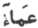

  
[Intangible Textual Heritage](../../index)  [Islam](../index) 
[Index](index)  [Previous](siim08)  [Next](siim10) 

------------------------------------------------------------------------

[Buy this Book at
Amazon.com](https://www.amazon.com/exec/obidos/ASIN/0548805903/internetsacredte)

------------------------------------------------------------------------

  
*Studies in Islamic Mysticism*, by Reynold A. Nicholson, \[1921\], at
Intangible Textual Heritage

------------------------------------------------------------------------

p. 94

#### II. THE DESCENT OF THE ABSOLUTE [1](#fn_264).

Pure Being, devoid of qualities and relations, is called by Jílí "the
dark mist" or "blindness" (*al-‘Amá*), a term which the Prophet is said
to have used in answering the question, "Where was God before the
creation? [2](#fn_265)" Dr Iqbal remarks that
*al-‘Amá*, translated into modern phraseology, would be "the
Unconsciousness," and that our author here anticipates the theories of
Schopenhauer and Von Hartmann [3](#fn_266). The
parallel seems to me little more than verbal. Jílí's ontology is based
on logic, and in developing it he follows a method which curiously
resembles the Hegelian dialectic. According to Hegel,

the Absolute Idea itself is the resolution of the
antithesis of Nature and Mind. The Idea is articulated as abstract,
self-identical unity, negation of this by a plural "other" of
particularity and differences, and as concrete identity-in-difference
and unity-in-plurality, wherein it affirms itself with a richer
content.…The "result" in question, however, must not be expressed amiss.
It does not occur at the end of a time-process. "Moments" severed for us
are together for the Absolute Idea, the conscious Reason, the Notion
which knows all as itself. The tail of the serpent is in the serpent's
mouth. This self-sundering of the Idea is the Hegelian form of the
mystic Jacob Böhme's view that "without self-diremption" the being of
the Eternal would be not-being. Conscious knowledge, it is urged,
implies antithesis within the Spiritual Ground [4](#fn_267).

p. 95

Similar principles determine Jílí's line of thought, although he never
states them formally.

The *‘Amá*, as he describes it, is not a blind unconscious power, but it
is the absolute inwardness (*buṭún*) and occultation (*istitár*) in
which the opposite concept of outwardness (*ẓuhúr*)—*i.e.*, all
relations of the Essence to itself as "other "is somehow absorbed and
negated, like starlight in sunlight [1](#fn_268). Jílí compares the *‘Amá*, as the
eternal and unchangeable ground of Being, to the fire which, in a sense,
is always latent in the flint whence it flashes forth [2](#fn_269). Thus the *‘Amá* may be regarded as the
inmost self, the "immanent negativity" of the Essence; as such, it is
logically correlated with *Aḥadiyya* [3](#fn_270), in which the Essence knows itself as
transcendental unity; and both these aspects are reconciled in the
Absolute, "whose outwardness is identical with its inwardness [4](#fn_271)."

*Aḥadiyya*, the abstract notion of oneness, although nothing else is
manifested in it, marks the first approach of the Essence to
manifestation [5](#fn_272). Its nature is
analogous to a wall viewed from a distance as a single whole without
reference to the clay, wood, bricks, and mortar of which it is composed:
the wall is "one" in respect of its being a name for the "murity"
(*jidáriyya*) [6](#fn_273). In the same way
*Aḥadiyya* comprises all particulars as negated by the idea of unity.
This absolute unity in turn resolves itself into a pair of opposites in
order to become re-united in a third term which carries the process of
individualisation a stage further. Thus we arrive at *Wáḥidiyya* 

p. 96

or relative unity, *i.e.*, unity in plurality. The intervening thesis
and antithesis are named *Huwiyya* (He-ness) [1](#fn_274) and *Aniyya* (I-ness) [2](#fn_275). *Huwiyya* signifies the inward unity
(*al-aḥadiyyat al-báṭina*) in which the attributes of the Essence
disappear; *Aniyya*, the obverse side or outward expression of
*Huwiyya*, is that unity revealing itself in existence. Clearly, then,
external manifestation is the result of a "self-diremption " which lies
in the very nature of the Essence as Pure Thought [3](#fn_276). The discord of *Huwiyya* (the Many
submerged in the One) and *Aniyya* (the One manifested in the Many) is
overcome in the harmony of *Wáḥidiyya* (the Many identical in essence
with each other and with the One) [4](#fn_277).
In *Wáḥidiyya* "essence is manifested as attribute and attribute as
essence," so that all distinction between the attributes is lost: one is
the ayn (identity) of the other, Mercy and Vengeance are the same. We
shall see that from this point of view the plane of Divinity
(*Iláhiyya*) is a descent from *Wáḥidiyya*, in so far as in the former
the attributes, which were identical in the latter, become distinct and
opposed. Before passing to theology, let

p. 97

me put the author's scheme of ontological devolution in the form of a
table.

A. Absolute Being or Pure Thought (al-*Dhát*, *al-Wujúd al-muṭlaq*).

\(a\) Inward aspect: "the dark mist" (*al-‘Amá*). Being, sunk in itself,
bare potentiality.

\(b\) Outward aspect: abstract Oneness (*Aḥadiyya*). Being, conscious of
itself as unity.

B. Abstract Oneness (*Aḥadiyya*).

\(a\) Inward aspect: He-ness (*Huwiyya*). Being, conscious of itself as
negating the Many (attributes).

\(b\) Outward aspect: I-ness (*Aniyya*). Being, conscious of itself as
the " truth " of the Many.

C. Unity in plurality (*Wáḥidiyya*). Being, identifying itself as One
with itself as Many.

------------------------------------------------------------------------

### Footnotes

[94:1](siim09.htm#fr_265) "Descent" (*nuzzúl*,
*tanazzul*) is equivalent to "individualisation" (*ta‘ayyun*) and
denotes the process by which Pure Being gradually becomes qualified.

[94:2](siim09.htm#fr_266) K I. 43, 2 foll. Cf.
Lane under   and Nyberg,
*Kleinere Schriften des Ibn al-‘Arabī*, Introd., p. 154. Jílí says that
the word signifies the Essence without its complementary attributes of
*Ḥaqq* (Creator) and *khalq* (creatures), *i.e.*, the Essence viewed
apart from its "self-diremption."

[94:3](siim09.htm#fr_267) *Development of
Metaphysics in Persia*, p. 165 fol. I have assumed that Dr Iqbal is
referring to these philosophers. His exact words are "anticipates
metaphysical doctrines of modern Germany."

[94:4](siim09.htm#fr_268) E. D. Fawcett, *The
World as imagination*, p. 102.

[95:1](siim09.htm#fr_269) K I. 43, 8 foll.; I.
44, 5 foll. Cf. 1. 61, 4 foll.—"The Essence (*Dhát*) denotes Absolute
Being stripped of all modes, relations, and aspects. Not that they are
outside of Absolute Being; on the contrary, they belong to it, but they
are in it neither as themselves nor as aspects of it; no, they are
identical with the being of the Absolute. The Absolute is the simple
essence in which no name or quality or relation is manifested. When any
of these appears in it, that idea is referred to that which appears in
*the Essence, not to the pure Essence, inasmuch as the Essence, by the
law of its nature, comprehends universals, particulars, and relations,
not as they are judged to exist, but as they are judged to be naughted
under the might of the transcendental oneness of the Essence*."

[95:2](siim09.htm#fr_270) K I. 42, 23 foll.

[95:3](siim09.htm#fr_271) Jílí says distinctly
that the terms *‘Amá* and *Aḥadiyya* are opposed to each other as inward
and outward aspects of the Essence (K I. 43, 7 foll.).

[95:4](siim09.htm#fr_272) K I. 45, 7.

[95:5](siim09.htm#fr_273) K I. 61, 16 foll.

[95:6](siim09.htm#fr_274) K I. 36, 9 foll.

[96:1](siim09.htm#fr_275) See K I. 61, 20 foll.
and 82, 11 foll. *Huwa*, the pronoun of the third person singular, is
called in Arabic grammar "the absent one" (*al-ghá’ib*); therefore
*Huwiyya* indicates the absence (*ghaybúbiyya*) of the attributes of the
Essence (from manifestation and perception). It is the inmost
consciousness of God (*sirr Allah*). Jílí demonstrates this (I. 82, 19
foll.) by analysing the name Allah, which in Arabic is written ALLH:
take away the A, and there remains LLH = *lilláh* ="to God"; then take
away the first L, and you are left with LH = *lahú* ="to Him"; remove
the second L, and you have H = *Huwa* ="He" (cf. my ed. of the *Kitáb
al-Luma‘*, p. 89, 1. 3 foll.). God is often described by Ṣúfís as the
*huwiyya* or inmost self of man and the universe, while man and the
universe are the *huwiyya* (*ḥaqíqa*, objectified idea) of God. God is
the absolute *Huwiyya* (Individuality), and everything has its own
peculiar *huwiyya*, which makes it what it is (*Fuṣúṣ*, 146, 8 foll.).
Cf. *Fuṣúṣ*, 46 and 194.

[96:2](siim09.htm#fr_276) K I. 61, 22; 83, 16.
*Aniyya*, derived from *Ana*, "I," and indicating presence, is involved
in the notion of *Huwiyya* as the rind is implied by the kernel.

[96:3](siim09.htm#fr_277) Cf. E. Caird,
*Hegel*, p. 149: "As the lightning sleeps in the dewdrop,. so in the
simple and transparent unity of self-consciousness there is held in
equilibrium that vital antagonism of opposites, which, as the opposition
of thought and things, of mind and matter, of spirit and nature, seems
to rend the world asunder."

[96:4](siim09.htm#fr_278) Cf. K I. 37, 8-9:
"*Wáḥidiyya* is that (aspect) in which the Essence appears as unifying
the difference of my attributes. Here the All is both One and Many.
Marvel at the plurality of what essentially is One."

------------------------------------------------------------------------

[Next: III. The Essence as God](siim10)
