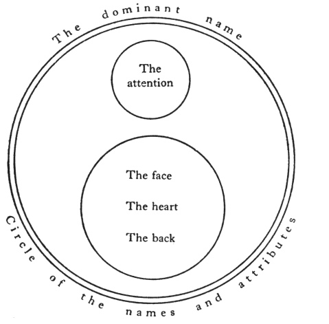
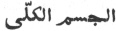
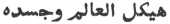
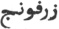
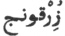
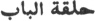
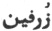

  
[Intangible Textual Heritage](../../index)  [Islam](../index.md) 
[Index](index)  [Previous](siim10)  [Next](siim12.md) 

------------------------------------------------------------------------

[Buy this Book at
Amazon.com](https://www.amazon.com/exec/obidos/ASIN/0548805903/internetsacredte.md)

------------------------------------------------------------------------

  
*Studies in Islamic Mysticism*, by Reynold A. Nicholson, \[1921\], at
Intangible Textual Heritage

------------------------------------------------------------------------

#### IV. THE HEAVENLY MAN.

Like Jacob Böhme [2](#fn_305.md), Jílí sets out
from the principle that "in order that the truth may he manifested as a
Something, there must be a contrary therein." He finds the ground of
existence in a Being which, though essentially One, is of threefold
nature, since it knows itself as the Creator (*al-Ḥaqq*) and the
creatures (*al-khalq*).

p. 104

"The Essence," he says, "is ‘Thou’ and ‘I’—‘Thou’ in respect of thy
deepest self (*huwiyya*, He-ness), not in respect of the human
attributes which the notion Thou' admits; and I' in respect of my
individual self, not in respect of the Divine attributes which the
notion ‘I’ admits. That is what is signified by the Essence (al-*Dhát*).
‘I,’ in respect of my ’l-ness’ (*aniyya*), viewed in relation to the
judgments which the notion ‘I’ is capable of, is God; and ‘Thou,’ in the
creaturely aspect, is Man. Therefore consider your essence, if you will,
as ‘I,’ or if you will, as ‘Thou,’ for there is nothing besides the
universal reality.…

If you say, that it (the Essence) is One, you are right; or if you say
that it is Two, it is in fact Two.  
Or if you say, No, it is Three,' you are right, for that is the real
nature of Man.  
Regard the Oneness (*aḥadiyya*) which is his essence: say, 'He is One
relatively (*wáḥid*), One absolutely (*aḥad*), unique in glory.'  
But if the two essences are considered, you will say that he is Two,
because he is a slave (*‘abd*) and a Lord (*rabb*).  
And if you examine his real nature and what is united therein, namely,
two things deemed to be contrary,  
You will contemplate him with amazement: his lowness is such that you
will not call him lofty, and his loftiness is such that you will not
call him low.  
Nay, name that (Man) a Third, because of a reality having two attributes
inherent in the realities of its essence [1](#fn_306.md).  
It (that reality) is he named Aḥmad as being that (Man), and Mohammed as
being the true idea (*ḥaqíqa*) of all things that exist [2](#fn_307.md)."

As an introduction to the Logos doctrine foreshadowed here, which is
interwoven with a mystical scheme of cosmology, I will translate part of
the 60th chapter, "Of the Perfect Man: showing that he is our Lord
Mohammed, and that he stands over against the Creator (*al-Ḥaqq*) and
the creatures (*al-khalq*) [3](#fn_308.md)."

p. 105

The Perfect Man is the *Quṭb* (axis) on which the
spheres of existence revolve from first to last, and since things came
into being he is one (*wáḥid*) for ever and ever. He hath various guises
and appears in diverse bodily tabernacles (*kaná’is*): in respect of
some of these his name is given to him, while in respect of others it is
not given to him. His own original name is Mohammed, his name of honour
Abú ’l-Qásim, his description ‘Abdullah [1](#fn_309.md), and his title Shamsu’ddín [2](#fn_310.md). In every age he bears a name suitable
to his guise (*libás*) in that age. I once met him in the form of my
Shaykh, Sharafu’ddín Ismá‘íl al-Jabartí, but I did not know that he (the
Shaykh) was the Prophet, although I knew that he (the Prophet) was the
Shaykh. This was one of the visions in which I beheld him at Zabíd in
a.h. 796. The real meaning of this matter
is that the Prophet has the power of assuming every form. When the adept
(*adíb*) sees him in the form of Mohammed which he wore during his life,
he names him by that name, but when he sees him in another form and
knows him to be Mohammed, he names him by the name of the form in which
he appears. The name Mohammed is not applied except to the Idea of
Mohammed (*al-Ḥaqíqatu ’l-Muḥammadiyya*). Thus, when he appeared in the
form of Shiblí [3](#fn_311.md), Shiblí said to his
disciple, "Bear witness that I am the Apostle of God"; and the disciple,
being one of the illuminated, recognised the Prophet and said, "I bear
witness that thou art the Apostle of God." No objection can be taken to
this: it is like what happens when a dreamer sees some one in the form
of another; but there is a difference between dreaming and mystical
revelation, *viz*., that the name of the form in which Mohammed appears
to the dreamer is not bestowed in hours of waking upon the *Ḥaqíqatu
’l-Muḥammadiyya*, because interpretation is applicable to the World of
Similitudes: accordingly, when the dreamer wakes he interprets the
*ḥaqíqa* of Mohammed as being the *ḥaqíqa* of the dream-form. In
mystical revelation it is otherwise, for if you perceive mystically that
the *ḥaqíqa* of Mohammed is displayed in any human form, you must bestow
upon the *ḥaqíqa* of Mohammed the name of that form and regard its owner
with no less reverence than you would show to our Lord Mohammed, and
after having seen him therein you may not behave towards it in the
same

p. 106

manner as before. Do not imagine that my words contain any tincture of
the doctrine of metempsychosis. God forbid! I mean that the Prophet is
able to assume whatever form he wishes, and the Sunna declares that in
every age he assumes the form of the most perfect men, in order to exalt
their dignity and correct their deviation (from the truth): they are his
vicegerents outwardly, and he is their spiritual essence (*ḥaqíqa*)
inwardly.

The Perfect Man in himself stands over against all the
individualisations of existence. With his spirituality he stands over
against the higher individualisations, with his corporeality over
against the lower. His heart stands over against the Throne of God
(*al-‘Arsh*), his mind over against the Pen (*al-Qalam*), his soul over
against the Guarded Tablet (*al-Lawḥu ’l-maḥfúẓ*), his nature over
against the elements, his capability (of receiving forms) over against
matter (*hayúlá*).…He stands over against the angels with his good
thoughts, over against the genies and devils with the doubts which beset
him, over against the beasts with his animality. …To every type of
existence he furnishes from himself an anti-type. We have already
explained that every one of the Cherubim is created from an analogous
faculty of the Perfect Man. It only remains to speak of his
correspondence with the Divine names and attributes.

You must know that the Perfect Man is a copy (*nuskha*) of God,
according to the saying of the Prophet, "God created Adam in the image
of the Merciful," and in another *ḥadíth*, "God created Adam in His own
image." That is so, because God is Living, Knowing, Mighty, Willing,
Hearing, Seeing, and Speaking, and Man too is all these. Then he
confronts the Divine *huwiyya* with his *huwiyya*, the Divine *aniyya*
with his *aniyya*, and the Divine *dhát* (essence) with his *dhát*—he is
the whole against the whole, the universal against the universal, the
particular against the particular.… Further, you must know that the
Essential names and the Divine attributes belong to the Perfect Man by
fundamental and sovereign right in virtue of a necessity inherent in his
essence, for it is he whose "truth" (*ḥaqíqa*) is signified by those
expressions and whose spirituality (*laṭífa*) is indicated by those
symbols: they have no subject in existence (whereto they should be
attached) except the Perfect Man. As a mirror in which a person sees the
form of himself and cannot see it without the mirror, such is the

p. 107

relation of God to the Perfect Man, who cannot
possibly see his own form but in the mirror of the name Allah; and he is
also a mirror to God, for God laid upon Himself the necessity that His
names and attributes should not be seen save in the Perfect Man. This
obligation to display the Divine attributes is the "trust" (*amána*)
which God offered to the heavens and the earth: they were afraid to
accept it, "but Man accepted it; verily he is unjust and ignorant" (Kor.
33, 72), *i.e.*, unjust to his own soul in letting it suffer degradation
(from the things of this world) and ignorant of his real worth, because
he is unaware of that with which he has been entrusted.…Beyond the plane
of the Names and Attributes, which are ranged on the right and left of
him according to their kind, the Perfect Man feels through his whole
being " a pervasive delight, which is named the delight of the Godhead"
(*ladhdhatu ’l-iláhiyya*).…Here he is independent of his modes, *i.e.*,
the Names and Attributes, and regards them not at all. He knows nothing
in existence save his own nature (*huwiyya*), contemplates the emanation
(*ṣudúr*) from himself of all that exists, and beholds the Many in his
essence, even as ordinary men are conscious of their own thoughts and
qualities; but the Perfect Man is able to keep every thought, great or
small, far from himself: his power over things does not proceed from any
secondary cause but is exercised freely, like other men's power of
speaking, eating, and drinking.

These extracts bring out the germinal idea which is developed by Jílí
into a psychological and cosmological system. The Perfect Man, as the
copy of God and the archetype of Nature, unites the creative and
creaturely aspects of the Essence and manifests the oneness of Thought
with things. "He is the heaven and the earth and the length and the
breadth [1](#fn_312.md)."

Mine is the kingdom in both worlds: I saw therein none but myself, that
I should hope for his favour or fear him.  
Before me is no "before," that I should follow its condition, and after
me is no " after," that I should precede its notion. p. 108  
I have made all kinds of perfection mine own, and lo, I am the beauty of
the majesty of the Whole: I am naught but It.  
Whatsoever thou seest of minerals and plants and animals, together with
Man and his qualities,  
And whatsoever thou seest of elements and nature and original atoms
(*haba’*) whereof the substance is (ethereal as) a perfume,  
And whatsoever thou seest of seas and deserts and trees and high-topped
mountains,  
And whatsoever thou seest of spiritual forms and of things visible whose
countenance is goodly to behold,  
And whatsoever thou seest of thought and imagination and intelligence
and soul, and heart with its inwards,  
And whatsoever thou seest of angelic aspect, or of phenomena whereof
Satan is the spirit,  
           \*      \*      \*      \*      \*      \*  
Lo, I am that whole, and that whole is my theatre: ’tis I, not it, that
is displayed in its reality.  
Verily, I am a Providence and Prince to mankind: the entire creation is
a name, and my essence is the object named.  
The sensible world is mine and the angel-world is of my weaving and
fashioning; the unseen world is mine and the world of omnipotence
springs from me.  
And mark! In all that I have mentioned I am a slave returning from the
Essence to his Lord—  
Poor, despised, lowly, self-abasing, sin's captive, in the bonds of his
trespasses [1](#fn_313.md).

The concluding verses only say what Jílí repeats in many places, that
while at supreme moments a man may lose himself in God, he can never be
identified with God absolutely.

In the second part of his work the author treats of the Perfect Man as
the Spirit whence all things have their origin. Accordingly he devotes
successive chapters to the organs and faculties which make up the
psychological and intellectual constitution of the Perfect Man—spirit,
heart, intelligence, reflection, etc., with the corresponding celestial
beings which are said to be "created" from them [2](#fn_314.md)e. The highest hypostases of his
psychology are the Holy Spirit (*Rúḥu ’l-Quds*) and the

p. 109

\[paragraph continues\] Spirit (*al-Rúḥ*);
the latter is also described as "the angel named al-Rúḥ" and, in the
technical language of the Ṣúfís, as "the *ḥaqq* by means of which the
world is created" (*al-ḥaqqu ’l-makhlúq bihi*) and "the Idea of
Mohammed" (*al-Ḥaqíqatu ’l-Muḥammadiyya*). How these two Spirits are
related to each other is indicated in the following passage:

You must know that every sensible object has a
created spirit which constitutes its form, and the spirit is to the form
as the meaning to the word. The created spirit has a Divine spirit which
constitutes it, and that Divine spirit is the *Rúḥu ’l-Quds*. Those who
regard the *Rúḥu ’l-Quds* in man deem it created, because two eternal
substances cannot exist: eternity belongs to God alone, whose names and
attributes inhere in His essence because of the impossibility of their
being detached; all else is created and originated. Man, for example,
has a body, which is his form, and a spirit, which is his meaning, and a
consciousness (*sirr*), which is *al-Rúḥ*, and an essential aspect
(*wajh*), which is denoted by the terms *Rúḥu ’l-Quds* (the Holy
Spirit), *al-sirru ’l-iláhí* (the Divine consciousness) and *al-wujúdu
’l-sárí* (the all-pervading Being) [1](#fn_315.md).

The *Rúḥu ’l-Quds* and the *Rúḥ* are one Spirit viewed as eternal in
relation to God and non-eternal in relation to Man; as the inmost
essence of things or as their form of existence [2](#fn_316.md). The uncreated Spirit of God, sanctified
above all phenomenal imperfections, is referred to in the verse, "I
breathed of My Spirit into Adam" (Kor. 15, 29; 38, 72), and in the
verse, "Wheresoever ye turn, there is the face (*wajh*) of Allah" (Kor.
2, 109), *i.e.*, the *Rúḥu ’l-Quds* exists, "individualised by its
perfection," in every object of sense or thought. Jílí adds that
inasmuch as the spirit of a thing is its self (*nafs*), existence is
constituted by the "self" of God; and His "self " is His essence [3](#fn_317.md). Union with the *Rúḥu ’l-Quds* comes
only as the crown and consummation of the mystical life to "the holy
one" (*qudsí*) [4](#fn_318.md) who unceasingly
contemplates the

p. 110

\[paragraph continues\] Divine
consciousness (*sirr*) which is his origin, so that its laws are made
manifest in him and God becomes his ear, eye, hand and tongue: he
touches the sick and they are healed, he bids a thing be and it is, for
he has been strengthened with the Holy Spirit, even as Jesus was (Kor.
2, 81) [1](#fn_319.md).

It will now be seen that Jílí considers the created *Rúḥ* or the
archetypal Spirit of Mohammed as a mode of the uncreated Holy Divine
Spirit and as the medium through which God becomes conscious of Himself
in creation [2](#fn_320.md).

God created the angel named *Rúḥ* from His own
light, and from him He created the world and made him His organ of
vision in the world. One of his names is the Word of Allah (*Amr*
Allah) [3](#fn_321.md). He is the noblest and most
exalted of existent beings: there is no angel above him, and he is the
chief of the Cherubim. God caused the mill-stone of existent beings to
turn on him, and made him the axis (*quṭb*) of the sphere of created
things. Towards every thing that God created he has a special aspect
(*wajh*), in virtue of which he regards it and preserves it in its
appointed place in the order of existence. He has eight forms, which are
the bearers of the Divine Throne (*al-‘Arsh*) [4](#fn_322.md). From him were created all the angels,
both the sublime and the elemental. The angels stand to him in the
relation of drops of water to the sea, and the eight bearers of the
*‘Arsh* stand in the same relation to him as the eight faculties which
constitute human existence to the spirit of man. These faculties are
intelligence (*‘aql*), judgment (*wahm*), reflection (*fikr*), phantasy
(*khayál*), imagination (*al-muṣawwira*), memory (*al-ḥáfiẓa*),
perception (*al-mudrika*), and the soul (*nafs*). The *Rúḥ* exercises a
Divine guardianship, created in him by God, over the whole universe. He
manifests himself in his perfection in the *Ḥaqíqatu ’l-Muḥammadiyya*:
therefore the Prophet is the most excellent of mankind. While God
manifests Himself in His attributes to all other created beings, He
manifests Himself in His essence to this

p. 111

angel alone. Accordingly the *Rúḥ* is the *Quṭb* of
the present world and of the world to come. He does not make himself
known to any creature of God but to the Perfect Man. When the saint
(*walí*) knows him and truly understands the things which the *Rúḥ*
teaches him, he becomes a pole (*quṭb*) on which the entire universe
revolves; but the Poleship (*Quṭbiyya*) belongs fundamentally to the
*Rúḥ*, and if others hold it, they are only his delegates [1](#fn_323.md). He is the first to receive the Divine
command, which he then delivers to the angels; and whenever a command is
to be executed in the universe, God creates from him an angel suitable
to that command, and the *Rúḥ* sends him to carry it out. All the
Cherubim are created from him, *e.g.*, Seraphiel, Gabriel, Michael, and
Azrael, and those above them, such as the angel named al-Nún [2](#fn_324.md), who is stationed beneath the Guarded
Tablet, and the angel named the Pen (*al-Qalam*), and the angel named
al-Mudabbir, whose station is beneath the *Kursí* [3](#fn_325.md), and the angel named al-Mufaṣṣil,
who

p. 112

stands beneath the Imámu ’l-Mubín [1](#fn_326.md):
these are the Sublime Angels, who were not commanded to worship Adam.
God in His wisdom did not command them, for had they been commanded to
worship, every one of Adam's descendants would have known them. Consider
how, inasmuch as the angels were commanded to worship Adam, they appear
to men in the forms of the Divine similitudes whereby God reveals
Himself to the dreamer. All those forms are angels, who descend in
diverse shapes by command of the angel entrusted with the making of
similitudes. For this reason a man dreams that lifeless things speak to
him: unless they were really spirits assuming the form of lifelessness,
they would not have spoken. The Prophet said that a true dream is an
inspiration from God—because an angel brings it—and also that a true
dream is one of the forty-six parts of prophecy. Since Iblís, though he
did not worship Adam, was amongst those commanded to worship, the devils
who are his offspring were commanded to appear to the dreamer in the
same forms as the angels: hence false dreams. According to this
argument, the Sublime Angels are unknowable except by "the divine men"
(*al-iláhiyyún*), on whom God bestows such knowledge as a gift after
their release from the limitations of humanity.

The *Rúḥ* has many names according to the number of his aspects. He is
named "The Most Exalted Pen" and "The Spirit of Mohammed" and "The First
Intelligence" and "The Divine Spirit," on the principle of naming the
original by the derivative, but in the presence of God he has only one
name, which is "The Spirit" (*al-Rúḥ*).

Jílí gives a long account of a vision in which the *Rúḥ* conversed with
him and spoke darkly concerning the mystery of his nature, saying, "I am
the child whose father is his son and the wine whose vine is its jar.…I
met the mothers who

p. 113

bore me, and I asked them in marriage, and they let me marry them [1](#fn_327.md)." In the course of this colloquy the
Idea of Mohammed (*al-Ḥaqíqatu ’l-Muḥammadiyya*) says:

God created Adam in His own image—this is not
doubted or disputed—and Adam was one of the theatres (*maẓáhir*) in
which I displayed myself: he was appointed as a vicegerent (*khalífa*)
over my externality. I knew that God made me the object and goal of all
His creatures, and lo, I heard the most gracious allocution from the
Most Great Presence: "Thou art the *Quṭb* whereon the spheres of beauty
revolve, and thou art the Sun by whose radiance the full-moon of
perfection is replenished; thou art he for whom We set up the
pattern [2](#fn_328.md) and for whose sake We made
fast the door-ring [3](#fn_329.md); thou art the
reality symbolised by Hind and Salmá, and ‘Azza and Asmá [4](#fn_330.md). O thou who art endued with lofty
attributes and pure qualities, Beauty doth not dumbfound thee nor
Majesty cause thee to quake, nor dost thou deem Perfection unattainable:
thou art the centre and these the circumference, thou art the clothed
and these the splendid garments [5](#fn_331.md)."

In some aspects the spiritual organ which Ṣúfís call "the heart"
(*qalb*) is hardly distinguished from the spirit (*rúḥ*): indeed Jílí
says that when the Koran mentions the Divine spirit breathed into Adam,
it is the heart that is signified. He

p. 114

describes it as "the eternal light and the sublime consciousness
(*sirr*) revealed in the quintessence (*‘ayn*) of created beings
(Mohammed), that God may behold Man thereby [1](#fn_332)"; as "the Throne of God (*al-‘Arsh*.md) and
His Temple in Man…the centre of Divine consciousness and the
circumference of the circle of all that exists actually or ideally [2](#fn_333.md)." It reflects all the Divine names and
attributes at once, yet quickly changes under the influence of
particular names. Like a mirror, it has a face and a back. The face is
always turned towards a light called the attention (*al-hamm*), which is
the eye of the heart, so that whenever a name becomes opposite to, or as
we should say, strikes the attention, the heart sees it and receives the
impression of it; then this name disappears and is succeeded by others.
The "back" of the heart is the place from which the attention is
absent [3](#fn_334.md). Jílí illustrates his
meaning by the diagram reproduced here:

 

p. 115

The Divine names and attributes are the heart's true nature, in which it
was created. Some men are so blessed that they have little trouble to
keep it pure, but most of us must needs undergo painful
self-mortifications in order to wash out the stains of the flesh [1](#fn_335.md). Recompense for good works depends on
the merit imputed by God to His creatures according to the original
individualisations in which He created them: it is a necessary right,
not an arbitrary gift [2](#fn_336.md). The heart
reflects the world of attributes, or rather, as Jílí holds, is itself
reflected by the universe. "Earth and heaven do not contain Me, but the
heart of My believing servant containeth Me": if the universe were
primary and the heart secondary, *i.e.*, if the heart were only a
mirror, then the power of containing and comprehending would have been
ascribed to the universe, not to the heart; but in fact, it is the heart
alone that comprehends God—by knowledge, by contemplation, and finally
by transubstantiation [3](#fn_337.md).

When God created the whole world from the Light of Mohammed, He created
from the heart of Mohammed the angel Isráfíl (Seraphiel), the mightiest
of the angels and the nearest to God [4](#fn_338.md).

The faculty of Reason has three modes, *viz*., the First Intelligence
(*al-‘aqlu ’l-awwal*), Universal Reason (*al-‘aqlu ’l-kullí*), and
ordinary reason (*‘aqlu ’l-ma‘ásh*) [5](#fn_339.md). Jílí identifies the First Intelligence,
as the faithful treasurer of Divine

p. 116

\[paragraph continues\] Knowledge, with
Gabriel, "the trusted Spirit" (*al-Rúḥu ’l-amín*) [1](#fn_340.md), and as a locus for the form of Divine
Knowledge in existence—the first objective analysis of the Divine
synthesis—with the Pen (*al-Qalam*) which transmits the particulars
contained as a whole in God's consciousness to the Guarded Tablet
(*al-Lawḥu ’l-maḥfúẓ*) [2](#fn_341.md). Universal
Reason is "the percipient luminous medium whereby the forms of knowledge
deposited in the First Intelligence are made manifest [3](#fn_342.md)"; not the sum of individual
intelligences, for in this case Reason would be plural, while in reality
it is a single substance, the common element, so to speak, of human,
angelic, and demonic spirits. Ordinary reason is " the light (of
Universal Reason) measured by the rule of reflection (*fikr*), and does
not apprehend save by means of reflection": therefore it cannot reach
the unconditioned First Intelligence, often misses its mark, and fails
to perceive many things. Universal Reason, on the other hand, is
infallible, since it weighs all with the twin scales of Wisdom and
Power [4](#fn_343.md), but it never penetrates
beyond the sphere of creation. Neither universal (intuitive) nor
ordinary (discursive) reason can attain to knowledge of God. The
contrary doctrine has only a demonstrative and controversial value. True
gnosis (*ma‘rifa*) is given by faith, which does not depend on proofs
and effects (*áthár*) but on the Divine attributes themselves [5](#fn_344.md).

The judgment (*wahm*) of Mohammed was created from the light of the
Divine Name *al-Kámil* (the Perfect), and God created from the light of
Mohammed's judgment Azrael, the Angel of Death [6](#fn_345.md). *Wahm* is the strongest of the human
faculties: it overpowers the understanding, the reflection, and the
imagination [7](#fn_346.md)…nothing in the world
apprehends more

p. 117

quickly; it is what enables men to walk on the water and fly in the air;
it is the light of certainty (*yaqín*) and the basis of dominion; he
that has it at his command exercises sway over all things high and low,
while he that is ruled by its might becomes stupefied and
bewildered [1](#fn_347.md). The spirit, on
entering the body [2](#fn_348.md), either acquires
angelic dispositions and ascends to Paradise, or assumes bestial
dispositions and sinks to Hell: it ascends when it judges the
limitations of its human form, *e.g.*, grossness and weakness, to be
merely negative and capable of being thrown off, since the spirit always
retains its original qualities potentially. At death Azrael appears to
the spirit in a form determined by its beliefs, actions, and
dispositions during life [3](#fn_349.md). Or,
again, he appears disembodied and invisible, so that a man may "die of a
rose in aromatic pain" or of a stench [4](#fn_350.md). When the spirit sees Azrael, it becomes
enamoured of him, and its gaze is entirely withdrawn from the body [5](#fn_351.md), whereupon the body dies. The spirit
does not quit its bodily form at once but abides in it for a while, like
one who sleeps without seeing any vision [6](#fn_352.md). After this dreamless sleep, which is
its death (*mawtu ’l-arwáḥ*), the spirit passes into the intermediate
state (*al-barzakh*).

Meditation (*himma*) is the noblest of the spiritual lights

p. 118

\[paragraph continues\] (faculties), for
it has no object but God [1](#fn_353.md). Yet one
must beware of resting in it in order to enjoy its fruits: the
master-mystic will leave it before it has yielded all its secrets to
him, lest it become a barrier to his further advance [2](#fn_354.md). Michael, the angel created from it, is
charged with the duty of dispensing the portions of fate allotted by
eternal necessity to each recipient [3](#fn_355.md).

From the reflection (*fikr*) of Mohammed God created the spirits of the
celestial and terrestrial angels, and appointed them to guard the higher
and lower spheres of existence until the Last Day, when they shall be
translated to the intelligible world [4](#fn_356.md). One of the keys to that world is
reflection, leading to true knowledge of the nature of Man, which is set
with all its aspects over against the aspects of the Merciful
(*al-Raḥmán*). But the pure region of filer lies open to mystics alone:
the path of speculative philosophy ends in a mirage [5](#fn_357.md).

As we have already seen [6](#fn_358.md), thought
(*khayál*), *i.e.*, the faculty that retains what the fancy perceives of
the forms of sensible objects after their substance has
disappeared [7](#fn_359.md), is declared by Jílí
to be the stuff of the universe. In Hegelian language " the things that
we know about are appropriately described when we say that their being
is established not on themselves, but on the Divine Idea." Nothing
exists otherwise than as a dream in the perception of the dreamer, and
the cosmos is "a thought within a thought within a thought"
(*khayálun fí khayálin fí khayál*) [8](#fn_360.md). It must be added, however, that while
every thing, *i.e.*, every thought, expresses some reality, the Perfect
Man (though he is not Reality itself) is the complete self-expression of
Reality [9](#fn_361.md).

Imagination, memory, and perception, which the author

p. 119

enumerated amongst the eight spiritual faculties [1](#fn_362.md), find no place in this discussion.

After a preliminary chapter on the Form of Mohammed (*al ṣúratu
’l-Muḥammadiyya*), which I will omit for the present, he concludes his
psychology with an account of the nature of the soul.

Ascetic and devotional Ṣúfism, in agreement with orthodox Islam,
distinguishes sharply between the spirit (*rúḥ*) and the soul
(*nafs*) [2](#fn_363.md). The latter term may,
indeed, be used to denote a man's spiritual "self"—"he that knows
himself (*nafsahu*) knows his Lord"—but as a rule when Ṣúfís refer to
the *nafs* they mean the appetitive soul, the sensual "self" which, from
their point of view, is wholly evil and can never become one with
God [3](#fn_364.md). Jílí makes short work of this
dualistic doctrine. The heading of his 59th chapter promises to show
that the *nafs* is the origin of Iblís and all the devils, and he begins
as follows:

The *nafs* is the consciousness (*sirr*) of the
Lord, and the essence (of God): through that Essence it hath in its
essence manifold delights. It is created from the light of the attribute
of Lordship: many, therefore, are its lordly qualities.… God created the
*nafs* of Mohammed from His own *nafs* (and the *nafs* of a thing is its
essence); then He created the *nafs* of Adam as a copy of the *nafs* of
Mohammed [4](#fn_365.md).

With great boldness Jílí argues that the Fall of Man is the necessary
consequence of his Divine nature. Adam ate the forbidden fruit because
his soul manifests a certain aspect of Deity, *viz*., Lordship
(*rubúbiyya*); for it is not in the nature of Lordship to submit to a
prohibition. The soul knew that, if it ate the fruit [5](#fn_366.md), it would inevitably descend into the
material

p. 120

world and would suffer misery, but on the other hand it was aware of the
blessedness of its inherent sovereignty. Thus it became perplexed, and
its perplexity (*iltibás*) brought about its fall. The choice of the
soul is at once determined and free: determined, because in the last
resort its act proceeds from a fundamental difference in the nature of
God; free, because the soul acts in accordance with its knowledge of
itself and, had it not been blinded by pride, would have perceived that
its true nature requires obedience to the Divine command, inasmuch as
disobedience renders the spirit miserable, and misery is inconsistent
with Lordship.

When God created the soul of Mohammed from His own Essence, which
comprises all contraries, He created from the soul of Mohammed (1) the
Sublime Angels in respect of His attributes of Beauty, Light, and
Leading, and (2) Iblís and his followers in respect of His attributes of
Majesty, Darkness, and Misleading [1](#fn_367.md).
Now, the name of Iblís was ‘Azázíl: he had worshipped God for thousands
of years before the creation of the world, and God had forbidden him to
worship aught else. Therefore, when God created Adam and commanded the
angels to bow down before him, Iblís refused, for he did not know that
to worship by God's command is equivalent to worshipping God [2](#fn_368.md). Instead of justifying his disobedience
or repenting of it and asking God to forgive him, he silently
acknowledged that God wills and acts in conformity with the eternal and
unchangeable principles of His nature. Iblís was banished from the
Divine presence and a curse was laid upon him "until the Day of
Judgment" (Kor. 15, 35), *i.e.*, for a finite period [3](#fn_369.md). After the Day of Judgment the
creatureliness which hinders the spirit from knowing God as He really is

p. 121

will be counted amongst its perfection [1](#fn_370.md), and Iblís will then be restored to his
place beside God [2](#fn_371.md).

Jílí mentions five phases of the soul, or ascending grades of spiritual
life: (1) the animal soul, *i.e.*, the spirit regarded as governing the
body; (2) the commanding (evil-prompting) soul [3](#fn_372.md), *i.e.*, the spirit regarded as subject
to the passions; (3) the inspired soul, *i.e.*, the spirit which God
inspires to do good; (4) the self-reproaching soul, *i.e.*, the spirit
regarded as turning penitently towards God; (5) the tranquil soul,
*i.e.*, the spirit regarded as at rest with God [4](#fn_373.md).

------------------------------------------------------------------------

### Footnotes

[103:2](siim11.htm#fr_307.md) Böhme's three
principles, *viz*., the Godhead, Divine Wrath, and Divine Love, are
represented in Jílí's system by the Essence with its complementary and
harmonious attributes of majesty (*jalál*) and beauty (*jamál*). The
German mystic unites Wrath and Love in a form which he calls "Fire": it
is "the centrum naturae, the point between the kingdom of light and that
of darkness, between love and anger, between good and evil" (Professor
Deussen's introd. to Böhme's *Three Principles of the Divine Essence*
tr. by John Sparrow, p. lvi foll.). This exactly answers to the
perfection (*kamál*) of the Perfect Man.

[104:1](siim11.htm#fr_308.md) The Perfect Man is
neither Absolute Being nor Contingent Being, but a third metaphysical
category, *i.e.*, the Logos. See Nyberg, *Kleinere Schriften des Ibn
al-‘Arabī*, Introd., p. 32 foll., 50.

[104:2](siim11.htm#fr_309.md) K I. 10, 12 foll. In
the Koran (61, 6) Mohammed is named Aḥmad and identified with the
Paraclete foretold by Christ.

[104:3](siim11.htm#fr_310.md) K II. 58, 22.

[105:1](siim11.htm#fr_311.md) The servant of God.

[105:2](siim11.htm#fr_312.md) The Sun of the
Religion.

[105:3](siim11.htm#fr_313.md) A famous Ṣúfí of
Baghdád. He died in a.d. 945-6.

[107:1](siim11.htm#fr_314.md) K I. 26, 3 fr. foot.
"The length and the breadth" (*al-ṭúl wa ’l-‘arḍ*) is a formula invented
by Ḥalláj, which corresponds with *láhút* (Divinity) and *násút*
(Humanity) and expresses his dualistic conception of the spiritual and
material universe. Ibnu ’l-‘Arabí and Jílí interpret the "two
dimensions" in a monistic sense. See Massignon, *Kitáb al-Ṭawásín*, p.
141 foll.

[108:1](siim11.htm#fr_315.md) K I. 26, last line
and foll.

[108:2](siim11.htm#fr_316.md) K II. 10 foll.

[109:1](siim11.htm#fr_317.md) K II. 11, 4 foll.

[109:2](siim11.htm#fr_318.md) Cf. M, 4 a, 7 b.

[109:3](siim11.htm#fr_319.md) K II. 10, 6 fr. foot
and foll.

[109:4](siim11.htm#fr_320.md) In M, 6 *b*, Jílí
distinguishes the *qudsí* (holy one), who is illuminated by the Divine
attributes, from the *aqdasí* (most holy one), who is united with the
Essence.

[110:1](siim11.htm#fr_321.md) K II. 11, 7 fr. foot
and foll.

[110:2](siim11.htm#fr_322.md) K II. 12, 6 foll.

[110:3](siim11.htm#fr_323.md) For the use of *amr*
(which is radically connected with the Jewish *mēmrā*) in the sense of
Logos, see H. Hirschfeld, *New researches into the composition and
exegesis of the Qoran*, p. 15. Cf. Kor. 17, 87.

[110:4](siim11.htm#fr_324.md) See Kor. 69, 17, and
cf. Nyberg, *Kleinere Schriften des Ibn al-‘Arabī*, Introd., p. 146. The
*‘Arsh* is the Universal Body (
) or the frame of the Cosmos ( ), K II. 5-6.

[111:1](siim11.htm#fr_325.md) Jílí's
identification of the *Rúḥ* with the *Quṭb*, taken in conjunction with
the fact that the *Rúḥ* is essentially God regarded as the Holy Spirit
or as the First Intelligence (see pp. 109 and 112), suggests an
explanation of the mysterious doctrine broached by Ghazálí in the
*Mishkátu ’l-Anwár*, where he asserts that in very truth the Mover of
all is not Allah but a Being, described as "the Obeyed One"
(*al-muṭá‘*), "whose nature is left obscure, since our only information
about him is that he is not the Real Being. Allah's relation to this
Vicegerent, the supreme controller of the Universe, is compared to the
relation of the impalpable light-essence to the sun, or of the elemental
fire to a glowing coal" (W. H. T. Gairdner, *Al-Ghazālī's Mishkāt
al-Anwār and the Ghazālī-problem in Der Islam*, 1914, p. 121 foll.). I
agree with Canon Gairdner that Ghazálí would not have accepted the
ordinary hierarchical *Quṭb* doctrine current amongst the Ṣúfís of the
5th century aḥ., if not earlier. But an
hypostatised *Quṭb* is another matter. The Perfect Man, though not
himself the Absolute, in no way impairs the absolute Divine unity which
he objectifies. It looks to me as if Ghazálí's esoteric teaching, which
he keeps back from his readers because they "cannot bear it," was not
different in substance from the Logos doctrine of the *Insánu ’l-kámil*.
His allusions to ineffable arcana, centring in the tradition that Adam
was created in the image of God, are extremely significant. \[Cf. now
Tor Andrae, Die person Muhammeds, p. 335 and Nyberg, *op. cit.*,
Introd., p. 106 foll.\]

[111:2](siim11.htm#fr_326.md) See Koran, 68, 1.
Al-Nún symbolises the Divine knowledge (K II. 22, 3).

[111:3](siim11.htm#fr_327.md) The Footstool under
the Divine Throne (*‘Arsh*). Those who are not familiar with these and
other details of Mohammedan cosmogony may consult E. J. W. Gibb's
*History of Ottoman Poetry*, vol. I. p. 34 foll. According to Jílí, the
creatures (*al-khalq*) are first individualised occultly and without
differentiation in the Divine knowledge, then brought into existence,
p. 112 synthetically and virtually, in the
*‘Arsh* (cf. K II. 5, 12 foll.), then manifested analytically in the
*Kursí* (cf. K II. 6, II foll.). All these individualisations are
"unseen" (*ghayb*), *i.e.*, in God, so to speak. The first objective
individualisation takes place in the Pen (*al-Qalam*), which
distinguishes the creatures from the Creator and imprints their forms of
existence on the Guarded Tablet (*al-Lawḥ al-maḥfúẓ*), as the mind
imprints ideas on the soul. Hence it is said in the Prophetic Tradition
that the Pen or the Intelligence (*al-‘aql*) was the first thing that
God created (K II. 6, last line and foll.).

[112:1](siim11.htm#fr_328.md) The Imámu ’l-Mubín
is identified with the First Intelligence (K II. 22, I), and with the
human spirit (M 7 b).

[113:1](siim11.htm#fr_329.md) K II. 14, 23 foll.
The commentator explains that the *Rúḥ* is the object of Divine
knowledge whose father (Divine knowledge) is produced by the object of
knowledge and is therefore its son. Cf. the verse of Badru’ddín
al-Shahíd:

My mother bore her father—lo, that is a wondrous thing—  
And my father is a little child in the bosom of those who suckle it.

\[paragraph continues\] The mother is
Nature. Adam, her son in one sense, is her father in another, because he
(as the microcosm) is the origin of all created things, like the
date-kernel which is both the seed of the palm and its fruit (Comm. K 17
b).

[113:2](siim11.htm#fr_330.md) *I.e.*, the First
Intelligence, the archetype of created things, which in relation to the
Perfect Man is named the Spirit of Mohammed (cf. K II. 6, penult. and
foll.).

[113:3](siim11.htm#fr_331.md) *I.e.*, the Perfect
Man is the door-keeper of the temple of the Godhead, and he alone can
reveal its mysteries. The text has 
, but according to Comm. K (foll. 16 b) the correct
reading is   =  , *i.e.*, the ring into which a
chain was inserted, so that it served as a padlock. Cf. Vullers' Persian
lexicon under  .

[113:4](siim11.htm#fr_332.md) These names are
typical of the women whose charms are celebrated by Arabian poets.

[113:5](siim11.htm#fr_333.md) K II. 15, 10 foll.

[114:1](siim11.htm#fr_334.md) K II. 18, 2.

[114:2](siim11.htm#fr_335.md) K II. 16, 25 foll.

[114:3](siim11.htm#fr_336.md) The position of the
*hamm* varies in different men. It may face upward or downward or to the
right or to the left, *i.e.*, in the direction of the *nafs* (appetitive
soul), which is located in the left rib. The hearts of profound mystics
have no *hamm* and no back (*qáfá*): these men face with their whole
being the whole of the Divine names and attributes and are with God
*essentially* (K II. 18, penult. and foll.).

[115:1](siim11.htm#fr_337.md) K II. 19, 15 foll.

[115:2](siim11.htm#fr_338.md) Therefore the
illuminations (*tajalliyát*) of the Essence are not named "a gift" (II.
20, 10). Jílí quotes a verse of "our Shaykh, Shaykh ‘Abdu l-Qádir
al-Jílání":

I ceased not pasturing in the fields of quietism until I reached a
dignity which is not bestowed by favour.

[115:3](siim11.htm#fr_339.md) K II. 20, 23 foll.
This agrees with Ibnu ’l-‘Arabí's doctrine in the *Fuṣúṣ*, 145 foll. The
three kinds of comprehension are denoted by the terms *wus‘u ’l-‘ilm*
(*‘ilm* in this connexion is synonymous with *ma‘rifa*), *wus‘u
’l-musháhada*, and *wus‘u ’l-khiláfa*. In the last stage Man is
essentialised and becomes the *khalífa* or vicegerent of God. Jílí,
however, maintains a distinction even here. The Perfect Man knows the
perfection of the Divine nature as manifested in him, not the perfection
of the Divine nature in itself, which is infinite and (since the Essence
cannot be comprehended by one of its attributes) ultimately unknowable.
We can only say that God knows Himself according to the necessity of His
knowledge (*ḥaqqu ’l-ma‘rifa*).

[115:4](siim11.htm#fr_340.md) K II. 21, 16 foll.

[115:5](siim11.htm#fr_341.md) K II. 22, 4.

[116:1](siim11.htm#fr_342.md) K II. 24, 5 foll.
Gabriel was created from the First Intelligence regarded as the rational
principle of Mohammed, who is therefore "the father of Gabriel."

[116:2](siim11.htm#fr_343.md) *I.e.*, Universal
Soul (see K II. 7, 15 foll.).

[116:3](siim11.htm#fr_344.md) Universal Reason is
a mode of Universal Soul (K II. 7, 3 fr. foot and foll.); it perceives
the forms of existence imprinted on Universal Soul by the First
Intelligence.

[116:4](siim11.htm#fr_345.md) Jílí likens the
First Intelligence to the sun, Universal Reason to water irradiated by
sunbeams, and ordinary reason to the light reflected from the water upon
a wall (K II. 22, 4 fr. foot and foll.).

[116:5](siim11.htm#fr_346.md) K II. 23, 9 foll.

[116:6](siim11.htm#fr_347.md) K II. 24, 21 foll.

[116:7](siim11.htm#fr_348.md) Cf. *Fuṣúṣ*, 229.

[117:1](siim11.htm#fr_349.md) K II. 27, 54 foll.
*Wahm* is generally defined as the "bodily" faculty which perceives the
qualities of a sensible object and forms a judgment concerning it,
*e.g.*, that the sheep runs away from the wolf. Jílí regards it as the
faculty whereby things are judged intuitively to be what they really
are: he says that by means of *wahm* God made His creatures worship Him
as their Lord (*ta‘abbada ’l-‘álam*).

[117:2](siim11.htm#fr_350.md) *I.e.*, on becoming
conscious of itself as the essence (*huwiyya*) of the body. "Spirits
dwell in the place towards which they look, without being separated from
their original centre" (K II. 25, 9 foll.).

[117:3](siim11.htm#fr_351.md) Sometimes in the
form of the Prophet, which the Cherubim, having been created from his
spiritual faculties, are able to assume, unlike Iblís and the devils who
were created from his fleshly nature (K II. 26, 2 foll.).

[117:4](siim11.htm#fr_352.md) K II. 26, 22 foll.

[117:5](siim11.htm#fr_353.md) Jílí objects to the
expression "goes forth from the body" on the ground that it implies
*ḥulúl*.

[117:6](siim11.htm#fr_354.md) Against the opinion
that no sleep is visionless, though some dreams are not remembered on
waking, Jílí sets the fact, revealed to him (as he says) by Divine
illumination, that it is possible to sleep dreamlessly for a period of
two days or more, which seems to pass in the twinkling of an eye.
Conversely, God may so extend a single moment of time that within it an
individual lives many lives and marries and has children (K II. 27, 1
foll.).

[118:1](siim11.htm#fr_355.md) K II. 28, 14.
*Himma* denotes the utmost concentration of the heart (*qalb*) upon God.
Cf. Jurjání's *Ta‘rífát*, p. 278.

[118:2](siim11.htm#fr_356.md) K II. 30, 7 foll.

[118:3](siim11.htm#fr_357.md) K II. 30, 13 foll.

[118:4](siim11.htm#fr_358.md) K II. 32, 15 foll.

[118:5](siim11.htm#fr_359.md) K II. 31, 8 foll.
Jílí confesses that he was once in danger of being engulfed in this
"deadly science" and was only saved by the blessing of God and the
watchful care of his Shaykh, Sharafu’ddín ibn Ismá‘íl al-Jabartí (K II.
32, 4 foll.).

[118:6](siim11.htm#fr_360.md) P.
[91](siim08.htm#page_91.md) *supra*.

[118:7](siim11.htm#fr_361.md) Jurjání, *Ta‘rífát*,
p. 507.

[118:8](siim11.htm#fr_362.md) K II. 34, 16.

[118:9](siim11.htm#fr_363.md) The term *al-insánu
’l-kámil* signifies "the manifestation of the Divine essence,
attributes, and names" (K I. 80, 14).

[119:1](siim11.htm#fr_364) P. [110](#page_110.md)
*supra*.

[119:2](siim11.htm#fr_365.md) Cf. Prof. D. B.
Macdonald, *The religious attitude and life in Islam*, p. 224 foll.

[119:3](siim11.htm#fr_366.md) How far Ibnu
’l-‘Arabí, Ibnu ’l-Fáriḍ, and Jílí have advanced beyond the old Ṣúfism
appears from the way in which they speak of the body. Although on
account of its grossness it is an imperfect medium and therefore
relatively a cause of evil, its faculties are necessary for the
attainment of spiritual perfection. A man born blind could know nothing,
either here or hereafter, of the Divine wisdom that is communicated
through the eye (M41). Cf. the *Tá’iyya*, *vv*. 677-9, and note *ad
loc*.

[119:4](siim11.htm#fr_367.md) K II. 48, 2 foll.

[119:5](siim11.htm#fr_368.md) The forbidden fruit
symbolises the darkness of Nature which is the p.
120 cause of disobedience, just as the light of Spirit is the
cause of obedience; but Nature and Spirit, like their opposite effects,
only differ correlatively.

[120:1](siim11.htm#fr_369.md) K II. 50, 7 foll.

[120:2](siim11.htm#fr_370.md) Jílí derives the
name Iblís from the doubt and confusion (*talbís*) which was produced in
the mind of ‘Azázíl by the command to worship Adam.

[120:3](siim11.htm#fr_371.md) The Days of God
(*ayyám Allah*) are the epiphanies by which He reveals His perfections
(K I. 89, 25 foll.). The Day of Judgment signifies "an omnipotent
epiphany before which all existent beings abase themselves" (K I. 111,
15), or in other words, the return of created things to God (K II. 50,
last line).

[121:1](siim11.htm#fr_372.md) Because the spirit,
having regained its absoluteness, will be one with the Essence which is
both Creator and creature.

[121:2](siim11.htm#fr_373.md) The view that Iblís
suffered damnation rather than compromise the doctrine of the Divine
unity (*tawḥíd*) is derived from Ḥalláj. See Massignon, *Kitáb
al-Ṭawásín*, p. 5 and 41 foll.

[121:3](siim11.htm#fr_374.md) In so far as the
soul does what its creaturely nature requires, it may be described as
*ammára* (*bi ’l-sú’*), *i.e.*, "commanding itself (to do evil)."

[121:4](siim11.htm#fr_375.md) K II. 58, 3 foll.

------------------------------------------------------------------------

[Next: V. The Macrocosm](siim12.md)
