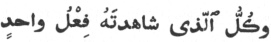
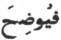

  
[Intangible Textual Heritage](../../index)  [Islam](../index.md) 
[Index](index)  [Previous](siim16)  [Next](siim18.md) 

------------------------------------------------------------------------

[Buy this Book at
Amazon.com](https://www.amazon.com/exec/obidos/ASIN/0548805903/internetsacredte.md)

------------------------------------------------------------------------

  
*Studies in Islamic Mysticism*, by Reynold A. Nicholson, \[1921\], at
Intangible Textual Heritage

------------------------------------------------------------------------

p. 162

### CHAPTER III

### THE ODES OF IBNU ’L-FÁRIḌ [1](#fn_521.md)

<table data-border="0">
<colgroup>
<col style="width: 100%" />
</colgroup>
<tbody>
<tr class="odd">
<td data-valign="top">
<em>Pensando al bel ch’ età non cangia o verno</em>. 
                                Michael Angelo.
</td>
</tr>
</tbody>
</table>

One of the deepest differences between
Arabs and Persians shows itself in the extent and character of the
mystical poetry of each people. As regards Persia, the names of Saná’í,
‘Aṭṭár, Jalálu’ddín Rúmí, Sa‘dí, Hafiz, and Jámí are witnesses enough.
Whether quantity or quality be considered, the best part of medieval
Persian poetry is either genuinely mystical in spirit or is so saturated
with mystical ideas that it will never be more than half understood by
those who read it literally. When we turn to Arabic poetry of the period
subsequent to the rise and development of Ṣúfisim, what do we find? No
lack of poets, certainly, though few of them reach the first rank and
their output is scanty compared with the opulent genius of their Persian
contemporaries. But from Mutanabbí and Ma‘arrí down to the bards unknown
in Europe who flourished long after the Baghdád Caliphate had fallen, it
is

p. 163

remarkable how seldom they possess the note (as Newman would say) of
mysticism. The main reason, I think, lies in racial endowment. The Arab
has no such passion for an ultimate principle of unity as has always
distinguished the Persians and Indians [1](#fn_522.md). He shares with other Semitic peoples an
incapacity for harmonising and unifying the particular facts of
experience: he discerns the trees very clearly, but not the wood. Like
his art, in which "we everywhere find a delicate sense for detail, but
nowhere large apprehension of a great and united whole [2](#fn_523.md)," his poetry, intensely subjective in
feeling and therefore lyrical in form, presents only a series of
brilliant impressions, full of life and colour, yet essentially
fragments and moments of life, not fused into the substance of universal
thought by an imagination soaring above place and time. While nature
keeps Arabian poetry within definite bounds, convention deprives the
Arabic-writing poet, who is not necessarily an Arab, of the verse-form
that is most suitable for continuous narrative or exposition—the
allegorical, romantic, or didactic *mathnawí*—and leaves him no choice
but to fall back upon prose if he cannot make the *qaṣída* or the
*ghazal* answer his purpose. Both these types of verse are associated
with love: the *ghazal* is a love-lyric, and the *qaṣída*, though its
proper motive is praise, usually begins "with the mention of women and
the constantly shifted habitations of the wandering tribesmen seeking
pasture throughout the Winter and Spring; the poet must tell of his love
and its troubles, and, if he likes, may describe the beauty of his
mistress [3](#fn_524.md)." Thus the models of
Arabic mystical poetry are the secular odes and songs of which this
passion is the theme; and the imitation is often so close that unless we
have some clue to the writer's intention, it may not be possible to know
whether his beloved is human or

p. 164

divine—indeed, the question whether he himself always knows is one which
students of Oriental mysticism cannot regard as impertinent.

Ibnu ’l-‘Arabí, a great theosophist rather than a great poet, deserves
to be mentioned amongst the few Arabs who have excelled in this
ambiguous style [1](#fn_525.md); but its supreme
master is Sharafu’ddín ‘Umar Ibnu ’l-Fáriḍ, a native of Cairo, who was
born seventeen years after Ibnu ’l-‘Arabí and died five years before him
(a.d. 1182-1235) [2](#fn_526.md). The two seem never to have met. The
description of Ibnu ’l-‘Arabí as Ibnu ’l-Fáriḍ's teacher (*ustádh*)
rests upon a far-fetched interpretation of the verse,

O camel-driver crossing the wilderness with thy howdahs,  
Kindly halt beside the hills of Ṭayyi’!

\[paragraph continues\] Here N. detects an
allusion to Ibnu ’l-‘Arabí, who belonged to the Ṭayyi’ tribe [3](#fn_527.md).

It rarely happens that the outward lives of mystics are eventful. The
poet's chief biographer—his grandson, ‘Alí—has much to say about his
personal beauty, his ecstatic temperament, his generosity and
unselfishness, his seclusion from the world, and the veneration in which
he was held by all [4](#fn_528.md). As his name
declares, he was the son of a notary (*fáriḍ*). In his youth he
practised religious austerities on Mt Muqaṭṭam near Cairo, returning at
intervals to attend the law-courts with his father and study theology.
One day he encountered a saint in the guise of an old greengrocer, who
told him that the hour of his illumination was at hand, but that he must
go to the Ḥijáz to receive it. Accordingly Ibnu ’l-Fáriḍ set out for
Mecca, where the promise was fulfilled. Many of his odes celebrate the
hills and valleys in the neighbourhood of the

p. 165

\[paragraph continues\] Holy City, scenes
endeared by the visions and ecstasies which they recalled to his mind.
After fifteen years’ absence from Egypt he heard the voice of the saint,
who was then on his deathbed, bidding him return to Cairo, in order to
pray over him and bury him. Ibnu ’l-Fáriḍ obeyed, and having performed
this pious duty settled in Cairo for the rest of his life, lodging (it
is said) in the mosque al-Azhar, as his father had done. The biographer
‘Alí, whose mother was a daughter of Ibnu ’l-Fáriḍ, mentions two sons of
the poet, Kamálu’ddín Muḥammad and ‘Abdu ’l-Raḥmán, who were invested
with the *khirqa* [1](#fn_529.md) by the famous
Ṣúfí, Shihábu’ddín Abú Ḥafṣ ‘Umar al-Suhrawardí on the occasion of his
meeting with Ibnu ’l-Fáriḍ at Mecca in a.d. 1231.

The *Díwán*, first edited by the aforesaid ‘Alí from a manuscript in the
author's handwriting, is a thin volume comprising about twenty qaṣídas
and *qiṭ‘as* together with some quatrains (*rubá‘íyyát*) and enigmas
(*algház*). The longest ode, the *Naẓmu ’l-sulúk* or "the Mystic's
Progress," generally known as the *Tá’iyyatu ’l-kubrá* [2](#fn_530.md), has been omitted from the Marseilles
edition, which is otherwise complete. Owing to its expository and
descriptive character this poem stands apart from the purely lyrical
odes, and I have treated it as an independent work. The Wine Ode
(*Khamriyya*) and several other pieces have been published with a French
prose translation in the *Anthologie arabe* of Grangeret de Lagrange
(Paris, 1828), and a few more will be found in De Sacy's *Chrestomathie
arabe*. Italy possesses a prose rendering of the minor poems by P.
Valerga (Firenze, 1874). There is nothing in English except some
fragments which hardly amount to a hundred lines in all [3](#fn_531.md). I hope to persuade my readers that the
*Díwán* of Ibnu ’l-Fáriḍ, though it will not please every

p. 166

taste, is too curious and exquisite to be left on one side by those who
take an interest in Oriental poetry.

Concerning the subtle quality of his thought no less than of his style,
it would be hard to better what a French critic wrote ninety years ago:

L’intelligence parfaite de ses productions ne peut
être que le fruit d’une étude longue et approfondie de la poésie arabe.
Deux causes principales les rendent d’un difficile accès. La première,
c’est qu’il arrive souvent à ce poëte de quintessencier le sentiment; et
alors ses idées sont si subtiles, si déliées, et, pour ainsi dire, si
impalpables, qu’elles échappent presque aux poursuites du lecteur le
plus attentif: souvent même elles disparoissent dès qu’on les touche
pour les transporter dans une autre langue. On voit qu’il a pris
plaisir, par un choix de pensées extraordinaires, et par la singularité
des tours, à mettre à l’épreuve la sagacité de ceux qui étudient ses
ouvrages. Au reste, les lettrés de l’Orient pensent qu’un poëte est sans
génie et sans invention, ou bien qu’il compte peu sur leur intelligence,
quand il n’a pas soin de leur ménager des occasions fréquentes de faire
briller cette pénétration qui sait découvrir les sens les plus cachés.
Il faut donc que le poëte arabe, si’l veut obtenir les suffrages et
l’admiration des connoisseurs, n’oublie pas de porter quelquefois à
l’excès le raffinement et la subtilité dans ses compositions, d’aiguiser
ses pensées, et de les envelopper de telle sorte dans les expressions,
qu’elles se présentent au lecteur comme des énigmes, qu’elles réveillent
son attention, piquent sa curiosité, et mettent en jeu toutes les
facultés de son esprit. Or, il faut convenir qu’ Omar ben-Fâredh n’a
point manqué à ce devoir prescrit aux poëtes arabes, et qu’il n’a point
voulu que ses lecteurs lui reprochassent de leur avoir enlevé les
occasions de montrer leur sagacité [1](#fn_532.md).

This describes very well a general and obvious feature of Ibnu
’l-Fáriḍ's style, a feature which is entirely absent both from
pre-Islamic and early Islamic poetry, although since the time of
Mutanabbí, who first brought it into prominence, it has maintained
itself, not merely as a local or temporary fashion but with all the
force of a fixed and almost universally accepted tradition. While Ibnu
’l-Fáriḍ has nothing in common

p. 167

with the *imitatorum seruum pecus*, he neither attempted nor desired to
swim against the stream; and it is probable that only his mysticism
saved him from the worst excesses of metaphysical wit. In him, as in
Meleager and Petrarch, "the religion of love is reduced to a theology;
no subtlety, no fluctuation of fancy or passion is left
unregistered [1](#fn_533.md)." If his verse
abounds in fantastic conceits, if much of it is enigmatic to the last
degree, the conceits and enigmas are not, as a rule, rhetorical
ornaments or intellectual conjuring tricks, but like tendrils springing
from a hidden root are vitally connected with the moods of feeling which
they delineate. It may be difficult to believe, what is related on the
testimony of his most intimate friends, that he used to dictate his
poems at the moment when he came out of a deep ecstatic trance, during
which "he would now stand, now sit, now repose on his side, now lie on
his hack, wrapped like a dead man; and thus would he pass ten
consecutive days, more or less, neither eating nor drinking nor speaking
nor stirring." His style and diction resemble the choicest and finest
jewel-work of a fastidious artist rather than the first-fruits of divine
inspiration. Yet I am not inclined to doubt the statement that his
poetry was composed in an abnormal manner [2](#fn_534.md). The history of mysticism records
numerous instances of the kind. Blake said that he was drunk with
intellectual vision whenever he took a pencil or graver in his hand. "St
Catherine of Siena," we are told, "dictated her great Dialogue to her
secretaries whilst in the state of ecstasy [3](#fn_535.md)." "When Jalálu’ddín Rúmí was drowned in
the ocean of Love he used to take hold of a pillar in his house and set
himself turning round it. Meanwhile he versified and dictated, and
people wrote down the verses [4](#fn_536.md)."
Since the form of such automatic composition will largely depend on
materials stored within the mystic's brain, and on the literary models
with which he is familiar, we need not be surprised if his visions and
revelations sometimes find spontaneous utterance in an elaborately
artificial style. The

p. 168

intense passion and glowing rapture of Ibnu ’l-Fáriḍ's poetry are in
keeping with this account of the way in which it was produced [1](#fn_537.md). That he may have written it while not
under the influence of ecstasy, I can conceive [2](#fn_538.md); but that he wrote it in cold blood, for
the sake of those who might enjoy sharpening their wits upon it, seems
to me incredible.

The double character of Islamic mystical poetry makes it attractive to
many who are out of touch with pure mysticism. Ibnu ’l-Fáriḍ would not
be so popular in the East if he were understood entirely in a spiritual
sense. The fact that parts of the *Díwán* cannot be reasonably
understood in any other sense would not, perhaps, compel us to regard
the whole as spiritual, unless that view of its meaning were supported
by the poet's life, the verdict of his biographers and commentators, and
the agreement of Moslem critical opinion; but as things are, we can
declare, with Nábulusí, that "in every erotic description, whether the
subject thereof be male or female, and in all imagery of gardens,
flowers, rivers, birds and the like he refers to the Divine Reality
manifested in phenomena, and not to those phenomena themselves [3](#fn_539.md)." This Reality, *i.e.* God (or, in some
places, Mohammed conceived as the Logos) is the Beloved whom the poet
addresses and celebrates under many names—now as one of the heroines of
Arabian Minnesong, now as a gazelle or a driver of camels or an archer
shooting deadly glances from his eye; most frequently as plain He or
She. The Odes retain the form, conventions, topics, and images of
ordinary love-poetry: their

p. 169

inner meaning hardly ever obtrudes itself, although its presence is
everywhere suggested by a strange exaltation of feeling, fine-drawn
phantasies in which (as the same French critic remarks) the poet is rapt
"au-delà des bornes de la droite raison," mysterious obscurities of
diction and subtle harmonies of sound. If Ibnu ’l-Fáriḍ had followed the
example of Ibnu ’l-‘Arabí and written a commentary on his own poems, it
might have added considerably to our knowledge of his mystical beliefs,
but I am not sure that it would have had much greater interpretative
value than the work of his commentators, who profess to explain the
esoteric meaning of every verse in the Odes. While such analysis may be
useful within certain limits, we should recognise how little it is
capable of revealing. An eminent scholar came to Ibnu l-Fáriḍ and asked
permission to write a commentary on his masterpiece, the *Naẓmu
’l-Sulúk*. "In how many volumes?" "Two." The poet smiled. "Had I
wished," said he, "I could have written two volumes of commentary on
every verse of it [1](#fn_540.md)." The more
interpreters, the more interpretations, as those who have given time and
labour to the study of mysticism well know. Poetry of this kind suggests
more than it says, and means all that it may suggest.

We cannot do without the commentators, however, and they will help us a
good deal if we learn to use them discreetly. When they handle their
text like philologists and try to fasten precise mystical significations
upon individual words and phrases, the process is as fatal to poetry as
the result is likely to be far from truth. Against this, they have the
immense advantage of being Ṣúfís, that is to say, of knowing through
tradition and their own experience what Europeans can only acquire by
study and perceive by sympathy. They are the poet's fellow-citizens in
the ideal world from which he drew his inspiration; they have dreamed
his dreams and travelled on his path towards his goal; they do not miss
the main drift of his allegory even though they err in some of the
details.

Any one who has read the *Díwán* of Ibnu ’l-Fáriḍ in

p. 170

\[paragraph continues\] Arabic will admit
that while a complete rendering into English verse would be a quixotic
enterprise, some entire odes and not a few passages in others are
suitable for that form of translation. Therefore, instead of confining
myself to prose, I have sought here and there to capture the shadows at
least of things that no prose version can reproduce.

  *Má bayna ḍáli ’l-munḥaná wa-ẓilálihi  
ḍalla ’l-mutayyamu wa-’htadá bi-ḍalálihi* [1](#fn_541.md).

Where lote-trees o’er the valley cast their shade  
The frenzied lover strayed.  
Alone with thoughts confusing  
Which love put in his brain,  
He lost and in his losing  
Found the way again:  
Lo, on yon gorge's southern slope  
The vision long-desired, that far seemed from his hope.  
This is ‘Aqíq [2](#fn_542.md), my friend!  
Halt! here to pass were strange.  
Feign rapture, if thou be  
Not rapt indeed, and let thine eye range free:  
Mine, with tears overflowing, cannot range.  
Ask the Gazelle that couches in this valley,  
Knows he my heart, its passion and distress?  
Delighting with his beauty's pride to dally,  
He recks not of my love's abasedness.  
My dead self be his ransom! ’Tis no giving:  
I am all his, dead or living!  
Think you he knows that I his absence love  
Even as I loved his presence? that I move  
Nightly his image to my waking eye?—  
A phantasy within a phantasy [3](#fn_543.md).  
So let me ne’er have savour  
Of peace from counsellors, as I never bent  
A listening ear towards their argument!  
By his sweet grace and favour,

p. 171

I vow my heart tired not, when he did tire,  
Of love-desire.  
Woe's me, ‘Udhayb's fair water might I win  
And with its coldness quench the flames within!  
But since my longing durst Not soil that noble stream,  
Ah! how I thirst  
For its mirage agleam!

The following ode, though characteristically subtle, presents no special
difficulties:

  *Tih dalálan fa-anta ahlun li-dháká  
wa-taḥakkam fa-’l-ḥusnu qad a‘tákdá* [1](#fn_544.md).

Feign coy disdain, for well art thou entitled;  
And domineer, for Beauty hath given thee power.  
Thine is the word: then will whatso thou willest,  
Since over me Beauty hath made thee ruler.  
If in death I shall be with thee united,  
Hasten it on, so may I be thy ransom!  
And try, in all ways thou deem’st good, my passion,  
For where thy pleasure is, my choice attends it.  
Whate’er betide, thou to myself art nearer  
Than I, since but for thee I had not existed.  
Not of thy peers am I: enough of glory,  
That loving thee I bow in lowly worship.  
And though I claim not—’twere too high relation—  
Favour with thee, and thou in truth my Master,  
Yet me sufficeth to be thought to love thee  
And counted by my folk amongst thy slain ones.  
Yea, in this tribe thou own’st a dead man, living  
Through thee, who found it sweet to die for love's sake;  
A slave and chattel who never pined for freedom  
Nor, hadst thou left, would let thee leave him lonely;  
Whom beauty veiled by awe doth so enravish,  
He feels delicious even that veil of torment,  
When thou, brought nigh to him by hope's assurance,  
Art borne afar by fear of sundering darkness.  
Now, by his ready advance when thee he visits,

p. 172

By his alarmed retreat when thou affright’st him,  
I swear mine heart is melted: oh, allow it  
To crave thee whilst it hath of hope a remnant;  
Or bid sleep (yet, methinks, ’twill disobey thee,  
Obedient else) pass o’er mine eyelids lightly;  
For in a dream, perchance, will rise before me  
Thy phantom and reveal to me a mystery.  
But if thou wilt not stir my life's last embers  
With the hand of hope, and thy All needs must naught me [1](#fn_545.md),  
And if Love's law not even a fitful slumber  
Lets trespass on my lids, and bans our meeting,  
Spare me an eye, that some day, ere I perish,  
Haply I may behold those who beheld thee [2](#fn_546.md)!  
Alas, how far is that desire! Nay, never  
Mine eyelashes durst kiss the earth thou tread’st on,  
For had my messenger brought a word of kindness  
From thee, and life were mine, I would cry, "Take it!"  
Enough of blood hath welled from these chapped eyelids:  
Ah, have I not yet shown what shall content thee?  
Guard safe against thine hate a man afflicted,  
Who loved thee fondly ere he knew what love was!  
Grant that uncivil flyting tongues forbade him  
To go near thee: by whom wast thou forbidden?  
Grant that thy beauty moved him to such passion,  
Yet who moved thee to part from him? Who, think’st thou?  
Who, think’st thou, gave the sentence thou should’st scorn him?  
Who gave the sentence thou should’st love another?  
By my heart-brokenness and humiliation,  
By my most bitter need, by thine abundance,  
Leave me not to the forces that betrayed me  
Of mine own strength: to thee I turn in weakness.  
Thou didst ill use me when I had some patience:  
Now for its loss God help thee to console me!  
Scorn upon scorn! It may be thou wilt pity  
My plaint, if but to hear me say, "It may be."  
The mischief-makers shamed thee with my parting

p. 173

And gave out that thy love I had forgotten.  
I loved not with *their* hearts, that I should ever  
Forget thee—God forfend!—so let them babble!  
Thee how should I forget? At every lightning  
That flashes, lo, mine eye starts up to meet thee.  
If ’neath the light of thy *lithám* [1](#fn_547.md) thou smilest  
Or breathest soft—and on the wind thy news comes—  
Glad is my soul when clear dawn of thy side-teeth  
Breaks on my sight, and keenly blows thy fragrance.  
Within thy borders all do love thee, natheless  
My single worth buys all within thy borders [2](#fn_548.md).  
There dwells in thee a notion that endeared thee  
To mind's eye, fixed my gaze on thy perfections.  
The lords of beauty thou in grace and goodness  
Excellest so, they hunger for thy notion.  
Beneath my flag the lovers shall be gathered  
To Judgment, as beneath thine all the fair ones.  
From thee dire sickness never turned me: wherefore  
Turn’st thou from me, then, O disdainful charmer?  
Thou art present with me in thine absence from me,  
And in thy cruelty I feel a kindness.  
Taught by Desire to wake through night's long hours,  
Mine eye hath won to see thee while it sleeps not.  
O happy, happy night in which thy vision I hunted after with my net of
waking!  
The full moon, being thy copy, represented  
To my unslumbering eye thy face's image [3](#fn_549.md);  
And in such alien form thine apparition  
Cooled mine eye's fever: I saw thee, none other.  
Thus Abraham of old, the Friend of Allah,  
Upturned his eye, what time he scanned the heavens [4](#fn_550.md).

p. 174

Now is the pitchy gloom for us made dazzling,  
Since thou thy splendour gav’st me for my guidance;  
And when thou from mine eye in outward seeming  
Art gone, I cast it inward, there to find thee.  
Of Badr are they with whom by night thou faredst—  
Nay, not of Badr: they journeyed in thy daylight [1](#fn_551.md).  
That men do borrow radiance from mine outward,  
’Tis not strange, when mine inward is thy dwelling.  
Ever since thou to kiss thy mouth didst call me,  
Musk lingers wheresoe’er my name is spoken,  
And the rich air teems in every place of meeting  
With spice—a metaphor of thine aroma.  
The beauty of all things seen tempted me, saying,  
"Enjoy me," but I said, "I aim beyond thee.  
Beguile not me, thyself by my Beloved  
Distraught, in whom thou seem’st but an idea [2](#fn_552.md).  
Averted, over men's souls he is mighty [3](#fn_553.md);  
Unveiled, he makes the ascetics be his vowed slaves.  
For his sake I exchanged my truth for error,  
My right for wrong, my modesty for ill-fame [4](#fn_554.md).  
My heart confessed his love One: then my turning  
To thee were dualism, a creed I like not."

p. 175

Beauty itself is mad with passion for him—  
O friend that chid’st me, may I lack thy friendship!  
Hadst thou his beauty seen—ne’er shalt thou see it—  
That me enthralled, it surely had enthralled thee.  
At a glimpse of him my wakefulness I pardon,  
And "This for that" I say to my aching eyeballs.

After reading a little of Ibnu ’l-Fáriḍ's poetry, one can take a general
view of the whole. All his odes are variations on a single theme, and
the variations themselves have a certain interior uniformity. Not only
do the same "leitmotifs" recur again and again, but the same metaphors,
conceits and paradoxes are continually reappearing in new dress.
Although translators must regret this monotony, which they cannot make
other than tedious, I think most of them would agree that the poet has
triumphed over it by means of the delicacy of his art, the beauty of his
diction, and the "linkèd sweetness" of his versification—powerful spells
to enchant those who read him in his own language. The *Díwán* is a
miracle of literary accomplishment, yet the form would be cold and empty
without the spirit which it enshrines. Like Sidney, Ibnu ’l-Fáriḍ looked
into his heart before he wrote. His verse is charged with the fire and
energy of his inmost feelings.

Where eyes encounter souls in battle-fray,  
I am the murdered man whom ’twas no crime to slay.  
At the first look, ere love in me arose,  
To that all-glorious beauty I was vowed.  
God bless a racked heart crying,  
And lids that passion will not let me close,  
And ribs worn thin,  
Their crookedness wellnigh to straightness shaped  
By the glow within,  
And seas of tears whence I had never ‘scaped  
But for the fire of sighing!  
How sweet are maladies which hide  
Me from myself, my loyal proofs to Love!  
Though after woeful eve came woeful dawn,  
It could not move  
Once to despair my spirit: I never cried

p. 176

To Agony, "Begone!"  
I yearn to every heart that passion shook,  
And every tongue that love made voluble,  
And every deaf ear stopped against rebuke,  
And every lid not dropped in slumbers dull.  
Out on a love that hath no melting eyes!  
Out on a flame from which no rapture flies [1](#fn_555.md)!

In exquisite contrast with this high-wrought prelude is another passage
of the same ode, describing the mystic's vision of the Divine beauty
revealing itself in all things beautiful.

Though he be gone, mine every limb beholds him  
In every charm and grace and loveliness:  
In music of the lute and flowing reed  
Mingled in consort with melodious airs;  
And in green hollows where in cool of eve  
Gazelles roam browsing, or at break of morn;  
And where the gathered clouds let fall their rain  
Upon a flowery carpet woven of blooms;  
And where at dawn with softly-trailing skirts  
The zephyr brings to me his balm most sweet;  
And when in kisses from the flagon's mouth  
I suck wine-dew beneath a pleasant shade [2](#fn_556.md).

Here the Moslem commentator, startled for a moment out of his
lucubrations on syntax and rhetoric, pauses to pay a tribute of
admiration to the poet, a tribute which is the more noteworthy because
in these six verses Ibnu ’l-Fáriḍ comes as near as he ever does to the
modern European conception of what poetry should be. Unadorned
simplicity is the antithesis of his style. For our taste, he has far too
much of the gift of

p. 177

\[paragraph continues\] Holofernes: he
plays with sound and sense alike, though in the daintiest and subtlest
fashion imaginable. Concerning his verbal euphuism a treatise might be
written. One verse—an extreme instance, no doubt—will serve as a sample
of many:

*Amá laki ‘an ṣaddin amálaki ‘an ṣadin  
li-ẓalmiki ẓulman minki maylun li-‘aṭfati*

Hast thou no desire to withdraw from a resistance that has caused thee
to turn away, with wrong on thy part, from one who thirsts for the water
of thy teeth [1](#fn_557.md)?

His extravagant flights of fancy are generally accompanied by an equal
exaltation of feeling and sustained by the fiery element in which they
move; at times, however, they sink into something very like the "sweet
smoke of rhetoric," *e.g.*,

I sowed roses on his cheek by looking (at him): mine eye has the right
to gather that which it planted.  
But if he refuses, then his (teeth white as) camomile will be my amends:
’tis no bad bargain when one is given pearls instead of flowers [2](#fn_558.md).

They said, "Thy tears flowed red." I answered, "They flowed from causes
which are small in comparison with the greatness of my desire:  
I slaughtered sleep on my eyelids to entertain my phantom-guest and
therefore my tears flowed bloody over my cheek [3](#fn_559.md)."

The following examples are more typical:

Thou stol’st away mine heart when it was whole:  
Now at my last gasp give it back in shreds [4](#fn_560.md)!

O thou who didst treacherously take my heart away, how didst not thou
let follow it the rest of me that thou sparedst?  
Part of me is made jealous of thee by part of me, and my outward envies
my inward because thou art there [5](#fn_561.md).

p. 178

I am so wasted by lovesickness that those who come to visit me have lost
their way, for how can the visitors see one who hath no shadow [1](#fn_562.md)?

To affirm that lovers and mystics delight in paradox is only to
acknowledge that in states of spiritual enthusiasm we enter a region
where the logic of common experience is perceived to be false. This
*alta fantasia* moulds the language of the Odes, imposing its own laws
and revelling in its power to transcend contradictions which, for the
intellect, are final.

When I died of his love, I lived by him, through the wealth of my
self-denial and the abundance of my poverty [2](#fn_563.md).

’Tis Love! Keep thy heart safe. Passion is no light thing, and he that
is wasted thereby chose it not when he was sane.  
And live fancy-free, for love's joy is sorrow: its beginning a sickness
and its end a slaying;  
Yet, methinks, death owing to love-desire is a life that my loved one
bestows upon me as a boon [3](#fn_564.md).

If separation be my guerdon from you, and if there be no (real) distance
between us, I regard that separation as union.  
Repulse is nothing but love, so long as it is not hate; and the hardest
thing, excepting only your aversion, is easy to bear.  
Delicious to me is the torment which ye inflict; and the injustice which
Love ordains that ye do unto me is justice.  
And my patience, a patience both without you and with you [4](#fn_565.md)—its bitterness seems to me everlastingly
sweet [5](#fn_566.md).

Besides the two protagonists, Arabian love-poetry introduces several
minor figures, who play a helping or hindering part in the idyll. Ibnu
’l-Fáriḍ, of course, uses them allegorically. One of them is the
"watcher" (*raqíb*), who prevents the lover from approaching. The
"slanderer" (*wáshí*) represents the logical and intellectual faculty,
which cannot pierce beyond the outward forms of things. More important
than either of these (to judge by the frequent passages of description

p. 179

and dialogue in which he appears), and more dangerous, because of his
greater plausibility, is the "blamer" (*lá’im*) or "railer" (*láḥí*), a
type of the Devil, suggesting evil and inspiring doubt, of sensual
passion, and of all that lures the soul away from Divine contemplation.

And in my silencing him who blamed me on thy account, when it was no
time to dispute concerning thee [1](#fn_567.md),
my argument was thy face;  
Whereby, after having been my rebuker, he was made my excuser; nay, he
became one of my helpers.  
And, as I live, my vanquishing in argument a guide whose reproaches
would have led me astray is like my greater and lesser pilgrimages [2](#fn_568.md).  
He perceived that my scornful ear was Rajab (deaf) to baseness and false
counsel, and that blame of me was al-Muḥarram (forbidden) [3](#fn_569.md).  
Full oft had he desired me to forget thy love and seek another than
thee, but how should he change my fixed purpose?  
He said, "Mend what remains in thee (of life)." I answered, "Methinks,
my mind turns nowhither but towards death."  
My refusal refused everything except thwarting a counsellor who would
beguile me to show a quality that was never mine [4](#fn_570.md),  
One to whom chiding me on thy account is sweet, as though he deemed my
separation (from thee) his manna and my forgetfulness (of thee) his
quails [5](#fn_571.md).

It is a favourite paradox of Ibnu ’l-Fáriḍ that reproof bears a message
of love, and that the "railer" deserves to be thanked and praised.

p. 180

Pass round the name of my Dearest, if only in blaming me—for talk of the
Beloved is my wine—  
That she may be present to mine ear, though she be far away, as a
phantom called up by blame, not by sleep.  
For sweet to me is her name in every mould, even if my chiders mingle it
with disputation.  
Methinks, he that blames me brings to me the glad news of her favour,
though I was not hoping to have my greeting returned [1](#fn_572.md).

But I found thee in one way my benefactor, albeit thou wouldst have hurt
me by the scorch of thy rebuke, had I obeyed thee.  
Thou didst me a kindness unawares, and if thou wroughtest ill, yet art
thou the most righteous of wrong-doers.  
The phantom that visits me in the hour of blame [2](#fn_573.md) brings the Beloved, though he dwell
afar, close to the eye of my waking ear.  
And thy reproof is, as it were, my Loved One's camels which came to me
when my hearing was my sight [3](#fn_574.md).  
Thou tiredst thyself and I was refreshed by thy mention of him, so that
I regarded thee as excusing me for my passion.  
Marvel, then, at a satirist lauding with the tongue of a thankful
complainant those who blame him for his love [4](#fn_575.md)!

The hyperfantastic strain in Ibnu ’l-Fáriḍ's poetry is surprisingly
relieved by a poignant realism, of which there is no trace in the work
of his Persian rivals. They have, what he reserves for his great
*Tá’iyya*, the power of lifting themselves and their readers with them
into the sphere of the infinite and eternal,

All breathing human passion far above.

The Arabic odes, on the contrary, are full of local colour and redolent
of the desert; and the whole treatment of the subject is intimately
personal. Jalálu’ddín Rúmí writes as

p. 181

a God-intoxicated soul, Ibnu ’l-Fáriḍ as a lover absorbed in his own
feelings. While the Persian sees a pantheistic vision of one reality in
which the individual disappears, the Arab dwells on particular aspects
of the relation of that reality to himself.

Some of the finest passages are inspired by the author's recollection of
the years which he spent in the Ḥijáz, where (he says) he left his heart
behind when his body returned to Egypt [1](#fn_576.md).

Give aid, my brother dear, and sing me the tale of them that alighted in
the water-courses—if thou wilt keep a brother's faith with me—  
And recall it to mine ears; for the spirit yearns for tidings, if the
loved ones be afar.  
When the anguish of pain settles on my soul, the aroma of the fresh
herbs of the Ḥijáz is my balm.  
Shall I be debarred from the sweetness of going down to the waters in
its land, and turned aside from it, when my very life is in its
sandhills,  
And its dwellings are my desire, yea, and its springtide is my joy and
averts from me the most bitter distress,  
And its mountains are to me a vernal abode, and its sands a pasture, and
its daytime shadows are my (cool) shades of eve,  
And its earth is my fragrant spice, and its water a full well for my
thirst, and in its soil are my riches,  
And its ravines are to me a garden, and its tents a shield, and on its
rocks my heart is untroubled [2](#fn_577.md)?  
May the rain bless those haunts and hills, and may showers following
each other moisten those homes of bounty,  
And shed abundance on the shrines of pilgrimage and the pebbles at
al-Miná, and plenteously bedew the halting-places of the jaded camels!  
And may God preserve my dear companions there with whom I whiled away
the night with tales of lovers’ meetings!  
And may He preserve the nights at al-Khayf that were but as a dream that
passed in the wakefulness of a light sleep!

p. 182

Ah me for that time and all that was in that goodly place, when the
spies were off their guard!—  
Days when I blithely pastured in the fields of Desire and tripped in
flowing skirts of Ease [1](#fn_578.md).  
How wonderful is Time, which lays benefits on a man and proves him by
taking the gift as spoil!  
O would that our bygone pleasure might return once more! Then would I
freely give my life.  
Alas, vain is the endeavour, and cut are the strands of the cord of
desire, and loosed is the knot of my hope.  
’Tis torture enough that I pass the night in frenzy, with my longing
before me and Fate behind me [2](#fn_579.md).

From many such passages I select one that is characteristic, because it
illustrates Ibnu ’l-Fáriḍ's habit of seeking his imagery in Nature, as
seen by Bedouins [3](#fn_580.md), and also his
sense of the poetic value of proper names.

O that I knew whether Sulaymá is dwelling in the valley of the demesne,
where the bondsman of love is crazed!  
Hath thunder crashed with bursting showers at La‘la‘, and hath rain
gushing from the clouds flooded it?  
And shall I come down to the waters of al-‘Udhayb and Ḥájir openly, when
the mystery of night is declared by dawn?  
And are there green dunes in the camping-place at al-Wa‘sá? and will the
joy that passed there ever return?  
And, O ye dear folk at al-Naqá, is there in the hills of Najd any one
that relates from me, to show forth what my ribs enclose [4](#fn_581.md)?  
And on the sand-slope of Sal‘ do they ask news of a rapt lover at Káẓima
and say, "How is Passion dealing with him?"  
And are the blossoms being culled from the myrtle-boughs, and in the
Ḥijáz are there mimosas with ripe berries?  
And the tamarisks at the bend of the vale, are they fruitful, and are
the eyes of despiteful Time asleep to them?  
And are there fair women at ‘Álij looking shyly with large eyes, as I
knew them once, or is it a vain thing?

p. 183

And did the gazelles of the Two Meadows remain there a little while
after us, or did something not let them stay?  
And will girls at al-Ghuwayr show me where dwells my Nu‘m in spring?—how
pleasant are those dwelling-places!  
And is the shade of yon willow east of Ḍárij still spread wide?—for my
tears have watered it.  
And is Shi‘b ‘Amír prospering since we departed, and will it one day
bring the lovers together?  
     \*      \*      \*      \*      \*      \*  
Perchance when my dear comrades at Mecca think of Sulaymá,  
they will feel the flame cooled of that which their bosoms hide,  
And perchance the sweet nights that are vanished will come again to us,
that a hoping man may win his desire,  
And a sorrowing one rejoice and a lovelorn one revive and a longing one
be made happy and a listening one thrill with delight [1](#fn_582.md).

It needs but a slight acquaintance with Ibnu ’l-Fáriḍ to discover that
he fully possesses a gift which the Arabs have always prized in their
rulers no less than in their poets and orators—the power of terse,
striking, and energetic expression. He depicts the lover wasted by
suffering,

     Hidden from his visitors, appearing only  
     As a crease in garments after their unfolding [2](#fn_583.md).

An exceeding great love hath hewn my bones, and my body is vanished, all
but the two least parts of me [3](#fn_584.md).

I felt such passion for you that if the strengths of all who love had
borne half the burden thereof, they would have tired.  
My bones were hewn by a desire twice as great as that of my eyelids for
my sleep or of my weakness for my strength [4](#fn_585.md).

Any one of the Odes will furnish examples of this Arabian eloquence
which has its roots deep in the structure of the language and defies all
attempts to transplant it.

In his famous Wine Ode (*Khamriyya*) Ibnu ’l-Fáriḍ develops a symbolism
which elsewhere he only uses incidentally. His sparing use of it may
perhaps be attributed to

p. 184

his respect for the Mohammedan religious law, just as the antinomian
bias of some Persian mystics seems to express itself in the freedom of
their bacchanalian imagery. According to Ibnu ’l-Fáriḍ's custom, the
symbolism is precise and circumstantial, so that its interpretation is
far more baffling than in Persian odes of the same kind, where large and
simple ideas carry the reader easily along. I hope that the literal
translation given below, together with the notes accompanying it, will
make the meaning tolerably clear, though we may doubt whether the poet
would always have accepted the interpretation given by his commentator,
‘Abdu ’l-Ghaní al-Nábulusí, who not only explains too much but brings in
philosophical theories that belong to Ibnu ’l-‘Arabí rather than to Ibnu
’l-Fáriḍ. Into this question, however, I need not enter now.

Sharibná ‘alá dhikhri ’l-ḥabíbi mudámatan  
sakirná bihá min qabli an yukhlaqa ’l-karmu [1](#fn_586.md).

\(1\) In memory of the Beloved we quaffed a vintage that made us drunk
before the creation of the vine [2](#fn_587.md).

\(2\) Its cup the full-moon; itself a sun which a new moon causes to
circle. When it is mingled (with water), how many stars appear [3](#fn_588.md)!

\(3\) But for its perfume, I should not have found the way to its
taverns; and but for its resplendence, the imagination would not have
pictured it [4](#fn_589.md).

p. 185

\(4\) Time hath preserved of it but a breath: it is unseen as a thing
hidden in the bosom of the mind [1](#fn_590.md).

\(5\) If it be mentioned amongst the tribe, the tribesmen become
intoxicated without incurring disgrace or committing sin [2](#fn_591.md).

\(6\) It oozed up from the inmost depths of the jars (and vanished), and
in reality nothing was left of it but a name [3](#fn_592.md).

\(7\) If it ever come into the mind of a man, joy will abide with him
and grief will journey away.

\(8\) And had the boon-companions beheld the sealing of its vessel, that
sealing would have inebriated them without (their having tasted) the
wine [4](#fn_593.md);

\(9\) And had they sprinkled with it the earth of a dead man's grave,
his spirit would have returned to him, and his body would have risen;

\(10\) And had they laid down in the shadow of the wall where its vine
grows a man sick unto death, his malady would have departed from him;

\(11\) And had they brought to its taverns one palsied, he would have
walked; and at the mention of its flavour the dumb would speak;

\(12\) And had the breath of its aroma floated through the East, and
were there in the West one that had lost the sense of smell, he would
have regained it;

\(13\) And had the palm of one touching its cup been stained red
thereby, he would not have gone astray at night, the lodestar being in
his hand;

\(14\) And had it been unveiled in secret (as a bride) to one blind from
birth, he would have become seeing; and at the sound of its (decanting
into the) strainer the deaf would hear;

\(15\) And had a party of camel-riders set out for the soil that bore
it, and were there amongst them one bitten by a snake, the venom would
not have harmed him;

p. 186

\(16\) And had the sorcerer inscribed the letters of its name on the
brow of one smitten with madness, the writing would have cured him;

\(17\) And had its name been blazoned on the banner of the host, that
blazon would have intoxicated those beneath the banner.

\(18\) It corrects the natures of the boon-companions, so that those who
lack resolution are led by it to the path of resolution,

\(19\) And he whose hand was a stranger to munificence shows himself
generous, and he who had no forbearance forbears in the hour of wrath.

\(20\) Had the dullest-witted man in the tribe kissed its *fidám*, his
kissing it would have endued him with the real inwardness of the wine's
qualities [1](#fn_594.md).

\(21\) They say to me, "Describe it, for thou art acquainted with its
description." Ay, well do I know its attributes:

\(22\) Pure, but not as water; subtle, but not as air; luminous, but not
as fire; spirit, but not (joined to) body.

\(23\) The (Divine) discourse concerning it was eternally prior to all
existing things (in the knowledge of God), where is no form nor any
external trace [2](#fn_595.md);

\(24\) And there through it all things came into being because of a
(Divine) providence whereby it was veiled from every one that lacketh
understanding.

\(25\) And my spirit was enamoured of it in such wise that they (my
spirit and the wine) were mingled together and made one, not as a body
pervades a body [3](#fn_596.md).

\(26\) There is a wine without a vine, when Adam is a father to me;
there is a vine without a wine, when its mother is a mother to me [4](#fn_597.md).

p. 187

\(27\) The (essential) subtlety of the vessels (forms) depends in truth
on the subtlety of the realities; and by means of the vessels the
realities increase [1](#fn_598.md)

\(28\) After division has occurred, so that, while the whole is one, our
spirits are a wine and our bodies a vine.

\(29\) Before it is no "before" and after it is no "after"; it is the
"before" of every "after" by the necessity of its nature [2](#fn_599.md).

\(30\) Its grapes were pressed in the winepress ere Time began, and it
was an orphan although the epoch of our father (Adam) came after
it [3](#fn_600.md).

\(31\) Such are the beauties that lead its praisers to laud it, and
beautiful is their prose and verse in its honour.

\(32\) And he that knows it not thrills at the mention of it, like the
lover of Nu‘m when her name is spoken.

\(33\) They said, "Thou hast drunk the draught of sin." Nay, I have only
drunk what, in my judgment, ’twere the greatest sin to renounce.

\(34\) Health to the people of the Christian monastery! How often were
they intoxicated by it without hawing drunk thereof! Still, they
aspired [4](#fn_601.md).

p. 188

\(35\) In me, ere I was born, it stirred a transport that abides with me
for ever, though my bones decay.

\(36\) Take it pure! but if thou wish to temper it, the worst wrong is
thy turning aside from the water of the Beloved's teeth [1](#fn_602.md).

\(37\) Seek it in the tavern, and there to the accompaniment of tuneful
notes bid it display itself, for by means of music it is made a
prize [2](#fn_603.md).

\(38\) Wine never dwelt with Care in any place, even as Sorrow never
dwelt with Song;

\(39\) And, though thy intoxication with it have but the life of a
moment, thou wilt regard Time as a slave obedient to thy command.

\(40\) Joyless in this world is he that lives sober, and he that dies
not drunk will miss the path of wisdom.

\(41\) Let him weep for himself—he whose life is wasted without part or
lot in wine!

The *Khamriyya* forms a link between the love-lyrics and the great Ode
in which Ibnu ’l-Fáriḍ describes his own mystical experience and puts it
forth (excepting, however, the highest stage of all) as a doctrine for
others. This Ode, the author's masterpiece, bears a plain and
appropriate title, *Naẓmu ’l-sulúk*, "The Poem of the Mystic's
Progress"; the meaning of the name al-*Tá’iyyatu ’l-kubrá*, by which it
is commonly known, has been explained above [3](#fn_604.md). The *Tá’iyya*, with its 760 verses, is
nearly as long as all the minor poems together, if we leave the
quatrains and enigmas out of reckoning. It was edited in 1854 by Joseph
von Hammer and may be studied in the fully vocalised text which he
copied from an excellent manuscript in his possession. To transcribe

p. 189

is one thing, to translate is another; and as "translation" of a
literary work usually implies that some attempt has been made to
understand it, I prefer to say that Von Hammer rendered the poem into
German rhymed verse by a method peculiar to himself, which appears to
have consisted in picking out two or three words in each couplet and
filling the void with any ideas that might strike his fancy. Perhaps, in
a sense, the *Tá’iyya* is untranslatable, and certainly it offers very
slight encouragement to the translator whose aim may be defined as
"artistic reproduction." On the other hand, it seemed to me that a
literal prose version with explanatory notes would at least enable the
reader to follow the course of the poem and become acquainted with its
meaning, while any one who ventured on the Arabic text would profit by
the labours of a fellow-student and would not be so likely to lose
heart,

Voyaging through strange seas of thought, alone.

\[paragraph continues\] Though formally an
ode (*qaṣída*), the *Tá’iyya* is addressed to a disciple, so that its
prevailing tone is didactic and descriptive, the exposition being only
now and then interrupted by strains of pure lyric enthusiasm. Not that
the poem is deficient either in beauty or in power; much, if not most of
it, combines these qualities, and in the following version I have tried
to preserve some traces of them. Ibnu ’l-Fáriḍ is here illustrating the
doctrine that phenomena are merely the illusory medium through which the
soul acts in the world. For this purpose he compares the soul to the
showman of the shadow-lantern who throws his puppets on a screen,
keeping himself out of sight while he manipulates them [1](#fn_605.md). The passage beginning

And so it comes that now thou laugh’st in glee

describes the various scenes and incidents of the shadow-play and the
emotions aroused in the spectators.

Lo, from behind the veil mysterious  
The forms of things are shown in every guise

p. 190

Of manifold appearance; and in them  
An all-wise providence hath joined what stands  
Opposed in nature: mute they utter speech,  
Inert they move and void of splendour shine [1](#fn_606.md).  
And so it comes that now thou laugh’st in glee,  
Then weep’st anon, like mother o’er dead child,  
And mournest, if they sigh, for pleasure lost,  
And tremblest, if they sing, with music's joy.  
Birds warbling on the boughs delight thine ear,  
The while their sweet notes sadden thee within;  
Thou wonderest at their voices and their words—  
Expressive unintelligible tongues!  
On land the camels cross the wilderness,  
At sea the ships run swiftly through the deep;  
And thou behold’st two armies—one on land,  
On sea another—multitudes of men,  
Clad, for their bravery, in iron mail  
And fenced about with points of sword and spear.  
The land-troops march on horseback or on foot,  
Bold cavaliers and stubborn infantry;  
The warriors of the sea some mount on deck,  
Some climb the masts like lances straight and tall.  
Here in assault they smite with gleaming swords,  
There thrust with tough brown shafts of quivering spears;  
Part drowned with fire of arrows shot in showers,  
Part burned with floods of steel that pierce like flames [2](#fn_607.md);  
These rushing onward, offering their lives,  
Those reeling broken ’neath the shame of rout;  
And catapults thou seest hurling stones  
Against strong fortresses and citadels,  
To ruin them. And apparitions strange  
Of naked viewless spirits thou mayst espy [3](#fn_608.md),

p. 191

That wear no friendly shape of humankind,  
For genies love not men.  
                          And in the stream  
The fisher casts his net and draws forth fish;  
And craftily the fowler sets a snare  
That hungry birds may fall in it for corn.  
And ravening monsters wreck the ships at sea,  
And lions in the jungle rend their prey,  
And in the air some birds, and in the wilds  
Some animals, hunt others. And thou seest  
Many a form besides, whose names I pass,  
Putting my trust in samples choice, tho’ few.

Regard now what is this that lingers not  
Before thine eye and in a moment fades.  
All thou beholdest is the act of one  
In solitude, but closely veiled is he.  
Let him but lift the screen, no doubt remains:  
The forms are vanished, he alone is all;  
And thou, illumined, knowest that by his light  
Thou find’st his actions in the senses’ night [1](#fn_609.md).

Ibnu ’l-Fáriḍ more often reminds us of Dante than of Lucretius, but
these verses may be compared with a passage in the *De rerum natura* (2,
323 foll.) where the author illustrates "the perpetual motion of the
atoms going on beneath an appearance of absolute rest" by a picture
"taken from the pomp of human affairs and the gay pageantry of armies":

Praeterea magnae legiones cum loca cursu  
camporum complent belli simulacra cientes,  
fulgor ibi ad caelum se tollit totaque circum  
aere renidescit tellus supterque uirum ui  
excitur pedibus sonitus clamoreque montes  
icti reiectant uoces ad sidera mundi  
et circumuolitant equites mediosque repente  
tramittunt ualido quatientes impete campos.

p. 192

"The truth and fulness of life in this passage are immediately
perceived, but the element of sublimity is added by the thought in the
two lines with which the passage concludes, which reduces the whole of
this moving and sounding pageant to stillness and silence—

et tamen est quidam locus altis montibus unde  
stare uidentur et in campis consistere fulgor [1](#fn_610.md)."

A similar and perhaps even more striking effect is produced when Ibnu
’l-Fáriḍ, after having brought before his readers the spectacle of
restless life and strife which fills the world, at once transforms it
into a vision of eternal order and harmony—

 

All thou beholdest is the act of One.

In reading the *Tá’iyya* it is a rare pleasure to meet with. even ten or
twenty consecutive lines like these, which require no commentary to
interpret them. Yet the poem, as a whole, is not unduly cryptic in
expression. Those who blame a writer for obscurity ought to ask
themselves whether his meaning could have been given more clearly; and
if so, whether he can allege good and sufficient reasons for his
default. On these counts I think Ibnu ’l-Fáriḍ will secure an acquittal,
if we remember that he was bound by the poetic forms and fashions of his
day. The obscurity does not lie in his style so much as in the nature of
his subject.

How little may a heart communicate in the form of thought, or a tongue
utter in the mould of speech [2](#fn_611.md)!

p. 193

While his symbolism may have served him at times as a mask when plain
speaking would have been dangerous [1](#fn_612.md), he generally uses it as the only
possible means of imparting mystical truth; and in his own circle, no
doubt, it was understood readily enough. We, on the other hand, must
begin by learning it and end with recognising that no intellectual
effort will bring us to the stage whence an initiated Mohammedan sets
out.

What makes the interpretation of the poem especially uncertain is that
the author's account of his religious and mystical experience is
psychological in character and throws but a faint light on his
theological position. Was he really a pantheist, or was he an orthodox
mystic whose feeling of oneness with God expressed itself in the
language of pantheism? Does the *Tá’iyya* reflect the doctrines of Ibnu
’l-‘Arabí, as its commentators believe? Although such questions cannot
be ignored by any one who attempts to translate or explain the poem,
they are not easy to answer definitely. I have followed Káshání in the
main; nevertheless I regard his interpretation as representing a point
of view which is alien to Ibnu ’l-Fáriḍ. Logically, the mystical
doctrine of *ittiḥád* (*Einswerden*) leads to the pantheistic monism of
Ibnu ’l-‘Arabí; but those who find in the *Tá’iyya* a poetical version
of that system are confusing mysticism with philosophy. In some
passages, however, we meet with philosophical ideas [2](#fn_613.md) and may draw inferences from them. While
they do not appear to me to support the view that Ibnu ’l-Fáriḍ was a
follower of Ibnu ’l-‘Arabí, they imply pantheism and monism on the plane
of speculative thought, where commentators and theologians

p. 194

\[paragraph continues\] (not poets and
mystics) are accustomed to dwell. I consider, therefore, that K.'s
interpretation, false as it is to the spirit of the poem, places it in a
medium intelligible to us and conveys its meaning in a relatively
adequate form. And my readers will see at once how the mystical content
of the *Tá’iyya* as well as its philosophical implications are
illustrated by the foregoing essay on the *Insánu ’l-Kámil*.

Was Ibnu ’l-Fáriḍ consciously a pantheist? I do not think so. But in the
permanent unitive state which he describes himself as having attained,
he cannot speak otherwise than pantheistically: he is so merged in the
Oneness that he identifies himself now with Mohammed (the Islamic
Logos), now with God, whose attributes he assumes and makes his own.

Many of these passages are such as no medieval religion but Islam would
have tolerated, and we cannot wonder that he was charged with heresy.
His opponents accused him of holding the doctrine of incarnation
(*ḥulúl*) and of pretending to be the *Quṭb*. He disavows hula l and
shows how it differs from his own doctrine (*vv*. 277 foll.). As regards
the *Quṭb*, the most explicit reference occurs in *vv*. 500-1:

Therefore ’tis upon me the heavens turn, and marvel thou at their *Quṭb*
(Pole) which encompasses them, howbeit the Pole is a central point.  
And there was no *Quṭb* before me, whom I should succeed after having
passed three grades (of sanctity), although the *Awtád* rise to the rank
of *Quṭb* from the rank of *Badal*.

Here is another suspected verse (313):

And my spirit is a spirit to all the spirits (of created beings); and
whatsoever thou seest of beauty in the universe flows from the bounty of
my nature.

Evidently the poet declares himself to be one with the spiritual *Quṭb*
(the Logos), whom in *v*. 501 he distinguishes from the terrestrial
*Quṭb* (the head of the Ṣúfí hierarchy). The latter presides over the
visible world. On his death he is succeeded by one of the three saints
known as *Awtád*, who are next to him in dignity and have themselves
risen from the

p. 195

ranks of the forty *Abdál* or *Budalá* [1](siim18.htm#fn_614.md). The dominion of the spiritual
*Quṭb*, the real Pole (*al-Quṭbu ’l-ḥaqíqí*), extends over the created
things of both the visible and invisible worlds. He has neither
predecessor nor successor, for he is the Spirit of Mohammed, *i.e.*, the
essence of Man and the final cause of creation [2](siim18.htm#fn_615.md). Ibnu ’l-Fáriḍ, then, does not
profess this heretical doctrine (*quṭbiyya*, *quṭbániyya*) in the sense
which Ṣúfís ordinarily assign to it. His "Poleship" is not the temporal
vicegerency delegated by Mohammed to the supreme saint of every age, but
a pure consciousness of being one with the Spirit, who as the perfect
image of God encompasses all things with his knowledge, power and glory.

My translation covers three-fourths of the poem [3](siim18.htm#fn_616.md). The omitted passages are
generally unimportant, but I have given a summary whenever I thought it
would be of use.

------------------------------------------------------------------------

### Footnotes

[162:1](siim17.htm#fr_523.md) I have used the
following editions and commentaries:

(*a*) *Díwán* of Ibnu ’l-Fáriḍ, ed. by Rushayyid b. Ghálib al-Daḥdáḥ
(Marseilles, 1853). This contains the minor poems, with a grammatical
commentary by Ḥasan al-Búríní as well as extracts from the mystical
commentary of ‘Abdu ’l-Ghaní al-Nábulusí.

(*b*) The *Tá’iyyatu ’l-kubrá*, with the commentary of ‘Abdu ’l-Razzáq
al-Káshání bearing the title *Kashfu ’l-wujúhi ’l-ghurr li-ma‘ání naẓmi
’l-durr* (Cairo, a.h. 1319).

(*c*) The *Tá’iyyatu ’l-kubrá*, with the commentary of al-Nábulusi
entitled *Kashfu ’l-sirri ’l-ghámiḍ fí sharḥi Díwán Ibni ’l-Fáriḍ* (Ms.
in the British Museum, Add. 7564-5 Rich.). The commentary on the
*Tá’iyya* begins at f. 176 of the first volume.

(*d*) The *Tá’iyyatu ’l-kubrá*, ed. with a German verse-translation by
Hammer-Purgstall (Vienna, 1854).

Concerning the Italian translation of the *Tá’iyyatu ’l-kubrá* by Sac.
Ignazio Di Matteo (Rome, 1917) and the valuable notice of it by Prof.
Nallino which appeared in Rivista degli studi orientali, vol. VIII
(Rome, 1919), some remarks will be found in the preface to this volume.

The abbreviations Díwán, K. and N. refer to (*a*), (*b*) and (*c*)
respectively.

[163:1](siim17.htm#fr_524.md) Even Zoroastrianism
does not exclude the monistic principle. It seems to be uncertain
whether Ormuzd and Ahriman stood in direct and equal antagonism to each
other, or whether Aṅra Mainyu (Ahriman), the evil spirit, and Spenta
Mainyu, the good spirit, were conceived as opposite emanations of One
(Ormuzd) who is above them both. In any case, the struggle between
Ormuzd and Ahriman ends with the complete destruction of the latter.

[163:2](siim17.htm#fr_525.md) Nöldeke, *Sketches
from Eastern History*, tr. by J. S. Black, p. 20.

[163:3](siim17.htm#fr_526.md) Sir Charles Lyall,
*Ancient Arabian Poetry*, p. xix.

[164:1](siim17.htm#fr_527.md) The present writer
has edited and translated a collection of mystical odes by Ibnu
’l-‘Arabí, entitled *Tarjumán al-Ashwáq*, in the Oriental Translation
Fund, New Series, vol. xx (London, 1911).

[164:2](siim17.htm#fr_528.md) The date of his
birth is usually given as a.d. 1181, but
see Nallino, *op. cit.*, p. I, note 3.

[164:3](siim17.htm#fr_529.md) *Díwán*, p. 4, 1. 13
foll. and p. 75, 1. I foll.

[164:4](siim17.htm#fr_530.md) The Life of Ibnu
’l-Fáriḍ by his grandson has been printed as an introduction to the
*Díwán* (pp. 3-24). A shorter notice, extracted from my Ms. of the
*Shadharátu ’l-dhahab*, was published in the *JRAS*. for 1906, pp.
800-806. See also Ibn Khallikán, No. 511 (De Slane's translation, vol.
n, p. 388 foll.).

[165:1](siim17.htm#fr_531.md) See p. 22 *supra*.

[165:2](siim17.htm#fr_532.md) *I.e.* the Greater
Ode rhyming in *t*. It is so named in order to distinguish it from the
*Tá’iyyatu ’l-ṣughrá*, *i.e.* the Lesser Ode rhyming in *t* (*Díwán*,
[p. 142](siim14.htm#page_142) foll..md).

[165:3](siim17.htm#fr_533.md) See Professor
Browne's *Literary History of Persia*, vol. 11, p. 504; my *Literary
History of the Arabs*, p. 397 fol., and *The Don and the Dervish*, pp.
105-9. A Latin version of one entire ode (*Díwán*, p. 306 foll.) is
given by Sir William Jones in his *Poeseos Asiaticae commentarii*
(Works, ed. by Lord Teignmouth, vol. VI, p. 74).

[166:1](siim17.htm#fr_534.md) Grangeret de
Lagrange, *Anthologie arabe*, p. 128.

[167:1](siim17.htm#fr_535.md) J. W. Mackail,
*Select Epigrams from the Greek Anthology*, p. 34.

[167:2](siim17.htm#fr_536.md) Preface to the
*Díwán*, p. II, 1. 20.

[167:3](siim17.htm#fr_537.md) Evelyn Underhill,
*Mysticism*, p. 352.

[167:4](siim17.htm#fr_538.md) Introd. to *Selected
Poems from the Dīvāni Shamsi Tabrīz*, p. XL.

[168:1](siim17.htm#fr_539.md) Of course these
remarks do not apply to many passages in the *Tá’iyyatu ’l-kubrá*, which
in respect of its didactic purpose bears the same relation to the minor
odes as the *Masnaví* of Jalálu’ddín Rúmí to his *Díwán*.

[168:2](siim17.htm#fr_540.md) Prof. Nallino (*op.
cit.* p. 17) points out that at a later period the Odes were often
chanted in the musical concerts of the Ṣúfís and suggests that they were
composed for this purpose.

[168:3](siim17.htm#fr_541.md) *Díwán*, p. 52, l. 8
foll. Búríní (*ibid*. p. 202, 12 foll.) asserts that Ibnu ’l-Fáriḍ's
poetry is not invariably mystical. The two verses which he cites might
bear an allegorical sense as easily as many of a similar kind in the
Song of Solomon; and, in any case, they are extracted from *rubá‘í*s.
The fact that Ibnu ’l-Fáriḍ is known to have written one amatorious
epigram (*Díwán*, p. 549, 9 fol. Ibn Khallikán, De Slane's translation,
vol. II, p. 389), and that he may have written others, proves nothing
against those who find mysticism in every line of the Odes.

[169:1](siim17.htm#fr_542.md) Preface to the
*Díwán*, p. 11, l. 1 foll.

[170:1](siim17.htm#fr_543.md) *Díwán*, p. 263
foll. Prof. Browne has given a translation of this ode in his *Literary
History of Persia*, vol. ii, p. 504.

[170:2](siim17.htm#fr_544.md) A valley with
fountains and date-palms in the neighbourhood of Medina.

[170:3](siim17.htm#fr_545.md) The dream-form
(*khayál*) of the Beloved in the poet's fancy (*khayál*).

[171:1](siim17.htm#fr_546.md) *Díwán*, p. 230
foll.

[172:1](siim17.htm#fr_547.md) Literally, "if thy
everlastingness (*baqá*) demands my passing-away (*faná*)."

[172:2](siim17.htm#fr_548.md) According to N. the
words "those who beheld thee" refer to the Light of Mohammed, which
emanated from the Light of God.

[173:1](siim17.htm#fr_549.md) A veil covering the
lower part of the face.

[173:2](siim17.htm#fr_550.md) "Within thy
borders": literally "within thy preserve (*ḥimá*)." The Divine Essence
is preserved (made inaccessible) by the spiritual and sensible forms in
which it veils itself. As the Bedouin poet brags about himself in order
to assert the dignity of his tribe, so when the Mohammedan saints boast
of the unique endowments which God has bestowed upon them, it is not
self-glorification, but thanksgiving to Him "from whom all blessings
flow."

[173:3](siim17.htm#fr_551.md) Real Being is
manifested in phenomena, just as the light of the sun is reflected by
the moon.

[173:4](siim17.htm#fr_552.md) See Kor. 6, 76 foll.
"And when the night overshadowed him, he saw a p.
174 star, and he said, This is my Lord; but when it set, he said,
I like not gods which set. And when he saw the moon rising, he said,
This is my Lord; but when he saw it set, he said, Verily, if my Lord
direct me not, I shall become one of the people who go astray" (Sale's
translation).

[174:1](siim17.htm#fr_553.md) In this verse there
is an untranslatable play on the double meaning of Badr, which signifies
(I) a place between Mecca and Medina where the Prophet won his memorable
victory over the Meccan idolaters in a.d.
624; (2) a full moon. Thus the *ahlu* *Badr* are to Moslems more than
what of οἱ μαραθωνομάχαι were to the Greeks of Plato's time, while the
phrase also suggests the perfect illumination reserved for adepts in
mysticism. Irish politics of forty years ago would provide an exact
parallel, if the Moonlighters were regarded as national heroes and
saints. The poet says that the men of Badr, *i.e.*, the noble company of
mystics, journey not so much in the light which phenomena derive from
Reality as in the light of Reality itself.

[174:2](siim17.htm#fr_554.md) Material beauty is
not worthy to be loved except in so far as it is one of the ideas
(attributes and manifestations) of Absolute Beauty.

[174:3](siim17.htm#fr_555.md) When God withdraws
Himself (from the inward eye of the mystic), He still lays His commands
on the soul, so that it performs its predestined good and evil works.

[174:4](siim17.htm#fr_556.md) Divine Love sweeps
away the conventional standards of truth and right and honour.

[176:1](siim17.htm#fr_557.md) *Díwán*, p. 331
foll.

[176:2](siim17.htm#fr_558.md) *Ibid*. p. 347, 1. 6
foll. Cf. Shelley, *Epipsychidion*:

                             In solitudes  
Her voice came to me through the whispering woods,  
And from the fountains, and the odours deep  
Of flowers…  
And from the breezes whether low or loud,  
And from the rain of every passing cloud,  
And from the singing of the summer birds,  
And from all sounds, all silence.

[177:1](siim17.htm#fr_559.md) *Ibid*. p. 173. It
is true, as Prof. Nallino has observed (*op. cit.* p. 16), that some
odes are less artificial in style than others.

[177:2](siim17.htm#fr_560.md) *Ibid*. p. 467.

[177:3](siim17.htm#fr_561.md) *Ibid*. p. 165.

[177:4](siim17.htm#fr_562.md) *Ibid*. p. 108.

[177:5](siim17.htm#fr_563.md) *Ibid*. p. 278.

[178:1](siim17.htm#fr_564.md) *Díwán*, p. 410.

[178:2](siim17.htm#fr_565.md) *Ibid*. p. 384.

[178:3](siim17.htm#fr_566.md) *Ibid*. p. 391 foll.

[178:4](siim17.htm#fr_567.md) "Patience without
you," *i.e.* in bearing your separation from me; "patience with you,"
*i.e.* in bearing the pain which you, as the object of my love, cause me
to suffer.

[178:5](siim17.htm#fr_568.md) *Díwán*, p. 402.

[179:1](siim17.htm#fr_569.md) The poet was rapt in
contemplation of the Beloved and could not bandy words with his critic.

[179:2](siim17.htm#fr_570.md) *I.e.* by convincing
my "blamer" of the error of his ways I acquired as much religious merit
as by making the pilgrimage to Mecca. It is meritorious to combine the
greater pilgrimage (*ḥajj*) with the lesser pilgrimage (*‘umra*).

[179:3](siim17.htm#fr_571.md) Rajab is the seventh
and al-Muḥarram the first month of the Mohammedan year.

[179:4](siim17.htm#fr_572.md) *I.e.* inconstancy.

[179:5](siim17.htm#fr_573.md) *Díwán*, p. 179
foll. The last verse alludes to the manna and quails which dropped from
heaven upon the Israelites (Kor. 2, 54). In the original there is a
double word-play: *mann* (separation), *mann* (manna), *salwat*
(forgetfulness), *salwá* (quails).

[180:1](siim17.htm#fr_574.md) *Díwán*, p. 443
foll.

[180:2](siim17.htm#fr_575.md) *I.e.* the image or
vision of the Beloved which appears when his name is pronounced by the
"blamer."

[180:3](siim17.htm#fr_576.md) As camels bring the
beloved to the lover's eye, so reproof brings him to the lover's ear.

[180:4](siim17.htm#fr_577.md) *Díwán*, p. 275
foll. Cf. p. 346, l. 5, and p. 429, l. 27—p. 420, l. 6.

[181:1](siim17.htm#fr_578.md) *Ibid*. p. 370, 1.
22.

[181:2](siim17.htm#fr_579.md) The Arabic word for
rocks (*ṣafá*) is also the name of a peak near Mecca, and this may be
its meaning here.

[182:1](siim17.htm#fr_580.md) Reading with the
commentator *ḥayá* instead of *ḥibá*.

[182:2](siim17.htm#fr_581.md) *Díwán*, p. 297
foll.

[182:3](siim17.htm#fr_582.md) This is quite
different, of course, from the pictorial treatment of desert life and
scenery which we find in the pre-Islamic odes.

[182:4](siim17.htm#fr_583.md) Reading  .

[183:1](siim17.htm#fr_584.md) *Díwán*, pp.
429-441.

[183:2](siim17.htm#fr_585.md) *Ibid*. p. 6.

[183:3](siim17.htm#fr_586.md) *Ibid*. p. 70. "The
two least parts" are the heart and the tongue.

[183:4](siim17.htm#fr_587.md) *Ibid*. p. 160, l.
24 foll.

[184:1](siim17.htm#fr_588.md) *Díwán*, p. 472
foll.

[184:2](siim17.htm#fr_589.md). The soul was
intoxicated with the wine of Divine Love (*i.e.* was rapt in
contemplation of God) during its pre-existence in the eternal knowledge
of God before the body was created.

[184:3](siim17.htm#fr_590.md) The full-moon is the
Perfect Man, *i.e.* the gnostic or saint in whom God reveals Himself
completely and who is, as it were, filled with Divine Love. The new moon
is the gnostic veiled by his individuality, so that he manifests only a
part of the Divine Light, not the whole; he causes the wine of Love to
circle, *i.e.* he displays and makes known to others the Names and
Attributes of God. When the wine is watered, *i.e.* when pure
contemplation is blended with the element of religion, the seeker of God
obtains spiritual direction and is like a traveller guided by the stars
in his night-journey.

[184:4](siim17.htm#fr_591.md) N.'s commentary on
this verse is characteristically recondite. He interprets "its perfume"
as the sphere of the Primal Intelligence, whence emanate all created
things; "its taverns" as the Divine Names and Attributes; "its
resplendence" as the human intellect, which is a flash of the Primal
Intelligence. Divine Love, being of the essence of God, has no form
except in the imagination.

[185:1](siim17.htm#fr_592.md) "Time," *i.e.* the
world of change. The second hemistich may be rendered literally: "’tis
as though its occultation were a concealment in the breasts of (human)
minds."

[185:2](siim17.htm#fr_593.md) "The tribesmen,"
*i.e.* mystics capable of receiving illumination.

[185:3](siim17.htm#fr_594.md) This verse describes
the gradual fading of ecstasy from the heart of the mystic.

[185:4](siim17.htm#fr_595.md) I need not trouble
my readers with the detailed allegorical analysis to which the
commentator subjects this and the next nine verses. They explain
themselves, if taken as a fanciful description of the miracles wrought
by Divine Love.

[186:1](siim17.htm#fr_596.md) The *fidám* is a
strainer placed over the mouth of the bottle, so that the wine may run
clear.

[186:2](siim17.htm#fr_597.md) Vv. 23-30 are
wanting in the commentary of Búríní and may have been inserted in the
poem by a copyist. See Nallino, *op. cit.* p. 31, note I. Divine Love,
as the eternal source of all created things, is logically prior to them,
although it does not precede them in time, which itself is created.

[186:3](siim17.htm#fr_598.md) Inasmuch as real
being belongs to God alone, mystical union cannot be likened to the
permeation of one body by another, as when water is absorbed by a
sponge.

[186:4](siim17.htm#fr_599.md) This enigmatic verse
refers to Being under its two aspects. Wine signifies pure being, vine
phenomenal being. In so far as man is related to the Divine Spirit (here
identified with Adam, whom God "created in His own p. 187 image"), he is pure reality; but in so far
as he belongs to Nature, he is unreal. "Its mother" is the mother of
wine, *i.e.* the vine, which is a symbol for the material world.

[187:1](siim17.htm#fr_600.md) The "vessels" are
the phenomenal forms by which real being is manifested. They are
"subtle," *i.e.* spiritual, because every such form is the veil of a
reality. These realities "increase," *i.e.* appear as the Many, by means
of the forms which our senses perceive.

[187:2](siim17.htm#fr_601.md) Absolute Being or
God or Divine Love—all these terms are the same in essence—is not
conditioned by time.

[187:3](siim17.htm#fr_602.md) *I.e.* it was an
orphan before the beginning of fatherhood. This, I think, is merely a
paradox indicating the timeless nature of reality. The word "orphanhood"
(*yutm*) may allude to Mohammed (cf. note on the *Tá’iyya*, *vv*.
288-9). In this case the meaning will be that Mohammed (as the Logos)
existed before the creation of Adam. According to N., Absolute Being is
made an " orphan " by the passing-away (*faná*) of the spirit in man.
Universal Spirit or Reason, the first emanation, may be said to "die"
when its essence (the human spirit) is mystically re-united with the
Absolute; and its "death" leaves the Absolute, *i.e.* the phenomenal
world regarded as the other self of the Absolute, "an orphan in the
bosom of its mother Nature."

[187:4](siim17.htm#fr_603.md) Moslems associate
with Christianity the beverage forbidden by their own religion. When
their poets describe a wine-party, the scene is often laid in the
neighbourhood of a Christian monastery (*dayr*). Ibnu ’l-Fáriḍ says that
the Christians became intoxicated without having drunk, *i.e.* their
doctrine that God reveals Himself in Christ is only a glimpse of the
truth, p. 188 which is fully realised by
Moslem saints, that God reveals Himself in every atom of existence. Cf.
the *Tá’iyya*, *v*. 730 foll. and [p. 140](siim14.htm#page_140.md) *supra*.

[188:1](siim17.htm#fr_604.md) *I.e.* seek to
contemplate the Divine Essence alone, or if you must seek anything
besides, let it be the first and highest manifestation of that Essence,
namely, the Spirit or Light of Mohammed, which is figuratively called
"the water of the Beloved's teeth."

[188:2](siim17.htm#fr_605.md) The Ṣúfís have
always known the value of music as a means of inducing ecstasy. Cf. The
*Mystics of Islam*, p. 63 foll.; D. B. Macdonald, *Emotional Religion in
Islam as affected by Music and Singing* in the *Journal of the Royal
Asiatic Society*, 1901, pp. 195 foll. and 748 foll., and 1902, p. 1
foll.

[188:3](siim17.htm#fr_606) P. [165](#page_165.md),
note [2](#fn_530.md).

[189:1](siim17.htm#fr_607.md) See *v*. 679 of the
prose translation *infra*.

[190:1](siim17.htm#fr_608.md) "The forms of
things," *i.e.* the puppets, typify phenomena, which in themselves are
lifeless and passive: all their life and activity is the effect of the
manifestation in them of the actions and attributes of Reality.

[190:2](siim17.htm#fr_609.md) The Greek fire to
which Von Hammer finds an allusion here is, I think, an *ignis fatuus*.

[190:3](siim17.htm#fr_610) The genies (*Jinn*.md)
are described as ethereal creatures, endowed with speech, transparent
(so that they are normally invisible), and capable of assuming various
shapes.

[191:1](siim17.htm#fr_611.md) *Tá’iyya*, *vv*.
680-706.

[192:1](siim17.htm#fr_612.md) W. Y. Sellar, *The
Roman poets of the Republic*, p. 403. I give Munro's translation: "Again
when mighty legions fill with their movements all parts of the plains,
waging the mimicry of war, the glitter then lifts itself up to the sky,
and the whole earth round gleams with brass, and beneath a noise is
raised by the mighty trampling of men, and the mountains stricken by the
shouting re-echo the voices to the stars of heaven, and horsemen fly
about and suddenly wheeling scour across the middle of the plains,
shaking them with the vehemence of their charge. And yet there is some
place on the high hills, seen from which they appear to stand still and
to rest on the plains as a bright spot."

[192:2](siim17.htm#fr_613.md) *Tá’iyya*, *v*. 489.

[193:1](siim17.htm#fr_614.md) *Tá’iyya*, *vv*.
395-6.

[193:2](siim17.htm#fr_615.md) *E.g.* emanation
(*fayḍ*) in *vv*. 403-5. The spiritual and sensible worlds derive their
life from Universal Spirit and Universal Soul (*v*. 405; cf. *v*. 492).
In *v*. 455 the Ḥallájian terms, *láhút* (divinity) and *násút*
(humanity) are used in the same way as by Ibnu ’l-‘Arabí, to denote the
inward and outward aspects of the Being with whom the "unified" mystic
is one (cf. Massignon, *Kitáb al-Ṭawásín*, p. 139). Allusions to the
pre-existence of the soul occur in *vv*. 41, 257-8, 428, 670 and 759.
Unlike Jílí, Ibnu ’l-Fáriḍ shows no sign of acquaintance with Ibnu
’l-‘Arabí's philosophical terminology or, so far as I have observed, of
being directly influenced by him in any considerable degree.

------------------------------------------------------------------------

[Next: Argument](siim18.md)
