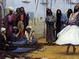

  
[Intangible Textual Heritage](../../index)  [Islam](../index) 
[Index](index)  [Previous](siim20)  [Next](siim22) 

------------------------------------------------------------------------

[Buy this Book at
Amazon.com](https://www.amazon.com/exec/obidos/ASIN/0548805903/internetsacredte)

------------------------------------------------------------------------

  
*Studies in Islamic Mysticism*, by Reynold A. Nicholson, \[1921\], at
Intangible Textual Heritage

------------------------------------------------------------------------

\(200\) And I loaded her with tasks, nay, I took care that she should
load herself with them, until I grew fond of my tribulation.

p. 217

\(201\) And in correcting her I deprived her of every pleasure by
removing her from her habits, and she became calm.

\(202\) No terror remained before her but I confronted it, so long as I
beheld that my soul therein was not yet purged,

(203 [203](#fn_700)) And every stage that I
traversed in my progress was an *‘ubúdiyya* which I fulfilled through
*‘ubúda*.

When the soul is completely denuded of affections it is made one with
God. In the first verse of the following passage the feminine pronoun,
which has hitherto referred to the soul either as reproaching itself for
its actions and desires or as being in passionless calm, undergoes a
change of meaning, so that "she," who stood for an individual, now
denotes the Universal Self.

(204 [204](#fn_701)) Until then I had been
enamoured of her, but when I renounced my desire, she desired me for
herself and loved me,

\(205\) And I became a beloved, nay, one loving himself: this is not
like what I said before, that my soul is my beloved.

(206 [206](#fn_702)) Through her I went forth
from myself to her and came not back to myself: one like me does not
hold the doctrine of return.

\(207\) And in generous pride I detached my soul from my going forth,
and consented not that she should consort with me again,

\(208\) And I was made absent from (unconscious of) the detachment of my
soul, so that in my presence (union with God) I was not pushed
(disturbed) by showing any attribute (of individuality).

p. 218

In a passage of high eloquence and beauty the poet endeavours to analyse
his experience of the unitive state and reveal the mystery, so far as it
can be expressed in a symbolic form.

(209 [209](#fn_703)) Lo, I will unfold the
beginning of my oneness and will bring it to its end in a lowly descent
from my exaltation.

(210 [210](#fn_704)) In unveiling herself she
unveiled Being to mine eye, and I saw her with my sight in every seen
thing.

\(211\) And when she appeared, I was brought to contemplate that in me
that is hidden, and through the displaying of my secret place I found
there that I was she;

(212 [212](#fn_705)) And my existence vanished
in my contemplation and I became separated from the existence of my
contemplation—effacing it, not maintaining it.

(213 [213](#fn_706)) And in the sobriety
following my intoxication I retained the object which, during the
effacement of my self-existence, I contemplated in her by whom it was
revealed,

(214 [214](#fn_707)) So that in the sobriety
after self-effacement I was none other than she, and when she unveiled
herself my essence became endued with my essence.

\(215\) When it (my essence) is not called "two," my attributes are
hers, and since we are one, her outward aspect is mine.

(216 [216](#fn_708)) If she be called, ’tis I
who answer, and if I am summoned,

p. 219

she answers the one who calls me, and cries "Labbayk!" ("At thy
service!").

\(217\) And if she speak, ’tis I who converse. Likewise, if I tell a
story, ’tis she that tells it.

(218 [218](#fn_709)) The pronoun of the second
person has gone out of use between us, and by its removal I am raised
above the sect who separate (the One from the Many).

\(219\) Now if, through want of judgment, thy understanding allow not
the possibility of regarding two as one and decline to affirm it,

\(220\) I will cause indications of it, which are hidden from thee, to
demonstrate it like expressions that are clear to thee;

(221 [221](#fn_710)) And, since this is not the
time for ambiguity, I will explain it by means of two strange
illustrations, one derived from hearing and one from sight,

\(222\) And I will establish what I say by evidence, showing forth a
parable as one who speaks the truth—for Truth is my stay

(223 [223](#fn_711)) The parable of a woman
smitten with catalepsy, by whose mouth, whilst she is possessed by a
spirit, another—not she—gives news to thee;

\(224\) And from words uttered on her tongue by a tongue that is not
hers the evidences of the signs are shown to be true,

\(225\) Since it is known as a fact that the utterer of the wondrous
sayings which thou heardest is another than she, though in the
(material) sense she uttered them.

p. 220

(226 [226](#fn_712)) Hadst thou been one, thou
wouldst have come to feel intuitively the truth of what I said;

(227 [227](#fn_713)) But, didst thou but know
it, thou wert devoted to secret polytheism with a soul that strayed from
the guidance of the Truth;

\(228\) And he in whose love the unification of his beloved is not
accomplished falls by his polytheism into the fire of separation from
his beloved.

(229 [229](#fn_714)) Naught save otherness
marred this high estate of thine, and if thou wilt efface thyself thy
claim to have achieved it will be established indeed.

\(230\) Thus was I myself for a time, ere the covering was lifted.
Having no clairvoyance, I still clave to dualism,

(231 [231](#fn_715)) Now losing (myself) and
being united (with God) through contemplation, now finding (God) and
being sundered (from myself) through ecstasy.

\(232\) My intellect, through being attached to my presence (with
myself), was separating me (from God), while my deprivation

p. 221

\[paragraph continues\] (of
individuality), through the enravishment of my self-existence by my
absence (from myself), was uniting me (with God).

(233 [233](#fn_716)) I used to think that
sobriety was my nadir, and that intoxication was my way of ascent to her
(the Beloved), and that my self-effacement was the farthest goal I could
reach;

\(234\) But when I cleared the film from me, I saw myself restored to
consciousness, and mine eye was refreshed by the (Divine) Essence;

\(235\) And at the time of my second separation I was enriched by a
recovery from my impoverishment (self-loss) in drunkenness, so that
(now) my union (*jam‘*) is like my unity (*waḥda*, individuality =
*tafriqa*, separation).

\(236\) Therefore mortify thyself that thou mayst behold in thee and
from thee a peace beyond what I have described—a peace born of a feeling
of calm.

p. 222

(237 [237](#fn_717)) After my
self-mortification I saw that he who brought me to behold and led me to
my (real) self was I; nay, that I was my own example,

(238 [238](#fn_718)) And that my standing (at
\`Arafat) was a standing before myself; nay, that my turning (towards
the Ka‘ba) was towards myself. Even so my prayer was to myself and my
Ka‘ba from myself.

\(239\) Be not, then, beguiled by thy comeliness, self-conceited, given
over to the confusion of folly;

(240 [240](#fn_719)) And forsake the error of
separation, for union will result in thy finding the right way, the way
of those who vied with each other in seeking oneness (*ittiḥád*);

(241 [241](#fn_720)) And declare the
absoluteness of beauty and be not moved to deem it finite by thy longing
for a tinselled gaud;

\(242\) For the charm of every fair youth or lovely woman is lent to
them from Her beauty.

\(243\) ’Twas She that crazed Qays, the lover of Lubná.; ay, and every
enamoured man, like Laylá's Majnún or ‘Azza's Kuthayyir.

\(244\) Every one of them passionately desired Her attribute (Absolute
Beauty) which She clothed in the form of a beauty that shone forth in a
beauty of form.

\(245\) And this was only because She appeared in phenomena. They
supposed that these (phenomena) were other than She, whilst it was She
that displayed Herself therein.

(246 [246](#fn_721)) She showed Herself by
veiling Herself (in them), and She was hidden by the objects in which
She was manifested, assuming tints of diverse hue in every appearance.

p. 223

\(247\) At the first creation She became visible to Adam in the form of
Eve before the relation of motherhood,

\(248\) And he loved Her, that by means of Her he might become a father
and that the relation of sonship might be brought into existence through
husband and wife.

(249 [249](#fn_722)) This was the beginning of
the love of the manifestations for one another, when as yet there was no
enemy to estrange them with (mutual) hate.

\(250\) And She ceased not to reveal and conceal Herself for some
(divinely ordained) cause in every age according to the appointed times.

\(251\) She was appearing to Her lovers in every form of disguise in
shapes of wondrous beauty,

\(252\) Now as Lubná, anon as Buthayna, and sometimes She was called
‘Azza, who was so dear (to Kuthayyir).

\(253\) They (fair women) are not other than She; no, and they never
were. She hath no partner in Her beauty.

\(254\) Just as She showed to me Her beauty clad in the forms of others,
even so in virtue of oneness (*ittiḥád*)

\(255\) Did I show myself to Her in every lover enthralled by youth or
woman of rare beauty;

(256 [256](#fn_723)) For, although they
preceded me (in time), they were not other than I in their passion,
inasmuch as I was prior to them in the nights of eternity;

p. 224

\(257\) Nor are they other than I in my passion, but I became visible in
them for the sake of clothing myself in every guise,

\(258\) Now as Qays, anon as Kuthayyir, and sometimes I appeared as
Jamíl who loved Buthayna.

(259 [259](#fn_724)) In them I displayed myself
outwardly and veiled myself inwardly. Marvel, then, at a revelation by
means of a mask!

(260 [260](#fn_725)) The loved women and their
lovers—’tis no infirm judgment—were manifestations in which we (my
Beloved and I) displayed our (attributes of) love and beauty.

\(261\) Every lover, I am he, and She is every lover's beloved, and all
(lovers and loved) are but the names of a vesture,

\(262\) Names of which I was the object in reality, and ’twas I that was
made apparent to myself by means of an invisible soul.

\(263\) I was ever She, and She was ever I, with no difference; nay, my
essence loved my essence.

\(264\) There was nothing in the world except myself beside me, and no
thought of beside-ness occurred to my mind.

Having advanced in *ittiḥád* to a point where the "I" is
indistinguishable from God, Ibnu ’l-Fáriḍ begins the promised sequel—"a
lowly descent from my exaltation" (see *v*. 209). He tells how he
returned from the freedom of ecstasy to the bondage of piety, how he
occupied himself with works of devotion and ascetic practices. He then
makes a solemn declaration that his coming back to the normal life of
the mystic was not due to any selfish motive, such as fear of disrepute
or hope of honour, but was dictated solely by his anxiety to protect
from attack the friends whom he revered. These friends (*awliyá*') were,
no doubt, his spiritual masters or other Ṣúfís intimately associated
with him. What was the danger which he foresaw and in which he would not
have them involved? As the following verses show, it was the charge of
heresy in

p. 225

respect of a doctrine abominable to all Moslems—the doctrine of
incarnation (*ḥulúl*).

(277 [277](#fn_726)) If I recant my words, "I
am She," or if I say—and far be it from one like me to say it!—that She
became incarnate (*ḥallat*) in me, (then I shall deserve to die the
death).

(278 [278](#fn_727)) I am not referring thee to
anything unseen; no, nor to. anything absurd which deprives me of my
power (to demonstrate its truth).

(279 [279](#fn_728)) Since I am stablished on
the Name of the Real (God) how should the false tales of error frighten
me?

(280 [280](#fn_729)) Mark now! Gabriel, the
trusted (messenger), came in the shape of Diḥya to our Prophet in the
beginning of his prophetic inspiration.

(281 [281](#fn_730)) Tell me, was Gabriel Diḥya
when he appeared in a. human form to the true Guide,

\(282\) Whose knowledge surpassed that of those beside him inasmuch as
he knew unambiguously what it was that he saw?

\(283\) He saw an angel sent to him with a message, while the others saw
a man who was treated with respect as being the Prophet's companion;

\(284\) And in the truer of the two visions I find a hint that removes
my creed far from the doctrine of incarnation.

(285 [285](#fn_731)) In the Koran there is
mention of "covering" (labs), and it cannot be denied, for I have not
gone beyond the double authority of the Book and the Apostolic
Traditions.

p. 226

Ibnu ’l-Fáriḍ, no longer speaking in his own person but as the Logos
(Mohammed) or as one merged in the Absolute, of which nothing—not even
Love and Oneness—can be predicated, warns his disciple that he must not
aim so high: let him fix his eyes on the glory of Love, and he will far
excel those who worship God in hope or fear.

\(286\) I give thee knowledge. If thou desirest its unveiling, come into
my way and begin to follow my law,

(287 [287](#fn_732)) For the fountain of Ṣaddá
springs from a water whose abundant well is with me: therefore tell me
not of a mirage in a wilderness!

(288 [288](#fn_733)) And take (thy knowledge)
from a sea into which I plunged, while those of old stopped on its
shore, observing reverence towards me.

\(289\) The text, "*Meddle not with the substance of the orphan*" (Kor.
6, 153), alludes symbolically to the palm of a hand that was holden when
it essayed (to draw water).

(290 [290](#fn_734)) And except me none hath
gained aught thereof, save only a youth who in constraint or ease never
ceased to tread in my footprints.

\(291\) Stray not darkly, then, from the tracks of my journeying,

p. 227

and fear the blindness of preferring another to me, and go in my very
path;

\(292\) For the valley of Her friendship, O comrade of sober heart, is
in the province of my command and falls under my governance,

(293 [293](#fn_735)) And the realm of the high
degrees of Love is mine, the realities (thereof) are my army, and all
lovers are my people.

(294 [294](#fn_736)) Love hath passed away! Lo,
I am severed from it as one who deems it a veil. Desire is below mine
high estate,

\(295\) And I have crossed Passion's boundary, for Love is (to me) even
as Hate, and the goal that I reached in my ascension to Oneness is
become my point of departure.

(296 [296](#fn_737)) But do thou be happy with
love, for (thereby) thou hast been made a chief over the best of God's
creatures who serve Him (by devotion and piety) in every nation.

\(297\) Win those heights and vaunt thyself above an ascetic who was
exalted by works and by a soul that purged itself (of worldly lusts);

\(298\) And pass beyond one heavily laden (with exoteric knowledge)—who,
if his burden were lightened, would be of little weight—one charged with
traditional authorities and intellectual wisdom;

(299 [299](#fn_738)) And take to thyself
through kinship (of love) the heritage of the most sublime gnostic, who
made it his care to prefer (above all else) that his aspiration should
produce an effect (upon mankind);

------------------------------------------------------------------------

### Footnotes

[217:203](siim21.htm#fr_702) (203) Both
*‘ubúdiyya* and *‘ubúda* (which literally signify the relation of a
slave to his master) are phases of mystical devotion. In *‘ubúdiyya* the
mystic is concerned with the means of drawing nigh to God, *e.g.* with
asceticism, quietism, and the like; in *‘ubúda*, which is the fulfilment
and consummation of *‘ubúdiyya*, he rises above egoism and loses himself
in the will of his Lord.

[217:204](siim21.htm#fr_703) (204-5) In ceasing
to will for himself the mystic becomes an object of the Divine will,
*i.e.* a beloved, and that which loves him is no other than his real
self. The words "my soul (self) is my beloved" refer to verse 98 ("Thou
art sworn to love, but to love of self"), in which the mystic is
described as loving himself, because he still clings to his
individuality.

[217:206](siim21.htm#fr_704) (206-8) Separation
from the self, *i.e.* union with God, is brought about by Divine grace,
not by any act of the self.

[218:209](siim21.htm#fr_705) (209) Perfect
oneness ultimately involves "a descent from union (*jam‘*) to separation
(*tafriqa*) and from the Essence to the Attributes, that the saint may
repair the disorder of the phenomenal world and instruct those who seek
the Truth, yet without losing real union with the Divine Essence; nay,
he must unite in himself both union and separation, both Essence and
Attributes" (K.). Cf. my *Mystics of Islam*, p. 163, and note on verse
218 *infra*.

[218:210](siim21.htm#fr_706) (210) The
beginning of oneness with God is God's revelation of Himself to the
mystic, which causes *faná*, so that he sees the unveiled face of God
(*i.e.* Real Being) in the mirror of phenomena.

[218:212](siim21.htm#fr_707) (212) "I became
separated from the existence of my contemplation," *i.e.* "I passed away
from (became unconscious of) my contemplation."

[218:213](siim21.htm#fr_708) (213) The object
retained and unceasingly contemplated in the sobriety (mystical
clairvoyance) following intoxication (ecstasy) is the inward and real
self—the hidden "I" which in the preceding moment of ecstasy was
contemplated in God. Cf. note on *vv*. 233-5.

[218:214](siim21.htm#fr_709) (214) Intoxication
or self-effacement is only the beginning of oneness (*ittiḥád*). Perfect
oneness is attained in sobriety, when the self, having been restored to
consciousness, knows itself as the Divine Essence which reveals itself
to itself. This is the state of "abiding after passing-away" (*al-baqá
ba‘d al faná*).

[218:216](siim21.htm#fr_710) (216) Cf. [p.
127](siim13.htm#page_127) *supra*.

[219:218](siim21.htm#fr_711) (218) Literally,
"the *ta* (of the 2nd person singular in the past tense of the Arabic
verb) has been removed (or 'has become *tu*, the sign of the 1st person
singular') between us," *i.e.* "each of us is the 'I' of the other."
"The sect who separate" are those who look at things from the aspect of
separation (*farq* or *tafriqa* as opposed to union, *jam‘*), so that,
for example, they view their acts of worship as proceeding from
themselves, not as being done by God in them.

[219:221](siim21.htm#fr_712) (221) The
illustration drawn from hearing (oral tradition) is the Prophet's vision
of Gabriel in the form of Diḥya (verse 280 foll.), while the parallel
analogy from ocular experience is the case of "a woman smitten with
catalepsy" (verse 223 foll.).

[219:223](siim21.htm#fr_713) (223-5) It may be
worth while to summarise the commentator's explanation of the argument.
*Ittiḥád*, he says, means that Absolute Being overwhelms the being of
the individual creature so as entirely to deprive him of the exercise of
his faculties: he *appears* to will and act, when he is really the organ
through which God wills and acts. To the objection that such a thing is
impossible the poet replies by pointing to what occurs in catalepsy; and
he makes a woman the subject of his illustration because the p. 220 female sex, on account of the weakness of
their minds and their general passivity (*infi‘ál*), are especially
liable to seizures of that kind. Now, the body of a woman suffering from
catalepsy is evidently controlled by the *Jinn*: her own personality
(*nafs*) is, for the time, defunct (*ma‘zúl*): otherwise, how could she
foretell future events and speak in a language that she never knew,
*e.g.* in Arabic though she be a foreigner, and in a foreign language
though she be an Arab? If this relation can exist between a woman and a
Jinni, notwithstanding the difference of their forms and qualities and
notwithstanding that both of them are helpless contingent beings, surely
none will deny that it may exist between the omnipotent Creator and the
creature whom He has created in His own image.

[220:226](siim21.htm#fr_714) (226) Although the
possibility of *ittiḥád* can be proved from analogy, knowledge of its
real nature depends on the unity (*waḥda*) or simplification (*ifrád*)
of the self which is effected by stripping it of attributes and
relations. Cf. verse 197 foll. K. renders *munázalatan* by
"intuition" (contrasted with logical demonstration), but the word may be
used here in its ordinary sense, namely, "a permanent state of mystical
feeling." See the Glossary to my edition of the *Kitáb al-Luma‘*, p.
151.

[220:227](siim21.htm#fr_715) (227) "Secret
polytheism" (*shirk*), *i.e.* latent self-regard which hinders the
mystic from becoming entirely one with God.

[220:229](siim21.htm#fr_716) (229) "Otherness"
is equivalent to "polytheism," *i.e.* thinking of one's self as
something other than God.

[220:231](siim21.htm#fr_717) (231-2) These
verses can hardly be translated. The language of Islamic mysticism
abounds in pairs of correlative terms, *e.g.* "losing" and "finding,"
"presence" and "absence," "intoxication" and "sobriety," which are not
merely artificial antitheses but express the fact that, as has been well
said, "the inner life of the Ṣúfí is in large measure a swinging to and
fro between opposite poles" (R. Hartmann, *Al-Ḳuschairîs Darstellung des
Ṣûfîtums*, p. 8). Cf. note on *vv*. 481-2.

[221:233](siim21.htm#fr_718) (233-5) For the
expressions used in *v*. 233 cf. Kor. 53, 9 and note on *v*. 729. Here
Ibnu ’l-Fáriḍ, writing as an adept, declares that the state of ecstatic
rapture, which Súfís call "intoxication" and "self-effacement," is
inferior to the subsequent state of conscious clairvoyance, which they
describe as "sobriety." Cf. *Kashf al-Maḥjúb*, transl., p. 184 foll. I
cannot agree with Prof. Nallino, who thinks (*op. cit.* p. 73) that
"sobriety" in *v*. 233 refers to normal and non-mystical consciousness.
The meaning of the words "but when I cleared the film from me, etc." is
explained by the commentator thus: "Existence (*wujúd*) is a veil
(*ḥijáb* = *ghayn*, film) in the beginning of the mystic life, and also
in its middle stage, but not in its end. The mystic is veiled in the
beginning by the outward aspect of existence (*i.e.* created things)
from its inward aspect (*i.e.* God), while in the middle stage (*i.e.*
the period of 'intoxication' during which he has no consciousness of
phenomena) he is veiled by its inward aspect (God) from its outward
aspect (created things). But when he has reached his goal (*i.e.*
'sobriety'), neither do created things veil him from God nor does God
veil him from created things, but God reveals Himself to the mystic in
both His aspects at once (*i.e.* both as the Creator and as the universe
of created things), so that he sees with his bodily eye the beauty of
the Divine Essence manifested under the attribute of externality."

The meaning of "separation" (*farq* or *tafriqa*) has been explained in
the note on verse 218: it is the state in which the mystic is conscious
of himself as an individual. Passing away from himself in the ecstasy of
"intoxication," he enters into the state of " union" (*jam‘*) in which
he is conscious of nothing but God. According to Ibnu ’l-Fáriḍ, the
final and supreme degree of "oneness" (*ittiḥád*) consists, not in
"intoxication," but in "sobriety," *i.e.* the return to consciousness,
"the second separation," when the mystic (who in the former "separation"
knew himself as "other than God") knows himself as the subject and
object of all action (cf. verses 237-8), and perceives that "union" and
"separation" are the same thing seen from different points p. 222 of view. The interpretation of the
concluding words in *v*. 215 is doubtful. Taking *jam‘* in a
non-mystical sense, we might translate: "My plurality is like my unity."

[222:237](siim21.htm#fr_719) (237)
Self-mortification prepares the mystic for contemplation of God but does
not precede it as the cause precedes the effect. In contemplation there
is no duality, but only God, who reveals Himself to Himself. The poet
describes this state of "union" (*jam‘*) symbolically in *vv*. 239-64.

[222:238](siim21.htm#fr_720) (238) The
"standing" on Mt ‘Arafát near Mecca is one of the ceremonies observed by
the pilgrims.

[222:240](siim21.htm#fr_721) (240) "Separation"
and "union" (*farq* and *jam‘*) are used in the technical sense which
has been noted (cf. verses 218 and 233-5).

[222:241](siim21.htm#fr_722) (241) The
"tinselled gaud" is beauty regarded as an attribute of phenomena, *i.e.*
beauty of form.

[222:246](siim21.htm#fr_723) (246) The
commentator illustrates this doctrine—that phenomena reveal or conceal
Absolute Being according to the measure of spiritual p. 223 insight with which they are regarded—by the
following parable (cf. Plato's allegory of the prisoners in the cave in
Book VII of the *Republic*). Imagine a house with no aperture except
glass windows of various colours and shapes, so that when the sun falls
on them, beams of corresponding shape and colour are reflected within.
Imagine, further, that in the house are a number of persons who have
never gone outside and have never seen the sun but have only been told
that it is one simple universal light possessing neither colour nor
form. Some, perceiving that the reflected beams resemble the glass in
form and colour, will not recognise them as sunbeams. Others will divine
the truth, namely, that those beams are the light of the sun endued with
form and colour by the medium through which it is seen and preserving
its unity unimpaired amidst all variety of appearance.

[223:249](siim21.htm#fr_724) (249) The "enemy"
is Satan, who caused Adam and Eve to eat the forbidden fruit, whereupon
God said to them, "Get ye down (from Paradise), the one of you a foe to
the other" (Kor. 2, 34).

[223:256](siim21.htm#fr_725) (256) The
commentator quotes the saying of the Prophet, "We are the last and the
first," *i.e.* the last in material time, the first in spiritual time.
Absolute Being, though logically prior to phenomena, is essentially
identical with them.

[224:259](siim21.htm#fr_726) (259) Absolute
Being manifests its attributes through the phenomenal forms which
conceal its essence.

[224:260](siim21.htm#fr_727) (260-4) Love and
beauty are aspects of the self-manifestation of the "invisible soul"
underlying all phenomena, and since that soul is the One Real Being
there can be no essential difference between the lover and the object of
his love. The mystic who has attained to "the intoxication of union"
(*sukru ’l-jam‘*) has no thought of "beside-ness," *i.e.* for him
nothing exists beside his unconditioned self, which is God.

[225:277](siim21.htm#fr_728) (277) "I am She,"
*i.e.* the doctrine of *ittiḥád*.

[225:278](siim21.htm#fr_729) (278) Addressing
the reader, Ibnu ’l-Fáriḍ says, "The God to whom I direct you is neither
outside of the world and yourself nor within you in the sense of '
incarnate,' which is an absurdity."

[225:279](siim21.htm#fr_730) (279) "False tales
of error," *i.e.* baseless accusations of heresy.

[225:280](siim21.htm#fr_731) (280) Gabriel,
through whom the Koran was revealed to Mohammed, is said to have assumed
the shape of Diḥya al-Kalbí, described as a very handsome man, on more
than one occasion.

[225:281](siim21.htm#fr_732) (281-4) As Gabriel
was not incarnate in Diḥya, so God is not incarnate in the mystic
"united" with Him.

[225:285](siim21.htm#fr_733) (284-5) *Labs*
(the act of covering) is attributed to God in the Koran (cf. 6, 9; 50,
14) and is implied in a group of traditions which record that Mohammed
said, "I saw my Lord in such and such a form." For the meaning of the
term, see A. J. Wensinck, *The Etymology of the Arabic Djinn (Spirits)*
in *Verslagen en Mededeelingen der Koninklijke Akademie van
Wetenschappen*, Afd. Letterkunde, 5e Reeks, Deel IV (1920), p. 506
foll., who says, "The action of covering is conceived in this way, that
the spirit comes upon a man, takes p. 226 its
abode in him and overpowers him, so that he is no longer himself but the
spirit that is upon or within him." The monistic interpretation of labs
adopted by Ibnu ’l-Fáriḍ differs essentially from *ḥulúl*. In the former
case, God creates the "disguise" of phenomenality in order thereby to
manifest Himself to Himself, and nothing exists beside Him; whereas
*ḥulúl* (the "infusion" of the Divine element into the human) denotes a
relation of immanence comparable to that of spirit and body.

[226:287](siim21.htm#fr_734) (287) Ṣaddá was
proverbial for the sweetness and wholesomeness of its water: cf. the
saying, "Water, but not like Ṣaddá." The poet means that his knowledge
flows from contemplation of the Divine Essence, so that he need not
follow the mirage of intellectual speculation.

[226:288](siim21.htm#fr_735) (288-9) The "sea"
is an emblem of the Beatific Vision which was denied to Moses (Kor. 7,
139) but was granted to Mohammed (Kor. 53, 9). Ibnu ’l-Fáriḍ interprets
the text, "*Meddle not with the substance of the orphan*," as an
admonition to Moses that he must not encroach upon Mohammed's unique
prerogative. When God revealed Himself in glory to Mt Sinai, Moses fell
in a swoon; and on recovering his senses he heard a voice saying, "This
Vision is not vouchsafed to thee, but to an orphan who shall come after
thee." The orphan (*yatím*) is Mohammed (Kor. 93, 6). Cf. *Kashf
al-Maḥjúb*, pp. 186 and 381.

[226:290](siim21.htm#fr_736) (290) The
commentator identifies the "youth " with ‘Alí b. Abi Ṭálib, the
Prophet's cousin and son-in-law. According to the belief of the Ṣúfís,
‘Alí received from the Prophet an esoteric doctrine which was
communicated to him alone.

[227:293](siim21.htm#fr_737) (293) "The
realities" (*al-ma‘ání*) are probably the real content of all
expressions that belong to the language of love.

[227:294](siim21.htm#fr_738) (294-5) To retain
consciousness of an attribute is to be limited by it; to pass from it is
to escape from limitation and break through to the Absolute, where all
contraries are reconciled. In verse 294 some read *fata ’l-ḥubbi*, "O
thrall of love," instead of *fani ’l-ḥubbu*.

[227:296](siim21.htm#fr_739) (296-8) The lover
of God is nearer to Him than the ascetic, theologian, or philosopher.

[227:299](siim21.htm#fr_740) (299) The most
sublime gnostic," *i.e.* Mohammed, from whom the Ṣúfís claim to have
inherited not only their knowledge of religion (‘ilm) but also their
mystical knowledge (*ma‘rifa*). In the highest degree of gnosis union
(*jam‘*) is combined with separation (*tafriqa*), so that the mystic
while continuing in the unitive state comes down once more to the world
of plurality and uses his spiritual powers for the benefit and
instruction of his fellow-creatures.

------------------------------------------------------------------------

[Next: vv. 300-399](siim22)
