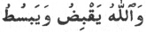

  
[Intangible Textual Heritage](../../index)  [Islam](../index.md) 
[Index](index)  [Previous](siim24)  [Next](siim26.md) 

------------------------------------------------------------------------

[Buy this Book at
Amazon.com](https://www.amazon.com/exec/obidos/ASIN/0548805903/internetsacredte.md)

------------------------------------------------------------------------

  
*Studies in Islamic Mysticism*, by Reynold A. Nicholson, \[1921\], at
Intangible Textual Heritage

------------------------------------------------------------------------

(600 [600](#fn_842).md) Such is the soul: if she
cast off her desires, her faculties are multiplied and endow every atom
with the (entire) activity of the soul.

(601 [601](#fn_843).md) Union suffices thee (as an
explanation of these miracles); they are not produced by a separation
consisting in two extensions, namely, measurable space and finite time.

After enumerating some miracles of pre-Islamic prophets—Noah, Solomon,
Abraham, Moses, Jacob and Jesus—the poet explains the unique position of
Mohammed as the spiritual father of all prophets and saints and the real
author of all miracles past, present and future.

\(614\) The inward notion that produced (miraculous) effects in outward
things is that (oneness) which, by (Divine) permission, my moulded
speech communicated to thine ear,

(615 [615](#fn_844).md) And the notions underlying
all (the effects) that

p. 254

belonged to them (the former prophets) were brought (together) by him
(Mohammed) who caused them to stream over us, thereby putting the seal
upon a time when no prophets arise;

\(616\) And there was none of them (the former prophets) but had called
his people to the Truth by grace of Mohammed and because he was
Mohammed's follower.

(617 [617](#fn_845).md) And a divine of ours is
one of those prophets, while any one of us that calls (the people) to
the Truth performs the office of apostle;

\(618\) And in our Mohammedan era our gnostic is (like) one of the old
prophets, one who clave to the commandment and was firm (in obedience to
the religious law).

(619 [619](#fn_846).md) After him, the evidentiary
miracles of the prophets became acts of Divine grace (χαρίσματα) towards
his saints and vicegerents.

\(620\) His family and his Companions and the religious leaders of the
next generation sufficed mankind instead of the apostles.

\(621\) Their miracles form part of what he conferred on them
exclusively, in bequeathing to them a share of every excellence (of
his).

\*     \*     \*     \*     \*     \*

\(627\) And the saints who believe in him, though they never saw him,
are elect in virtue of their affinity: they are near (to him) as brother
to brother.

(628 [628](#fn_847).md) And his being near them in
spirit resembles his yearning towards them in form. Marvel, then, at a
presence in absence!

The mystical union of the saints with the Logos expresses itself in
language that might easily be mistaken for blasphemy.

p. 255

(629 [629](#fn_848)) They (the prophets.md) who
received the Spirit called (their peoples) to my way in my name and
vanquished the miscreants by my argument;

(630 [630](#fn_849).md) And in consequence of the
priority of my essence they all revolve in my circle or descend from my
watering-place,

(631 [631](#fn_850).md) For albeit I am outwardly
a son of Adam, yet in him is a spirit of mine that bears witness I am
his father.

\*     \*     \*     \*     \*     \*

(637 [637](#fn_851).md) Do not deem that this
matter lies outside of me, for none gained lordship (as a prophet or a
saint) except he entered my service,

(638 [638](#fn_852).md) Since, but for me, no
existence would have come into being, nor would there have been a
contemplation (of God), nor would any secure covenants have been known.

\(639\) None lives but his life is from mine, and every willing soul is
obedient to my will;

\(640\) And there is no speaker but tells his tale with my words, nor
any seer but sees with the sight of mine eye;

\(641\) And no silent (listener) but hears with my hearing, nor any one
that grasps but with my strength and might;

\(642\) And in the whole creation there is none save me that speaks or
sees or hears.

(643 [643](#fn_853).md) And in the world of
composition (the sensible world) I

p. 256

manifested in every (phenomenal) form a reality whereby that form was
made fair;

\(644\) And in every reality that was not revealed by my phenomena I was
imaged, but not in a corporeal shape;

\(645\) And in that which the spirit beholds by clairvoyance I was
hidden from fatigued thought by my subtlety.

The clairvoyant spirit contemplates itself as the Whole that pervades
every aspect of reality and as the Identical in which all contraries are
united.

(646 [646](#fn_854).md) In the mercy of
"expansion" the whole of me is a wish whereby the hopes of all the world
are expanded;

\(647\) And in the terror (wrath) of "contraction" the whole of me is an
awe, and o’er whatsoever I let mine eye range, it reveres me;

(648 [648](#fn_855).md) And in the union of both
these attributes the whole of me is a nearness. Come, then, draw near to
my beauteous qualities!

(649 [649](#fn_856).md) In the place where "in"
ends I ceased not to feel, through myself, the majesty of contemplating
myself—an experience arising from the perfection of my nature;

\(650\) And where is no "in" I ceased not to contemplate in myself the
beauty of my Being, not with the sight of mine eye.

Perception of reality is impossible so long as sense-impressions, which
affirm that things exist by themselves, are allowed to stand in the way.

(651 [651](#fn_857).md) So if thou art of me, seek
union with me and efface the distinction of my separation and be not
turned aside by the darkness of Nature,

\(652\) And receive the signs of my inspired wisdom which

p. 257

will remove from thee the false judgments of opinion formed through
sensation.

Ibnu ’l-Fáriḍ naturally condemns metempsychosis, a special form of the
already repudiated doctrine of incarnation (*ḥulúl*) [1](#fn_859.md).

\(653\) Have nothing to do with one that believes in *naskh* (the
transmigration of souls into human bodies)—for his is a case of *maskh*
(the transmigration of souls into the bodies of animals)—and hold aloof
from his doctrine;

\(654\) And let him alone with his assertion of *faskh* (the
transmigration of souls into plants)—for if *raskh* (the transmigration
of souls into minerals) were true, he deserves to suffer it
everlastingly in every cycle.

If we scorn the notion of a spirit doomed to perpetual confinement in
matter, how shall we represent the true monistic relation between them?
Our minds can never know that relation as it really is: like all
mystical truth, it is unseizable by thought. But mystics have their own
ways and means of communicating with each other, and the poet has just
announced himself as a hierophant (*v*. 652), bidding his readers attend
to "the *signs* of his inspired wisdom." The best commentary on this
phrase is Ibnu ’l-‘Arabí's remark that mystical "states" cannot be
explained, but can only be *indicated symbolically* to those who have
begun to experience the like [2](#fn_860.md).

\(655\) My coining parables for thee time after time concerning my state
is a favour from me to thee.

(656 [656](#fn_858).md) Consider the *Maqámát* of
the Sarújite and draw a lesson from his variety (of disguise)—then wilt
thou deem it good to have taken my advice,

p. 258

\(657\) And thou wilt perceive that the soul in whatever form and shape
she appears, inwardly masks herself in sensation;

\(658\) And if his (Ḥarírí's) work is fiction, yet the Truth makes of it
a parable, for the soul labours not in earnest.

(659 [659](#fn_861).md) Therefore be
understanding, and while doing justice to thy soul look upon thy
phenomenal actions with thy (faculty of) sense;

\(660\) And wouldst thou have thy soul unveil herself, contemplate what
thou seest without doubt in the burnished mirrors.

\(661\) Was it another that appeared in them? Or didst thou behold
thyself by means of them when the rays were refracted?

\(662\) And listen how the sound of thy voice, when it dies away, is
returned to thee by the walls of lofty buildings.

\(663\) He that talked with thee there, was he some one else? Or didst
thou hear words uttered by thy voiceful echo?

\(664\) And tell me, when thy senses had been hushed in slumber, who
imparted to thee his lore?

\(665\) Ere to-day thou didst not know what happened yesterday or what
shall happen to-morrow,

\(666\) And now thou art acquainted with the histories of them that are
past and with the secrets of them that shall come after—and the
knowledge makes thee proud.

\(667\) Think’st thou it was another, not thyself, that conversed with
thee in the drowsiness of sleep touching diverse sorts of noble
knowledge?

(668 [668](#fn_862).md) ’Twas none but thy soul,
what time she was busied with her own world and disengaged from the
theatre of humanity.

(669 [669](#fn_863).md) She Unveiled herself to
herself in the invisible world in the form of a sage that led her to the
apprehension of wondrous meanings;

\(670\) For already had the sciences been imprinted on her, and

p. 259

she was anciently taught the names (realities) thereof through the
inspiration of fatherhood,

\(671\) Not by knowledge derived from the "separation" of otherness was
she blest; nay, she enjoyed that which she dictated to herself.

(672 [672](#fn_864).md) Had she become naked
(detached from the body) before thy dream, thou wouldst have beheld her,
as I do, with an eye that sees true (in a waking vision).

(673 [673](#fn_865).md) And her being normally
detached (in sleep) in the first place confirms her being detached in
the eternal world (of mystical contemplation) in the second place;
therefore be steadfast,

\(674\) And be not one whom his studies made foolish, so that they
enfeebled and unsettled his mind;

\(675\) For there, beyond tradition, lies a knowledge too subtle to be
apprehended by the farthest reach of sound understandings.

\(676\) I received it from myself and derived it from myself: ’twas with
mine own bounty my soul was replenishing me.

One of the most amazing things in Von Hammer's version of the *Tá’iyya*
is his translation of *vv*. 677-8. Their language could scarcely be
plainer, they introduce a passage in which the poet dwells on the
relative *value* of sense-perception viewed as an illustration of the
nature of reality—and this is how Von Hammer translates them:

Du spiele nicht mit Scherz and fasle nicht im Leben,  
Du sei den Possen nicht, dem Ernste sei ergeben!  
O hüte dich and wend’ dich ab von allen Bildern,  
Von allen Fantasei’n, die nur Geträumtes schildern.

In a different context Ibnu ’l-Fáriḍ might have said this or something
like it; but here, as it happens, he says just the opposite.

p. 260

(677 [677](#fn_866).md) Be not wholly neglectful
of the play (illusion), for the jest of the playthings (phenomena) is
the earnestness of a soul in earnest,

\(678\) And beware of turning thy back on every tinselled form or unreal
and fantastic case;

\(679\) For in the sleep of illusion the apparition of the
shadow-phantom brings thee to that which is shown through the thin
(semi-transparent) curtains.

Here Ibnu ’l-Fáriḍ refers to the shadow-lantern by means of which
leathern figures, moved by wands against a muslin curtain, are
illuminated and made visible to the spectators on the other side (see
Nallino, *op. cit.*, p. 93). The verses immediately following (680-706)
have been translated above (p. 189 foll.). They describe how the
showman, standing behind the screen, displays his figures in every
variety of action and causes the spectators to sympathise with the
representation; yet when the screen is taken away, he alone is seen to
be the real actor. This analogy guides us to the truth of things. The
showman is the soul, the shadowy figures are the phenomena of sensation,
the screen is the body: remove it and the soul is one with God.

------------------------------------------------------------------------

### Footnotes

[253:600](siim25.htm#fr_844) (600.md) Cf. notes on
*vv*. 525-6, 539-40, and 546-8.

[253:601](siim25.htm#fr_845) (601.md) Miracles are
the effects of union (*jam‘*) with the Essence, *i.e.* the unitive
state. Time and Space belong to "separation" (*tafriqa*), *i.e.* the
phenomenal world.

[253:615](siim25.htm#fr_846) (615-6.md) The spirit
of prophecy attained to complete and final manifestation in Mohammed,
the Seal of the prophets; and since Universal Spirit, the p. 254 first emanation from Absolute Being, is
identified with Mohammed and was revealed by him in its whole essential
nature, whereas the prophets before him manifested no more than
particular aspects and attributes, his predecessors drew their
inspiration from him and are logically his followers.

[254:617](siim25.htm#fr_847) (617-8.md) Although
prophecy ended with Mohammed, the Moslem divines and mystics may be
described as the prophets and apostles of the Mohammedan era. Orthodox
Ṣúfís take the strictest possible view of their religious duties (cf.
*Kitáb al-Luma‘*, p. 10, l. 11 foll.).

[254:619](siim25.htm#fr_848) (619.md) For the
distinction between *mu‘jizát* (miracles of the prophets) and *karámát*
(miracles of the saints) see *Kashf al-Maḥjúb*, p. 218 foll.

[254:628](siim25.htm#fr_849) (628.md) Yearning
(*ishtiyáq*) implies that the object of desire is present (to the mind),
though absent (in the body).

[255:629](siim25.htm#fr_850) (629.md) "My way,"
*i.e.* the way of real oneness with God. "In virtue my name," *i.e.* the
prophets manifested in their miracles the potency of the Divine Names,
as Jesus, for example, called the dead to life by manifesting the Divine
Name *al-Muḥyí*, the Quickener. "My argument," *i.e.* evidentiary
miracles.

[255:630](siim25.htm#fr_851) (630.md) Cf. note on
*vv*. 615-6.

[255:631](siim25.htm#fr_852) (631.md)
Metaphysically, Mohammed is the father of Adam in the sense that the
spirit or essence of Adam is Universal Spirit = the Logos = Mohammed.

[255:637](siim25.htm#fr_853) (637.md) "This
matter," *i.e.* prophecy and saintship.

[255:638](siim25.htm#fr_854) (638.md) Cf. the
Tradition in which it is related that God said to Mohammed, "But for
thee I had not created the heavens." As the created universe is the form
of the Logos, so is Divine contemplation an attribute of the same
Supreme Spirit (*al-Rúḥu ’l-a‘ẓam*), whence all human spirits derive
their powers. The "covenants" have been explained above.

[255:643](siim25.htm#fr_855) (643-5.md) These
verses describe the self-manifestation of the Logos to the senses in the
phenomenal world (*‘álamu ’l-shaháda*), to the intellect in the
intelligible world (*‘álamu ’l-ghayb*), and to the spirit in the world
of mystical contemplation, which the intellect is unable to reach
(*‘álamu ’l-malakút* and *‘álamu ’l-jabarút*: cf. [p.
251](siim24.htm#page_251).md).

[256:646](siim25.htm#fr_856) (646-7.md)
"Expansion" (*basṭ*) and "contraction" (*qabḍ*) are modes of feeling in
the gnostic which correspond to "hope" (*rajá*) and "fear" (*khawf*) in
the lower stages of the mystical life: cf. R. Hartmann, *Al-Ḳuschairîs
Darstellung des Ṣûfîtums*, p. 84. *Basṭ* is the effect of Divine mercy,
*qabḍ* of Divine wrath. Cf. Kor. 2, 246: 
.

[256:648](siim25.htm#fr_857) (648.md) "A
nearness," *i.e.* a negation of farness (difference) in the ground of
Pure Being. Distinction first appears when the Essence manifests itself
through its Names and Attributes.

[256:649](siim25.htm#fr_858) (649.md) In the
sphere of the Essence there is no "in," *i.e.* limitation of space and
time. "The perfection of my nature" denotes the inherent self-identity
(*jam‘*) in virtue of which the Essence eternally contemplates itself in
and by itself as the One in Many and the Many in the One.

[256:651](siim25.htm#fr_859) (651.md) *I.e.* do
not seek me in the phenomenal world, where my attributes appear to be
separated from the underlying reality.

[257:656](siim25.htm#fr_862) (656-8.md) The
following passage should be compared with *vv*. 239-85 and *vv*. 525-48
*supra*. The metaphor of "disguise" (*labs*: cf. note on *vv*. 284-5)
shadows forth the oneness of reality and appearance. In Ḥarírí's Maqámát
(see my *Literary History of the Arabs*, pp. 329-336) the hero, Abú
Zayd, a native of Sarúj in Mesopotamia, assumes all sorts of disguises
to get money from his dupes. "In whatever form and shape," *e.g.* in the
eye or the ear and in sight or hearing. "For the soul labours not in
earnest," *i.e.* "if any one objects that Ḥarírí's fiction does not
correspond with the nature of Reality, p. 258
I reply that my analogy is perfectly just, inasmuch as the soul creates
and maintains the *illusion* of phenomenal existence." Cf. *v*. 67.7,
where phenomena are described as the playthings of a soul in earnest,
and also *v*. 709.

[257:1](siim25.htm#fr_860.md) p. 257 See *v*. 277 foll.

[257:2](siim25.htm#fr_861.md) *Tarjumán
al-ashwáq*, p. 68.

[258:659](siim25.htm#fr_863) (659.md) "Doing
justice to thy soul," *i.e.* recognising that all bodily activities are
effects (*áthár*) of the soul.

[258:668](siim25.htm#fr_864) (668.md) The body is
the theatre in which humanity (human nature) is exhibited.

[258:669](siim25.htm#fr_865) (669-71.md) In dreams
the soul knows itself as it was in the state of preexistence, *i.e.* as
one with the Being which is the subject and object of all p. 259 knowledge, and which, *quâ* Universal Spirit
(the father) eternally begets in itself, *quâ* Universal Soul (the
mother), the ideal, *i.e.* non-externalised, essences of individual
things. Cf. Kor. 2, 29: "And He (Allah) taught Adam the Names, all of
them." See also p. 186, note 4, and *v*. 631 *supra*.

[259:672](siim25.htm#fr_866) (672.md) "Become
naked" (*tajarradat*): so Plato speaks of ἡ ψυχὴ γυνμνὴ τοῦ σώματος.

[259:673](siim25.htm#fr_867) (673.md) Cf. a
passage of the Masnaví quoted and translated in *Selected Poems from the
Díváni Shamsi Tabríz*, p. 298 fol.

[260:677](siim25.htm#fr_868) (677-9.md) "The
phenomenal is a bridge to the real" (*al-majáz qanṭaratu ’l-ḥaqíqa*).
Cf. *Tarjumán al-ashwáq*, p. 100: "In the survival of the substance of
phenomenal being the Divine Presence and its lovely Names are
manifested, and this is the beauty of phenomenal being; if it perished,
thou wouldst not know aught, since all kinds of knowledge are divulged
by means of forms and bodies."

------------------------------------------------------------------------

[Next: vv. 707-761](siim26.md)
